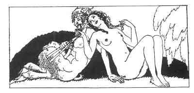

[Intangible Textual Heritage](../../index)  [Classics](../index) 
[Sappho](../sappho/index)  [Index](index)  [Previous](sob029) 
[Next](sob031) 

------------------------------------------------------------------------

p. 48

 

### GAME OF DICE

Since both of us adored him, we engaged to play a game of dice for him.
That was a famous party. Many maidens watched most anxiously.

She led off with the Cyclops throw, and I cast the Solon. Then she threw
Kallibolos, and I, sensing my defeat, besought the Goddess.

I played, I threw Epiphenon, she the high cast of Kios; I the Antiteukos
and she the Trikias; and then I threw the cast of Aphrodite which wins
the cherished lover.

The girl grew pale; I clasped her by the neck and whispered in her ear
(that no one else might know), "Don't cry, my friend, we'll let him
choose between us."

------------------------------------------------------------------------

[Next: The Distaff](sob031)
