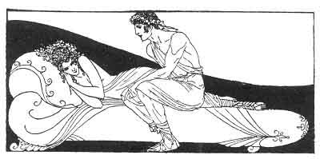

[Intangible Textual Heritage](../../index)  [Classics](../index) 
[Sappho](../sappho/index)  [Index](index)  [Previous](sob038) 
[Next](sob040) 

------------------------------------------------------------------------

p. 58

 

### SONG

When he came back, I hid my face within my hands. He said: "Fear
nothing. Who has seen our kiss? --Who saw us? The night and the moon."

"And the stars and the first flush of dawn. The moon has seen its visage
in the lake, and told it to the water 'neath the willows. The water told
it to the rower's oar.

"And the oar has told it to the boat, and the boat has passed the secret
to the fisher. Alas! alas! if that were only all! But the fisher told
the secret to a woman.

"The fisher told the secret to a woman: my father and my mother and my
sisters, and all of Hellas now shall know the tale."

------------------------------------------------------------------------

[Next: Bilitis](sob040)
