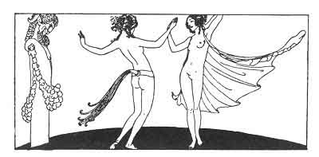

[Intangible Textual Heritage](../../index)  [Classics](../index) 
[Sappho](../sappho/index)  [Index](index)  [Previous](sob050) 
[Next](sob052) 

------------------------------------------------------------------------

p. 70

 

### THE DANCE OF GLOTTIS AND KYSE

Two little girls had led me to their home, and as soon as the door was
closed they touched the wick unto the fire and wished to dance for me.

Their unrouged cheeks were tan, just like their little bellies. They
grasped each other by the arms and chattered joyously.

Seated upon a raised and padded trestle, Glottis sang in a sharp voice,
and struck her noisy little hands together.

Kyse danced in quick staccato fashion, then stopping, winded with
laughter, grasped her sister by her breasts, bit her shoulder and turned
her roundabout much like a playful goat.

------------------------------------------------------------------------

[Next: Counsels](sob052)
