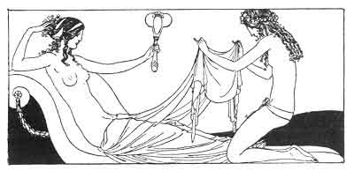

[Intangible Textual Heritage](../../index)  [Classics](../index) 
[Sappho](../sappho/index)  [Index](index)  [Previous](sob056) 
[Next](sob058) 

------------------------------------------------------------------------

p. 76

 

### THE WEDDING

The wedding feast was given in the morning, in Acalanthis' house whom
she had taken for a mother. Mnasidika wore a milk-white veil, and I the
virile tunic.

Then after, in the midst of twenty women she donned her festal robes.
Perfumed with bakkaris and spread with gold-dust, her cool and rippling
skin attracted furtive hands.

In her leafy chamber she awaited me, as a bridegroom. And I led her out
in a little two-wheeled cart, seated between me and the
nymphagogue. [76](sob154.htm#xref_76) One of her little breasts burned
in my hand.

They sang the nuptial song: the flutes sang madly. And carrying
Mnasidika, my arms beneath her knees and round her shoulders, I passed
the threshold, strewn with blushing roses.

------------------------------------------------------------------------

[Next: The Living Past](sob058)
