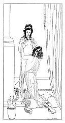

[Intangible Textual Heritage](../../index)  [Classics](../index) 
[Sappho](../sappho/index)  [Index](index)  [Previous](sob062) 
[Next](sob064) 

------------------------------------------------------------------------

p. 82

[  
Click to enlarge](img/08200.jpg)

p. 83

 

### MNASIDIKA'S BREASTS

Carefully, with one hand, she opened her tunic and tendered me her
breasts, warm and sweet, just as one offers the goddess a pair of living
turtle-doves.

"Love them well," she said to me, "I love them so! They are little
darlings, little children. I busy myself with them when I am alone. I
play with them; I pleasure them.

"I flush them with milk. I powder them with flowers. I dry them with my
fine-spun hair, soft to their little nipples. I caress them and I
shiver. I couch them in soft wool.

"Since I shall never have a child, be their nursling, oh! my love, and
since they are so distant from my mouth, kiss them, sweet, for me."

------------------------------------------------------------------------

[Next: The Doll](sob064)
