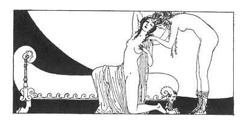

[Intangible Textual Heritage](../../index)  [Classics](../index) 
[Sappho](../sappho/index)  [Index](index)  [Previous](sob065) 
[Next](sob067) 

------------------------------------------------------------------------

p. 86

 

### GAMES

More than her baubles and her doll am I a plaything for Mnasidika. For
hours on end, unspeaking, like a child, she amuses herself with all my
body's charms.

She undoes my hair and does it up again according to her fancy,
sometimes knotting it beneath my chin like some heavy cloth, or twisting
it into a knot behind my neck, or plaiting it until its very end.

She looks with wonder at the color of my lashes, or on the bending of my
elbow-joint. Sometimes she places me on hands and knees:

And then (it is one of her games), she slips her little head underneath,
and plays the trembling kid at nursing time beneath its mother's belly.

------------------------------------------------------------------------

[Next: Shadowlight](sob067)
