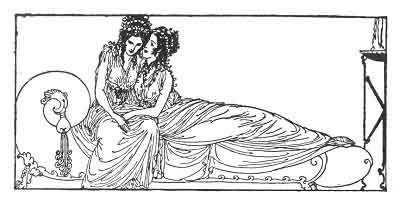

[Intangible Textual Heritage](../../index)  [Classics](../index) 
[Sappho](../sappho/index)  [Index](index)  [Previous](sob076) 
[Next](sob078) 

------------------------------------------------------------------------

p. 98

 

### MNASIDIKA'S LULLABY

My little child, as few years older as I am than you, I love you, not as
a lover loves, but as though you had come forth from my womb in labour.

When, stretched upon my knees, frail arms about my neck, you seek my
breast, and with mouth held forward you slowly suck with palpitating
lips,

I dream that at some former time I really nursed this supple, wet and
tender mouth, this purple vase of myrrh in which my happiness is
mysteriously enclosed.

Sleep! I'll cradle you upon my rocking knee with one hand. Sleep, so.
I'll sing you mournful little songs, songs used to lull the new-born
child to sleep. . .

------------------------------------------------------------------------

[Next: Sea-Side Promenade](sob078)
