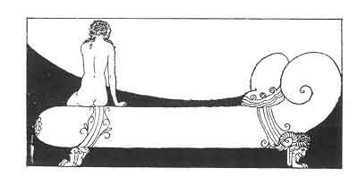

[Intangible Textual Heritage](../../index)  [Classics](../index) 
[Sappho](../sappho/index)  [Index](index)  [Previous](sob085) 
[Next](sob087) 

------------------------------------------------------------------------

p. 107

 

### WAITING

The sun spent all the night in the country of the dead, while I have
waited, seated on my bed, fatigued from having stayed so long awake. The
wick of the exhausted lamp has burned until the end.

She will not come: there is the last star. How well I know that she will
come no more. I even know the very name I hate. And still I wait.

Let her come now! yes, let her come, her hair undone, ungarlanded, her
dresses soiled and spotted, rumpled up, her tongue dry and her eyelids
black!

As soon as she opens the door I'll say to her . . . but there she is. .
. It is her dress I touch, her hands, her hair, her skin! I kiss her
with a maddened mouth, and weep.

------------------------------------------------------------------------

[Next: Solitude](sob087)
