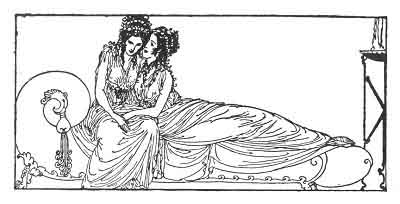

[Intangible Textual Heritage](../../index)  [Classics](../index) 
[Sappho](../sappho/index)  [Index](index)  [Previous](sob087) 
[Next](sob089) 

------------------------------------------------------------------------

p. 109

 

### LETTER

This is impossible, impossible. I beg you on my knees, in tears, all the
tears that I have wept upon this dreadful letter; do not abandon me this
way.

Think of how dreadful it is to lose you forever, for the second time,
after having had the immense joy of hoping to recapture you. Ah! my
loves, do you not feel to what extreme I love you!

Listen to me. Consent to see me just once more. Will you be, tomorrow,
at the setting of the sun, before your door? Tomorrow, or the next day.
I shall come to get you. Do not refuse me that.

The last time, perhaps; so be it, but just this time, just this one time
more! I ask it of you, beg it of you, and think that the remainder of my
life hangs on your answer.

------------------------------------------------------------------------

[Next: Attempt](sob089)
