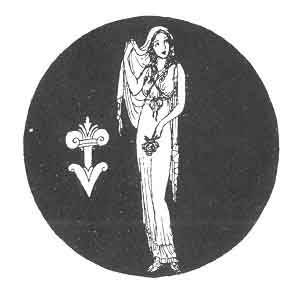

[Intangible Textual Heritage](../../index)  [Classics](../index) 
[Sappho](../sappho/index)  [Index](index)  [Previous](sob095) 
[Next](sob097) 

------------------------------------------------------------------------

# III

# EPIGRAMS IN THE ISLE OF CYPRUS

 

 

Ἀλλά με ναρϰίσσοις ἀναδήσατε, ϰαὶ πλαγιαύλων  
  γεύσατε ϰαὶ ϰροϰίνοις χρίσατε γυῖα μύροις.  
Καὶ Μυτιληναίῳ τὸν πνεύμονα τέγξατε Βάϰχῳ  
  ϰαὶ συζεύξατέ μοι φωλάδα παρθενιϰήν.  
                                    PHILODEMUS [117](sob154.htm#xref_117)

 

------------------------------------------------------------------------

[Next: Hymn to Astarte](sob097)
