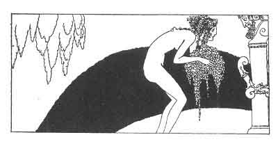

[Intangible Textual Heritage](../../index)  [Classics](../index) 
[Sappho](../sappho/index)  [Index](index)  [Previous](sob096) 
[Next](sob098) 

------------------------------------------------------------------------

p. 118

 

### HYMN TO ASTARTE

Mother inexhaustible and incorruptible, creatures, born the first,
engendered by thyself and by thyself conceived, issue of thyself alone
and seeking joy within thyself, Astarte!

Oh! perpetually fertilized, virgin and nurse of all that is, chaste and
lascivious, pure and revelling, ineffable, nocturnal, sweet, breather of
fire, foam of the sea!

Thou who accordest grace in secret, thou who unitest, thou who lovest,
thou who seizest with furious desire the multiplied races of savage
beasts and couplest the sexes in the wood.

Oh, irresistible Astarte! hear me, take me, possess me, oh, Moon! and
thirteen times each year draw from my womb the sweet libation of my
blood!

------------------------------------------------------------------------

[Next: Hymn to the Night](sob098)
