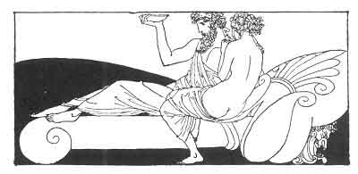

[Intangible Textual Heritage](../../index)  [Classics](../index) 
[Sappho](../sappho/index)  [Index](index)  [Previous](sob108) 
[Next](sob110) 

------------------------------------------------------------------------

p. 131

 

### THE IMPARTIAL ONE

As soon as he enters the room, no matter what he be (and can it
matter?): "Behold," I say to the slave, "what a handsome man! and how
happy a courtesan is."

I call him Adonis, Ares or Herakles, according to his face, or the Old
Man of the Seas, if his locks are silver-pale. And then what disdain I
show for frivolous youth!

"Ah!" I say, "if tomorrow I had no need to pay my florist or my
goldsmith, how I should love to say to you: 'I do not want your gold! I
am your slave, impassioned!'"

Then, when he has clasped his arms behind my shoulders, I see a handsome
boatman, like an image most divine, passing across the starry sky of my
transparent lids.

------------------------------------------------------------------------

[Next: Clear Water of the Basin](sob110)
