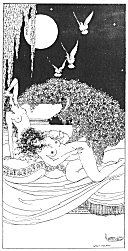

[Intangible Textual Heritage](../../index)  [Classics](../index) 
[Sappho](../sappho/index)  [Index](index)  [Previous](sob110) 
[Next](sob112) 

------------------------------------------------------------------------

p. 133

[  
Click to enlarge](img/13300.jpg)

p. 134

 

### DESIRE

At night, they left us on a high white terrace, fainting among the
roses. Warm perspiration flowed like heavy tears from our armpits,
running on our breasts. An over-whelming pleasure-lust flushed our
thrown-back heads.

Four captive doves, bathed in four different perfumes, fluttered
silently above our heads. Drops of scent fell from their wings upon the
naked women. I was streaming with the odor of the iris.

Oh, weariness! I laid my cheek upon a young girl's belly, who cooled her
body with my humid hair. My open mouth was drunken with her
saffron-scented skin. She slowly closed her thighs about my neck.

I dreamed, but an exhausting dream awakened me: the iynx, bird of
night-desires, sang madly from afar. I coughed and shivered. An arm, as
languid as a flower, rose in the air, stretching towards the moon.

------------------------------------------------------------------------

[Next: The Inn](sob112)
