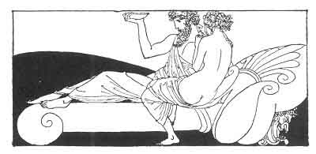

[Intangible Textual Heritage](../../index)  [Classics](../index) 
[Sappho](../sappho/index)  [Index](index)  [Previous](sob114) 
[Next](sob116) 

------------------------------------------------------------------------

p. 138

 

### TO HER BREASTS

Flesh in blossom, oh, my breasts! how rich and heavy you are with
desire! My breasts in my hands, how soft you are, and with what mellow
warmths and young perfumes.

Formerly you were frozen like the breasts of a statue, and hard as
senseless marble. Since you have softened I cherish you more, you who
have been loved.

Your smooth and swelling form is the pride of my nut-brown body. Whether
I bind you in the golden gauze or free you naked to the open air, you
precede me with your splendor.

Be happy, then, tonight. If my fingers give forth soft caresses, you
alone will know until the dawn: for tonight, Bilitis has paid Bilitis.

------------------------------------------------------------------------

[Next: Mydzouris](sob116)
