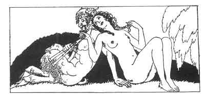

[Intangible Textual Heritage](../../index)  [Classics](../index) 
[Sappho](../sappho/index)  [Index](index)  [Previous](sob121) 
[Next](sob123) 

------------------------------------------------------------------------

p. 145

 

### TO A HAPPY HUSBAND

I envy you, Agorakrites, for having so zealous a wife. 'Tis she herself
who tends the stable, and in the morning, instead of making love, she
waters the beasts.

And you rejoice in it. How many others, you say, think only of base
pleasures, 'wake the night, sleep all day and still ask of adultery a
criminal satiety.

Yes, your wife works in the stable. They even say she has a thousand
caresses to bestow upon the youngest of your asses. Ah! ha! what a
handsome animal! He has a black spot over both his eyes.

They say she plays between his hoofs, beneath his soft grey belly. . .
But they who say these things are slanderers. If your ass pleases her,
Agorakrites, it is, without a doubt, because your expression reminds her
of its own.

------------------------------------------------------------------------

[Next: To One Who Has Strayed](sob123)
