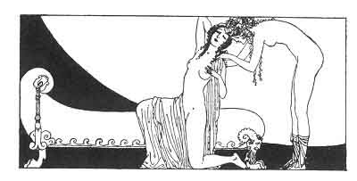

[Intangible Textual Heritage](../../index)  [Classics](../index) 
[Sappho](../sappho/index)  [Index](index)  [Previous](sob131) 
[Next](sob133) 

------------------------------------------------------------------------

p. 157

 

### FRIENDS FOR DINNER

Myromeris and Maskale, my friends, come with me, I have no lover for
tonight, and couched on beds of byssos we'll pleasantly discourse
through dinner-time.

A night of rest will do you good: you'll sleep in my bed, unpainted and
uncoiffed. Put on a simple woolen tunic and leave your jewels in the
jewel-box.

No one here will make you dance to admire your legs or the heavy
movements of your loins. No one will ask you for the sacred Figures, to
judge if you be rightly amorous.

And I have not asked, for our diversion, two
auletrides [157](sob154.htm#xref_157) with lovely mouths, but rather two
large pots of well-browned peas, some honeyed cakes and fried croquettes
and my last skin of Kios wine.

------------------------------------------------------------------------

[Next: The Tomb of a Young Courtesan](sob133)
