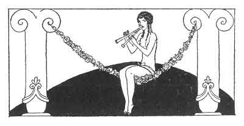

[Intangible Textual Heritage](../../index)  [Classics](../index) 
[Sappho](../sappho/index)  [Index](index)  [Previous](sob133) 
[Next](sob135) 

------------------------------------------------------------------------

p. 159

 

### THE LITTLE FLOWER-VENDOR

"Yesterday," Naïs said to me, "I was in the square, when a little girl
in scarlet rags and tatters walked up and offered roses to a cluster of
young men. And this is what I heard:

'Buy something from me. --Explain yourself, little creature, for we
don't know what you're selling: yourself? your roses? or both of them
together? --If you buy all these flowers, I will give you mine for
nothing.

--And how much do you want for all your roses? --My mother must have six
oboli, or I'll be beaten like a bitch. --Follow us and you shall have a
drachma. --Then should I go and get my little sister?'

And both of them followed these men. They had no breasts, Bilitis. They
did not even know how to smile. They trotted off like kids led to the
slaughter."

------------------------------------------------------------------------

[Next: Dispute](sob135)
