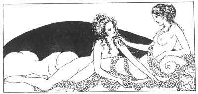

[Intangible Textual Heritage](../../index)  [Classics](../index) 
[Sappho](../sappho/index)  [Index](index)  [Previous](sob141) 
[Next](sob143) 

------------------------------------------------------------------------

p. 168

 

### YOUNG MOTHER

Do not think, Myromeris, that because you were a mother your beauty has
diminished in the least. Now your body, underneath its robe, has drowned
its fragile lines beneath voluptuary softness.

Your breasts are two vast flowers overturned upon your chest, whose cut
stems furnish forth a milky sap. Your softer belly melts beneath the
hand.

And give a thought now to the little child, born of the ecstasy that
once you felt, one evening in the arms of a passer-by whose very name
you now no longer know. Dream of her far-away fate.

These eyes, which scarcely open now, one day will be far lengthened by a
line of black, and will sow joy or anguish among men by a single flutter
of their curling lashes.

------------------------------------------------------------------------

[Next: The Unknown](sob143)
