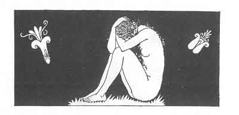

[Intangible Textual Heritage](../../index)  [Classics](../index) 
[Sappho](../sappho/index)  [Index](index)  [Previous](sob150) 
[Next](sob152) 

------------------------------------------------------------------------

p. 179

 

### SECOND EPITAPH

On the dark shores of the Melas, at Tamassos in Pamphylia, I, Bilitis,
daughter of Damophylos, first saw the light. I rest far away from my
birth-place, you see.

As a child I was taught the loves of Adon and Astarte, the mysteries of
holy Syria, and death and the return to She-of-the-full-rounded-eyelids.

If I have been a courtesan, wherein lies the blame? Was this not my work
as a woman? Stranger, the Mother-of-Everything guides us. She cannot be
wisely ignored.

In gratitude to you who have paused here, I wish you this fate: May you
be loved, but not love. Farewell, and in your old age remember that once
you gazed on my tomb.

------------------------------------------------------------------------

[Next: Last Epitaph](sob152)
