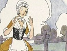

  
[Intangible Textual Heritage](../../index)  [Comparative
Religion](../index)  [Index](index)  [Previous](otmf01) 

------------------------------------------------------------------------

  
*On the Migration of Fables*, by Max Müller, \[1881\], at Intangible
Textual Heritage

------------------------------------------------------------------------

p. 188

# NOTES.

### NOTE A.

IN modern times, too, each poet or fabulist tells the story as seems
best to him. I give three recensions of the story of Perrette, copied
from English schoolbooks.

##### The Milkmaid.

A milkmaid who poised a full pail on her head,  
Thus mused on her prospects in life, it is said:—  
Let me see, I should think that this milk will procure  
One hundred good eggs or fourscore, to be sure.  
     Well then, stop a bit, it must not be forgotten,  
Some of these may be broken, and some may be rotten;  
But if twenty for accident should be detached,  
It will leave me just sixty sounds eggs to be hatched.  
     Well, sixty sound eggs—no, sound chickens I mean:  
Of these some may die—we'll suppose seventeen;  
Seventeen, not so many!—say ten at the most,  
Which will leave fifty chickens to boil or to roast.  
     But then there's their barley, how much will they need?  
Why, they take but one grain at a time when they feed,  
So that's a mere trifle;—now then, let me see,  
At a fair market-price how much money there'll be.  
Six shillings a pair, five, four, three-and-six,  
To prevent all mistakes that low price I will fix;  
Now what will that make? Fifty chickens I said;  
Fifty times three-and-six?—I'll ask brother Ned.  
     Oh! but stop, three-and-sixpence a pair I must sell them!  
Well, a pair is a couple; now then let us tell them.  
A couple in fifty will go (my poor brain),  
Why just a score times, and five pairs will remain. p. 189  
     Twenty-five pairs of fowls, now how tiresome it is  
That I can't reckon up such money as this.  
Well there 's no use in trying, so let 's give a guess—  
I'll say twenty pounds, and it can be no less.  
     Twenty pounds I am certain will buy me a cow,  
Thirty geese and two turkeys, eight pigs and a sow;  
Now if these turn out well, at the end of the year  
I shall fill both my pockets with guineas, ’tis clear.  
     Forgetting her burden when this she had said,  
The maid superciliously tossed up her head,  
When, alas for leer prospects! her milkpail descended,  
And so all her schemes for the future were ended.  
     This moral, I think, may be safely attached  
"Reckon not on your chickens before they are hatched!  
                                      Jeffreys
Taylor."

##### Fable.

A country maid was walking with a pail of milk upon her head, when she
fell into the following train of thoughts: "The money for which I shall
sell this milk will enable me to increase my stock of eggs to three
hundred. These eggs will bring at least two hundred and fifty chickens.
The chickens will be fit to carry to market about Christmas, when
poultry always bear a good price; so that by May-day I shall have money
enough to buy me a new gown. Green?—let me consider—yes, green becomes
my complexion best, and green it shall be. In this dress I will go to
the fair, where all the young fellows will strive to have me for a
partner; but I shall perhaps refuse every one of them, and with an air
of distain toss from them." Charmed with this thought, she could not
forbear acting with her head what thus passed in her mind, when down
came the pail of milk, and with it all her fancied happiness.—From Guy's
"*British Spelling Book*."

##### Alnasker.

Alnasker was a very idle fellow, that would never set his hand to work
during his father's life. When his father died he left him to the value
of a hundred pounds in Persian money. In order to make the best of it he
laid it out in glasses and bottles, and the finest china. These he piled
up in a large open basket at his feet, and leaned his back upon the wall
of his shop in the

p. 190

hope that many people would come in to buy. As he sat in this posture,
with his eyes upon the basket, he fell into an amusing train of thought,
and talked thus to himself: "This basket," says he, "cost me a hundred
pounds, which is all I had in the world. I shall quickly make two
hundred of it by selling in retail. These two hundred shall in course of
trade rise to ten thousand, when I will lay aside my trade of a
glass-man, and turn a dealer in pearls and diamonds, and all sorts of
rich stones. When I have got as much wealth as I can desire, I will
purchase the finest house I can find, with lands, slaves, and horses.
Then I shall set myself on the footing of a prince, and will ask the
grand Vizier's daughter to be my wife. As soon as I have married her, I
will buy her ten black servants, the youngest and best that can be got
for money. When I have brought this princess to my house, I shall take
care to breed her in due respect for me. To this end I shall confine her
to her own rooms, make her a short visit, and talk but little to her.
Her mother will then come and bring her daughter to me, as I am seated
on a sofa. The daughter, with tears in her eyes, will fling herself at
my feet, and beg me to take her into my favor. Then will I, to impress
her with a proper respect for my person, draw up my leg, and spurn her
from me with my foot in such a manner that she shall fall down several
paces from the sofa." Alnasker was entirely absorbed with his ideas, and
could not forbear acting with his foot what he had in his thoughts; so
that, striking his basket of brittle ware, which was the foundation of
all his grand hopes, he kicked his glasses to a great distance into the
street, and broke then into a thousand pieces.—"Spectator." (From the
"Sixth Book," published by the Scottish School Book Association, W.
Collins & Co., Edinburgh).

### NOTE B.

Pertsch, in Benfey's "Orient and
Occident," vol. ii. p. 261. Here the story is told as follows: "Perche
si conta che un certo pouer huomo hauea uicino a doue dormiua, un mulino
& del buturo, & una notte tra se pensando disse, io uenderò questo
mulino, & questo butturo tanto per il meno, che io comprerò diece capre.
Le quali mi figliaranno in cinque mesi altre tante, & in cinque anni
multiplicheranno fino a quattro cento; Le quali barattero in cento buoi,
& con essi seminarò una cãpagna, & insieme da figliuoli

p. 191

loro, & dal frutto della terra in altri cinque anni, sarò oltre modo
ricco, & faro un palagio *quadro*, adorato, & comprerò schiaui una
infinità, & prenderò moglie, la quale mi farà un figliuolo, & lo
nominerò Pancalo, & lo farò ammaestrare come bisogna. Et se vedrò che
non si curi con questa bacchetta cosi il percoterò. Con che prendendo la
bacchetta che gli era uicina, & battendo di essa il vaso doue era il
buturo, e lo ruppe, & fuse il buturo. Dopò gli partorì la moglie un
figliuolo, e la moglie un dì gli disse, habbi un poco cura di questo
fanciullo o marito, fino che io uo e torno da un seruigio. La quale
essendo andata fu anco il marito chiamato dal Signore della terra, & tra
tanto auuenne che una serpe salì sopra il fanciullo. Et vna donzella
uicina, corsa là l’uccise. Tornato il marito uide insanguito l’ vscio, &
pensando che costei l’ hauesse ucciso, auanti che il uedesse, le diede
sui capo, di un bastone, e l’ uccise. Entrato poi, & sano trouando il
figliuolo, & la serpe morta, si fu grandemente pentito, & piãse
amaramente. Cosi adunque i frettolosi in molte cose errano." (Page 516.)

### NOTE C.

This and some other extracts, from books
not to be found at Oxford, were kindly copied for me by my late friend,
E. Deutsch, of the British Museum.

"Georgii Pachymeris Michael Palæologus, sive Historia serum a M. P.
gestarum," ed. Petr. Possinus. Rome, 1666.

Appendix ad observationes Pachymerianas, Specimen Sapientiæ Indorum
veterum liber olim ex lingua Indica in Persicam a Perzoe Medico: ex
Persica in Arabicam ab Anonymo: ex Arabica in Græcam a Symeone Seth, a
Petro Possino Societ. Iesu, novissime e Græca in Latinam translatas.

"Huic talia serio nuganti haud paulo cordatior mulier. Mihi videris,
Sponse, inquit, nostri cujusdam famuli egentissimi hominis similis ista
inani provisione nimis remotarum et incerto eventu pendentium rerum. Is
diurnis mercedibus mellis ac butyri non magna copia collectâ duobus ista
vasis e terra coctili condiderat. Mox secum ita ratiocinans nocte quadam
dicebat: Mel ego istud ac butyrum quindecim minimum vendam denariis. Ex
his decem Capras emam. Hæ mihi quinto mense totidem alias parient.
Quinque annis gregem Caprarum facile quadringentarum confecero. Has
commutare tunc placet cum bobus centum, quibus

p. 192

exarabo vim terræ magnum et numerum tritici maximum congeram. Ex
fructibus hisce quinquennio multiplicatis, pecuniæ scilicet tantus
existet modus, ut facile in locupletissimis numerer. Accedit dos uxoris
quam istis opibus ditissiman nansciscar. Nascetur mihi filius quem jam
nunc decerno nominare Pancalum. Hunc educabo liberalissime, ut nobilium
nulli concedat. Qui si ubi adoleverit, ut juventus solet, contumacem se
mihi præbeat, haud feret impune. Baculo enim hoc ilium hoc modo feriam.
Arreptum inter hæc dicendum lecto vicinum baculum per tenebras jactavit,
casuque incurrens in dolia mellis et butyri juxta posita, confregit
utrumque, ita ut in ejus etiam os barbamque stillæ liquoris prosilirent;
cætera effusa et mixta pulveri prorsus corrumperentur; ac fundamentum
spei tantæ, inopem et multum gementem momento destitueret." (Page 602.)

### NOTE D.

"Directorium Humanæ Vitæ alias Parabolæ
Antiquorum Sapientum," fol. s.1. e. a. k. 4 (circ. 1480?): "Dicitque
olim quidam fuit heremita apud quendam regem. Cui rex providerat
quolibet die pro sua vita. Scilicet provisionem de sua coquina et
vasculum de melle. Ille vero comedebat decocta, et reservabat mel in
quodam vase suspenso super suum caput donec esset plenum. Erat autem mel
percarum in illis diebus. Quadam vero die: dun jaceret in suo lecto
elevato capite, respexit vas mellis quod super caput ei pendebat. Et
recordatus quoniam mel de die in diem vendebatur pluris solito seu
carius, et dixit in corde suo. Quum fuerit hoc vas plenum: vendam ipsum
uno talento auri: de quo mihi emam decem oves, et successu temporis he
oves facient filios et filas, et erunt viginti. Postes vero ipsis
multiplicatis cum filiis et filiabus in quatuor annis erunt quatuor
centum. Tunc de quibuslibet quatuor ovibus emam vaccam et bovem et
terram. Et vaccæ multiplicabuntur in filiis, quorum masculos accipiam
mihi in culturam terre, præter id quod percipiam de eis de lacte et
lana, donec non consummatis aliis quinque annis multiplicabuntur in
tantum quod habebo mihi magnas substantias et divitias, et ero a cunctis
reputatus dives et honestus. Et edificabo mihi tunc grandia et
excellentia edificia pre omnibus meis vicinis et consauguinibus, itaque
omnes de meis divitiis loquantur, nonne erit mihi illud jocundum, eum
omnes homilies mihi reverentiam in omnibus locis exhibeant.

p. 193

\[paragraph continues\] Accipiam postea
uxorem de nobilibus terre. Cumque eam cognovero, concipiet et pariet
mihi filium nobilem et delectabilem cum bona fortuna et dei beneplacito
qui crescet in scientia virtute, et relinquam mihi per ipsum bonam
memoriam post mei obitum et castigabo ipsum dietim: si mee
recalcitraverit doctrine; ac mihi in omnibus erit obediens, et si non:
percutiam eum isto baclo et erecto baculo ad percutiendum percussit vas
mellis et fregit ipsum et defluxit mel super caput ejus."

### NOTE E.

"Das Buch der Weisheit der alter Weisen,"
Ulm, 1415. Here the story is given as follows:—

"Man sagt es wohnet eins mals ein brůder der dritten regel der got fast
dienet, bei eins künigs hof, den versach der künig alle tag zů auff
enthalt seines lebens ein kuchen speiss und ein fleschlein mit honig.
diser ass alle tag die speiss von der kuchen und den honig behielt er in
ein irden fleschlein das hieng ob seiner petstat so lang biss es voll
ward. Nun kam bald eine grosse teür in den honig und eins morgens früe
lag er in seinem pett und sach das honig in dem fleschlein ob seinem
haubt hangen do fiel ym in sein gedanck die teure des honigs und fieng
an mit ihm selbs ze reden. wann diss fleschlein gantz vol honigs wirt so
ver kauff ich das umb fünff güldin, darum̅ kauff ich mir zehen gůtter
schaff und die machen alle des jahrs lember. und dann werden eins jahrs
zweintzig und die und das von yn kummen mag in zehen jaren werden
tausent. dann kauff ich umb fier schaff ein ku und kauff dobei ochsen
und ertrieh die meren sich mit iren früchten und do nimb ich dann die
frücht zů arbeit der äcker. von den andern küen und schaffen nimb ich
milich und woll ee das andre fünff jar fürkommen so wird es sich allso
meren das ich ein grosse hab und reichtumb überkumen wird dann will ich
mir selbs knecht und kellerin kauffen und hohe und hübsche bäw ton. und
darnach so nimm ich mir ein hübsch weib von einem edeln geschlecht die
beschlaff ich mit kurtzweiliger lieb. so enpfecht sie und gebirt mir ein
schön glückseligten sun und gottförchtigen. und der wirt wachsen in lere
und künsten und in weissheit. durch den lass ich mir einen gůten leümde
nach meinein tod. aber wird er nit fölgig sein und meiner straff nit
achten so wolt ich yn mit meinem stecken über sein rucken on erbermde
gar hart schlahen. und nam sein stecken da mit man pflag das

p. 194

pet ze machen ym selbs ze zeigen wie fretelich er sein sun schlagen
wölt. und schlůg das irden fass das ob seinem haubt hieng zů stricken
dass ym das honig under sein antlit und in das pet troff und ward ym von
allen sein gedencken nit dann das er sein antlit und pet weschen můst."

### NOTE F.

This translation has lately been
published by Don Pascual de Gayangos in the "Biblioteca de Autores
Españoles," Madrid, 1860, vol. li. Here the story runs as follows
(p.57):—

'Del religioso que vertió la miel et la manteca sobre su cabeza.

"Dijo la mujer: 'Dicen que un religioso habia cada dia limosna de casa
de un mercader rico, pan é manteca é miel e otras cosas, et comia el pan
é lo ál condesaba, et ponia la miel é la manteca en un jarra, fasta quel
a finchó, et tenia la jarra colgada â la cabecera de su cama. Et vino
tiempo que encareció la miel é la manteca, et el religioso fabló un dia
consigo mismo, estando asentado en su cama, et dijo así: Venderé cuanto
está en esta jarra por tantos maravedís, é comparé con ellos diez
cabras, et empreñarse-han, é parirán á cabo de cinco meses; et fizo
cuenta de esta guisa, et falló que en cinco años montarian bien
cuatrocientas cabras. Desí dijo: Venderlas-he todas, et con el precio
dellas compraré cien vacas, por cada cuatro cabezas una vaca, é haberé
simiente é sembraré con los bueyes, et aprovecharme-he de los becerros
et de las fembras é de la leche é manteca, é de las mieses habré grant
haber, et labraré muy nobles casas, é compraré siervos é siervas, et
esto fecho casarme-he con una mujer muy rica, é fermosa, é de grant
logar, é emprefrarla-he de fijo varon, é naceré complido de sus
miembros, et criarlo-he como á fijo de rey, é castigarlo-he con esta
vara, si non quisiere ser bueno é obediente.' E él deciendo esto, alzó
la vara que tenia en la mano, et ferió en la olla que estaba colgada
encima del, é quebróla, é cayóle la miel é la manteca sobre su cabeza,"
etc.

### NOTE G.

See "Poésies inédites du Moyen Âge," par
M. Edélstand Du Méril. Paris, 1854. XVI. De Viro et Vase Olei (p. 239):—

p. 195

"Uxor ab antiquo fuit infecunda marito.  
 Mesticiam (l. mœstitiam) cujus cupiens lenire vix (1. vir) hujus,  
 His blandimentis solatur tristi\[ti\]a mentis:  
 Cur sic tristaris? Dolor est tuus omnis inanis:  
 Pulchræ prolis eris satis amodo munere felix.  
 Pro nihilo ducens conjunx hæc verbula prudens,  
 His verbis plane quod ait vir monstrat inane:  
 Rebus inops quidam . . . (bone vir, tihi dicam)  
 *Vas oleo plenum*, longum quod retro per ævum  
 Legerat orando, loca per diversa vagando,  
 Fune ligans ar(c)to, tecto\[que\] suspendit ab alto.  
 Sic præstolatur tempus quo pluris ernatur\[atur\]  
 Qua locupletari se sperat et arte beari.  
 Talia dum captat, hæc stultus inania jactat:  
 Ecce potens factus, fuero cum talia nactus,  
 Vinciar uxori quantum queo nobiliori:  
 Tune sobolem gignam, se meque per omnia dignam,  
 Cujus opus morum genus omne præibit avorum.  
 Cui nisi tot vitæ fuerint insignia rite,  
 Fustis hic absque mora feriet caput ejus et \[h\]ora.  
 Quod dum narraret, dextramque minando levaret,  
 Ut percussisset puerum quasi præsto fuisset  
 Vas in prædictum manus ejus dirigit ictum  
 Servatumque sibi vas il\[l\]ico fregit olivi."

I owe the following extract to the kindness of M. Paul Meyer: —

*Apologi Phædrii ex ludicris I. Regnerii Belnensis doct. Medici,
Divione, apud Petrum Palliot, 1643 in 12, 126 pages et de plus un
index*.

Le recueil se divise en deux partis, pars I., pars II. (La fable en
question est à la page 32, pars I. fab. xxv.)

XXV\.

Pagana et eius mercis emptor.

Pagana mulier, lac in olla fictili,  
Ova in canistro, rustici mercem penus,  
Ad civitatem proximam ibat venditum.  
In eius aditu factus huit quidam obvius p.
196  
Quanti rogavit ista quæ fers vis emi?  
Et illa tanti. Tantin’? hoc fuerit nimis.  
Numerare num me vis quod est æquum? vide  
Hac merce quod sit nunc opus mihi plus dabo  
Quam præstet illam cede, et hos nummos cape,  
Ea quam superbe fœde rusticitas agit,  
Hominem reliquit additis conviciis,  
Quasi æstimasset vilius mercem optimam.  
Aversa primos inde vix tulerat grades,  
Cum lubricato corruit strato viæ:  
Lac olla fundit quassa, gallinaceæ  
Testæ vitellos congerunt cœno suos  
Caput cruorem mittit impingens petræ  
Luxata nec fert coxa surgentem solo:  
Ridetur ejus non malum, sed mens procax,  
Qua merx et ipsa mercis et pretium petit;  
Segue illa deflens tot pati infortunia  
Nulli imputare quam sibi hanc sortem potest  
Dolor sed omnis sæviter recruduit  
Curationis danda cum merces fuit.

In re minori cum quis et fragili tumet  
Hunc sortis ingens sternit indignatio.

### NOTE H.

Hulsbach, "Sylva Sermonum," Basileæ,
1568, p. 28: "In sylva quadam morabatur heremicola jam satis provectæ
ætatis, qui quaque die accedebat civitatem, afferens inde mensuram
mellis, qua donabatur. Hoc recondebat in vase terreo, quod pependerat
supra lectum suum. Uno dierum jacens in lecto, et habens bacalum in manu
sua, hæc apud se dicebat: Quotidie mihi datur vasculum mellis, quod dum
indies recondo, fiet tandem summa aliqua. Jam valet mensura staterem
unum. Corraso autem ita floreno uno aut altero, emam mihi oves, quæ
fœnerabunt mihi plures: quibus divenditis coëmam mihi elegantem
uxorculam, cum qua transigam vitam meam lætanter: ex ea suscitabo mihi
puellam, quam instituam honeste. Si vero mihi noluerit obedire, hoc
baculo eam ita comminuam: atque levato baculo confregit suum vasculum,
et effusum est mel, quare

p. 197

cassatum est suum propositum, et manendum adhuc in suo statu."

### NOTE I.

"El Conde Lucanor, compuesto por el
excelentissimo Principe don Iuan Manuel, hijo del Infante don Manuel, y
nieto del Santo Rey don Fernando," Madrid, 1642; cap. 29, p. 96. He
tells the story as follows: "There was a woman called Dona Truhana
(Gertrude), rather poor than rich. One day she went to the market
carrying a pot of honey on her head. On her way she began to think that
she would sell the pot of honey, and buy a quantity of eggs, that from
those eggs she would have chickens, that she would sell them and buy
sheep; that the sheep would give her lambs, and thus calculating all her
gains, she began to think herself much richer than her neighbors. With
the riches which she imagined she possessed, she thought how she would
marry her sons and daughters, and how she would walk in the street
surrounded by her sons and daughters-in-law; and how people would
consider her happy for having amassed so large a fortune, though she had
been so poor. While she was thinking over all this, she began to laugh
for joy, and struck her head and forehead with her hand. The pot of
honey fell down, was broken, and she shed hot tears because she had lost
all that she would have possessed if the pot of honey had not been
broken."

### NOTE K.

Bonaventure des Periers, "Les Contes ou
les Nouvelles." Amsterdam, 1735. Nouvelle XIV. (vol. i. p. 141). (First
edition, Lyon, 1558): "Et ne les (les Alquemistes) sçauroiton mieux
comparer qu’à une bonne femme qui portoit une potée de laict au marché,
faisant son compte ainsi: qu’elle la vendroit deux liards: de ces deux
liards elle en achepteroit une douzaine d’oeufs, lesquelz elle mettroit
couver, et en auroit une douzaine de poussins: ces poussins
deviendroient grands, et les feroit chaponner: ces chapons vaudroient
cinq solz la piece, ce seroit un escu et plus, dont elle achepteroit
deux cochons, masle et femelle: qui deviendroient grands et en feroient
une douzaine d’autres, qu’elle vendroit vingt solz la piece; apres les
avoir

p. 198

nourris quelque temps, ce seroient douze francs, dont elle achepteroit
une iument, qui porteroit un beau poulain, lequel croistroit et
deviendroit tant gentil: il sauteroit et feroit *Hin*. Et en disant
*Hin*, la bonne femme, de l’aise qu’elle avoit en son compte, se print à
faire la ruade que feroit son poulain: et en ce faisant sa potée de
laict va tomber, et se respandit toute. Et voila ses œufs, ses poussins,
ses chappons, ses cochons, sa jument, et son poulain, tous par terre."

 

 

 
