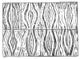

  
[Intangible Textual Heritage](../../index)  [Earth Mysteries](../index) 
[Index](index)  [Previous](amm11)  [Next](amm13) 

------------------------------------------------------------------------

[Buy this Book at
Amazon.com](https://www.amazon.com/exec/obidos/ASIN/0486435199/internetsacredte)

------------------------------------------------------------------------

*Architecture, Mysticism and Myth*, by W.R. Lethaby, \[1892\], at
Intangible Textual Heritage

------------------------------------------------------------------------

p. 201

### CHAPTER IX

### PAVEMENTS LIKE THE SEA

'. . . *The sea, flat like a pavement of lapis-lazuli, ascended
imperceptibly to the sky on the horizon*.'—FLAUBERT.

IN the 'Stones of Venice' Mr Ruskin wrote of the floors of the basilicas
of Murano and St Mark: 'We feel giddy at the first step we make on the
pavement, for it is of Greek mosaic, waved like the sea, and dyed like a
dove's neck.' 'Round the domes of its roof the light enters only through
narrow apertures, like large stars; and here and there a ray or two from
some far-away casement wanders into the darkness, and casts a narrow
phosphoric stream upon the waves of the marble that heave and fall in a
thousand colours along the floor.'

Mr Street, in 1854, described 'the wild beauty of the pavement' in St
Mark's as swelling up and down like a petrified sea; and he went on to
suggest that this *undulation of surface* was an intentional making of
the floor in the semblance of the sea. This, magnificent as it would be
as imagination, has not generally been approved, and the balance of
evidence from technical examinations of the construction and settlements
is against the theory. As a parallel, Mr Street referred to the pavement
of the 'Mother Church' at Constantinople as representing water in its
design; but the floor is entirely covered with matting, and it has never
been drawn, nor precisely described.

p. 202

The story of its representing water which appears in many recent books
on Constantinople, is borrowed from Von Hammer's description of the
church. The original is given by Codinus, an officer of the Imperial
palace at Constantinople, who wrote an account of Sta. Sophia in the
fifteenth century, from which a friend has made the following extracts.
In the church, as finished by Justinian, 'the varied hues of the
pavement were like the ocean.' This was destroyed when the roof fell in;
and in the repairs undertaken by Justin, the nephew of Justinian, 'as he
could not otherwise obtain variegated stones, he sent Marses, the
patrician, to Proconnesus to quarry marble as near like it as possible.
Four rivers of leek-green marble were laid, like the four streams which
flow from Paradise to the sea.' The marbles named are those known to us
as pavonazzetto and verde antico: and some friends who examined the
floor, as far as it might be seen through the chinks of 'that accursed
matting,' say that it is laid in slabs of whitish marble with green
bands; but it is impossible without more evidence to say that this is
the original floor.

It is only in story that we can find *ideal* architecture—the pure
thought unrelated to cost and utility. The romance writers delighted in
decorating their dream edifices with marvellous pavements; bronze in the
palace of Alcinous, in 'Cupid and Psyche' mosaic pictures of jewels, in
mediæval story jasper, onyx, paste of coral, or alternate squares of
gold and silver for living chess. But actual pavements have been hardly
less remarkable. Some were areas of black marble or wholly of white
slabs, 'like snow,' says Procopius of a floor in a church built by
Justinian. Another, in the palace at Constantinople, 'imitated the
flowers of the field.' In mediæval pavements, the subjects usually are

p. 203

chapters from Nature's story, and in this they follow Roman and Eastern
tradition. The four Seasons, for instance, was a favourite subject for
classic pavements, whether in Carthage or in Cirencester. A mosaic from
a Christian church at Tyre was brought from Syria by Renan, which
represented the *Seasons*, *Months*, and *Winds*. In Italy, the *Year*
is often enthroned in the centre, holding Sun and Moon, and surrounded
by the Months with the several appropriate *Labours of the Fields*. The
four *Rivers of Eden* are poured out of great vases, and the angles are
filled up with the beasts of the earth. At Brindisi and Otranto are
floors of fine design, whatever may be their meaning:—'The principal
divisions are formed by gigantic trees, resting upon elephants and
extending far into the nave; the branches are alive with animals of all
kinds.' These motives, Woltmann says, are borrowed 'from the designs of
Oriental carpets. We find, again and again, that to follow up any
thought in decorative design leads to the East, apparently to Persia;
and as the farther East was influenced as much by Persian art, we may
see here the centre of at least true Aryan design.

When Ahasuerus made his feast at Shushan the floor was 'of porphyry, and
marble, and alabaster, and stone of a blue colour' (lapis-lazuli). There
is a beautiful Assyrian pavement in the British Museum, of alabaster,
wrought like a tapestry; and Sadi tells us of a tomb floored with marble
and turquoise. Philostratus describes a temple of the sun seen by
Apollonius in India, the walls of which were of red marble, like fire
with streaks of gold; on the pavement was an image of the sun, with its
rays imitated in dazzling profusion of rubies and diamonds.

We might have expected to find floors with geographies; but—except the
carpet of Chosroes, representing

p. 204

a garden with its paths, trees, and running water-courses, with
parterres of spring flowers of the brightest hues: and a carpet
belonging to one of the Fatimite caliphs, which represented the earth
with its mountains, seas, rivers, highways, and cities, especially Mecca
and Medinah, each marked with its proper name—none have been found
described.

But far beyond all these realised or imagined designs the finest is the
floor like the sea; the thought of which penetrates us like certain
vibrations in music. It is the pavement in the heavenly temple of the
Apocalypse:—

'And before the throne there was a sea of glass, like unto crystal.'
'Them that had gotten the victory . . . stand on the sea of glass,
having the harps of God' (chs. iv. and xv.) Compare the firmament, like
'the terrible crystal,' on which was placed the sapphire throne in
Ezekiel, also 'the paved work' of clear sapphire in Exodus (xxiv. 10).
The pseudo Enoch, in his vision of heaven, entered a spacious habitation
of crystal, 'its walls, as well as its pavement, were formed with stones
of crystal, and crystal likewise was the ground.'

This is the ultimate conception on which is founded the crystal floors
of romance; but probably, as we shall see, it was not taken directly and
consciously from the Revelation. In Lydgate's 'Warre of Troy,' the floor
of the hall in Priam's palace is of jasper. In the 'Gest Hystoriale' of
the Destruction of Troy, Hector, while suffering from his wounds, was
laid in the proud 'Palace of Ylion':—

'Hit was pight up with pilirs all of pure stonys  
 Palit full proudly; and a proud floor  
 Wrought all with crystall, clere as the sonne.'

In each corner was a pillar, and on it an image of

p. 205

gold with 'gematry justly ajoynet.' The design is repeated again in the
tomb of Hector 'trayturly slayn,' the same figures and floor of 'clere
crystall.' 'As Dares tells in his treatise,' is the authority given for
all these wonders; but Dares and Dictys say nothing half so nice in
their bald and dreary narrative. The genealogy for the palace of romance
probably ascends through the Alexander stories, and Apuleius in Cupid
and Psyche, to the Eastern cities of gold, of which Homer's palace of
Alcinous is a Greek version.

Justinian, at Constantinople, appears definitely to have set himself to
rival Solomon as a builder. His throne was not only made in the fashion
of Solomon's, but actually called 'Solomon's throne;' and when he had
erected Sta. Sophia, the most splendid church Christendom has ever seen,
he exclaimed: 'Glory be to God! who has esteemed me worthy to achieve a
work so sublime; O Solomon, I have surpassed thee!' It is said that he
intended at first to floor his church with gold, like the Temple; but,
fearing man's cupidity, he substituted the floor of marble, resembling
water.

Now, there is an Eastern legend of Solomon laying a floor like the sea
in his wonderful palace in Jerusalem:—'When the Queen of Sheba heard of
the fame of Solomon, she came to prove Solomon with hard questions'
(Book of Chronicles). These, according to Eastern tradition, were
riddles, like those which passed between Solomon and Hiram of Tyre. But
'there was nothing hid from Solomon,' and, *en revanche*, he retorts by
transporting the throne of Queen Balkis to his palace by the aid of the
genii who ever served him, so that on her arrival she was confronted by
her own throne. 'It was said unto her: enter the palace. And when she
saw it she imagined it to be a

p. 206

great water, and she discovered her legs, by lifting up her robe, to
pass through it. Whereupon Solomon said unto her: Verily, this is a
palace evenly floored with glass' (Koran xxvii.) Or, as some understand,
adds Sale, this was in 'the court before the palace, which Solomon had
commanded to be built against the arrival of Balkis; the floor or
pavement being of transparent glass, laid over running water in which
fish were swimming. Fronting this pavement was the royal throne, on
which Solomon sat to receive the Queen.'

A similar floor is given to the palace of *The City of Brass*, in the
'Arabian Nights,' probably the most wonderful piece of architectural
imagination in literature. The Emeer Moosa and his followers came to a
high-walled city, from the midst of which shines the tower of brass.
They entered and pressed on to the palace, and found a saloon
constructed of polished marble, adorned with jewels. 'The beholder
imagined upon its floor was running water, and if any one walked upon it
he would slip. The Emeer Moosa therefore ordered the Sheykh Abd-Es-Samad
to throw upon it something that they might be enabled to walk upon it;
and he did this, and so contrived that they passed on.'

The story, incorporated in the Koran soon after the year 622, is
probably from the Talmud, which contains this version:—All the kingdoms
congratulated Solomon as the worthy successor of his father David, whose
fame was great among all nations, save one, the Kingdom of Sheba, the
capital of which was called Kitore.

To this kingdom, Solomon sent a letter.

'From me, King Solomon, peace to thee and to thy government. Let it be
known to thee, that the Almighty God has made me to reign over the whole
world, the kingdoms of the north, the south, the east, and the west. Lo,
they have come to me with their

p. 207

congratulations, all save thee alone. Come thou also, I pray thee, and
submit to my authority, and much honour shall be done thee; but if thou
refusest, behold I shall by force compel thy acknowledgment.

'To thee, Queen Sheba, is addressed this letter in peace, from me, King
Solomon, the Son of David.' When Solomon heard that the Queen was coming
he sent Benayahu, the son of Yehoyadah, the general of his army, to meet
her. When the queen saw him she thought he was the king, and she
alighted from her carriage.

Then Benayahu asked, 'Why alightest thou from thy carriage?' and she
answered, 'Art thou not his majesty the king?'

'No,' replied Benayahu, 'I am but one of his officers.' Then the queen
turned back and said to her ladies in attendance, 'If this is but one of
the officers, and he is so noble and imposing in appearance, how great
must be his superior the king.'

And Benayahu, the son of Yehoyadah, conducted Queen Sheba to the palace
of the king.

*Solomon prepared to receive his visitor in an apartment laid and lined
with glass, and the queen at first was so deceived by the appearance
that she imagined the king to be sitting in water*.

And when the queen had tested Solomon's wisdom and witnessed his
magnificence, she said, 'I believed not what I heard, but now I have
come and my eyes have seen it all; behold, the half has not been told to
me. Happy are thy servants who stand before thee continually, to listen
to the wisdom of thy words. Blessed be the Lord thy God, who hath placed
thee on a throne to rule righteously and in justice.'

There is a practically identical story in another of the quarry books of
the world, the Sanscrit epic of the *Mahabharata*, which sings the long
strife of rival royal

p. 208

houses. One of the Rajas celebrates a royal sacrifice. 'When the
sacrifice had been fully accomplished, Duryodhana entered the place
where it had been performed, and saw very many beautiful things that he
had never beheld in his own Raj at Hastinapur. Amongst other wonders was
a square, made of black crystal, which appeared to the eye of Duryodhana
to be clear water, and as he stood on the margin he began to draw up his
garments lest they should be wetted, and then throwing them off he
plunged in to bathe and was struck violently on the head against the
crystal. Then he was much ashamed and left that place.'

Mr Talboys Wheeler suggests that this may be borrowed from the Koran,
but allows that it may have had an independent origin. There can,
however, be little doubt that these transcendental palaces, which are
handed on through milleniums of Indian story, find their origin in the
structures of the land which is not subject to winter's wind, nor any
decay—The City of Gold founded in the waters above the firmament.

In the fifteenth century Italian romance, called the *Hypnerotomachia*,
the author seems to have collected all the architectural wonders of
history and romance; but how should he come by this same story?
Poliphilus, after penetrating zone after zone of gardens, which occupy
an island, comes at last to a circular temple, open to the sky, and on
entering it was astonished to find 'a marvel more grand and stupefying
than anything he had ever seen;' the whole area of the amphitheatre was
apparently paved with one sole stone of obsidian, entirely black and of
invincible hardness, so polished and shining that at the first moment he
feared destruction by walking into an abyss. It reflected the light of
day so perfectly that he contemplated the profound and limpid sky as in
a quiet sea: everything was reflected as in a polished mirror.

p. 209

According to the story in the Koran, Solomon's throne seems to stand on
the waters, just as was imagined of God's throne. 'It is He who hath
created the heavens and the earth in six days, but His throne was above
the waters, before the creation thereof' (Koran xi.). 'For the
Mohammedans supposed this throne, and the waters whereon it stands—which
waters they imagine were supported by a spirit or wind—were, with some
other things, created before the heavens and the earth. This fancy they
borrowed from the Jews, who also say that the throne of glory then stood
and was borne on the face of the waters by the breath of God's mouth'
(Sale). An account of this pavement of waters above the firmament is
given in Smith's 'Dictionary of the Bible'—'Further, the office of the
*rakia* (firmament or solid expansion) in the economy of the world
demanded strength and substance. It was to serve as a division between
the waters above and the waters below . . . . and accordingly the
*rakia* was created to support the upper reservoir (Psalms cxlviii. 4
and civ. 3), where Jehovah is represented as "building His chambers of
water," not simply in water, that being the material of which the beams
and joists were made.'

In Ezekiel's vision of a perfect temple, after he has seen every court
and chamber, and measured them with his reed, he is brought again to the
door:—'And, behold, waters issued out from under the threshold of the
house eastward: for the forefront it of the house stood toward the
east.' The waters came from the south of the altar, and after passing
through the court and the outer gate became a mighty river flowing to
the sea. It is the river of the water of life, 'and everything shall
live whither the river cometh.'

p. 210

To return to Constantinople once more: an account of the emperor's
bed-chamber, in the imperial palace, is given by Bayet (*L’Art
Byzantin*.), quoting from Constantine Porphyrogenitus. A range of the
palace called 'Cenourigion,' was built by Basil, the Macedonian; one of
the rooms had sixteen columns, of green marble, and of onyx, sculptured
with branches of the vine, and the vault was covered with golden mosaic.
'But nothing could equal the royal bed-chamber. The pavement was of
mosaic, the centre was a peacock in a circle of Carian marble,
surrounded by rays, and an outer circle. From this second circle issued,
as it were, streams or rivers of green marble of Thessaly, which flowed,
seemingly, to the four angles of the room (*comme des ruisseaux ou des
fleuves de marble vert de Thessalie*); the four interspaces left between
the marble streams had eagles wrought in mosaic, which seemed to live
and to breathe. The lower part of the walls were encrusted with glass,
in many pieces of varied colour, in the forms of flowers. Above a gold
band, the walls were covered with mosaic, on the golden field of which
were enthroned Basil and Eudoxia, and their children around them. In the
centre of the ceiling glittered a cross of emerald glass on a star-lit
sky.' In the same book (Bayet) is a story taken from Codinus, of
flooding Sta. Sophia with water, which, although not questioned by the
author, seems to be an expedient so impracticable and injurious as to be
obviously a myth—just such a myth as would arise to account for a
pavement representing water. 'When the dome fell in Anthemius and
Isidore were dead, but the latter had left a nephew, who was charged
with the works. He increased the elevation of the cupola, and at the
same time gave greater solidity to the great arches. They this time left
the centres longer in place, and all

p. 211

the scaffolding. *They also inundated with water the lower part of the
church*, so that pieces of wood in falling should not cause any injury.'

In the great area of Sta. Sophia it is not possible to see the floor,
but in one of the galleries a green marble pavement is still uncovered.
It is formed of very large slabs of antique Cipollino (Browning's 'onion
stone'), the slabs being laid in such a manner

[  
Click to enlarge](img/fig22.jpg)  
  

that what were the two faces of the division made by the saw in the
original 'block are opened out side by side, thus obtaining a
symmetrical wave-like veining. Mr Brindley, the best English authority
on marbles, says—'Cippolino produces, when sawn across the bed, sea-wave
like effects, to which the Roman and Byzantine architects were very
partial.'

In St Mark's at Venice where the floor is generally covered by the most
varied and intricate mosaic in existence, there is, just in the most
important place of

p. 212

the area, centrally in front of the choir screen, a similar 'sea' of
marble. Twelve immense slabs of Cipollino, each thirteen feet long by
five feet wide, are arranged in the same way as to matching one another,
covering an area thirty feet by twenty-six feet with their rippled
veining. The marble block from which these slabs were cut was brought
from the east, and the slabs were laid down in quite evident imitation
of the floor of Sta. Sophia.

If the ceiling belonged of right to the sky, the floor is yielded to the
sea. When Galla Placidia escaped from shipwreck, she dedicated a
pavement in St John the Evangelist at Ravenna—a picture of the shipwreck
recalling the peril of the queen by its likeness to the storm-tossed
waves of the sea. Mr Baring Gould describes a pavement he discovered in
a Gallo-Roman palace near Pau:—'In the principal room the pavement was
very elaborate; the design was, however, rudely interrupted by a
monstrous cross, nearly twenty feet by thirteen feet, with its head
towards the south and its foot at the head of a flight of marble steps
descending into what we were unable to decide whether it was a bath or a
vestibule. The ground of the cross was white, the limbs were filled with
cuttle, lobsters, eels, oysters, and fish *swimming as though in their
natural element;* but the centre, where the arms intersected, was
occupied by a gigantic bust of Neptune with his trident.'

Sir Charles Newton says:—'On a mosaic found at Oudnah, in Algeria, we
have a representation of the sea, remarkable for the fulness of details
with which it is made out. The mosaic lines the floor and sides of a
bath; and, as was commonly the case in the baths of the ancients, serves
as a figurative representation of the water it contained. On the sides
are hippocamps, figures riding on dolphins, and islands

p. 213

on which fishermen stand; on the floor are fish, crabs, and shrimps.'

The baths of Caracalla, in Rome, have such sea pavements treated
pictorially, as well as patterns in a conventional rendering of sea
waves. And the baths of Titus even had a floor of lapis lazuli—a great
pool of ultramarine.

If we take any collection of Roman mosaic floors—as, for instance, those
now exhibited on the staircase of the British Museum, or the drawings at
South Kensington—it is most remarkable how often the

[  
Click to enlarge](img/fig23.jpg)  
  

floor is designed as a sea; there are subjects such as Neptune and
Amphitrite; Ulysses in his ship; or a fisherman in a boat, the rest of
the area being filled with fish: or, more frequently, only fish and
marine monsters 'swimming as though in their natural element;' the sea
being represented by the flowing lines of the plain white mosaic, with a
darker broken line here and there in various directions. One of the most
beautiful of these is an English example that was discovered at
Cirencester, and figured by Lysons.

We can hardly suppose that all of these were in baths. At Lydney on the
Severn, a mosaic was found forming the floor of a temple to the Celtic

p. 214

\[paragraph continues\] 'God of the
Deeps,' to whom the pavement was dedicated; inscribed offerings proved
that this was a temple. Great sea serpents and fish swim over the
expanse of the floor (C. W. King).

The best authenticated specimen of Greek mosaic floor, that of the
pronaos of the temple of Zeus, at Olympia, of which only a small
fragment exists, represents a triton and fish swimming. Within the
temple, directly in front of the great statue of Zeus enthroned, by
Pheidias, and right across the sanctuary, was an area of black marble
twenty-two feet square, and slightly sunk below the rest of the floor.
Pausanias describes it, and the foundations yet show its place. Shining
with the oil thrown over the ivory figure, and reflecting it and the
lights, it must have resembled the deep still sea, the sea of heaven
which bore the throne of Zeus, and in which the stars floated. There is
an irresistible suggestion of water in these marble floors when highly
polished. Miss Beaufort, for instance, saw in a Damascus mosque, what
every worshipper of the throned Zeus must have seen and understood in
the Temple of Olympia—'The polished marble floor shone darkly, like a
lake of black water, reflecting back the few lamps like stars.'

A representation of the sea of heaven with its stars is especially
appropriate to the floor of the holy place, which bears the figure of
the god, or the altar.

It was quite general in the Middle Ages to figure the signs of the
zodiac on the floor of the sanctuary, thus marking it like the 'paved
work' of heaven.

'Look how the floor of heaven  
 Is thick inlaid with patines of bright gold.'  
                                  —*Merchant of Venice*.

\[paragraph continues\] Left behind in the
west end of the church was the labyrinth of the lower world, but the
holy place, raised seven steps, was heaven itself. In England we have a
fine

p. 215

zodiac on the floor at Canterbury. The choir of St Remi, at Rheims, had
a pavement of marble and enamel; on one side of which was figured the
earthly paradise with the four rivers, the earth seated on ocean, and
the seasons; on the other side were the four cardinal points, the
zodiacal circle, and within the last the two bears of the North Pole
studded with stars. Some British-Roman pavements display the sun in the
middle surrounded by the planets.

In the Dome of the Rock at Jerusalem, a slab of dark stone inlaid in the
floor is said to be a piece of the pavement of paradise.

[  
Click to enlarge](img/fig24.jpg)  
  

Many of the churches of Italy have wave patterns on the floors, and in
some instances we are able to identify them as set imitations of the
waters. In the crypt of an early church at Piacenza the space before the
altar has a mosaic pavement with undulating lines of waves in which
fishes swim, and circular discs contain the zodiacal signs; these
heavenly signs floating on the water appear to mark it as the oversea.

In the great basin of the Baptistry at Pisa the floor again definitely
represents the water it contains.

p. 216

At Florence, the floor of the Baptistry is laid in patterns suggesting
running and rippled water, with the sun and zodiacal signs. (*See*
[figures](#img_fig24).)

With all these examples, it cannot be doubted that the wave-like
patterns of the central space at Grado, or portions in St Mark's,
represent the sea by a traditional pattern.

 

To the Egyptians the realm of Osiris was watered by a network of smiling
canals. Wilkinson writes of the happy dead admitted to these Elysian
fields:—'Horus introduces him to the presence of Osiris, who, in his
palace, attended by Isis and Nepthys, sits on his throne in the midst of
the waters, from which rises the lotus, bearing upon its expanded flower
the four genii of Amenti.' In the plate given by Wilkinson of the scene
from which he takes his description, Osiris is shown under a
pillar-borne canopy, seated on a throne placed on the waters, the water
being shown by a parallelogram covered with zigzag lines.

In some of the Egyptian temples, the lower part of the side walls is
painted with growing water plants, and next the floor is the zigzag line
of water. The bases of the columns are wrapped round with water leaves;
the shafts themselves being bundles of water reeds.

The gods are sometimes shown supported by the oversea, Ra floating in
his bark, or enthroned (like that discovered by Miss Edwards' party at
Aboo Simbel) on a platform of blue spangled with stars. As the Pharaoh
had the effigies of his enemies painted on the soles of his shoes so
that he might tread them in the dust, as his footstool was carved on its
sides with prostrate captives: so, with symbolic intention, the thrones
and footstools shown at the

p. 217

\[paragraph continues\] Ramessium, and in
the tombs of the kings, were covered with tissue of blue sprinkled with
stars. The king, godlike, crushes his enemies under his footstool, and
treads underfoot the azure flood in which float the stars. No mere
accident this, but an ordered symbolism; it occurs many times, the stars
being treated exactly as they are on the star ceilings of the temples,
an acknowledged symbol of the sky and heavens reserved for sacred
places.

The most beautifully worked and preserved Babylonian tablet in the
British Museum represents the king before the sun-god Samas. It is
carefully engraved by Lenormant (*Histoire Ancienne de l’Orient*), and
by Perrot. The image of the god sits on a throne, under a canopy; before
him is a great sun disc, with flaming rays on it, which is revolved by
means of ropes as the king is led forward. The floor of this
composition, on which stands the throne, the sun altar, and the
worshippers, is an area of water, and on it are a row of stars—without
doubt stars, for above the god are engraved the forms of the sun, moon,
and stars; and the stars on the pavement repeat the last with
exactitude. The text says it represents the king before Samas in his
temple at Sippara, and it seems possible that the floor there really
represented the oversea. It is not without some relation, we might
suppose, to these thoughts that an Assyrian pavement in the British
Museum is entirely patterned over with the lotus.

There is abundance of evidence besides what has been given, that the
celestial sea forms the floor of the over-world; our dome being the
under side of the pavement, as in Blake:—

'Lo! the vault of paved heaven.'

In the Brahmanical system, the paradise is well

p. 218

watered with broad, beautiful lakes. 'These lakes are covered with
water-lilies, red, blue, and white, each blossom having a thousand
petals; and on the most beautiful of all these calm lakes floats a
throne, glorious as the sun, whereon Krishna the beautiful reposes'
(Miss Gordon Cumming). Indeed, the whole city of Krishna is built on the
waters.

To the Buddhist, the 'lotus throne' of Buddha rests on the waters—Buddha
being called 'the Jewel on the lotus.' Even in the Rig Veda, Yama, the
lord of death, is 'the assembler of men who departed to the mighty
waters,' 'the heavenly ocean;' and Varuna dwells in a golden palace,
where he 'sits throned in unapproachable light, on the waters of
heaven.' In the Avesta, the 'lofty mountain,' the exterior of the domed
firmament is the seat of the gods, and the source of all the waters of
earth. The paradise of the Burmese has 'gorgeous palaces, with crystal
pavements, golden columns, and jewelled walls.'

Doubtless to a parallel phase of the thought belong the vast sacred
lakes attached to the temples of India, on which, as the homes of the
gods, they seem to float. It was the same in Greece, in Syria, Babylon,
and Egypt; here the priests imitated the voyage of the sun, and here
swam sacred fish. 'At Sais, in the sacred precinct . . . is a lake
ornamented with a stone margin, formed in a circle, and in size it
appeared to me much the same as that at Delos, which is called the
circular. In this lake they perform by night the representation of that
person's adventures, which they call mysteries' (Herodotus).

Nebuchadnezzar, in one of his inscriptions, speaks of surrounding the
temple he had built with a lake. And in India the golden temple of
Amritzur seems to float on an artificial sea, crossed by a single
causeway, entering on which, as Lady Dufferin remarks, the

p. 219

pilgrim puts off his 'earthly shoes.' At Marttand the temple court was
filled with water, in which stepping-stones were placed, leading from
the gateway.

The fountain of ablution is common to the religions of the East.
Although its use is obvious, both for practical and symbolic purity, yet
the water was 'holy water,' and represented the fountain of life.
Professor Sayce, in his Hibbert Lectures, says 'the temples of Babylonia
were provided with large basins filled with water, and used for
purificatory purposes, which resembled *the sea* made by Solomon in his
temple at Jerusalem, and were called *deeps* or *abysses*.' Pausanias
also mentions *seas* in Greek temples.

 

That there is something impressive to the imagination in thus making the
floor to appear like a sea, is sufficiently borne out by the following
instances from modern romance and poetry; from French, German, and
English authors. To take them respectively:—

Flaubert thus describes the assembly at the temple in Carthage: 'The
elders sat on the ebony benches, having thrown over their heads the ends
of their long robes. They remained motionless, with their hands crossed
in their wide sleeves; and the mother-of-pearl pavement resembled a
luminous stream, that ran under their bare feet, from the altar to the
door.'

In Eber's Egyptian romance, 'Uarda,' a temporary palace is built, in
which to welcome back Rameses from the war in Syria. As the author leans
so on his correct archæology, the floor of the banqueting-hall may be
taken from a wall painting. 'This (the palace) was of unusual height,
and had a vaulted wooden ceiling, which was painted blue, and sprinkled
with stars, to represent the night heavens. Thick carpets, which seemed
to have transported the seashore

p. 220

on to the dry land—for their pale blue ground was strewn with a variety
of shells, fishes, and water-plants—covered the floor of the
banqueting-hall.'

Mr William Morris makes use of the thought in the description of a new
fourteenth century church, in 'A Dream of John Ball': 'The white shafts
of the arches rose out of the shining pavement in the moonlight as
though out of a sea, dark, but with gleams struck over it.' In the story
of 'Cupid and Psyche,' in his 'Earthly Paradise,' it seems as if the
floor is taken from the account of the reception of Queen Balkis by
Solomon, for the idea is not found in the story by Apuleius.

'At last she came into a chamber cool,  
 Paved cunningly in the manner of a pool,  
 Where red fish seemed to swim through the floating weed;  
 And at the first she thought it so indeed,  
 And took the sandals quickly from her feet;  
 But when the glassy floor these did but meet,  
 The shadow of a long-forgotten smile  
 Her anxious face a moment did beguile.'

The last instance is that in Southey's 'Thalaba,' which is not so much a
continuation of the tradition as a reverting to the original idea which
underlies the whole series—an imitation by human hands, in an artificial
paradise, of the water or transparent crystal pavement above the
firmament, where stands the throne. Shedad, who, according to Arab
story, lived in the early ages of the world, built to himself such a
lordly pleasure-house and garden of delights:—

'Here emerald columns o’er the marble courts  
 Fling their green rays, as when, amid a shower,  
 The sun shines loveliest on the vernal corn;  
 Here Shedad bade the sapphire floor be laid  
 As though with feet divine to trample azure light,  
 Like the blue pavement of the firmament.'

------------------------------------------------------------------------

[Next: Chapter X. Ceilings Like the Sky](amm13)
