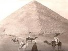

  
[Intangible Textual Heritage](../../index)  [Earth Mysteries](../index) 
[Index](index)  [Previous](ams02)  [Next](ams04) 

------------------------------------------------------------------------

[Buy this Book at
Amazon.com](https://www.amazon.com/exec/obidos/ASIN/B002EEP30M/internetsacredte)

------------------------------------------------------------------------

  
*A Miracle in Stone: The Great Pyramid*, by Joesph A. Seiss, \[1877\],
at Intangible Textual Heritage

------------------------------------------------------------------------

p. 9

"EVERY student who enters upon a scientific pursuit, especially if at a
somewhat advanced period of life, will find not only that he has much to
learn, but much also to unlearn. As a first preparation, therefore, for
the course he is about to commence, he must loosen his hold on all crude
and hastily adopted notions, and must strengthen himself, by something
of an effort and a resolve, for the unprejudiced admission of any
conclusion which shall appear to be supported by careful observation and
logical argument, even should it prove of a nature adverse to notions he
may have previously formed for himself, or taken up, without
examination, on the credit of others. Such an effort is, in fact, a
commencement of that intellectual discipline which forms one of the most
important ends of all science."—*Sir John Herschel*.

"THE fair question is, does the newly proposed view remove more
difficulties, require fewer assumptions, and present more consistency
with observed facts, than that which it seeks to supersede? If so, the
philosopher will adopt it, and the world will follow the
philosopher."—*Grove's Address to the British Association for the
Advancement of Science*.

------------------------------------------------------------------------

[Next: Plate: The Great Pyramid](ams04)
