  
[Intangible Textual Heritage](../../index)  [Earth Mysteries](../index) 
[Index](index)  [Previous](boe06)  [Next](boe08) 

------------------------------------------------------------------------

### Creation of the World

And yet he has tried to determine it, with that handful of working means
left him when the gods departed; his vague knowledge of truth--which has
served him better for determining what is not truth than what is truth;
his numbers, his signs, his characters, his symbols, his words, his
capacity to be curious, to wonder, and to draw analogies between strange
things. This was his equipment when he first began to question Space,
and from this tiny handful of resources all the Creation stories of the
world arose. Their outlines are remarkably the same. First of all a
primordial substance and a Former to mould it--they sometimes called
these two first forces the Maker and the Moulder, each contained within
the other, but at rest. Then out of stillness came motion; out of motion
light, out of light all created things; after Creation, evil; and, after
evil, the deluge; out of the deluge the mountain top; and out of the
ruins of the Old Earth, the New. Many of the Creation stories are
familiar, but here are two which are almost unknown to the western
world, though one of them is of that very world itself.

The first comes from Asia, land of the oldest recorded

p. 23

thought we have--at least nothing older is recognised as coming from any
other source. The second is of America, youngest historically of all the
continents, with all her prehistoric past practically stripped of
records. The first is in words, one of man's most magnificent guesses at
the original combining of the Great Elements which produced the Earth.
The second is told in glyphs or pictographs. The first is taken from the
Sanscrit *Mahabharata*; the second from the *Walam Olum* of the Lenape
or Delaware Indians, a branch of the great Algonkin stock which roamed
from east to west and west to east in North America, and styled itself
the Sacred People," "the Mound Builders."

Bhrgu, in the Sanscrit epic, is answering the question, "By whom was
this world with its oceans, its firmament, its mountains, its clouds,
its lands, its fire, and its winds created? He replies that, first of
all, the Primæval Being Manasa created a Divine Being Mahat.

Mahat created Consciousness.

That Divine Being created Space.

From Space was born Water, and from Water were born Fire and Wind.

Through the union of Fire and Wind was born the Earth.

Then follows a song to Mahat.

The Mountains are His bones.  
The Earth is His fat and flesh. p. 24  
The Oceans are His blood.  
Space is His stomach.  
The Wind is His breath.  
Fire is His energy.  
The Rivers are His arteries and veins.  
Agni and *Soma*, otherwise the Sun and the Moon, are called His eyes.  
The firmament above is His head.  
The Earth is His two feet.  
The Cardinal and subsidiary points of the horizon are His arms.  
Without doubt He is incapable of being known and His Soul is
inconceivable.

Of the extent of the firmament, of the surface of the Earth, and of the
Wind:

*Bhrgu said*: The Sky thou seest above is infinite.

The Sun and the Moon cannot see, above or below, beyond the range of
their own rays. There where the rays of the Sun and the Moon cannot
reach are luminaries which are self-effulgent and which possess
splendour like that of the Sun or of Fire.

This Space which the very gods cannot measure is full of many blazing
and self-luminous worlds each above the other.

Beyond the limits of land are oceans of water. Beyond water is darkness.

Beyond darkness is water again, and beyond the last is fire.

p. 25

Downwards, beyond the nether regions, is water. Beyond water is the
region belonging to the great snakes.

Beyond that is sky once more, and beyond the sky is water again.

Ever thus there is water and sky alternately without end. . . .

Formerly there was only Infinite Space, perfectly motionless and
immovable. Without sun, moon, stars, and wind, it seemed to be asleep.

Then Water sprang into existence, like something darker within darkness.

Then from the pressure of Water arose Wind. As when an empty vessel
without a hole appears at first to be without any sound, but when filled
with Water, Air appears and makes a great noise, even so when Infinite
Space was filled with Water, the Wind arose with a great noise,
penetrating through the Water.

That Wind, thus generated by the pressure of the Ocean of Water, still
moveth. Coming into unobstructed Space, its motion is never stopped.

Then, in consequence of the friction of Wind and Water, Fire possessed
of great might and blazing energy sprang into existence with flames
directed upwards.

That Fire dispelled the darkness that covered Space.

Assisted by the Wind, Fire drew Space and Water together.

Indeed, combining with the Wind, Fire became solidified.

While falling from the Sky, the liquid portion of Fire

p. 26

solidified again, and became what is known as the Earth.

The Earth or land, in which everything is born, is the origin of all
kinds of taste, of all kinds of scent, of all kinds of liquids, and of
all kinds of animals.

*The Walam Olum* (or "Red Score") *of the Lenape*. [1](#fn_0)

|                                                 |                                                                                                                                                 |
|-------------------------------------------------|-------------------------------------------------------------------------------------------------------------------------------------------------|
|  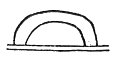 | 1\. At first, in that place, at all times, above the earth,                                                                                     |
|  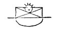 | 2\. On the earth, \[was\] an extended fog, and there the great Manito was.                                                                      |
|  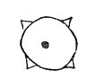 | 3\. At first, forever, lost in space, everywhere, the great Manito was.                                                                         |
|  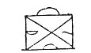 | 4\. He made the extended land and the sky.                                                                                                      |
|  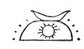 | 5\. He made the sun, the moon, the stars.                                                                                                       |
|                                                 | p. 27                                                                                                                 |
|  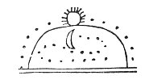 | 6\. He made them all to move evenly.                                                                                                            |
|  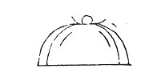 | 7\. Then the wind blew violently, and it cleared, and the water flowed off far and strong.                                                      |
|   | 8\. And groups of islands grew newly, and there remained.                                                                                       |
|  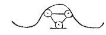 | 9\. Anew spoke the great Manito, a manito to manitos,                                                                                           |
|  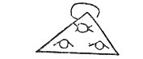 | 10\. To beings, mortals, souls and all,                                                                                                         |
|  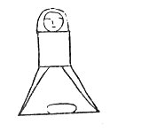 | 11\. And ever after he was a manito to men, and their grandfather                                                                               |
|  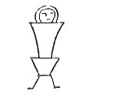 | 12\. He gave the first mother, the mother of beings.                                                                                            |
|  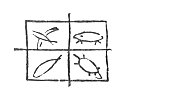 | 13\. He gave the fish, he gave the turtles, he gave the beasts, he gave the birds.                                                              |
|  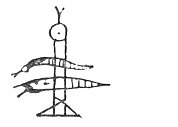 | 14\. But an evil Manito made evil beings only, monsters,                                                                                        |
|                                                 | p. 28                                                                                                                 |
|  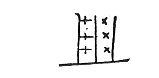 | 15\. He made the flies, he made the gnats.                                                                                                      |
|  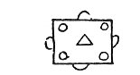 | 16\. All beings were then friendly.                                                                                                             |
|  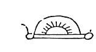 | 17\. Truly the manitos were active and kindly                                                                                                   |
|  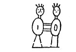 | 18\. To those very first men, and to those first mothers, fetched them wives,                                                                   |
|  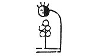 | 19\. And fetched them food, when first they desired it.                                                                                         |
|  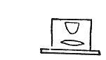 | 20\. All had cheerful knowledge, all had leisure, all thought in gladness.                                                                      |
|  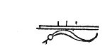 | 21\. But very secretly an evil being, a mighty magician, came on earth,                                                                         |
|  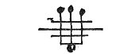 | 22\. And with him brought badness, quarreling, unhappiness,                                                                                     |
|  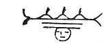 | 23\. Brought bad weather, brought sickness, brought death.                                                                                      |
|  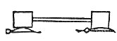 | 24\. All this took place of old on the earth, beyond the great tide-water, at the first.                                                        |
|                                                 | p. 29                                                                                                                 |
|                                                 | II\.                                                                                                                                            |
|  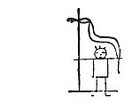 | 1\. Long ago there was a mighty snake and beings evil to men.                                                                                   |
|  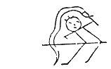 | 2\. This mighty snake hated those who were there (and) greatly disquieted those whom he hated.                                                  |
|  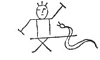 | 3\. They both did harm, they both injured each other, both were not in peace.                                                                   |
|  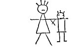 | 4\. Driven from their homes they fought with this murderer.                                                                                     |
|  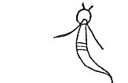 | 5\. The mighty snake firmly resolved to harm the men.                                                                                           |
|  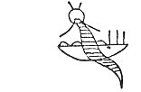 | 6\. He brought three persons, he brought a monster, he brought a rushing water.                                                                 |
|  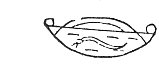 | 7\. Between the hills the water rushed and rushed, dashing through and through, destroying much.                                                |
|  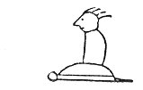 | 8\. Nanabush, the Strong White One, grandfather of beings, grandfather of men, was on the Turtle Island.                                        |
|                                                 | p. 30                                                                                                                 |
|  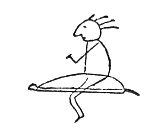 | 9\. There he was walking and creating, as he passed by and created the turtle.                                                                  |
|  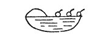 | 10\. Beings and men all go forth, they walk in the floods and shallow waters, down stream thither to the Turtle Island.                         |
|  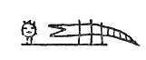 | 11\. There were many monster fishes, which ate some of them.                                                                                    |
|  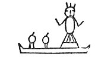 | 12\. The Manito daughter, coming, helped with her canoe, helped all, as they came and came.                                                     |
|  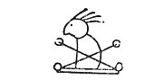 | 13\. \[And also\] Nanabush, Nanabush, the grandfather of all, the grandfather of beings, the grandfather of men, the grandfather of the turtle. |
|  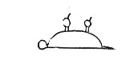 | 14\. The men then were together on the turtle, like to turtles.                                                                                 |
|  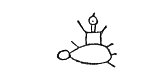 | 15\. Frightened on the turtle, they prayed on the turtle that what was spoiled should be restored.                                              |
|  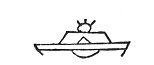 | 16\. The water ran off, the earth dried, the lakes were at rest, all was silent, and the mighty snake departed.                                 |

Let us extract several of these primitive world-pictures from the *Walam
Olum* and set them side by side for comparison. Quite apart from any
meaning attached to them in the legend of the Lenape, these three signs
illustrate very well indeed what were probably the first

p. 31

two world-concepts of man; either that the Earth was an island in a
watery waste on whose waves the sky rested

<table data-border="0">
<colgroup>
<col style="width: 33%" />
<col style="width: 33%" />
<col style="width: 33%" />
</colgroup>
<tbody>
<tr class="odd">
<td data-valign="top" width="218">
 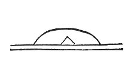 
FIGURE 27.
</td>
<td data-valign="top" width="218">
 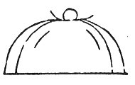 
FIGURE 28.
</td>
<td data-valign="top" width="218">
 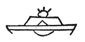 
FIGURE 29.
</td>
</tr>
</tbody>
</table>

as best it might, or that it was a vast plain overarched by the solid
vault of heaven and tightly enclosed within it. The first of the three
needs only a writhing sea serpent inscribed beneath it to illustrate
that heavy fear of primitive man, that portentous monsters, slipping
through the deepest depth of the ocean, might creep under the edge of
the firmament to work evil on Earth. So little has ever been done with
these Lenape pictographs, as Dr. Brinton himself admits, that it is
impossible to speak with certainty about the real meaning of any of
them; and it is only a hazardous guess to suggest that [Fig.
29](#img_fig029), the last "sign" of the Deluge story--"The water ran
off, the earth dried, the lakes were at rest, all was silent, and the
mighty snake departed"--may represent the ocean surrounding the Earth as
barred, perhaps forever, against the "mighty snake" which had wrought
such desolation. The oblique lines would serve here, instead of an
Earth-surrounding mountain wall, or a circular continental ring beyond
the "River Ocean," to guard the Earth against invasion from without. In
any case, here are primitive representations of "mountains of the
world"--the "first Earth" before and

p. 32

the "first Earth" after the Deluge--and of that other "first" concept of
the Earth as a vast plain, overarched by the solid vault of heaven.

There is another Creation story that we might glance at here, because it
contains so many notions of the beginnings of things that are
extraordinarily similar to other ideas we shall meet later on. It is the
Creation story of the Maidus, an Indian tribe of northern California.

"When this world was filled with water," so Dixon translates the
tradition, [1](#fn_1) Earth-Maker floated upon
it, kept floating about. Nowhere in the world could he see even a tiny
bit of earth. No persons of any kind flew about. He went about in this
world, the world itself being invisible, transparent like the sky.

"He was troubled. 'I wonder how, I wonder where, I wonder in what place,
in what country, we shall find a world!' he said. You are a very strong
man, to be thinking of this world,' said Coyote. 'I am guessing in what
direction the world is, then to that distant land let us float!' said
Earth-Maker.

"In this world they kept floating along, kept floating along, hungry,
having nothing to eat. You will die of hunger,' said Coyote. Then he
thought. No, I cannot think of anything,' he said. 'Well,' said
Earth-Maker, the world is large, a great world. If somewhere I find a
tiny world, I can fix it up.'

"Then he sang, 'Where, little world, art thou?' It is said he sang, kept
singing, sang all the time. 'Enough!' he said, and stopped singing.
Well, I don't know many

 

[  
Click to enlarge](img/pl01.jpg)  
Plate I: STAGES OF CREATION  
*From right to left: I. Chaos: Division of Light from Darkness:
Separation of Earth and Water. Vegetation. II. Sun, Moon, and Stars:
Fishes and Birds: Animals and Man; Sabbath Rest*.  
(From *Haggadah von Sarajevo* of the 14th century)  

 

p. 33

songs (?),' he said. Then Coyote sang again, kept singing, asking for
the world, singing, 'Where, O world, art thou?' He sang, kept singing;
then 'Enough!' he said. 'I am tired. You try again.'

"So Earth-Maker sang. 'Where are you, my great mountains, my world
mountains?' he said. He sang, and all the time kept saying, 'Where are
you?' He stopped singing. 'Enough!' he said. 'You try also.' Coyote
tried, kept singing. 'My foggy mountains, where one goes about,' he
said. 'Well, we shall see nothing at all. I guess there never was a
world anywhere,' said he. 'I think, if we find a little world, I can fix
it very well,' said Earth-Maker.

"As they floated along, they saw something like a bird's nest. 'Well,
that is very small,' said Earth-Maker. 'It is small. If it were larger I
could fix it. But it is too small,' he said. 'I wonder how I can stretch
it a little.' He kept saying, 'What is the best way! How shall I make it
larger!' So saying, he prepared it. He extended a rope to the east, to
the south he extended a rope, to the west, to the northwest, and to the
north he extended ropes.

"When all were stretched, he said, 'Well, sing, you who were the finder
of this earth, this mud! "In the long, long ago, Robin-Man made the
world, stuck earth together, making this world." Thus mortal man shall
say of you, in myth-telling.' Then Robin sang, and his world-making song
sounded sweet. After the ropes were all stretched, he kept singing;
then, after a time, he ceased.

"Then Earth-Maker spoke to Coyote also. 'Do you sing, too,' he said. So
he sang, singing, 'My world where

p. 34

one travels by the valley-edge; my world of many foggy mountains; my
world where one goes zigzagging hither and thither; range after range,'
he said, 'I sing of the country I shall travel in. In such a world I
shall wander,' he said.

"Then Earth-Maker sang--sang of the world he had made, kept singing,
until by and by he ceased. 'Now,' he said, it would be well if the world
were a little larger. Let us stretch it.'--'Stop!' said Coyote. 'I speak
wisely. This world ought to be painted with something so that it may
look pretty. What do ye two think?'

"Then Robin-Man said, 'I am one who knows nothing. Ye two are clever
men, making this world, talking it over; if ye find anything evil, ye
will make it good.' 'Very well,' said Coyote, 'I will paint it with
blood. There shall be blood in the world; and people shall be born
there, having blood. There shall be birds born who shall have blood.
Everything--deer, all kinds of game, all sorts of men without any
exception--all things shall have blood that are to be created in this
world. And in another place, making it red, there shall be red rocks. It
will be as if blood were mixed up with the world, and thus the world
will be beautiful,' he said. 'What do you think about it?' Your words
are good,' he said, 'I know nothing.' So Robin-Man went off. As he went,
he said, 'I shall be a person who travels only in this way,' and he flew
away."

Only after all this was accomplished did Earth-Maker, commanding Coyote
to lie down on his face, begin to stretch the world. With his foot he
extended it to the east, to the south, to the west, to the northwest,
and to

p. 35

the north. And yet again, saying to Coyote, "Do not look up. You must
not," he stretched it again, as far as it would go in the five
directions. Then Coyote, rising, began to walk to the eastward side, and
Earth-Maker, after describing the entire circuit of the world, returned
to the spot from whence he had set out, and began to prepare things. He
made men, of different colours, two of each kind only, and as he made
them in pairs, he counted them. "Then he counted all the countries, and,
as he counted them, assigned them, gave them to the countries. 'You are
a country having this name, you shall have this people,' he said. This
sort of people, naming you, shall own the country. These people shall
grow, shall keep on growing through many winters, through many dawns.
They shall continue to grow until, their appointed winters being past,
their dawns being over, this people having finished growing, shall be
born,' he said."

So Earth-Maker created, to each country a name and a people with a name
and speech, each different; until he arrived at the middle of the world,
where he made two others and left them, saying, "'Ye here, growing
steadily, when so many winters shall have passed, very many winters,
many days, ye shall be fully grown,' he said. 'Then ye shall be mortal
men, ye shall be born full grown. . . . Ye shall not be born soon,' he
said."

Continuing on his way to the uttermost limit where mortal men were to
live, he stopped, and created, first two, whom he laid down, and two
more, and still another pair. "'Ye shall remain here,' he said, 'and
your country shall have a name. Although living in a small country, in

p. 36

one that is not large, it shall be sufficient for you. This I leave; and
growing continually . . . ye, being fully grown, shall be born,' he
said. 'Then your food will grow--different sorts of food, all kinds of
food; and ye, being born with sufficient intelligence, will survive,'
said he. Then he pushed them down under a gopher-hill.

"He spoke again. 'Ye, too, shall possess a small country. "Come now,
leave this country!" (this ye must not say to others wishing to take
this land). Ye shall be people who will not drive others away, driving
them off to another country. Ye shall be different, ye shall name your
country.'"

To still another pair he spoke, saying, "'Ye shall have children, and
when your children shall have grown larger, then, looking all over this
country, ye must tell them about it, teach them about it, naming the
country and places, showing them and naming them to your children. "That
is such and such a place, and that is such and such a mountain." So when
ye have caused them to learn this, teaching them, they shall understand
even as ye do yourselves.' Then, placing them between his thumb and
finger, he snapped them away.

"And when he had given countries thus to all that he had counted out,
there was one pair left. 'Ye, also, ye shall be a people speaking
differently. There will be a little too many of you for you to have the
same sort of a country also. So ye shall have that kind of a country, a
great country,' he said.

"'Now, wherever I have passed along, there shall never be a lack of
anything,' he said, and made motions in all

p. 38

directions. 'The country where I have been shall be one where nothing is
ever lacking. I have finished talking to you, and I say to you that ye
shall remain where ye are to be born. Ye are the last people; and while
ye are to remain where ye are created, I shall return and stay there.
When this world becomes bad, I will make it over again; and after I make
it, ye shall be born,' he said. Long ago Coyote suspected this, they
say.

"'This world will shake,' he said. 'This world is spread out flat, the
world is not stable. After this world is all made, by and by, after a
long time, I will pull this rope a little, then the world shall be firm.
I, pulling on my rope, shall make it shake. And now,' he said, 'there
shall be songs, they shall not be lacking, ye shall have them.' And he
sang, and kept on singing until he ceased singing. 'Ye mortal men shall
have this song,' he said, and then he sang another; and singing many
different songs, he walked along, kept walking until he reached the
middle of the world; and there, sitting down over across from it, he
remained.

"But in making the world, Robin-Man sang that which was pleasant to
hear. He, they say, was the first created person--a man whose song
passed across the valleys, a man who found the world, a man who in the
olden time sang very beautifully--sounding songs. And Earth-Maker, going
along, and having passed by the middle of the world, made a house for
himself, and remained there. That is as far as he went. That is all,
they say."

 

------------------------------------------------------------------------

### Footnotes

[26:1](boe07.htm#fr_0) This Creation and Deluge
story of the Lenape or Delaware Indians is taken from Dr. Daniel G.
Brinton's *The Lenape and Their Legends* (The Library of Aboriginal
American Literature, Vol. V, 1885). Since "walam" means "painted,"
particularly "painted red," and "olum" signifies the scores or marks or
notches or figures used on tally-sticks or record-boards, the sense of
*Walam Olum* is variously rendered by "Red Score" (Dr. Brinton's
choice), "Painted-engraved Tradition" (the translation left by
Constantine Rafinesque, original copyist of these Algonkin pictographs),
or "Painted Bark-Record." The pictographs or glyphs or signs were
"notches" designed to keep the long chant in memory. The very beautiful
translation is Dr. Brinton's.

[32:1](boe07.htm#fr_1) *Maidu Texts*: Roland B.
Dixon. Leyden, 1912.

------------------------------------------------------------------------

[Next: Upholders of the World](boe08)
