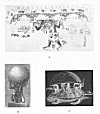

  
[Intangible Textual Heritage](../../index)  [Earth Mysteries](../index) 
[Index](index)  [Previous](boe07)  [Next](boe09) 

------------------------------------------------------------------------

### Upholders of the World

FLAMMARION'S OLD DRAWING of *The Earth Floating* is a peculiarly
desolate rendering of the ancient idea that the Earth was nothing more
than an island in a sea. This idea would of course have its probable
origin among races living near great seas or oceans whose other side
they

   
FIGURE 30. *The Earth Floating*.  
(From *Flammarion's Astronomical Myths*, 1877.)

had tried in vain to reach. The mind of men likes symmetry; if water
stretching endlessly away bounded one side of their "island," even
though that island were a continent whose other edge they did not know,
water must lie also on its other sides. If the Sun rose from their
eastern waters, say, at dawn, it must sink in some unknown western waves
at night, if for no other reason than, by swimming through them, to
arrive again by the next dawn, in the eastern sky. We may smile at this
childish notion if we will, but it may very well be that no great
"system" of the harmonious orbits of Sun and Moon and

 

[  
Click to enlarge](img/pl02.jpg)  
PLATE II: SUSTAINERS OF THE EARTH  

A. *Quetzalcoatl upholding the Heavens. From an original Mexican
painting preserved in the Imperial Library at Vienna*.

                   (From Kingsborough's *Mexican Antiquities*. 1831,
Vol. II)

B. *Atlas upholding the Earth*.

                   (From *Engravings after Stoddard*: a collection in
The New York Public Library)

C. *A Hindu Earth*.

                   (From *Flammarion's Astronomical Myths*, 1877)

 

p. 39

\[paragraph continues\] Earth *explain* the mystery of the "rising and
the setting of the Sun" any more or any better than the primitive idea
that darkness came when the Sun was submerged in the sea, and that light
came when the Sun sprang out of the sea. Perhaps all that we know
to-day--really know--is that in the hour of dawn the Sun appears, and in
the hour of twilight the Sun has vanished.

The precise nature of the element in which the Earth-island floated came
to be a matter of concern and much speculation. At first it was assumed
to be simply water; later it was defined as "water or some other
liquid," and finally it was believed to be a liquid not unlike the
composition of the waters directly under the firmament or lower heaven,
which were supposed to be a crystalline, congealed water, specially
combined to resist the flame of the Sun, Moon, and galaxy of stars, to
be itself full of fire, and yet not to burn. It was water, yet not
water, air yet not air, fire, yet not fire. Probably this was an attempt
to describe the medium in which the Island Moon floated, all sustaining,
yet clear.

Doubtless too the roundness of the Sun and Moon, their discs so broad,
yet thin enough to float in space, or aethereal waters, had as much to
do with giving men the idea that the Earth's shape might also be flat
and round, as the circular defining line of the horizon. Again, if the
Moon was like a leaf, floating in the heavenly water, the Earth, like a
leaf, floated on the world water, and like a leaf in water would develop
roots. Ages ago, as we have already noted ([p. 14](boe06.htm#page_14)),
the ancient world, India, China,

p. 40

\[paragraph continues\] Egypt, made the lotus the water-flower that
symbolises Earth and Heaven and all that lies between. For as a tree,
rooted in the Earth, is a part of it, so Earth, rooted in the universal
waters, must be a part of the universe from which it derives life and
nourishment. And again, though the roots of an Earth-island might not be
as firm as the

   
FIGURE 31. *The Earth with Roots*.  
(From *Flammarion's Astronomical Myths*, 1877.)

roots of a great Earth-tree might, that is, be as supple and flexible as
those of water plants, nevertheless it was an anchorage of the Earth to
something outside itself.

Naturally evolving from this would rise an Earth set on solid pillars,
an established, firmly founded disc. [Fig. 32](#img_fig032) is an old
picture of just such an Earth--"the Earth of the Vedic priests." Its
upper side is its only habitable side; its under side rests on twelve
columns, these columns resting in turn on the Twelve Great Sacrifices of
the Virtuous,--the aimful deeds, that is, of men aware of duty. Without
this subterranean foundation, said the

p. 41

ancient priests, the pillars of the Earth would dry up, and the Earth
would fall down. These pillars, says Flammarion, accounted more
reasonably for the rising and the setting of the Sun, than the rather
lazy guess that it swam through water from west to east every night;
though there was another speculation that it might reach the

   
FIGURE 32. *The Earth of the Vedic Priests*.  
(From *Flammarion's Astronomical Myths*, 1877.)

eastern heavens by traversing a complicated system of tunnels, like
great connecting caves, which pierced the Earth-disc from occident to
orient.

But the twelve pillars, quite as little as the roots of the Earth-island
leaf, failed to satisfy man's wonderings over the problem of what
supported the Earth, or on what the Earth rested. One of the old
familiar figures of Earth is that hemispherical Earth of the Hindus
([Plate II, C](#img_pl02)) supported on the backs of four elephants,
which stand on the hemispherical shell of a gigantic tortoise floating
on

p. 42

the surface of the world-waters. Sometimes, in addition to these three
supports, there is a fourth, the coiled ring of the great world-serpent
on which the tortoise rests--four foundations for Earth, and five for
Heaven which must rest on the Earth.

But the elephant, the tortoise and the serpent are only three of the
great animals which folk-lore and tradition say may support this planet.
The Altaic people of Northern Siberia affirm that their mighty Ulgen
created the Earth on the waters, and placed under its disc, to support
it, three great fish, one in the centre and one on either side. The head
of the middle fish being placed towards the north, floods occur there
when it presses its head down; and, should it ever sink too low, the
whole Earth will be deluged again. They believe that these fish are
attached to heaven by a rope through their gills, whereby their heads
can be lowered or raised, and that at the three posts of heaven to which
these ropes are tied, the Bodhisatta Mandishire, or guardian of Earth,
always watches. According to another tradition, only one great fish
supports the Earth; when he changes his position earthquakes occur. In
Hebrew myths, this mighty animal is the "fish-shaped Leviathan." Where
the turtle or the tortoise is unknown, as in far northern lands, the
"world-supporting Frog" will take its place; if its finger ever moves,
the Earth shivers. Among Tartars and many of the tribes of Asia-Europe,
the Earth is believed to be supported by a great bull; sometimes the
Earth rests on its back, sometimes it is held aloft on the horns. Or,
another variation,

 

[  
Click to enlarge](img/pl03.jpg)  
PLATE III. ATLAS SUPPORTING THE UNIVERSE  
(From Margarita Philosophica, 1517)  

 

p. 43

in the world-ocean there is a great fish, and, upon the fish, a bull
which bears the Earth. Or again, in the world-ocean there is a
giant-crab which gives support to the Earth-bearing bull. Some say that
the terrible weight of the Earth has already broken one of the great
horns, and that when the other breaks the world will come to an end.
Another of the Tartar tribes says that after the Great Mammoth was
created, it was found that the Earth was not strong enough to bear its
weight, and so, to avoid a waste of creation in the universe, the Great
Ruler solved the difficulty by commanding the Great Mammoth to bear the
Earth.

On what did the Earth rest? Not only on literal water, and great beasts.
On a whirlwind, said Empedocles; on roots rooted in the Infinite, said
Xenophanes; on a Soul of the World, said Plato and his school; on Twelve
Pillars, said the Vedic priests, which must have for their foundation
the "sacrifices of the virtuous." Earth, that is, depended ultimately on
man for its support. And sooner or later, in all cosmologies and
mythologies, we come upon some lurking or developed concept that the
burden of supporting both Earth and Heaven rests on the shoulders of
man. In countries as widely separated by race and by oceans as Greece
and Mexico, we find an "Atlas of the World," a sustainer of the universe
([Plate II](#img_pl02), A and B). In Greece it is Atlas the "Endurer,"
brother of Prometheus the rebel bringer-of-fire, who supports the globe.
Son of Poseidon, he knew the depths of the whole Ocean-world; it was his
task to guard the pillars which held Heaven and Earth apart. According
to one story, it was

p. 44

because he had attempted to storm the heavens that he was condemned to
carry its vault on his head and hands. According to another version, it
was only after the loss of his great Island realm Atlantis, that he was
forced to become the sustainer of the sky.

Mexico appears to have had four--at least--heaven-bearing gods, and each
of these appears to have exercised a number of functions other than the
sufficiently onerous one of supporting the universe. Quetzalcoatl,
although a Sun god and an earthquake god, was also, like Atlas, a water
god. If Atlas, interpreted, means the Endurer, Quetzalcoatl,
interpreted, means Heart of the Sea. God of the Sun, of the earthquake,
and the water, he also up-held the heavens of the Mexicans. In the
eastern world and in the western, thousands of years ago, these
different races believed alike that some great force never to be
understood and never to be overcome had wrenched the heavens from the
Earth, but that, at the same time it separated them, it united them by
another force, which each race represented by a human figure, a great
man-god. Explain it as we will, call it naïve or arrogant, it expressed
one of man's few entirely admirable qualities, his lonely necessity to
share, or to believe that he shared in the work of carrying on the
universe. And it found expression in countless ways.

A curious old drawing of the Middle Ages ([Plate III](#img_pl03)) shows
how the Atlas-myth persisted even into modern time. The Earth still
occupies the centre of the universe, with all the other heavenly bodies
revolving about it. From pole to pole of the firmament--his head marking

p. 45

the "Polus Arctic" and his two feet the "Polus Antarctic," stretches
Atlas, or the Macrocosm, or the Great Man, or Adam Kadmon, whichever you
will. To mediæval Europe Atlas represented the Macrocosm, or the long
great world, in contrast to the Microcosm or man--little, but the
epitome of all that had combined to produce him. Very often, in such
circular designs, the two lower corners will be filled each with a
toiling figure, the burden-bearer man, with his shoulders bent to the
wheel. Only by his microcosmic, microscopic effort, they seem to say
over and over again, may the Wheel of Life be kept revolving. Not only
does the Earth--the pillared Earth of the Vedic priests--rest on the
sacrifices of man, but, since Heaven itself leans on the Earth, without
man's aid the whole universe must collapse.

It is easy to see how this ancient image of the Great Man rose before
the eyes of the "little men" of the Earth. This was a being infinitely
stronger, infinitely better, almost yet not quite a god because he was
Man, who somehow stood or moved between the two worlds and kept them in
touch with one another. He came to be called by many names, to be
pictured under many disguises. He was the Being praised in the Creation
chant of the *Mahabharata*; he was the "manitou to men and their
grandfather" of the Lenape Creation story. He was the cosmic P’an Ku of
the Chinese, who came into being "in the midst of the cosmic egg," whose
very name P’an means "the shell of an egg," and who was hatched out of
the cosmos. He created in the middle, out of the pure elements, Heaven;
out of the mixed elements, Earth. Every

p. 46

day Heaven grew ten feet higher, Earth ten feet deeper and he ten feet
taller, for 18,000 years. When he died, his breath became wind, his
voice thunder, his four limbs the four directions, his five extremities
the five sacred mountains, his left eye the sun, his right eye the moon,
his blood the rivers, his beard the stars, his hair the trees and
plants, his flesh the soil, his teeth metals, his bones rocks, his
marrow precious stones, his perspiration rain, and his parasites men.
The old Chaldeans drew a Great Man across the sky in such a way that the
signs of their zodiac corresponded to the parts of his body. And, proof
once again that the ancient peoples separated by the Earth's diameter
from each other were inexplicably one in many of their fancies, the Tewa
Indians regarded *Opa*--the world, the universe--as a living being, and
worshipped it as the "Universal Man," whose backbone, they said, is the
Milky Way. And the old Norse sagas have in their giant Ymir almost the
facsimile--or it may be the original, who may say?--of the Chinese P’an
Ku; for from Ymir's body was made the world, from his flesh the Earth,
from his blood the rivers and oceans, from his bones the mountains, from
his eyebrows the "encompassing" of Mitgard the Earth. From his skull was
shaped Heaven, and his brains were changed into floating clouds and
fogs.

What is interesting about all this is the fact that primitive man
arrived without the aid of science at the tremendous idea that definite
*figure* is an attribute of the heavens. It was the idea that so
fascinated Herschel, discoverer of Uranus, and curious inquirer into the
mysteries of the Milky Way. He was possessed by the "guess" that

 

[  
Click to enlarge](img/pl04.jpg)  
PLATE IV. *A very clear demonstration of the three kinds of vision in
the Microcosm* (*or soul of Man*) *of the location of their objects, and
of the manner of discerning them*.  
(From *Microcosmi Historia*; Robert Fludd, 1619)  

 

p. 47

not only is our galaxy a stratum or confined bed of stars, but that this
stratum is measurable, and that by comparison of his gauging or sounding
lines, he might actually draw a chart of it. He "guessed" again that in
the main--and this guess was wrong--the stars are scattered equably
throughout our immediate Space, which would mean that, seeing as far in
one direction as another, the figure of the heavens would tend towards a
circular form. In an old book of 1848, *Thoughts on Some Important
Points Relating to the System of the World*, by John Nichol, there is a
very odd "Figure of the Universe," based on Herschel's gauging system,
which illustrates as well as any other the method employed ([Fig.
33](#img_fig033))

If, says Nichol, we were in the centre of a circular group, it would
mean that whether we looked through the line C A or the line C B, the
number of stars that could be counted would be the same. But if the
group were an irregular one, the number of stars in the direction of C A
would be much less than that along the line C B, and the proportions of
their numbers would give the pro-portions of the two lines C A and C B.
Supposing S (lower figure) the place of our Sun, "or," says Nichol,
"what is the same thing, of the Earth, on which the observations are
recorded," let a number of lines be drawn answering in direction to the
position of Herschel's telescope, and in length to the number of stars
revealed in that direction. Then, if the extremities of these lines were
joined, the result would be "a figure which, however strange, must
approximate to a *section* of our vast and dazzling vault." He goes on
to imagine one with the

p. 48

 

[  
Click to enlarge](img/fig033.jpg)  
FIGURE 33. *A Figure of the Universe*.  
(From *The System of the World*; John Nichol, 1848.)  

 

p. 49

power to depart from Earth, proceeding through Space towards the Milky
Way, leaving behind the constellations which we know, coming upon new
configurations, passing even through the Milky Way, until, looking back,
he sees this universe so dwindled away as to present the appearance of
nothing but a speck in Space, shining with a faint, irregularly diffused
illumination corresponding in its rays to the outlined figure.

 

NATURALLY MOST OF THE EARLY STORIES of the "Great Man" of the heavens
are odd mixtures of perception and fancy, of clumsy literalness and real
imagination. All too often this *Opa* Being was more earthly than
heavenly, much more man than god, but, whatever his guise or disguise,
he was always much more than man, and in some of his incarnations he was
very close to divine. As Adam Kadmon he has meant not only the First Man
created in the true image of God, but something more, "the divine
man-forming power" capable of transforming a questioning little man cut
off from wisdom into a divining Great Man who could know. Precisely such
a conception of Adam Kadmon has been lying in Robert Fludd's *Microcosmi
Historia* since 1619 (), "A very clear demonstration of the three kinds
of vision in the Microcosm (or soul of man); of the location of their
objects, and of the manner of discerning them." Surely no figure of
"Earth" was ever drawn before or since so lightly poised, so aethereally
supported.

p. 50

Unless it is the tiny figure of Earth as the end and the beginning of
the Spiral World ([Plate V](#img_pl05)) which immediately follows in the
*Microcosmi Historia*: "Another demonstration showing how the soul rises
in a spiral ascent from the sensible things of the world to unity,
through twenty-two stages, beginning with the Earth, and ascending
upwards to God; that is, from multiplicity to unity." This is drawn in
twenty-two whorls or "grades," beginning, by numbers, with "Terra" and
ending with "Deus." Or, by the order of the Hebrew alphabet, beginning
with "Deus" and ending in "Terra." These spiral grades or stages have
each four signs to mark them; first, the letters of the Hebrew alphabet,
beginning with the outer whorl and winding continuously inward to the
centre. (The Hebrew alphabet, according to the Kabbala, is based on the
primitive alphabet in which Gods were Letters, Letters were Ideas, Ideas
were Numbers, and Numbers were perfect Signs.) Second, the names of the
procession of grades, from the first manifestation of the Godhead, Mens
or Mind, to its final expression in Terra or Earth. Third, numbers, from
1 to 22. Fourth, the tiny winged heads common to each completed whorl.
The spiral, reaching from Heaven to Earth, is shown here as lying in a
flat coil, like a spring. But it may be re-imaged as the winding line
described about a sphere that tapers irresistibly out to a point. It is
just that line, says this figure, described by a point moving in space,
beginning in Heaven and ending in Earth, which at once separates and
unites them. Beyond Earth there is nothing. But in Earth there is
everything--even the power to make the descending

 

[  
Click to enlarge](img/pl05.jpg)  
PLATE V. *Another demonstration showing how the soul rises in a spiral
ascent from the sensible things of the world to Unity*.  
(From *Microcosmi Historia*: Robert Fludd, 1619)  

 

p. 51

spiral an ascending one. It can be re-imaged as an ascending vine,
climbing back by way of the great World-tree. For life, said the
ancients, flows never in one way. Rooted in Heaven, it descends to
Earth, and rooted in Earth it may ascend to Heaven.

 

------------------------------------------------------------------------

[Next: The Primæval Earth](boe09)
