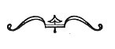

  
[Intangible Textual Heritage](../../index)  [Earth Mysteries](../index) 
[Index](index)  [Previous](boe22)  [Next](boe24) 

------------------------------------------------------------------------

### The Aztec Universe

THE AZTEC WORLD-PICTURE ([Plate XXXIII](#img_pl33)) is the first sheet
of the "Night Side" of the Codex Ferjérváry-Mayer, an old Mexican
painted book now in the Free Public Museums at Liverpool. The foundation
for the series of paintings is a sort of parchment made of deerskin
covered on both sides with a thin coating of an extremely adhesive paste
on which the paintings were executed in the usual way--the outlines in
deep black and the spaces filled in with colours. It consists of
twenty-two folded shapes 17½ cm. square. One side Dr. Eduard Seler, its
interpreter, calls the "Night Side," the other the "Day Side."

This first sheet is the most interesting and the most famous of the
entire manuscript. It represents the Five Regions of the Aztec world and
their tutelary deities, spread out like a cross, all their spaces filled
with figures of

p. 190

trees, gods, birds, rivers, and symbols of the cosmos, both of its
objects and its attributes.

In the Middle Place, says Seler, [1](#fn_15) is
the Fire deity, Xiuhtecutli, "the Mother, the Father of the gods, who
dwells in the navel of the Earth." From his body four streams of blood
flow towards the four cardinal points, and are continued beyond the
square space enclosing the centre to the outer corners of the picture,
where the signs *acatl*, "Reed," *tecpatl*, "Flint," *calli*, "House,"
and *tochtli*, "Rabbit," are seen on shields respectively borne by a
quetzal bird, an arara, an eagle, and a green parrot. "These are the
four signs by which the consecutive years are named with constant
reiteration, because they are the signs which fall on the first days of
those years, and therefore, since they are exhausted with the number
four, have become symbols for the four cardinal points, East, North,
West, and South."

The stream of blood pointing to the sign *acatl* (Reed), that is, to the
East (left-hand above), terminates with a hand painted yellow--"the hand
(ray) of the Sun god?" The stream pointing to the sign *tecpatl* (Flint)
ends with the stump leg of the god of the North. The stream flowing
towards the sign *calli* (House) or West (right-hand below) ends in a
figure of a chest formed by the vertebrae and adjoining ribs of a
skeleton. "For the West is the region of the setting (dead) Sun." The
stream flowing towards the sign *tochtli* (Rabbit) or South ends in a
head in whose hair is stuck a downy feather ball, which symbolises

 

[  
Click to enlarge](img/pl33.jpg)  
PLATE XXXIII. A WORLD-PICTURE OF THE AZTECS  
*First page of the Codex Ferjérváry-Mayer, representing the five regions
of the world, and their tutelary deities*.  
(From *Mythology of All Races*, 1927, Vol. XI, Plate VI)  

 

p. 191

the "warrior in the South" and at the same time, the "warrior in the
North," the dual god of the two quarters.

Above the upper side of the central square is a sort of platform with
steps in the centre; that is to say, to the right of the corner which,
owing to the shield with the sign *acatl*, "Reed," we have to regard as
the *East corner*." At the level of the steps, which are painted red, is
shown the image of the Sun. "This can obviously be nothing but the House
of the Sun, the East."

Above the left side of the central square is a votive dish in which are
a rubber ball, an agava-leaf thorn, and a bone dagger. They are the
symbols of sacrifice, of blood-letting, of self-torture, voluntarily
made in honour of the gods, but, says Scier, they belong to the gods of
the South, and bringing them into the Northern quarter of the heavens
means a reversion of the order, or an interchange of North and South."

Above the lower side of the central square is seen a monster descending
from above, that is, here, from be-low. It would seem to be tolerably
certain that this is intended to represent the *Tzitzimimê*, the demons
which symbolise the realm of darkness, the eclipse of the Sun. I shall
have more fully to explain farther on that the *Tzitzimimê* are
originally images of the stars, which, merely because at the solar
eclipses the stars become visible in broad daylight, have been made
demons of darkness, symbols of the devouring gloom. In any case, here
the figure denotes the West, the region of the setting Sun, of the light
swallowed up by the Earth."

p. 192

Above the fourth or right-hand side of the central square is seen "the
wide open throat of a monster hieroglyph of the Earth, which in this
form is obviously thought of as the taker of life, the *mictlampa*, the
realm of death, *i.e.*, the North."

The flowering tree rising above the picture of the Sun (upper East side)
is surmounted by a quetzal bird and guarded by Itztli, the Stone-knife
god (on the left), and Tonantiuh, the Sun god, all symbolising the
Eastern quarter. This tree, like all in the four quarters, has the form
of a cross.

The tree above the left side of the central square is a thorn tree
surmounted by an eagle, and is guarded by Tlaloc, the Rain god, and
Tepeyollotli, the Heart of the Mountains or the Voice of the Jaguar in
the Mountains--symbols of the North.

The tree of the West, growing out of the forehead of the *Tzitzimitl*,
or the dragon of the eclipse, has a stem set with huge upright thorns.
Instead of flowers, it bears feather balls at the tips of its branches.
"On it is perched doubtless a humming bird," which according to Aztec
belief, dies with the dry and revives with the rainy season. The
guardian deities are Chalchiuhtlicue, goddess of flowing water, and the
Earth goddess Tlazolteotl.

Above the South side (right) is a tree growing out of the open jaws of
the monster symbolising the Earth; "its stem is set with notches (or
fruit pods?) turned downwards, while the branches bear a kind of
star-shaped blossom like that of the tree of the North." On it is
perched

p. 193

a parrot, and it is guarded by Cinteotl, the maize god, and
Mictlantecutli, god of death.

The deities depicted about the four arms of the St. Andrew's Cross, that
is, in the spaces enclosed by the trapezes above the four sides of the
central square, are the eight gods of the four quarters. In the central
square stands the Fire god; he belongs to the Centre or the Middle Place
because he represents the hearth fire which burns in the middle of the
house. These nine are the deities of the Five Regions and "Lords of the
Night."

Like the Tibetan and Kalmuck worlds, the four quarters of the Aztec
world have their four colours, and they are: East, red; North, yellow;
West, blue; and South, green. These are the colours also of the years
and of the days. The whole figure symbolises the orientation of the
world-powers in Space and Time-years and Earth-realms and Sky-realms.

 

------------------------------------------------------------------------

### Footnotes

[190:1](boe23.htm#fr_15) *Codex
Ferjérváry-Mayer*, elucidated by Eduard Seler, 1901, pp. 5-24."

------------------------------------------------------------------------

[Next: Tartar-Mongol Worlds](boe24)
