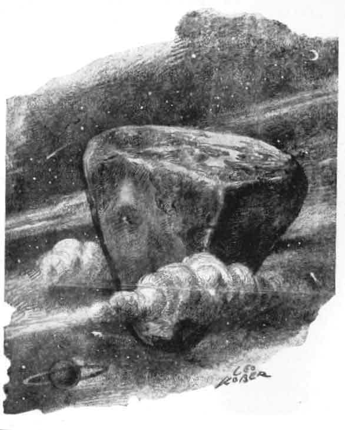

  
[Intangible Textual Heritage](../../index)  [Earth Mysteries](../index) 

------------------------------------------------------------------------

<table width="75%">
<colgroup>
<col style="width: 50%" />
<col style="width: 50%" />
</colgroup>
<tbody>
<tr class="odd">
<td width="50%" data-valign="CENTER"> 
</td>
<td width="50%" data-valign="CENTER"><h1 id="the-book-of-earths" data-align="CENTER">The Book of Earths</h1>
<h2 id="by-edna-kenton" data-align="CENTER">by Edna Kenton</h2>
<h4 id="section" data-align="CENTER">[1928]</h4></td>
</tr>
</tbody>
</table>

------------------------------------------------------------------------

|                                                                                                                           |
|---------------------------------------------------------------------------------------------------------------------------|
|  |

[Contents](#contents)    [Start Reading](boe00)  

------------------------------------------------------------------------

This is a compendium of theories of the shape of the Earth, along with a
great deal of 'Earth Mystery' lore. Richly illustrated, the Book of
Earths includes many unusual theories, including Columbus' idea that the
Earth is literally pear-shaped, modern theories that the Earth was
originally tetrahedral, and so on. Kenton also covers many traditional
theories including the ancient Babylonians and Egyptians, Hindu and
Buddhist cosmology, and those of the Peruvians, Aztecs and Mongols. She
also discusses modern alternative theories such as that of
[Reed](../potp/index) and [Koresh](../cc/index). Strangely enough, she
misses or ignores the modern flat earth theory of
[Rowbotham](../za/index). This is the only apparent omission in this
definitive study.

Kenton has no apparent axe to grind: this is simply a very readable
survey of the literature. If you have any interest in 'Earth mysteries',
this book is a must-read.

Production notes: The book has no explicit chapter separations. I added
chapter names based on the table of contents and page headers. The
illustrations have been scanned from a first edition of the book; even
still, please understand that the quality of some of the plates were
marginal, and I've used image processing to enhance the worst ones. In
addition, I've added alternate, high resolution, scans of plates
[25](boe17.htm#img_pl25alt) and [28](boe18.htm#img_pl28alt), from the
source book, Waddell's Tibetan Buddhism. Note that the plates in the
Kessinger reprint ended up almost illegible (but all other illustrations
turned out okay). If you want to acquire a copy of this book with better
plates, search a good used book site like
[ABEbooks](https://www.abebooks.com/); original editions of this book
are not particularly rare, or expensive.

*--John Bruno Hare, 7/11/2005*

After I posted this, Johh Mark Ockerblook of the Online Books page
pointed out that this was actually renewed in a timely fashion. However,
I've decided to leave this online because it appears that the copyright
has been orphaned. If you want to comment on this, please [write
us](../../contact).

------------------------------------------------------------------------

 [Title Page](boe00)  
[Acknowledgements](boe01)  
[Contents](boe02)  
[Illustrations](boe03)  
[Figures](boe04)  
[Man's Quest in Space](boe05)  
[Figures of Earth](boe06)  
[Creation of the World](boe07)  
[Upholders of the World](boe08)  
[The Primæval Earth](boe09)  
[The Babylonian Universe](boe10)  
[The Egyptian Universe](boe11)  
[Earth-Moon Catastrophe](boe12)  
[The Deluge](boe13)  
[The Lost Atlantis](boe14)  
[Lost Land of the West](boe15)  
[Trees of the World](boe16)  
[Mountains of the World](boe17)  
[The Wheel of Life](boe18)  
[Earth The Mundane Egg](boe19)  
[Systems of the Universe](boe20)  
[The Square Earth of Cosmas Indicopleutes](boe21)  
[The Peruvian Universe](boe22)  
[The Aztec Universe](boe23)  
[Tartar-Mongol Worlds](boe24)  
[Maps of the Earth](boe25)  
[The Earth of Columbus](boe26)  
[Dante's Universe](boe27)  
[Earth the Heart of the Cosmos](boe28)  
[St. Hildegard's Universe](boe29)  
[The Earths in the Universe](boe30)  
[Wheels upon Wheels](boe31)  
[The World Octaves](boe32)  
[Earth a Hollow Sphere](boe33)  
[The Tetrahedral Earth](boe34)  
[Bibliography](boe35)  
