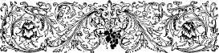
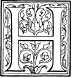
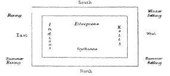
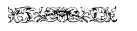

  
[Intangible Textual Heritage](../../index)  [Earth Mysteries](../index) 
[Index](index)  [Previous](ct03)  [Next](ct05) 

------------------------------------------------------------------------

**Cosmas Indicopleustes, Christian Topography (1897) pp. 23-90.  Book
2**

 

# BOOK II.

*The Christian theories regarding the form and position of the whole
world, the proofs of which are taken from Divine Scripture.*

 OW long I put off
the composition of my work regarding the figure of the world, even
though other admirable men as well as thyself frequently urged me to
undertake it, you know best of all. O dearest, God-loving and
Christ-loving Pamphilus, a man worthy of that name, since all holy men
love thee [1](#1)----a sojourner in the earthly Jerusalem,
but enrolled among the first-born and the prophets, with whom when of
yore I knew thee only by report I was knit in the bonds of warmest
friendship; but now I have had the satisfaction of having seen thee face
to face, when by the will of God you came hither to us, to Alexander's
great city, and never ceased to importune us about this work, enfeebled
though we were in body, afflicted with ophthalmia and costiveness of the
bowels, and as the result suffering afterwards from constant attacks of
illness; while besides we were deficient in the school-learning of the
Pagans,[2](#2) without any knowledge of the rhetorical art,
\|24 ignorant how to compose a discourse in a
fluent and embellished style, and were besides occupied with the
complicated affairs of everyday life. Nevertheless you ceased riot
pressing us to compose a treatise about the Tabernacle prepared by Moses
in the wilderness, which was a type and copy [3](#3) of the
whole world, as I explained to thee personally by the living voice in a
cursory way, not as communicating opinions and conjectures of my own
framing, but what I had learned from the divine scriptures, \[125\] and
from the living voice of that most divine man and great teacher
Patricius, who when fulfilling the vows of the Abrahamic
rule,[4](#4) set out from Chaldaea with his disciple Thomas
of Edessa, a holy man who followed him wherever he went, but by the will
of God was removed from this life at Byzantium. Patricius propagated the
doctrines of holy religion and true science, and has now by the grace of
God been elevated to the lofty episcopal throne of all Persia, having
been appointed to the office of Bishop Catholic of that
country.[5](#5) So then being greatly perplexed about this
undertaking, on account more \|25 especially of
those who delight in censoriousness, whose tongues are glib at calumny,
and who can always find abundance of material for their scoffs and
jeers, I shrank with more than ordinary hesitation from addressing
myself to the work. But you again pressed me to proceed with it, loading
me with condemnation upon condemnation if I refused, and assuring me
that the work would be useful for the guidance of life and for the study
and understanding of the divine doctrines, as well as for a refutation
of the Greek preconceptions; while showing that the whole scope of
divine scripture has respect to the future state, as is most pointedly
affirmed by the Apostle when he says: *For we know that if the earthly
house of this our tabernacle were dissolved we have a building of
God*----*a house not made with hands, eternal in the
heavens*.[6](#6) When in these and such like terms you
appealed to me, and it was beyond my power to gainsay the injunctions
laid upon me by your piety, I consented, trusting to receive the benefit
of your prayers; while making supplication ourselves that the divine
grace without which we can do nothing aright \|26 
might be vouchsafed to us in the opening of the mouth, so that we might
be able without polished and artistic modes of expression, but in the
simple words of ordinary speech (while grace manifests her own peculiar
powers), both to teach her foster-children the divine knowledge of the
doctrines, the lives of pious men, and the figure of the world and its
origin, without ambiguity; as well as to describe with all readiness,
and to communicate ungrudgingly, what we ourselves have freely received
from God.

Having finished, therefore, O God-beloved, the first book concerning
pretended Christians, and having convicted them, to the best methinks of
my power, of having attempted impossibilities, without our having sought
to disparage the beauty of their language, which God forbid I should do,
but to refute the fictitious and fabulous Greek theories; and having
finished that book, we now in obedience to thy order proceed to discuss
first in this second book the Christian theories regarding the figures
and the position of the world. We shall then in the third book show that
in describing and explaining the utility of the figures of the world,
divine scripture alike in the Old and the New Testament is in itself
sure and trustworthy. In the fourth book again we shall offer a
recapitulation \[126\] and a delineation of the figures of the world;
and similarly shall in the fifth book present a description of the
tabernacle prepared by Moses, and exhibit the harmony of what has been
said by the Prophets and Apostles. Be this then the book which we have
entitled *Christian Topography,* embracing the whole world and deriving
its proofs from the truly divine scriptures, regarding which a Christian
is not at liberty to doubt. Since then aid from above, as has been said,
cooperates with us through your prayers, we proceed to state our
theories. Moses, then, the Divine Cosmographer, says: *In the beginning
God made* \|27 *the heaven and the
earth*.[7](#7) We assume, therefore, that heaven and earth
comprise the universe as containing all things within themselves. And
that this is so he himself again proclaims: *For in six days God made
the heaven and the earth and all that in them is* [8](#8);
and again in like manner he says: *And the heaven and the earth were
finished and all the host of them*.[9](#9) And again, when
recapitulating and giving its name to the book, he speaks thus: *This is
the book of the generation of heaven and earth*,[10](#10) as
if they contained all things, and as if all things that are in them
ought to be signified along with them. For if, according to the
counterfeit Christians, the heaven alone comprises the universe, he
would not have mentioned the earth along with the heaven, but he would
have said: This is the book of the generation of heaven. Evidently,
however, he has not done so, nor any other of the prophets, and it is
manifest that they knew that the two together comprised the universe,
and indeed the whole company of the righteous and of the prophets always
indicate the heaven along with the earth. Hear what each of them says.
Melchisedech first when blessing Abraham thus speaks: *Blessed be
Abraham of God most High who created the heaven and the
earth*.[11](#11) In the second place, Abraham says: *I will
stretch out my hand to God most High who created the heaven and the
earth.* And again: *Place thine hand under my thigh and I will make thee
swear by the Lord the God of the heaven and the God of the
earth.*[12](#12) For when the most faithful Abraham wished to
make his servant swear with more than usual solemnity by the
circumcision as being a seal royal, *Place,* he said, *thine hand under
my thigh,* instead of under the seal royal, that is, the circumcision.
See also: Gen. xxiv, 7; \|28 \[127\] Psalm cxiv,
15; cxxxiv, 6, ci, 25; Isai. xlii, 5; Zech. xii, i; Isai. li, 13, xliv,
24, xlviii, 13, xlvi, 1, xl, 22; Jerem. x, 11; Daniel iii, 59; Acts
xvii, 24, xiv, 15; Math., xi 25.[13](#13) Since then the
divine scripture of both the Old and the New Testament shows by its
customary declarations that all things are contained within heaven and
earth, how is it possible that one can be a Christian who disbelieves
all this, and says that all things are contained within the heaven only.

\[128\] Since then the heaven and the earth comprise the universe, we
assert that the earth has been founded on its own stability by the
Creator, according once more to the divine scripture, and that it does
not rest upon any body; for in the Book of Job it is written: *He
hangeth the earth upon nothing;* and again (xxxviii, 4, 5, 6): *Where
wast thou when I laid the foundations of the earth? etc.* And in like
manner in David (Psalm cii, 5) it is said: *He who laid the foundations
of the earth upon its own stability.* By the power, therefore, of the
Deity who created the universe, we say that it was founded and is
supported by him. *Upholding all things,* as the Apostle saith, *by the
word of his* *power.*[14](#14)

For if a body of any kind whatever were either underneath the earth or
outside of it, that body could not keep its place, but would fall down
according to what is seen always occurring in the natural world. For if
we take air, for instance, or water or fire, we find that things which
are heavier than these do invariably fall down in them. Since therefore
the earth is heavier than any other body whatever, the Deity placed it
as the foundation of the universe, and made it steadfast in virtue of
its own inherent stability. To illustrate this, let us suppose a place
to have a depth \|29 of a hundred cubits, and this
place to be filled with a body denser say than water; then if one should
lift a stone with his hand and drop it into the place, in what interval
of time would it reach the bottom? One may reply, in four hours, let us
say. But further, supposing the place to be filled with some rarer
substance, air, for example, in what interval of time would the stone
now reach the bottom? Evidently in a shorter time: in two hours, let us
say. Supposing in the next place a still rarer substance, then the
bottom will be reached in an hour, and with a yet rarer substance in
half an hour. And again, if a rarer still be supposed, the stone will
touch the bottom in a still shorter time; and so on until the body when
attenuated to the last degree becomes incorporeal, and the time ceases
of necessity to be any time at all. Thus then in the case supposed,
where no body at all exists, but where there is only the incorporeal,
the heavy body of necessity gains the bottom in no time at all and
becomes stationary. The Deity, having thus in the order of nature, as
the scripture declares, suspended the earth upon nothing, when it had
reached the bottom of space laid its foundations upon its own stability
so that it should not be moved for ever. But should one again, from a
wanton love of contradiction, assume that outside of earth and heaven
there exists \[129\] a place made of another invisible and imaginary
substance, even such a place must of necessity rest upon something else,
and this again upon another, and so on *ad infinitum.* Nevertheless let
us, with God's help, tackle this subject as more a question of physical
science. If one should suppose that place to be chaos, then because
.....[15](#15) as the heaven is light and tends upwards, and
the \|30 earth heavy and tends downwards, and
extremes are bound together with extremes, that, namely, which tends
upwards with that which tends downwards, they support the one the other
by their pulling against each other, and so remain unmoved. The Deity
accordingly having founded the earth, which is oblong, upon its own
stability, bound together the extremities of the heaven with the
extremities of the earth, making the nether extremities of the heaven
rest upon the four extremities of the earth, while on high he formed it
into a most lofty vault overspanning the length of the earth. Along the
breadth again of the earth he built a wall from the nethermost
extremities of the heaven upwards to the summit, and having enclosed the
place, made a house, as one might call it, of enormous size, like an
oblong vaulted vapour-bath. For, saith the Prophet Isaiah (xlix, 22):
*He who established heaven as a vault.* With regard, moreover, to the
glueing together of the heaven and the earth, we find this written in
Job: *He has inclined heaven to earth, and it has been poured out as the
dust of the earth. I have welded it as a square block of
stone.*[16](#16) Do not the expressions about inclining it to
the earth and welding it thereto clearly show that the heaven standing
as a vault has its extremities bound together with the extremities of
the earth? The fact of its inclination to the earth, and its being
welded with it, makes it totally inconceivable that it is a
sphere.[17](#17) \|31 

Moses, likewise, in describing the table in the Tabernacle, which is an
image of the earth, ordered its length to be of two cubits, and its
breadth of one cubit. So then in the same way as Isaiah spoke, so do we
also speak of the figure of the first heaven made on the first day, made
along with the earth, and comprising along with the earth the universe,
and say that its figure is vaultlike. And just as it is said in Job that
the heaven has been welded to the earth, so do we again also say the
same. Having learned, moreover, from Moses that the earth has been
extended in length more than in breadth, we again admit this, knowing
that the scriptures, which are truly divine, ought to be believed. But
further, when God had produced the waters and angels and other things
simultaneously with the earth and the highest heaven itself, he on the
second day exposed to their vision this second heaven visible to our
eyes, which, as if putting to use the creations of his own hands, he
formed from the waters as his material. In appearance it is like the
highest heaven, but not in figure, and it lies midway between that
heaven and the earth; and God \[130\] having then stretched it out
extended it throughout the whole space in the direction of its breadth,
like an intermediate roof, and bound together the firmament with the
highest heaven, separating and disparting the remainder of the waters,
leaving some above the firmament, and others on the earth below the
firmament, as the divine Moses explains to us, and so makes the one area
or house two houses----an upper and a lower story.

But again, the divine scripture speaks thus in Moses concerning the
second heaven: *And God called the firmament
heaven*[18](#18)*;* and in the inspired David we
find these words: *Stretching out the heaven as a
covering*[19](#19)*;* and he adds: \|32 *who covereth his upper chambers with the waters;*
saying this evidently with respect to the firmament. But scripture, when
coupling the two heavens together, frequently speaks of them in the
singular, as but one, saying through Isaiah: *He that established the
heaven as a vaulted chamber, and stretched it out as a tent to dwell
in*[20](#20)*;* meaning here by the vaulted
chamber the highest heaven, and by what is stretched out as a tent the
firmament, and thus declaring them in the singular number to be bound
together and to be of similar appearance. David again speaks to this
effect: *The heavens declare the glory of God, and the firmament sheweth
forth his handiwork*[21](#21)*;* here beginning with a
duality and ending with a unity. For since, agreeably to the idiom of
the Hebrew language, the same word serves to express both *heavens* and
*heaven,* and the two heavens are not only bound together as one, but
are also like in appearance and aspect, the divine scripture speaks of
heaven both in the plural and in the singular number indiscriminately.
For the blessed David, using this idiom, exclaims: *Praise him, ye
heavens of heavens,*[22](#22) where you might say
in the singular number a *heaven of heaven,* for he says elsewhere: *And
the water which is above the heavens:* here distinctly employing the
plural number, *heavens,* and indicating that the firmament has the
waters above it. For following the idiom, instead of saying, *the heaven
of the heaven,* he said *the heavens of the heavens.* For he again says
also in another place: *the heaven of the heaven belongs to the Lord,
but the earth hath he given to the sons of man,*[23](#23)
here calling the highest heaven which is like a vault heaven of heaven,
as it is the heaven of the firmament, being up above it and much
loftier. And in Deuteronomy the great hierophant Moses thus speaks:
\|33 *Behold unto the Lord thy God belongeth the
heaven and the heaven of heaven, the earth with all that is therein.*
The great apostle Paul, moreover, uses this idiom, exclaiming: *For our
citizenship is in the heavens, from which also we look for the
Saviour;*[24](#24) beginning here with the plural
number and ending with the singular, for he *uses from which* in the
singular number. David also frequently makes use of this mode of
expression, exclaiming: *Praise the Lord from the
heavens*;[25](#25) and after he had said: *Praise
the Lord from the earth,* he thus ends: *the praising of him in earth
and heaven;*[26](#26) and in another passage, *To
him who made the heavens in wisdom;*[27](#27) and on this
subject he uses many such expressions.

We have said that the figure of the earth is lengthwise \[131\] from
east to west, and breadthwise from north to south, and that it is
divided into two parts: this part which we, the men of the present day,
inhabit, and which is all round encircled by the intermedial sea, called
the ocean by the Pagans, and that part which encircles the ocean, and
has its extremities bound together with those of the heaven, and which
men at one time inhabited to eastward, before the flood in the days of
Noah occurred, and in which also Paradise is
situated.[28](#28) Men, strange to say, having
crossed the ocean in the Ark at the time of the Deluge, reached our part
of the earth and settled in Persian territory, where also the Ark rested
on the mountains of Ararat, having saved alive Noah and his sons,
together with \|34 their wives, so that there were
four pairs, and all the brute animals, three pairs of clean, but of wild
only one poor pair. Since Noah appears to have offered up to God in
sacrifice the superfluous one pair of all the clean animals, there were
four pairs of human beings, and of clean animals three pairs, but of
wild beasts only one poor pair. Now when the Ark had crossed over into
this part of the earth which we now from that time forth inhabit, the
three sons of Noah divided the earth among them. Shem and his posterity
obtained the regions extending from Asia as far as the eastern parts of
the ocean[29](#29); Ham and his posterity the
regions from Gadeira[30](#30) in the west to the
ocean of Ethiopia, called Barbaria, beyond the Arabian
Gulf,[31](#31) receiving besides the regions extending as far
as our sea, \|35 that is to Palestine and
Phoenicia, as well as the southern parts, together with all that part of
Arabia which adjoins us, and that which is called the Happy; and Japhet
and his posterity: the regions extending from Media and Scythia in the
distant north, as far as the western ocean and the parts outside of
Gadeira, according to what is written in Genesis by the inspired Moses,
who, in describing the division of the earth, speaks thus concerning
these three: *The sons of Japhet, Gamer (Gomer)*
[32](#32) *and Magog* [33](#33) *and
Madaï and Javan (Iouaun) and Elisa,*[34](#34)
whereby he indicates the hyperborean nations of the Scythians and Medes,
and then similarly the Ionians [35](#35) and the
Greeks, [36](#36) and likewise Thôbel
[37](#37) and Mosôch
[38](#38) and Thêres (Θήρας) that he may show what
nations lay near them. For he calls the Thracians *Thêres,* and from
these, he tells us, some \|36 were removed and
dispersed among the islands of the Gentiles
[39](#39) and adjacent localities, for this
indicates Tharseis. [40](#40) The inhabitants of
Cyprus he calls Kêtioi, and those of Rhodes,
Rhodians.[41](#41) *The sons of Ham* (Cham),
*Cush* (Chous) *and Mesraim,* thereby designating the Ethiopians and
Egyptians. [42](#42) Finally, *Phut (Phouth) and
Canaan,*[43](#43) \|37
whereby he designates the Libyans and adjoining nations. *The sons of
Cush, Saba and Elêsâ,* whereby he designates the Homerites and their
neighbours [44](#44); similarly also the \[132\]
nations one after another that occupy the southern parts. The Chananeans
again, he says, were descended from Mesraim, that is the Egyptians and
Sidonians and all the neighbouring nations. *The sons of Shem, Elam and
Ashur,* that is the Elamites [45](#45) and
Assyrians and remaining nations, and as many of these as were spread far
and wide over Asia and the East----the nations of the Persians, Huns,
Baktrians, [46](#46) Indians, onwards to the
ocean.

The pagans even, availing themselves of what Moses has thus revealed,
divide the whole earth into three parts: Asia, Libya and Europe,
designating Asia the east, Libya the south, extending to the west;
Europe the north, also extending to all the west; and in this our part
of the earth there are four gulfs which penetrate into it from the ocean
as the pagans also say, and say with truth when treating \|38 of this subject [47](#47)
namely, this gulf of ours, which entering from Gadeira in the west
extends along the countries subject to Rome;
[48](#48) the Arabian Gulf called the Erythraean
[49](#49) and the Persian, both of which advance
from Zingium to the southern and more eastern parts of the earth from
the country called Barbaria, which begins where the land of the
Ethiopians terminates. [50](#50) Now Zingium, as
those who navigate the Indian sea are aware, is situated beyond the
country called Barbaria which produces
frankincense,[51](#51) and \|39 is girdled by the ocean which streams from thence
into both the gulfs. The fourth gulf is that which flows from the
north-eastern part of the earth, and is called the Caspian or Hyrcanian
Sea.[52](#52) These gulfs only admit of
navigation, for the ocean cannot be navigated on account of the great
number of its currents, and the dense fogs which it sends up, obscuring
the rays of the sun, and because of the vastness of its extent. Having
learned these facts from the Man of God, as has been said, I have
pointed them out as coincident also with my own experience, for I myself
have made voyages for commercial purposes in three of these gulfs----the
Roman, the Arabian and the Persian, while from the natives or from
seafaring men I have obtained accurate information regarding the
different places.

Once on a time, when we sailed in these gulfs, bound for Further India
[53](#53) and had almost crossed over to Barbaria,
beyond which there is situated Zingium, as they term the \|40 mouth of the ocean, I saw there to the right of our
course a great flight of the birds which they call Souspha, which are
like kites, but somewhat more than twice their size.[54](#54)
\[133\] The weather was there so very unsettled that we were all in
alarm; for all the men of experience on board, whether passengers or
sailors, all began to say that we were near the ocean and called out to
the pilot: "Steer the ship to port and make for the gulf, or we shall be
swept along by the currents and be carried into the ocean and be lost."
For the ocean rushing into the gulf was swelling into billows of
portentous size, while the currents from the gulf were driving the ship
into the ocean, and the outlook was altogether so dismal that we were
kept in a state of great alarm. A great flock, all the time, of the
birds called Souspha followed us, flying generally high over our heads,
and the presence of these was a sign that we were near the ocean.

The northern and western parts of the earth which we inhabit are of very
great elevation, while the southern parts are proportionately
depressed.[55](#55) For to what extent of its breadth the
earth is imperceptibly depressed it is found to have an elevation of
like area in the northern and western parts, while the ocean beyond is
of unusual depth. But in the southern and eastern parts the ocean beyond
is not of unusual but of the medium depth. When these facts are
considered, one can see why those who sail to the north and the west are
called lingerers. It is because they are mounting up and in mounting up
they sail more \|41 slowly, while in returning
they descend from high places to low, and thus sail fast, and in a
few'days bring their voyage to an end. Then the two rivers, the Tigris
and Euphrates, flowing down from the northern parts, that is, from
Persarmenia to the south, have far more rapid currents than our river
the Nile----that is, the Gêôn. For this river Nile flowing from
low-lying regions in the south towards the elevated northern regions,
and running, as one may say, up,[56](#56) pursues quietly the
even tenor of its way. The eastern and southern parts again, as
low-lying and overheated by the sun, are extremely hot, while the
northern and western from their great elevation and distance from the
sun are extremely cold, and in consequence the inhabitants have very
pale complexions, and must keep themselves warm against the cold. But
the whole of this portion of the earth is not inhabited, for the parts
in the extreme north are to the last degree cold, and remain
uninhabited, just as the parts in the extreme south remain also
uninhabited on account of the excessive heat. For the blessed David thus
speaks: *Neither from the goings forth nor from the goings down* (of the
sun); *nor from the desert mountains,*[57](#57) where he
calls the east *exodous* and the west *dusmas,* and the other regions,
namely the extreme north and extreme south *desert mountains.* The
pagans when \[134\] writing on these subjects say what is true
concerning them.

These things being so we shall say, agreeably to what we find in divine
scripture, that the sun issuing from the east traverses the sky in the
south and ascends \|42 northwards, and becomes
visible to the whole of the inhabited world. But as the northern and
western summit intervenes it produces night in the ocean beyond this
earth of ours, and also in the earth beyond the
ocean;[58](#58) then afterwards when the sun is in the west,
where he is hidden by the highest portion of the earth, and runs his
course over the ocean through the northern parts, his presence there
makes it night for us, until in describing his orbit he comes again to
the east, and again ascending the southern sky illumines the inhabited
world, as the divine scripture says through the divine Solomon: *The.
sun riseth and the sun goeth down and hasteth to his own place. Rising
there, he goeth to the south, and wheeleth his circuit, and the wind
turneth round to his circuits.*[59](#59) Here he
calls the air *the wind,* for, as he says, the sun making a circuit in
the air from east to south, from south to west, from west to north, from
north to cast, causes the vicissitudes of day and night and the
solstices; for, by the expressions *wheeleth his circuit,* and *turneth
round to his circuits,* he signified not only the revolution but also
the solstices, for it is the plural number he uses. For he does not say
that the wind describes a circuit, but that the sun does so through the
wind, that is, through the air.[60](#60) Yea, even
the blessed Moses having been ordered on Mount Sinai to make the
Tabernacle according to the pattern which he had seen, said under divine
inspiration, that the outer Tabernacle was a pattern of this the visible
world. Now the divine Apostle in the epistle to the \|43 Hebrews, in explaining the inner Tabernacle, or
that which was within the veil, declares that it was a pattern of the
heavenly----that is, of the kingdom of the heavens or the future state,
taking the veil which divides the one Tabernacle into two for the
firmament; just as the firmament placed in the middle, between the
heaven and the earth, has made two worlds----this world namely, and that
which is to come, into which world to come the first who entered was the
forerunner on our behalf, Christ, who thus prepared for us a new and
living way. Now in his description of the first Tabernacle, Moses places
in the south of it the candlestick, with seven lamps, after the number
of days in the week----these lamps being typical of the celestial
luminaries----and shining on the table placed in the north of the earth.
On this table again he ordered to be \[135\] daily placed twelve loaves
of shewbread, according to the number of the twelve months of the
year----three loaves at each corner of the table, to typify the three
months between each of the four tropics.[61](#61) He
commanded also to be wreathed all around the rim of the table a waved
moulding,[62](#62) to represent a multitude of waters, that
is, the ocean; and further, in the circuit of the waved work, a crown to
be set of the circumference of the palm of the hand, to represent the
land beyond the ocean, and encircling it, where in the east lies
Paradise, and where also the extremities of the heaven are bound to the
extremities of the earth. And from this description we not only learn
concerning the luminaries and the stars that most of them, when they
rise, run their course through the south, but from the same source we
are taught that the earth is surrounded by the ocean, and further \|44 that beyond the ocean there is another earth by
which the ocean is surrounded.

But again, from the prophecy of Lamech, the father of Noah, we learn
that Noah, by means of the world-carrying Ark, was to convey men and the
brute beasts into this earth of ours, for the prophecy runs somewhat to
this effect: *This same shall give us rest concerning our work and toil
of our hands, because of the ground which the Lord God hath
cursed.*[63](#63) For this reason also Lamech gave
Noah his name, which means *rest.* For the first man having sinned, and
having been cast by God out of the garden into the earth, which was foul
with thorns and effete, those ten generations smarted under grievous
chastisement, being forbidden according to the sacred scripture to eat
any longer of fruit that grew upon a tree, because man had transgressed
by eating the fruit of a tree. And meagre truly was the fare on which
the generations from Adam to Noah subsisted, since they neither ate the
olive, nor tasted either wine or flesh, but were commanded to eat only
grain, and that too although there the earth was by no means productive,
but required the very hardest toil for its cultivation; for thus saith
the scripture: *Cursed is the ground in thy labours; in sorrow shalt
thou eat of it all the days of thy life; thorns also and thistles shall
it bring forth to thee, and thou shalt eat the herb of the field; in the
sweat of thy face shalt thou eat thy
bread.*[64](#64)

*Note.*

With regard to wine, it is manifest from what is recorded in Scripture
that, after the Deluge, Noah having planted and cultivated the vine and
expressed the juice from the grapes, drank to excess of the sweet must
of which he had no previous experience, and made himself drunk; and with
regard to flesh the case is still more manifest, for God instructed him
in these terms: \|45 *Lo! I have given you all
things as the green herb to eat, but flesh in the blood thereof shall ye
not eat*[65](#65)*;* meaning this: Lately I interdicted you
from eating many things, but now I permit you \[136\] to eat of all
things, and to eat even flesh. Sacrifice, therefore, and pour out the
blood, and then eat the flesh as ye eat vegetables; and eat also of the
olive, of which before the Flood it was not permitted to eat, because it
also was the fruit of a tree. But perhaps someone will object and say:
If it is true that before the Flood they did not eat flesh, why is it
then written: *Abel was a keeper of sheep, and brought of the firstlings
of his flock and of the fat thereof?*[66](#66) If they did
not eat flesh, why did they take upon them the care of sheep? And why
did Abel, when he brought a lamb for sacrifice, not slay it? Now, one
who so enquires, will be truly answered that, in making the oblation, he
presented the holocausts alive; for one of the editions shows this,
saying: Over Cain and over his sacrifice he did not apply fire, so that
it is evident that the offerings were consumed with divine fire. They
provided themselves with a flock to procure for themselves milk and
wool. Another objection: If they did not eat flesh, how came it into
their head to select the fat for the sacrifice to God? Answer----Because
when anything is to be burned in the fire, fat is more readily set
ablaze.

*Text.*

When God in his mercy wished that the human race should be no longer
pinched with such scanty fare, and such hard toil, as they were less
robust than the first men, who, being newly created, were better able to
sustain their punishment, God taking occasion from the wickedness of
men, of whom he found none righteous except Noah, brought in a flood for
two or even for more reasons----that he might destroy the wicked, and
save alive him that was righteous for the instruction of future
generations----that, by the untimely end of the wicked, he might the
better deter those who are liable to death, and will some \|46 time or other die, from doing what is wicked----and
that he might bring men, and the brutes that were created for the use of
man, into this earth of ours, which is better than the other, and almost
equal to Paradise; which also he hath done, having ordered Noah, who was
left in this earth after the Flood, to taste of everything whether tree
or grain, and having taught him also to eat flesh. But that he brought
in the Flood not for the purpose merely of destroying the wicked, is
evident from the fact that the water prevailed for a length of time,
although one or two days were quite sufficient to have destroyed them
all; but he brought it in also, that he might take the Ark across the
ocean, and bring it to this earth of ours. For during one hundred and
fifty days did the water prevail without diminishing, until, wonderful
to relate, the Ark came to this earth of ours. The circumstance,
moreover, that the water rose fifteen cubits above the tops of the
highest \[137\] mountains, makes it evident beyond all question that
this was due to the depth to which the Ark was submerged in the waters,
in order that it might rest upon the mountains. For a half of the height
of the Ark was under water to the depth of fifteen cubits, for its
entire height was thirty cubits. From this, then, as well as from the
prophecy of Lamech, and the construction of the table in the Tabernacle,
we can learn that beyond the ocean there is an earth which encompasses
the ocean. Nay more; the hierophant Moses also in Deuteronomy saith
thus: *And thou, Israel, hear the command which I give unto thee this
day. Do not say in thine heart who shall go up into heaven to bring it
down to us, or who shall go over the sea for us to bring it to us; but
the word is nigh unto thee even in thy mouth.*[67](#67) By
this he means: Say not it is impossible to go up into heaven to bring
down thence the divine precepts, or to \|47 cross
over to the farther side of the sea to bring them thence, for lo! they
are in thy mouth and in thy heart. In the same passage he teaches us two
truths----that beyond the ocean there is land or a place, and that it is
impossible to cross the ocean, just as we, while in this mortal state,
cannot possibly go up into heaven. Even Baruch, the scribe of Jeremiah
the Prophet, when giving counsels of prudence in his epistle, being a
man well taught in the institutions of Moses, speaks in the same strain
with Moses, and says: *Who hath gone up into heaven and taken it and
brought it down from the clouds, who hath passed over the
sea?*[68](#68) Here he does not speak of our sea, for it
admits of being crossed, but of the ocean itself.

Yet if Paradise did exist in this earth of ours, rnany a man among those
who are keen to know and enquire into all kinds of subjects, would think
he could not be too quick in getting there: for if there be some who to
procure silk[69](#69) for the miserable gains of
commerce, hesitate not to travel to the uttermost ends of the earth, how
should they hesitate to go where they would gain a sight of Paradise
itself? Now this country of silk is situated in the remotest of all the
Indies, and lies to the \|48 left of those who
enter the Indian sea, far beyond the Persian Gulf, and the island called
by the Indians Selediba and by the Greeks Trapobanê
(*sic*).[70](#70) It is called Tzinitza, and is
surrounded on the left by the ocean, just as Barbaria is surrounded by
it on the right. The Indian philosophers, called the Brachmans, say that
if you stretch a cord from Tzinitza to pass through Persia, onward to
the Roman dominions, the middle of the earth would be quite correctly
\[138\] traced, and they are perhaps right. For the country in question
deflects considerably to the left, so that the loads of silk passing by
land through one nation after another, reach Persia in a comparatively
short time;[71](#71) whilst the route by sea to
Persia is vastly greater. For just as \|49 great a
distance as the Persian Gulf runs up into
Persia,[72](#72) so great a distance and even a
greater has one to run, who, being bound for Tzinitza, sails eastward
from Taprobanê; while besides, the distances from the mouth of the
Persian Gulf to Taprobanê; and the parts beyond through the whole width
of the Indian sea are very considerable.[73](#73) He then who
comes by land from Tzinitza to Persia shortens very considerably the
length of the journey. This is why there is always to be found a great
quantity of silk in Persia. Beyond Tzinitza there is neither navigation
nor any land to inhabit.

If one measures in a straight cord line[74](#74) the stages
which make up the length of the earth from Tzinitza to the west, he will
find that there are somewhere about four hundred
stages,[75](#75) each thirty miles in length. The measurement
is to be made in this way: from Tzinitza to the borders of Persia,
between which are included all Iouvia,[76](#76) India, and
the country of the Bactrians, there are about one hundred and fifty
stages at least; the whole country of the Persians has eighty stations;
and from Nisibis to Seleucia[77](#77) \|50 there are thirteen stages; and from Seleucia to
Rome and the Gauls and Iberia, whose inhabitants are now called
Spaniards, onward to Gadeira, which lies out towards the ocean, there
are more than one hundred and fifty stages; thus making altogether the
number of stages to be four hundred, more or less. With regard to
breadth: from the hyperborean regions to Byzantium there are not more
than fifty stages. For we can form a conjecture as to the extent of the
uninhabited and the inhabited parts of those northern regions from the
Caspian Sea, which is a gulf of the ocean. From Byzantium, again, to
Alexandria there are fifty stages, and from Alexandria to the Cataracts
thirty stages;[78](#78) from the Cataracts to
Axômis, thirty stages;[79](#79) from Axômis \|51 to the projecting part of Ethiopia, which is the
frankincense country called Barbaria, lying along the ocean, and not
near but at a great distance from the land of Sasu which is the remotest
part of Ethiopia, fifty stages more or less; so that we may reckon the
whole number of stages at two hundred more or less; and thus we see that
even here the divine scripture speaks the truth in representing the
length of the earth to be double its breadth; *For thou shalt make the
table in length two cubits and in breadth one cubit,* a pattern, as it
were, of the earth.[80](#80)

The region which produces frankincense is situated at the projecting
parts of Ethiopia, and lies inland, but is washed by the ocean on the
other side. Hence the \[139\] inhabitants of Barbaria, being near at
hand, go up into the interior and, engaging in traffic with the natives,
bring back from them many kinds of spices, frankincense, cassia,
calamus,[81](#81) and many other articles of merchandise,
which they afterwards send by sea to Adulê, to the country of the
Homeritcs, to Further India, and to Persia. This very fact you will find
mentioned in the Book of Kings, where it is recorded that the Queen of
Sheba, that is, of the Homerite country, whom afterwards our Lord in the
Gospels calls the Queen of the South, brought to Solomon spices from
this very Barbaria, which lay near Sheba on \|52
the other side of the sea, together with bars of ebony, and apes and
gold from Ethiopia which, though separated from Sheba by the Arabian
Gulf, lay in its vicinity. We can see again from the words of the Lord
that he calls these places the ends of the earth, saying: *The Queen of
the South shall rise up in judgment with this generation and shall
condemn it, for she came from the ends of the earth to hear the wisdom
of Solomon.*----Matt, xii, 42. For the Homerites are not far distant
from Barbaria, as the sea which lies between them can be crossed in a
couple of days, and then beyond Barbaria is the ocean, which is there
called Zingion. The country known as that of Sasu is itself near the
ocean, just as the ocean is near the frankincense country, in which
there are many gold mines. The King of the Axômites accordingly, every
other year, through the governor of Agau,[82](#82) sends
thither special agents to bargain for the gold, and these are
accompanied by many other traders----upwards, say, of five
hundred----bound on the same errand as themselves. They take along with
them to the mining district oxen, lumps of salt, and iron, and when they
reach its neighbourhood they make a halt at a certain spot and form an
encampment, which they fence round with a great hedge of thorns. Within
this they live, and having slaughtered the oxen, cut them in \|53 pieces, and lay the pieces on the top of the
thorns, along with the lumps of salt and the iron. Then come the natives
bringing gold in nuggets like peas,[83](#83) called
*tancharas,* and lay one or two or more of these upon what pleases
them----the pieces of flesh or the salt or the iron, and then they
retire to some distance off. Then the owner of the meat approaches, and
if he is satisfied he takes the gold away, and upon seeing this its
owner comes and takes the flesh or the salt or the iron. If, however, he
is not satisfied, he leaves the gold, when the native seeing that he has
not taken it, comes and either puts down more gold, or takes up what he
had laid down, and goes away. Such is the mode in which business is
transacted with the people of that country, because their language is
different and interpreters are hardly to be found. The time they stay in
that country is five days more or less, according as the natives more or
less readily coming forward buy up all their wares. On the journey
\[140\] homeward they all agree to travel well-armed, since some of the
tribes through whose country they must pass might threaten to attack
them from a desire to rob them of their gold. The space of six months is
taken up with this trading expedition, including both the going and the
returning. In going they march very slowly, chiefly because of the
cattle, but in returning they quicken their pace lest on the way they
should be overtaken by winter and its rains. For the sources of the
river Nile lie somewhere in these parts, and in winter, on account of
the heavy rains, the numerous rivers which they generate obstruct the
path of the traveller. The people there have their winter at the time we
have our summer. It begins in the month Epiphi of the Egyptians and
continues till Thôth,[84](#84) and during the \|54 three months the rain falls in torrents, and makes
a multitude of rivers all of which flow into the Nile.

The facts which I have just recorded fell partly under my own
observation and partly were told me by traders who had been to those
parts. And I now wish to give an account to your Piety of a matter quite
pertinent to our subject. On the coast of Ethiopia, two miles off from
the shore, is a town called Adulê, which forms the port of the Axômites
and is much frequented by traders who come from Alexandria and the
Elanitic Gulf.[85](#85) Here is to be seen a marble chair,
just as you enter the town on the western side by the road which leads
to Axômis. This chair appertained to one of the Ptolemies, who had
subjected this country to his authority.[86](#86) It is made
of costly white marble such as we employ for marble tables, but not of
the sort which comes from Proconnesus.[87](#87) Its base is
\|55 quadrangular, and it rests at the four
corners on four slender and elegant pillars, with one in the middle of
greater girth and grooved in spiral form. The pillars support the seat
of the chair as well as its back against which one leans, and there are
also sides to right and left. The whole chair with its base, five
pillars, seat and back and sides to right and left, has been sculptured
from a single block into this form. It measures about two cubits and a
half, and is in shape like the chair we call the Bishop's
throne.[88](#88) Behind the Chair is another marble of
basanite stone, three cubits in height and of quadrangular form, like a
tablet, which at the centre of its upper portion rises to a sharp point
whence the sides slope gently down in the form of the letter *lambda*
(λ), but the main body of the slab is rectangular. This tablet has now
fallen down behind the Chair, and the lower part has been broken and
destroyed. Both the marble and the chair itself arc covered over with
Greek characters. Now when I was in this part of the country some five
and twenty years ago, more or less, at the beginning of the reign of the
Roman Emperor Justinus,[89](#89) Elesbaan, who was then King
of the Axômites, \[141\] and was preparing to start on an expedition
against the Homerites on the opposite side of the Gulf
[90](#90) wrote to the \|56 Governor of
Adulê directing him to take copies of the inscriptions on the Chair of
Ptolemy and on the tablet,[91](#91) and to send them to him.
Then the Governor, whose name was Abbas, applied to myself and another
merchant called Mênas, who afterwards became a monk at
Rhaithû,[92](#92) and not long ago departed this life----and
at his request we went and copied the inscriptions. One set of the
copies was made over to the Governor; but we kept also like copies for
ourselves which I shall here embody in this work, since their contents
contribute to our knowledge of the country, its inhabitants, and the
distances of the several places. We found also sculptured on the back of
the Chair figures of Hercules and Mercury; and my companion, Menas, of
happy memory, alluding to these would have it that Hercules was the
symbol of strength and Mercury of wealth. I remembered, however, the
Acts of the Apostles, and would on this one point differ from him,
upholding \|57 that we should take Hermes rather
as the symbol of speech, for it is recorded in the Acts that they called
Barnabas, Jupiter, and Paul, Mercury, because he was the chief speaker.
Here is the form of the Chair and of the marble, and Ptolemy
himself.[93](#93)

*Inscription on the Tablet.*

The great king, Ptolemy, son of King Ptolemy and Queen Arsinoe, twin
gods, grandson of the two sovereigns King Ptolemy and Queen Berenice
[94](#94)----gods sôtêres----sprung from Hercules the son of
Jupiter on the father's side, and on the mother's side from Dionysus the
son of Jupiter----having received from his father the Kingdom of Egypt
and Libya and Syria and Phoenicia and Cyprus, and Lycia and Caria, and
the Islands of the Cyclades, made an expedition into Asia with forces of
infantry and cavalry, and a fleet and elephants from the Troglodytes and
Ethiopia----animals which his father and himself were the \|58 first to capture by hunting in those countries, and
which they took down to Egypt, where they had them trained for
employment in war.[95](#95) And when he had made himself
master of all the country on this side of the Euphrates, and of Cilicia
and Pamphylia and Ionia, and the Hellespont and Thrace, and of all the
forces in the provinces, and of the Indian
elephants,[96](#96) and had also made subject to his
authority all the monarchs who ruled in these parts, \[142\] he crossed
the Euphrates river, and when he had subdued Mesopotamia and Babylonia
and Susiana and Persis and Media, and all the rest of the country as far
as Bactriana, and had collected all the spoils of the temples which had
been taken away from Egypt by the Persians, he conveyed them to that
country [97](#97) along with the other \|59 treasures, and sent back his troops by canals which
had been dug.[98](#98)

Such was the inscription on the tablet so far as we could copy it out,
and, but for a few words, it would have been the whole, for it was only
a small part of the tablet that had been fractured. The inscription
again on the Chair was a continuation of the other,[99](#99)
and ran thus:----

Having after this with a strong hand compelled the nations bordering on
my kingdom to live in peace, I made war upon the following nations, and
by force of arms reduced them to subjection.[100](#100) I
warred first with the nation \|60 of
Gazê,[101](#101) then with Agamê [102](#102) and
Sigyê,[103](#103) and having conquered them I exacted the
half of all that they \|61 possessed. I next
reduced Aua [104](#104) and Tiamô, called Tziamô, and the
Gambêla,[105](#105) and the tribes near them \[he means the
nations beyond the Nile\],[106](#106) and Zingabênê and
Angabe and Tiama and Athagaûs and Kalaa,[107](#107) and the
Semênoi ---- a people who lived beyond the Nile on mountains difficult
of \|62 access and covered with snow, where the
year is all winter with hailstorms, frosts and snows into which a man
sinks knee-deep.[108](#108) I passed the river to attack
these nations, and reduced them. I next subdued Lazine and Zaa and
Gabala, tribes [109](#109) which inhabit mountains with steep
declivities abounding with hot springs, the Atalmô and
Bega,[110](#110) and all the tribes in the same quarter along
with them. I proceeded next against the TangaTtae,[111](#111)
who adjoin the borders of Egypt; and having reduced them I made a
footpath giving access by land into Egypt from that part of my
dominions. Next I reduced Annine and Metine----tribes inhabiting
precipitous mountains.[112](#112) My arms \|63 were next directed against the Sesea nation. These
had retired to a high mountain difficult of access; but I \[143\]
blockaded the mountain on every side, and compelled them to come down
and surrender. I then selected for myself the best of their young men
and their women, with their sons and daughters and all besides that they
possessed. The tribes of Rhausi I next brought to submission: a
barbarous race spread over wide waterless plains in the interior of the
frankincense country. \[Advancing thence towards the sea\] I encountered
the Solate, whom I subdued, and left with instructions to guard the
coast.[113](#113) All these \|64
nations, protected though they were by mountains all but impregnable, I
conquered, after engagements in which I was myself present. Upon their
submission I restored their territories to them, subject to the payment
of tribute. Many other tribes besides these submitted of their own
accord, and became likewise tributary. And I sent a fleet and land
forces against the Arabitae and Cinaedocolpitae
[114](#114) who dwelt on the other side of the Red
Sea, and having reduced the sovereigns of both, I imposed on them a land
tribute and charged them to make travelling safe both by sea and by
land. I thus subdued the whole coast from Leucê Cômê
[115](#115) to the country of the Sabaeans. I first and \|65 alone of the kings of my race made these conquests.
For this success I now offer my thanks to my mighty God, Arês, who begat
me, and by whose aid I reduced all the nations bordering on my own
country, on the East to the country of frankincense, and on the West to
Ethiopia and Sasu.[116](#116) Of these expeditions, some were
conducted by \|66 myself in person, and ended in
victory, and the others I entrusted to my officers. Having thus brought
all the world under my authority to peace, I came down to Aduli and
offered sacrifice to Zeus, and to Ares and to Poseidon, whom I entreated
to befriend all who go down to the sea in ships. Here also I reunited
all my forces, and setting down this Chair in this place, I consecrated
it to Ares in the twenty-seventh year of my reign.

*Scholia of Cosmas on the Inscription of Ptolemy. From the Vatican
codex.*

*Then Lazine and Zaa and Gabala.* These nations are called by these
names up to the present time.

*I conquered the Sesea nation.* Here he indicates the nations of
Barbaria.

*The Arabitae and Cinaedocolpitae.* Note----He refers to the people of
the Homerite country, that is, the inhabitants of Arabia Felix.

*From Leuce Come.* Note----In the territories of the Blemmyes there is a
village (Κώμη) called Leucoge.

*As far as the country of the Sabaeans.* Note----The land of the
Sabaeans is also in the Homerite country.

*And to the places of Sasu.* Note----The land of Sasu, where there is
much gold----that which is known as Tancharas, is the remotest in
Ethiopia. Beyond this, and also beyond the country of the Barbareotes,
the people who trade in frankincense, lies the Ocean. \|67 

Such is the inscription on the Chair, and at this very \[144\] day in
the very place where that Chair stands they execute in front of it
condemned criminals; but whether this custom has prevailed from the time
of Ptolemy I cannot say. I have set all this down from a desire to show
that he is quite correct in taking the land of Sasu and Barbaria to lie
at the extremity of Ethiopia, since he had subjugated all these regions
and the tribes by which they were inhabited, most of which we ourselves
have seen, while about the rest we obtained accurate information when we
were in their neighbourhood. For most of the slaves which are now found
in the hands of merchants who resort to these parts are taken from the
tribes of which we speak. As for the Semenai,[117](#117)
where he says there are snows and ice, it is to that country the King of
the Axômites expatriates any one whom he has sentenced to be banished.
The nation again which has its seats beyond the Arabitae and the
Cinaedocolpitae and the country of the Sabaeans he calls the Homerites.
We can accordingly, from what has been above recorded, correctly
estimate the breadth of the earth from the hyperborean regions down to
Sasu and Barbaria, the frankincense country, to be not more than two
hundred stages (*of thirty miles each*). I have written thus with the
advantage of possessing exact knowledge, and I cannot therefore have
fallen much short of the truth. For the facts I am indebted partly to
what I observed in the course of my voyages and travels, and partly to
what I learned from others on whose accuracy I could depend. Thus even
in this matter divine scripture is proved to be right and the pagans to
be wrong, who, in preference to the truth and in support of their
vanity, advance conjectures, sophistries, and old wives' fables no
matter how false, inventing forsooth another zone farther \|68 south than the torrid, and like the earth which we
inhabit; and although no one has either seen or heard of such. For how
could that be seen or heard of, that has never come within the ken of
our senses? Hence the nonsense they babble cannot be accepted; for it is
the jargon of mere novices in quibbling, and not of old adepts in that
art. These youngsters supposed that by their plausible sophisms they
could refute the opinions of those who were born before them, thus
attempting the impossible, as we have proved in brief in the preceding
book.

*Note on Ptolemy.*

This Ptolemy is one of those Ptolemies who reigned after Alexander the
Macedonian, concerning whom the prophet Daniel prophesied in different
passages, and especially in the dream of Nabuchodonosor and in the
vision of the four beasts that rose up from the sea which Daniel himself
saw; namely in the image, a head of gold, but in the vision a lioness,
by which he signified the kingdom of the Babylonians, that is
Nabuchodonosor. Then, \[145\] in the image, the breast and the arms of
silver, but in the vision, a bear----namely, the empire of the Medes,
which was inferior to that of the Babylonians, whereby he means Darius
the Mede. Next again in the image----the belly and the thighs of brass,
but in the vision a leopard, the kingdom namely of the Persians, by
which he signifies Cyrus, whose empire was no less splendid and renowned
than that of the Babylonians. Then again in the image, the legs of iron,
and in the vision, a beast terrible and dreadful, with claws of brass
and teeth of iron, by which he indicates the Macedonian empire----that
is Alexander----breaking kingdoms in pieces and subduing them. Then
again in the image, the feet and toes partly of iron and partly of clay;
and in the vision, ten horns corresponding in number with the toes, by
which he means the empire of Alexander broken up after his death, which,
in the vision also of the ram and the he-goat was, he says, broken up
towards the four winds of heaven. For, when Alexander was approaching
his end, he divided his empire among his four friends, of whom one
reigned in Europe, that is, in Greece, another in Asia, another in Syria
and Babylonia, and \|69 the fourth in Egypt, Libya
and the southern parts.[118](#118) Unto these four were many
sons born, who filled their thrones after them and brought manifold
evils upon the world, as has been recorded in the book of the Maccabees.
Now the little horn speaking great things, that was in the midst of the
ten horns, signifies Antiochus Epiphanes, who warred against the Jews in
the days of the Maccabees. He speaks therefore of all these things as
partly of iron and partly of clay, to show them as conquering each other
and being conquered in turn, and not mixed together, just as iron and
clay do not commingle.

Then again, in the image, he speaks of a stone cut out of the mountains
without hands, and, in the vision, of the Son of Man coming on the
clouds of heaven, whereby he indicates the Lord Christ on both side's of
his descent----from Abraham and from the Virgin without human seed, for
here the words *without hands* mean *without human seed;* while the
words *on the clouds of heaven* are employed because the clouds without
human hands carry as it were in their womb the rains to which they give
birth. Then again, in the image, the words: *And he smote the clay, the
iron, the brass, the silver and the gold, and they became like the chaff
of the summer threshing-floors, and the wind with its gusts swept them
away and there was no more place found for them* (Dan. ii, 35); and in
the vision the words: *I beheld till the beast was slain and his body
destroyed, and given to be burned with fire; and as for the rest of the
beasts their dominion was taken away, yet their lives were prolonged for
a season* (Dan. vii, ii), signify respectively the same thing----namely,
that at the coming of the Lord Christ all these empires would be taken
away----the Babylonian, the \[146\] Median, the Persian and the
Macedonian, while all the kingdoms that arose from the partition of the
last would become of no account. And such was the very condition of
things in the time of Christ, for neither did the Babylonian, Median,
Persian nor Macedonian empires then exist, but they had all been
destroyed.

Then again, in the image, he says: *And in the days of those kings shall
the God of Heaven set up a Kingdom which shall never be destroyed, nor
shall the sovereignty thereof be left to another people, and it shall
stand for ever* (Dan. ii, 44). And in the \|70
vision he says: *And he came even to the Ancient of days and they
brought him near before him*----*and there was given him dominion and
glory and a kingdom, that all people, nations and languages should serve
him; his dominion is an everlasting dominion, and his kingdom that which
shall not be destroyed* (Dan. vii, 13, 14). This is one instance more of
his saying the same thing both in the image and the vision, namely, that
at the coming of the Lord Christ those kingdoms shall pass away and be
destroyed, but his kingdom shall be indissoluble and eternal. This
Ptolemy is therefore one of those who reigned, either Philometor or
Euergetes the Second, or the king called Dionysus, who preceded the last
Cleopatra.[119](#119) For these reigned more than seven and
twenty years, and were descended from the first Ptolemies who were the
sovereigns of Egypt, in accordance with the inscription on the marble
tablet of which we have given a copy. For concerning the kings that now
are, nothing has been written in the Prophet (*Daniel*), as the Lord
himself says that the Law and the Prophets prophesied until John. For
when Nebuchodonosor was cogitating whether his kingdom would endure, and
Daniel whether the Judaic rites would be perpetually observed, the same
revelation was made to both alike. At one and the same time shall thy
kingdom come to an end, and the Judaic and ritual observances be
abolished, and a new and better dispensation shall supersede the
old----and be eternal and indissoluble----and this shall have its
beginning when the first kingdoms and legal rites shall cease, and be
openly exhibited when its supreme head makes his appearance. For
concerning the Roman empire nothing is expressly written in the Prophet,
for it did not rise by succession from Nabuchodonosor, nor has it
congruity with the polity of the Jews, or, to speak more correctly, with
the laws which they obey; but is rather calculated to destroy them. Nor
did it succeed the empire of the Macedonians, for he says: *The God of
Heaven shall set up a kingdom which shall never be destroyed.* Here he
speaks of the Lord Christ, and within the scope of his words includes,
though but darkly, the Roman empire, which made its appearance \[147\]
contemporaneously with the Lord Christ. For while Christ was yet \|71 in the womb, the Roman empire received its power
from God as the servant of the dispensation which Christ introduced,
since at that very time the accession was proclaimed of the unending
line of the Augusti by whose command a census was made which embraced
the whole world. The evangelist certainly indicates that *this
enrolment* [120](#120) *was first made in the days of
Augustus Caesar,* when the Lord Christ was born, and deigned to be
enrolled in a country subject to Roman dominion, and to pay tribute
thereto.

The empire of the Romans thus participates in the dignity of the Kingdom
of the Lord Christ, seeing that it transcends, as far as can be in this
state of existence, every other power, and will remain unconquered until
the final consummation, for he says that *it shall not be destroyed for
ever.* Now, if that expression *for ever* be taken as applying to the
Lord Christ, it signifies *endless duration,* in accordance with what
Gabriel also says to the Virgin: *And he shall reign over the house of
Jacob for ever, and of his Kingdom there shall be no
end.*[121](#121) If again the expression be taken
as applying to the Roman empire which made its appearance in the world
along with Christ, this shall not be destroyed while this world
continues. For I assert with confidence, that though, by way of
chastisement for our sins, hostile barbarians rise up for a short while
against the Roman dominion, yet that by the valour of him who governs us
the empire will continue to be invincible, provided it does not restrict
but widens the influence of Christianity. I say so because this imperial
family [122](#122) believed in Christ before the
others, and this empire is the servant of the dispensation established
by Christ, on which account he, who is the Lord of all, preserves it
unconquered till the final consummation. The royal family of the
Persians on the other hand is not of Persian lineage, nor in the line of
the succession of its former kings, but it sprang from an \|72 alien power, that is, from the
Magi.[123](#123) For by the time of Christ the empire of the
Persians had been destroyed by Alexander in accordance with the
prophecy, and the successors to his empire ruled that part of the world
until the time of Antiochus, after which the Parthians gradually made
themselves masters of the country.[124](#124) In point of
fact, they marched in arms against Jerusalem, and took prisoner
Hyrcanus, the Ruler of the Jews, not long before the advent of the Lord
Christ.[125](#125) As regards this empire of the Magi, it is
now about four hundred years since it was founded, and in my opinion it
ranks next to that of the Romans, because the Magi, in virtue of their
having come to offer homage and adoration to the Lord Christ, obtained a
certain distinction. For it was in the Roman dominions that the
preaching of Christianity first became current in the days of the
Apostles, and it was immediately afterwards extended to Persia by the
Apostle Thaddaeus.[126](#126) And, to be sure we find \[148\]
this written in the Catholic Epistles: *The Church that is in Babylon
elect together with you, saluteth you.*[127](#127) The Roman
empire, \|73 moreover, has many bulwarks of its
safety in that it is the foremost power in the world, in that it was the
first to believe in Christ, and in that it renders services to every
department of the Christian economy. There is yet another sign of the
power which God has accorded to the Romans. I refer to the fact that it
is with their coinage all the nations carry on trade from one extremity
of the earth to the other. This money is regarded with admiration by all
men to whatever kingdom they belong, since there is no other country in
which the like of it exists.[128](#128) Let us now return to
our proper subject.

*Text.*

For some of the old philosophers, who in the course of their travels
visited almost every part of the inhabited world and wrote accounts of
what they learned, have explained the position of the earth
[129](#129) and the revolution of the heavenly bodies in
close agreement with divine scripture. Let one of them now come forward
and give this evidence.

*Extract from the fourth Book of the History of
Ephorus.*[130](#130) The Indians inhabit a country in the
east near sunrise, while the Ethiopians dwell in the south near the
Meridian, the Kelts in the west near sunset, and the \|74 Scythians in the north towards the Pole. These
divisions are not of equal size, Scythia and Ethiopia being larger and
India and the Keltic divisions smaller. The two larger, however, are of
similar size, and so are the two smaller. For the Indians are situated
between the summer and the winter sunrise, while the Kelts occupy the
regions from the summer to the winter sunset. The two distances are
equal as well as nearly opposite each other. The Scythians again inhabit
those regions which the sun leaves unvisited in the course of his
revolution. They are situated opposite the nation of the Ethiopians,
which seems to extend from the winter sunrise to the shortest sunset.

*Note.* \[149\] This Ephorus is an old writer, philosopher, and
historian.

 

Ephorus, both in his text and by means of his sketch, explains
accurately, like the divine scripture, the position of the earth and the
revolution of the heavenly bodies. For this Ephorus was an historical
writer who, in the fourth book of his *History,* has inserted the
exposition which we have cited. Pytheas of
Marseilles,[131](#131) again, in his work
concerning the ocean, informs us \|75 that when he
had reached the remotest parts of the north the barbarous people found
there showed him the cradle of the sun, for, in the parts where they
live, the nights always have their source. Xenophanes also, the
Colophonian,[132](#132) is clearly no believer in the sphere,
for he supposed that the earth had no limits. Thus, then, the pagans are
found, in what they have said, chiming in with sacred scripture.

But, to pursue our argument, we again assume that the four rivers which
divine scripture says emanate from Paradise cleave a passage through the
ocean and spring up in this earth. Of these, the Pheison is the river of
India, which some call Indus or Ganges. It flows down from regions in
the interior, and falls by many mouths into the Indian Sea. It produces
beans of the Egyptian sort, and the fruit called Neilagathia; savoury
herbs, also, and lotus plants, and crocodiles, and everything the Nile
produces.[133](#133) The Geon, again, which rises somewhere
in Ethiopia, passes through the whole of Ethiopia and Egypt, and
discharges its water into our Gulf by several mouths, while the Tigrés
and \|76 Euphrates, which have their sources in
the regions of Persarmenia, flow down to to the Persian Gulf. Such,
then, are our opinions on these points. Divine scripture, with a view to
show the diameter of Paradise, how great it is, and how far extended
eastward, mentions the four rivers only, and thence we learn that the
fountain which springs up in Eden and waters the garden, \[150\]
distributes the residue of its waters among the four great rivers which
cross over into this earth and water a large part of its surface.

*Text.*

Since then, the luminaries of heaven in this manner pursue their course,
making day and night, seasons and years, serving also for signs for
those sailing upon the seas or travelling through deserts, while they
also supply the earth with light, we shall not say that they are moved
by the revolution of the heavens, but rather by powers that are
rational, as if they were so many torch-bearers, as we shall prove once
more by the declaration of divine scripture. For the divine Apostle,
speaking of the Adversary, teaches what was his work from the beginning
in these words: *According to the prince of the power of the air, of the
spirit that now worketh in the sons of disobedience*
[134](#134) ----words which clearly show him to
have been formerly a prince endowed with the power of moving the air and
changing its place, but one now cast out for ever from this dignity;
yea, rather, one who from sheer depravity works upon sinners, as is
evident from the fact that he stood not alone in having the power to do
this, but shared it in common with many others. For some of the angels
were commissioned to move the air, some the sun, some the moon, some the
stars, while others prepared the clouds and the rains, and rendered many
other services---- for this is the work, the appointed duty, of the
angelic orders and powers----to minister to the well-being and honour of
the \|77 image of God, that is, of man, and to
move all things like soldiers obeying the commands of the king. This
work they were commanded to do on the fourth day, when God adorned the
heaven with its stars. The work of the adverse demons, as rebels against
God, is to do what will mar his image, for on the fourth day they
transgressed the command and were cast out of heaven, as elsewhere he
says: *Are they not all ministering spirits sent forth to minister to
those who shall be the heirs of Salvation?* [135](#135) thus
expressly declaring that they were ordained for the service of man. He
further says: *For the earnest expectation of the creature waiteth for
the revealing of the sons of God. For the creation was subjected to
vanity not of its own will, but by reason of him who subjected it, in
hope because the creation itself also shall be delivered from the
bondage of corruption into the liberty of the glory of the children of
God.*[136](#136) By *the creature* he here designates the
angels, and by the *sons of God* the human race. By the term
ἀποκαραδοκία (earnest expectation), he represents the creature as
straining its neck to scan the distant horizon in hope of descrying some
help coming to man. For if the angels had not been subjected to servile
ministrations they would not have longed for liberty; for when man had
sinned and received sentence of death, they were smitten with sore
grief, concluding that all was hopelessly lost; for since man was the
bond uniting the whole creation, as well as the image of God, they
abandoned after his sentence all hope both of themselves and of the
universe, and were unwilling to be his \[151\] servants and subordinates
without resulting advantage. By the words, however, in the passage
cited, *by reason of him who hath subjected it in hope,* the Apostle
would have us understand that God did not permit the wish of the angels
to prevail, but gave them some hope that they \|78
might not despair, but be cheered with the prospect that in the course
of time some good would accrue to man.

*Note.*

On the sixth day the demon who hates good, seeing man honoured and
thought worthy to have great care bestowed on him, became envious, and
formed a design to drag him down to ruin with himself. But when he was
at a loss how to assail him, he happened to perceive the beasts running
straightway to their food, while the object of his envy, looking around
him at such of the trees as were pleasant to the eye, remained quite
unmoved the while by the calls of appetite; whence he concluded he had
received some command from God about them. Having then approached nearer
in the form of the serpent, he sought to learn the nature of the
command, and craftily says: *What! hath God said ye shall not eat of
every tree in the Garden?* [137](#137) Then the
woman who had just been brought into the world, and was far inferior to
the other in quickness of intelligence, answered his enquiry. Then,
pretending he had already known the command (which he had only that
moment learned), he began to accuse God of giving grudgingly, and to
entice man to eat of the fruit, advising him at the same time to
transfer his allegiance to himself; and thus, forsooth, become as God,
infecting him in this way with his own disease. The man was, in fact,
persuaded in the afternoon, and was that same day cast out of the
garden, just as his tempter had himself, as soon as he sinned, been cast
out of Heaven. Then the man heard the sentence of death pronounced upon
him: *Dust thou art, and unto dust shalt thou
return.*[138](#138) This filled the angels with sore grief,
and all the more as they were also disheartened at some of their own
number having transgressed; although they were more especially
distressed about man, as on him depended what lot should befall the
whole creation----and he was also the pledge that secured the amity of
all the world. For should this bond be in reality dissolved, the
universe would of necessity be also dissolved. They bewailed, therefore,
their own dissolution along with that of the universe, and could no
longer endure to minister to man without any good resulting. But when
\|79  God, who is full of compassion, had, through
his renewed care for man and the postponement of his punishment,
inspired them with good hope, they began under its influence to render
their services with alacrity. In each generation, moreover, God, by
exalting the righteous to great renown, still further stimulated their
alacrity, and implanted in them hopes of renovation, of restoration, and
of resurrection. At the birth, particularly, of the Lord Christ
according to the flesh, the whole multitude of the invisible \[152\]
powers, having seen him born through whom comes the destruction of
death, the beginning of the renovation and the resurrection, and their
own freedom, lifted up their voices in hymns of praise to God, the cause
of all, exclaiming: *Glory to God in the highest, and on earth peace,
good will towards men.*[139](#139) Then away were thrown at
last all the sorrow and dejection which at one time they had suffered on
account of man, and they gave expression to their joy at the birth of
the second Adam. Wherefore they also, at the time of his temptations,
remembering how in the days of old they had witnessed the discomfiture
of the first Adam, which had filled them with dismay, but seeing now the
victory of the second Adam, and how fairly not once but thrice in close
grip with his tempter he had flung him out of the lists----they, I say,
rejoiced with a great joy, and were eager in bestowing their services,
as scripture has recorded, not now as if prompted by some hope, but
because, having seen with their own eyes the victory of the second Adam,
they came to minister to him with joyful alacrity.

But the host of his adversaries in their turn now mourned and lamented,
being confounded with shame at the victory of the second Adam. Their
chief accordingly finding himself unable to throw him down began to plot
against him, with the Jews as his instruments, and having stirred up the
Jewish mob against him and crucified and put him to death, imagined that
he was at once and for ever rid of him. But when, not long afterwards,
the resurrection----that wondrous, glorious, unexpected and mighty
event----had taken place, and he had no longer to experience death or
any other form of suffering whatever, but along with incorruption and
immortality had obtained also immutability of soul; and when again he
afterwards ascended heavenward in a chariot of cloud, \|80 borne up like a conqueror who celebrates his
triumph; then did he enter within the firmament, and was the first of
all who opened up for us a new and living way. The angels therefore,
clad in white raiment, rejoiced along with men, and brought the good
tidings to the disciples and the women. But their adversaries, seeing
the superiority to themselves and to the whole creation of the human
nature, which they had at one time tripped up by the heels, but by which
they were now thrown down, remained dumb with madness and overwhelmed
with uttermost shame. Wherefore the Lord exclaimed to the disciples:
*Let not your hearts be troubled. I have overcome the
world.*[140](#140) And again: *Lo! I have given
you power to tread upon serpents and scorpions and all the power of the
enemy* [141](#141)----as much as to say: Man of
old having sinned when the serpent in Paradise assailed him, it was said
to him: *He shall lie in wait for* [142](#142)
*thy heel, but thou for his head*; that is, Ye shall he divided and at
enmity against each other, that man may not be under obedience to him.
So the warfare was then waged on equal terms, each having the power to
hurt the other; for the serpent watching for the heel of man, that is,
besetting his path in order to hurt him on finding him out of the path,
as he \[153\] could do by creeping about his heel; while man being of
upward stature and on his guard, and not straying from his path, was
able to bruise [143](#143) the head of the
serpent. And now having conquered the serpent and brought him finally to
shame, and having through his agency unjustly endured death for the
whole race, and nailed the bond against it to the cross and blotted it
out, I rose again on the third day victorious over death, and became the
champion [144](#144) who has achieved victory for
all the human race, for through me the victory has been extended to all
humanity. Be ye therefore of good courage. Behold, I have given you
power to tread upon serpents and scorpions and on all the power of the
enemy. He says in effect the serpent is no longer able to hurt your
heel, being himself trampled down under your feet. So then, just as Adam
\|81 had on the sixth day sinned by eating about
mid-day of the fruit of the tree, and was cast out of the garden in the
afternoon, so also on the sixth day and at the sixth hour, the Lord
Christ for his sake endured in the flesh the Cross, by which we are
saved. And just as again from the time of the transgression to the
expulsion from the garden, all the angels were filled with great dismay,
expecting nothing else than the destruction of man and of themselves and
of the universe, so also during the Passion from the sixth hour until
the ninth the whole creation was shrouded in darkness at the wickedness
that was being perpetrated. And just as the two, Adam and Eve, were at
the ninth hour cast out of Paradise, so also at the ninth hour the Lord
Christ in the spirit and the thief entered into Paradise. On the same
day, therefore, in which Adam was made, that is, on the sixth, there
occurred both the Fall and the grief of the angels, the sentence of
death and the expulsion from Paradise, so also at the time of the
Passion, on the same day, there occurred the death of the Saviour by the
tree of the Cross, the mourning of the creation, and in the afternoon
the putting away of the mourning and the entrance into Paradise. *Verify
I say unto you,* saith the Saviour to the thief, *to-day shalt thou be
with me in Paradise.* [145](#145) Glory to God for
ever and ever, Amen! But we must now return to our text.

*Text.*

Wherefore the angels did not desist from the ministrations which they
rendered to men liable to death and corruption, for the Apostle speaks
thus: *For the creation was subjected to vanity, not of its own will,*
that is, they were unwilling to labour and serve to no purpose; *but,*
he goes on to say, *by reason of him who subjected it in hope.*
[146](#146) In what hope? Because, as is quite
evident, after the transgression the angels, when they saw that God was
not carrying into effect the sentence upon man, but treating him with
loving care and providing him with clothing, came to entertain better
hopes of man, so that they did not despair of him but ministered in his
behalf. Then \[154\] \|82 afterwards he says: *And
the creature itself shall be delivered from the bondage of corruption
into the glory of the liberty of the sons of
God*;[147](#147) that is, the angels themselves
shall be delivered and with them the whole creation, when men shall be
delivered from corruption and be glorified, and be made immortal, and
the sons of God at the world's final consummation, when the form of this
world shall pass away, and the resurrection of the dead shall take
place, and the existing prder of things shall be changed. For when it
shall come to pass in accordance with divine scripture that the stars
shall fall, and the course of night and day cease, and the angels who
move them be liberated through the exemption of men from corruption, who
shall thus not at all need them, what then can these new law-givers say
who think that the heaven is spherical, and assert that the stars are
moved and yet move of themselves? For what useful purpose, let them tell
us, if at least they define themselves to be Christians, will the heaven
then perform revolutions? But away with these inept, these unstable men,
for the Apostle yet again exclaims that *the whole creation groaneth and
travaileth together in pain until now,*[148](#148)
thereby again showing that the whole creation, and especially the angels
themselves, are burdened in this state of existence from being
subservient to corruption and mutation. For since they are themselves
mutable they are constantly absorbed in reflections about mutation,
thinking over and hoping for liberty and longing to obtain it; and
obtain it they shall, as has been stated, when men rise from the dead.
For unless they had themselves received a law prescribing what they
should and should not do, they could not have fallen into sin, for some
of them could not have transgressed *(as they did)* unless they had
received this law from God. Those consequently who transgressed were
cast \|83 down from on high to the earth, for *I*
*saw*----it is the Lord who speaks----*Satan like lightning fall from
heaven*.[149](#149) But without law it is
impossible there should be transgression, as saith the Apostle: *For
where there is no law there is no
transgression,*[150](#150) and *Without the law
sin is dead.*[151](#151) So that the angels
themselves in every way want to obtain freedom from the law and from
mutation. Now, of this liberty, the cause has been and will be the
advent of our Lord Jesus Christ. *For all things,* the Apostle saith,
*both those which are in heaven and those which are on the earth are
summed up in Christ*; and, *If any one is in Christ he is a new
creature; old things are passed away, behold all things are become
new.*[152](#152)

*Note.*

On the first day, that is the Lord's day, the foundation of the world
and the beginning of the creation took place. God having begun in the
evening to create those things which comprise the whole world, that is
to say, heaven and earth, creating along with them the darkness and the
water and the air and the fire which has been commingled with the earth,
and the angels----producing all these at one time. Wherefore on the same
day and the same night a new creation of the whole world again took
place, for the whole world has its circumscription in
man,[153](#153) because man, as has been
frequently stated, is the bond which holds all the world together. When
man, therefore, rose again on the same night of the Lord's day,
incorruptible and immortal and unchangeable, he gave a pledge to the
whole creation visible and invisible that it would obtain like benefits.
Wherefore the Apostle saith: *To sum up all things in the Christ, both
the things that are in heaven and that are in the
earth*;[154](#154) and: *If any one be in Christ
he is a new creature. Old things are passed away, behold all things have
become new.*[152](#152) He says *all things,*
because; in man are contemplated things visible and invisible. He then
who denies \|84 to the Lord Christ the possession
of perfect manhood [155](#155) is deceived by failing to
understand the great dispensation which God has planned, as well as to
conceive aright the Christian doctrine. In like manner again he who
denies his perfect godhead [156](#156) is chargeable with
guilt and is utterly misled. Since then this hope is placed before
Christians, that the angels and the whole creation shall be renovated
into a better and a blessed state of existence, who is so malignant and
so impious as to abandon this hope and lean for support on the new and
beguiling folly of the pagans? For he shall hear in that day from the
Judge these words: *Verify I say unto you I know you not; depart from
me, all ye that work iniquity.*[157](#157) For it is in sooth
a great iniquity to reject the declarations of God, and in opposition to
them to ascribe a spherical form to the heaven. For such men are
incapable of receiving the blessed hope and manifestation of the glory
of the great God, our Saviour Jesus Christ, who gave himself for us; nor
do they wish along with the faithful to hear the Lord Christ exclaiming
from on high: *Come, ye blessed of my Father, inherit the Kingdom
prepared for you from the foundation of the
world,*[158](#158) but always erring in their opinions they
are whirled round in ceaseless revolution along with their sphere,
without any hope that there will ever be a pause.

*Text.*

Since the heavenly bodies then, according to divine scripture, are moved
in their orbits by invisible powers, and run their course through the
north, and pass below the elevated part of the earth, it is possible,
with such a configuration, for eclipses of the moon and the sun to be
\|85 produced. For the angelic powers, by moving
the figures on rational principles and in regular order, and with
greater speed than lies in us to apprehend, produce these phenomena,
plying their labours by night and by day without ever pausing. For as on
the one hand the pagans assert that underneath the earth these bodies
revolve far out of sight, thus, as was before shown, advancing views not
only out of harmony with the nature of things, but opposed to the divine
testimony, so we on the other hand following divine scripture, conceive
that the revolution and the course of the heavenly bodies have some
slight obliquity, and affirm that they are accomplished in this manner.
For this being so, eclipses of necessity follow, and we are thus opposed
neither to the Deity nor to the nature of things. For God must be
believed in preference to all the notions and all the teaching of men.
And with reference again to the four elements, we say that God having
first established the earth as being dry, made it the foundation of the
universe because of its heaviness. Water again, which is the moist
element, he set above the earth on account of its fluidity; and the two
as being opposite in their qualities he thought good to place together
on account of their good temperature.[159](#159) Next he
placed above these the air, which is the cold element, and above the air
again fire, which is the warm element, because these are both lighter
than the other elements. They are, however, mutually opposed, and
therefore the two elements which are placed together in the
middle----water which is moist and air which is cold----having many
mutual affinities, the one being of a fluid and the other of a porous
nature, while both are soft to the touch, and \|86
readily receiving into themselves the qualities of each other and of
their opposites, impart them in return to each other and blend the whole
together; these two elements, I say, he thought good to place in the
middle between the other two, the dry and the warm, that all nature
might not be destroyed and reduced to a cinder. For from the readiness
with which these two middle elements pervade each other, the pagans have
fallen into error, and turning things the opposite way call air moist
and water cold; consequent upon this they bestow two qualities upon a
single element, and frequently even four.

God again provided rains for the good of the earth through the angelic
powers, who with the utmost exertion bring them up from the sea into the
clouds, and in obedience to the divine command discharge them where-over
the divine command directs, for saith scripture by the prophet Amos: *He
that calleth forth the water of the sea, and poureth it out over the
face of the earth* (Amos ix, 6; see also Zech. x, I; I Kings xviii, 41).
With regard to earthquakes we affirm that they are not produced by wind,
for we do not, like our opponents, have recourse to fables, but simply
say that they occur by divine appointment, for saith scripture through
David: *He looketh upon the earth* \[157\] *and maketh it tremble*
(Psalm civ, 32; see also Acts ii, 2; Amos ix, 5; Haggai ii, 20; Isaiah,
in sundry passages).

With regard again to the Antipodes, divine scripture does not suffer me
either to say or hear anything about these fables: *For he made,* saith
the Apostle, *of one the whole race of men to dwell upon the whole face
of the earth*. He does not mean upon every face of the earth, but upon
its face.[160](#160) The dead, again, that are buried in the
earth, \|87 he calls the subterraneans, as in the
passage: *That in the name of Jesus every knee shall bow, of beings
celestial and terrestrial and
subterranean*[161](#161)*;* where by *beings
celestial* are meant the angels, by the *terrestrial* men, and by the
*subterranean* those that are buried in the earth. For the Apostle says
that this is to take place at the resurrection, when all, alike angels
that are in heaven, men that are upon the earth, and the dead that are
buried in the earth, shall all rise and bow the knee in the name of
Jesus the Son of God. For we are said to tread upon the earth, in the
sense of the expression as used in the passage: *I have given you power
to tread upon serpents and scorpions.*[162](#162)
To tread therefore implies treading above some one, but if we tread
above any one he who treads in the opposite direction must be below him
who treads above him; but according to those wiseacres, a spherical body
has neither an above nor a below, and hence we neither tread nor are
trodden on in return, nor do we at all walk on the earth. Consequently,
all their theories are but inventions and fables.

With regard again to angels and demons and souls, divine scripture
represents them as completely circumscribed, and as living in this
world, as when the Apostle says: *We are made a spectacle unto the world
and to angels and to men,*[163](#163) as if they all lived in
one and the same world. In Daniel also it speaks thus on the same point:
*And the prince of the Kingdom of Persia withstood me one and twenty
days, but lo! Michael one of the chief princes came to help me, and I
left him there with the King of the Persians. Now I am come to make thee
understand what shall befall thy people in the latter
days.*[164](#164) The expression *he withstood me,* and that
other, *he came and went away and I left him there,* and others of like
import, refer to beings whose \|88 natures are
circumscribed. It is, moreover, to be observed that archangels are
entrusted with the administration and guardianship of particular nations
and kingdoms: Yea, even that an angel attends each man as his guardian;
as when the church says concerning Peter in Acts: *It is his
angel*.[165](#165) The Lord likewise in the
Gospels exclaims: *For* \[158\] *their angels always behold the face of
my Father who is in heaven;*[166](#166) thus
plainly showing that each one of us has his angel, evidently as his
guide and his guardian. For Deity alone is uncircumscribed, existing
everywhere, and as the same and in the same manner. *For if I ascend,*
saith David, *into heaven, thou art there; if I descend into Hades thou
art present there; if I should take to myself wings at morning*----that
is, in the east----*and dwell in the uttermost parts of the sea*----that
is, in the west----*even there shall thy hand lead
me:*[167](#167) evidently indicating here the
uncircumscribed nature of the Deity. But this cannot be supposed to hold
good of the angels, who in the passage above cited are said to have been
left in a certain place. With respect to souls, divine scripture
declares them to be circumscribed, and indicates them to be
circumscribed by the body itself, as in the passage: *Bless the Lord, O
my soul, and all that is within me;*[168](#168)
thus speaking of the soul as being within. And again: *My heart and my
flesh.*[169](#169) Here it uses *the heart*
instead of *soul,* as if the soul had its seat in the heart, and was
within the body, as when it again says: *In my heart have I hid thy
words that I might not sin against
thee;*[170](#170) that is, I have hid them in my
soul. And again: *Create in me a clean heart, O God
!*[171](#171) meaning a clean soul. The Lord too
speaks thus: *Not that which goeth into a man defileth him, for it goes
into the belly and is cast out into the draught,* \|89 *but the things which proceed out of the
heart*----that is, the soul----*these defile the man: such as evil
thoughts* [172](#172) and other things peculiar to the soul
which he enumerates. Elsewhere again he says what is more adapted to put
the Jews to shame: *The Kingdom of God is within you,*
[173](#173) instead of saying: Ye ought always to
have the Kingdom of God within the soul. And again, to the thief who
believed in him he gave this promise: *Verily I say unto you, to-day
shall thou be with me in Paradise.* [174](#174) Here as
evidently as possible he speaks of the soul as in a place. And that he
speaks with reference to the soul and not to the body, is evident from
the fact that the body of the Lord was buried by Joseph of Arimathea in
Jerusalem, and that of the thief was buried there also. Most manifestly
therefore he speaks of the soul when saying: *To-day shalt thou be with
me in Paradise.* Besides, most of the evangelists when speaking of the
death of the Lord say: *He gave up the spirit*----that is, the spirit
within----namely, the soul, which went out of the body. Another of the
evangelists says: *Having bowed his head, he gave up the spirit.*
[175](#175)

We have advanced the foregoing conclusions as expressive of the true
Christian theory, having been moved to accept them by divine scripture,
for they arc not inventions or conjectures of our own, but we have
strictly followed what God has spoken to us through the prophets and the
\[159\] Apostles and his own Son. Now, as all those who undertake to
deal with such topics in dependence on their own reasonings and
conjectures fall into endless perplexities and errors, and can say
nothing with certainty, it behoves every true Christian to take refuge
in God, the Maker of all, who knows the how and the why of everything,
in order that we may not wander and be blown about by \|90 every wind of the doctrine of men, according to
what the Apostle says: *In craftiness of speech and after the wiles of
error,*[176](#176) and thus even ourselves be condemned along
with the world. Moses also in the Old Testament, in the Book of Numbers,
gives expression to the same thoughts: *And the Lord said unto Moses,
Speak unto the children of Israel and bid them that they make them
fringes in the borders of their garments throughout their generations,
and that they put upon the fringe of each border a cord of blue: and it
shall be unto you for a fringe, that ye may look upon it and remember
all the commandments of the Lord and do them: and that ye go not about
after your own follies and after your own eyes, after which ye used to
go a whoring, that ye may remember and do all my commandments and be
holy unto your God. I am the Lord your God who brought you out of the
Land of Egypt to be your God: I am the Lord your God* (Num. xv, 38). God
himself in that passage teaches more clearly what the Apostle also has
taught us, that we should not follow our own imaginations, but rather
the divine precepts. God grant, O honoured Head, that we may abstain
from these things, and cling instead to those that are divine, through
the prayers of your Holiness,[177](#177) O most
Christian Father, so that we may find mercy and grace before the throne
of grace for evermore, Amen!  

 

 \[Footnotes have been moved to the end and renumbered\]

1. 1 A play upon the name of Pamphilus,
which means *beloved by all. *

2. 2 Gr. τη̃ς ἔξωθεν ἐγκυκλίου παιδείας.
̕Εγκύκλιον παιδεία, the circle of the arts and sciences taught in Greek
schools.

3. 1 Gr. τύπος καὶ ὑπογραφὴ.

4. 2 Gr. ὡς τάξιν ̕Αβραμιαίαν πληρω̃ν.
Abram, or Abraham, of Cascar, who flourished about the beginning of the
sixth century of our aera, retired into the desert of Scete and dwelt in
a cave on Mount Izla, near Nisibis. He founded a monastic order among
the Nestorians. The ὡς πληρω̃ν of the text is translated both by
Montfaucon and De la Croze: *quum implevisset,* but erroneously. The use
of the present participle indicates that Patricius set out to teach in
fulfilment of the vows of his order.

5. 3 According to the Latin version of
Montfaucon, it was Patricius who died at Byzantium, and Thomas who
became Primate of Persia. This rendering, however, conflicts with the
rules of Greek syntax, and states, besides, what is historically untrue.
For from the Catalogue of the Nestorian Patriarchs it has been clearly
proved that Patricius, who was a Magian and was called by the Syrians
Abas or Mar-Abas, became Bishop Catholic of the whole of Persia. This
passage has received much notice from writers on early ecclesiastical
history, and has been used to show that Cosmas was himself a Nestorian.

The real founder of Nestorianism was Theodorus of Mopsuestia. "In the
Persian School of Edessa", says Gibbon, "the rising generations of the
faithful imbibed their theological idiom; they studied in the Syriac
version the ten thousand volumes of Theodore of Mopsuestia, and they
revered the Apostolic faith and holy martyrdom of his disciple
Nestorius, whose person and language were equally unknown to the nations
beyond the Tigris"; vol. viii, c. 47. Nestorius, a presbyter of Antioch,
was appointed Patriarch of Constantinople in 428, but having been
deposed by the Council of Ephesus, was banished first to Antioch and
afterwards to the Greater Oasis in Upper Egypt, where he died before the
year 450. The Nestorians, or Chaldaean Christians as they call
themselves, are still numerous in the East, and retain their tendency to
distinguish carefully between the human and divine natures of Christ,
and their objection to call the Virgin Mary the *Mother of God. *

6. 1 II Cor. v, 1.

7. 1 Gen. i, 1. 

8. 2 Exod. xx, 11.

9. 3 Gen. ii, i. 

10. 4 *Ibid.,* 4.

11. 5 Gen. xiv, 19.

12. 6 Gen. xxiv, 2.

13. 1 The passages are quoted in full
both in the Latin and the Greek text. 

14. 2 Heb. i, 3.

15. 1 Here some passage or passages
must have fallen out, as there is no connection between the opening and
the conclusion of the sentence. Cosmas, besides, does not here tackle,
as he must have done in accordance with what he says, the assumption
that there was a place outside heaven and earth. I have indicated by
marks, which, however, are found neither in the Greek text nor Latin
version, that here there must be a hiatus.

16. 1 Gr. κεκόλληκα δὲ αὐτὸν ὥσπερ
λίθον κύβον*.* Cosmas, in quoting the Old Testament, always uses the
Septuagint. The reading in the Vatican copy of the Septuagint is λὶθῳ
κύβον*.* The English Revised Version reads: *When the dust runneth into
a mass, and the clouds cleave fast together.*----Job, xxxviii, 38.

17. 2 Cosmas's idea of the figure of
heaven and earth will be readily understood from his delineation of it,
as shown in Fig. 7 at the end of this work. 

18. 1 Gen. i, 8. 

19. 2 Psalm cii, 3.

20. 1 Isai. xl, 42. 

21. 2 Psalm viii, 1.

22. 3 Psalm cxlvii, 4.

23. 4 Psalm cxii, 16.

24. 1 Philip, iii, 20.

25. 2 Psal. cxlvii, 1.

26. 3 *Ibid.,* 14.

27. 4 Psal. cxxxiv, 5.

28. 5 Montfaucon, in a note upon this
passage, says: "The idea of Cosmas is that this earth which we inhabit
is surrounded by the ocean, but that beyond the ocean there is another
earth which on every side encompasses the ocean, and which had been
formerly the seat of Paradise. It was this earth whose extremities were
fastened together with the extremities of heaven."

29. 1 By Asia here is meant the Roman
province of Asia Minor. Shem, thus extending from the Mediterranean Sea
to the Indian Ocean, intersected the portions of Japhet and Ham.

30. 2 Now Cadiz----the Gades of the
Romans. The name is Phoenician, as we learn from Dionysius Periêgêtes
and his copyist Avienus, who says:

> > > Gadir prima fretum solida supereminet arce,   
> > > Attollitque caput geminis inserta columnis.   
> > > Haec Cotinusa prius fuerat sub nomine prisco,   
> > > Tartessumque dehinc Tyrii dixere coloni,   
> > > Barbara quinetiam Gades hanc lingua frequentat:   
> > > Poenus quippe locum Gadir vocat undique septum   
> > > Aggere praeducto. ---- *Descriptio Orbis Terrae*, ll. 610-616.

Dionysius to the same effect says:

> > >   
> > > Καὶ τὴν μὲν ναετη̃ρες, ἐπὶ προτέρων άνθρώπων Κλῃζομένην Κοτινου̃σαν,
> > > ἐφημίξαντο Γάδειρα. *Perieg.* ll. 455-6.

31. 3 Barbaria extended from the
Straits of Bab-el-Mandeb to the Aromatic Cape, now called Cape
Guardafui. Ptolemy, however, in his *Geography* (Books I, c. 17, and iv,
vii, 28) applies it as a general designation to the coast regions of
East Africa from the Aromatic Cape southward as far as Zanzibar, beyond
which his knowledge did not extend. The author of the *Periplus* again
says that Barbaria, ἡ Βαρβαρικὴ χώρα, extended southward from Berenice,
a great seaport in the south of Egypt, not far from the Tropic.

32. 1 Gomer is taken by Josephus to
denote the Galatians of Northern Phrygia, by others the Gimmeri, or
Cimmerii, who inhabited the Crimea and eastern shores of the Euxine;
others, again, the Cappadocians.

33. 2 Magog is supposed by some to have
been the ancestor of the Scythians and Tartars, and by others of the
Persians.

34. 3 Gen. x, 2.

35. 4 Gr. Ιουαυ̃ν*.* This is the reading
of the Laurentian codex, while the Vatican has ̔Ιυωουα̃ν. Javan was the
ancestor of the Ionians and of the Greeks generally. The form of the
name in the cuneiform inscriptions is *Yavnan* or *Yunan,* and this
designates Cyprus, where the Assyrians first came into contact with the
Greeks. Elisa is the Elishah of Ezekiel, xxvii, 7: "Blue and purple from
the isles of Elishah". Josephus identified Elishah with Aeolis; but it
is generally taken for Elis in the Peloponnesus, or for the Peloponnesus
itself. The Tyrians found along the shores of Greece and her islands the
shellfish which yielded their famous purple dye.

36. 5 Gr. ̔Ελλαδικοὺς. ̔́Ελληνες often
means Pagans or Gentiles.

37. 6 Tubal, supposed to be the
ancestor of the Tibarêni, who were settled along the coast of Pontus.
They are mentioned by Herodotus, and are thought to have been a Scythic
people.

38. 7 Meshech, a remote nation, and one
of the rudest in the world. "Woe is me", saith one of the Psalms of
Ascents, "Woe is me, that I sojourn in Meshech!"

39. 1 By the *islands of the Gentiles*
are meant the sea-coasts and islands of the Mediterranean. The
Thracians, I take it, were called Thêres, i.e, *wild beasts,* on account
of the barbarity and ferocity for which they were proverbial.

40. 2 The Tarshish of scripture and
Tartessus of Greek writers, who designated thereby the district of Spain
which lay beyond the pillars of Hercules, and also a city in the region,
probably Gadeira.

41. 3 The Kêteioi are mentioned by
Homer, *Odys.,* xi, 521, and also by Strabo in several passages (B.
xiii, i, 69, and iii, 2; B. xiv, v, 23 and 28). He makes them, however,
a continental people, and places them between the Cilicians and the
Pelasgi. They are the *Kittim* of 7. *Chronicles* I, v. 7, as the
Rhodians are the *Rodanim* of the same passage. For Κητίους the
Florentine MS. has Σκυθίους*.*

42. 4 The word *Ham* means *adust,* and
has reference to the dark sunburnt complexions of the Ethiopians and
Egyptians, of whom Ham was the progenitor. *Mizraim* was the name of
Egypt in Hebrew and *Mesr* in Arabic. The Cushite settlements have
proved a fertile theme of discussion among critics. Cush, as a country,
is African in all passages of the Bible except Genesis, ii, 13, where
the Revised Version has *Cush* instead of *Ethiopia,* as in the
Authorised. It was supposed by the Greeks, after the conquests of
Alexander had made them acquainted with India, that the Egyptians,
Ethiopians or Nubians, and Indians, were derived from the same stock
(Arrian, *Anab.,* vi, 9); while Dioclorus Siculus held that the
Egyptians and their civilisation were derived from Meroë. It has again
been supposed that the early Babylonians came from Ethiopia; but though
in support of this view some striking evidence was advanced, it is now
rejected along with that of Diodorus. It has been thought that there
took place a later emigration of Cushites from the Nile to Western
India, through Arabia, Babylon, and Persia.

43. 5 Phut is Libya. In the *Atlas
Antiquus,* however, of Justus Perthes, Phut is placed along the
south-western shores of the Red Sea, to the south of the Troglodytes.
The tribes descended from Canaan are enumerated in Genesis, x, 15-19.
They occupied Palestine and Phoenicia, and spread as far north as the
valley of the Orontes.

44. 1 Saba denotes here that part of
Arabia which is known as Yemen, or Arabia Felix, and which of old was
thought to have been situated at the very ends of the earth. It was
civilised in very early times. The climate was salubrious, the soil
fertile, and its products varied and valuable. The inhabitants at the
same time were noted for their great stature (Isaiah, xlv, 14), their
commercial enterprise, and their opulence and luxury. The Homerites are
the Himyari of Oriental history. Their alphabet is one of the oldest,
and is thought to have been the source of the Indian. Saba denoted also
the kingdom of Meroe, or at least that part of it which extended along
the western shores of the Red Sea, from the Adulitic Gulf southward to
the Aualitic. Elêsâ probably denotes the Elisari (the El-Asyr tribe of
Burchardt), who are mentioned in Ptolemy's *Geography* as situated
between the Cassaniti and the Homerites at the Straits of the Red Sea.
Cosmas may have called at Muza (one of their ports) on his way to India,
and have there heard of this people.

45. 2 Elam is the name in scripture of
Susiana, one of the provinces of which was Elymais.

46. 3 The Huns are again mentioned in
Book xi, where see note regarding them (*Montf.* p. 338). Baktria is now
the province of Balkh.

47. 1 The Baltic is, however, omitted.

48. 2 Gr. (Κόλπος) ὁ κατὰ τὴν Ρωμανίαν.
Montfaucon has the following note upon this. "*Romania* hic intelligitur
terra illa omnis, quae ad Romanam ditionem pertinebat. Quo item usu
Athanasius, p. 361, et Epiphanius, p. 728, Ρωμανίαν memorant." The
numbers refer to the pages in his own editions of these two authors.

49. 3 The Erythraean, in its wider
sense, includes both the Arabian and Persian Gulfs, beside the ocean
between Africa and India.

50. 4 On Zingium Montfaucon has the
following note: "Cosmas after the custom of his age designates by
Zingium not only the strait of the Arabian Gulf (Straits of
Bab-el-Mandeb), but also the sea-coast beyond the Straits, and likewise
the adjacent sea; which name still subsists, since the Zanguebaric
coast, from the strait of the Arabian Gulf almost to the very Cape of
Good Hope, which is constantly visited by European ships, is by the
inhabitants called *Zangui,* for Zanguebar signifies the sea of Zangui."
Ptolemy in his *Geography,* iv. vii, 11, has a cape called Zingis or
Zengisa on the coast of the Barbaric Gulf, which seems to be Ras Hafun
in Lat. 10°25' N. *Ethiopia* designated vaguely those parts of Africa
which extended from the southern limits of Egypt and Libya southward to
the Equator. It designated also the frankincense country of southern
Arabia----as shown by the famous bilingual inscription of Axum. Dr.
Glaser derives the name *Ethiopia* from *atyôb* (the plural of *taib,*
frankincense), so that it thus denotes generally the frankincense
countries. In its restricted application *Ethiopia* designated the
Kingdom or Island of Meroë. This realm, which lay between the Abyssinian
highlands on the east and the Libyan desert on the west, and which was
watered by the Nile and some of its affluents, was wondrously opulent,
and the scat of a civilization introduced in early times from Yemen, as
shown by its place-names, many of which are Sabasan.

51. 5 Cosmas is here in agreement with
the author of the *Periplus,* who makes the Aromatic Cape (Guardafui)
the end of Barbaria: τελευτοι̃ον τη̃ς βαρβαρικη̃ς ἠπείρου*.* Ptolemy,
however, makes it begin here, and extends it to Rhaptum in the Gulf of
Zanguebar.

52. 1 Cosmas shared the error prevalent
in ancient times, that the Caspian was not a land-locked sea but was a
gulf of the great ocean. Herodotus, however, is not chargeable with
having been under this delusion.

53. 2 Gr. ἐπὶ τὴν ἐσωτέραν ̕Ινδίαν*.*
Literally "Inner India". This generally means that part of India which
lies on the further side of Cape Comorin or of the Straits between
Ceylon and the mainland. But as the name of India was sometimes applied
to Southern Arabia, and even to Eastern Africa, India as lying beyond
these countries may be here meant. John Malela, or Malala, the Byzantine
historian, who wrote not long after the time of Cosmas, calls both of
them *India:* "At this time it happened that the *Indians* warred
against each other, those called Auxumites with those called Homerites.
. . . The Roman traders go through the Homerites into Auxume, and to the
interior Kingdoms of the Indians, for there are seven Kingdoms of the
Indians and Ethiopians." Friar Jornandes calls Eastern Africa *India
Tertia.*

54. 1 The size of these birds, and the
fact afterwards mentioned that they kept flying aloft, might indicate
them to be albatrosses.

55. 2 Virgil (*Georg.,* I, 11. 233
*seq.*) gives poetical expression to the same idea: "High as the globe
rises towards Scythia and the pinnacles of Rhipaean hills, so deep is
its downward slope to Libya and its southern clime. The one pole ever
stands towering above our heads; the other is thrust down beneath the
feet of murky Styx and her abyssmal spectres."----Conington's Transl.

56. 1 Gr. ἄνω που τρέχων*.* Cosmas here
annihilates his own objection to the doctrine of Antipodes. Rain could
as easily fall *up* to them as the Nile could run *up* to the sea.

57. 2 Gr. ἀπὸ ἐρήμων ὀρέων*.* Psalm
LXXV. v. 6. The Revised Version translates the verse thus: "For neither
from the east, nor from the west, nor yet from the south, *cometh*
lifting up;" giving in the margin: "from the wilderness of mountains
cometh judgement."

58. 1 Montfaucon has here this note:
"Cosmas thought that in the northern parts of the earth there existed a
very lofty mountain of a conical shape which the sun always went round;
and that night was produced in this earth by the shadow of the mountain,
while the sun was traversing that part of his orbit which is turned away
from us." See, in the Appendix, the figure of the mountain as sketched
by Cosmas.

59. 2 Eccl. i, 5, 6.

60. 3 The Revised Version, however,
attributes the making of a circuit to the wind as well as to the sun.

61. 1 Cosmas extends the name of
*tropics* to the points at which the sun turns northward from the
Equator on the 21st of March, and southward from it on the 21st of
September.

62. 2 Gr. Κυμάτιον στρεπτὸν κύκλῳ.

63. 1 Gen. v, 29.

64. 2 Gen. iii, 17.

65. 1 Gen. ix, 3.

66. 2 Gen. iv, 3.

67. 1 Deut, xxx, 12.

68. 1 Baruch, iii, 29.

69. 2 Gr. μετάξιον ----sometimes
written ματάξιον----a foreign word, and only found in later Greek. In
classical Greek the name for silk is βόμβυξ, and also σηρικὸν, from
which our word *silk* is derived by the change, which is not uncommon,
of *r* into *l*. The *Seres* from whom it was procured inhabited
Northern China, whence it was conveyed by various land routes to the
nations of the west. Southern China, again, which Cosmas calls Tzinitza,
was inhabited by the *Sinae*, who sent their products by sea to Ceylon
and India, and other countries farther west. Full details as to the
commodities which China in ancient times exported and imported, as well
as to the trade routes by which they were conveyed, will be found in the
late Dr. De Lacouperie's great work, *The Western Origin of Chinese
Civilization.* It was in the days of Cosmas that the silk-worm was for
the first time introduced into Europe. Gibbon, in the fortieth chapter
of *The Decline and Fall*, presents us with an admirable account of the
silk trade up till the time of the Emperor Justinian, and of the
far-reaching effects upon commerce which eventually resulted from the
receipt by that emperor of eggs of the silk-worm which had been
surreptitiously conveyed to him from China.

70. 1 Montfaucon has the following note
here: "*Selediba* is written afterwards *Sielediba.* It is the island
*Ceylan,* the name being so far changed. For *diba,* or *diva,* means
'island'; hence *Maldive,* just as Sielediva, signifies the island
*Siele. Tzinitza,* immediately below, in the Vatican copy is read Tzknê
(Tzinê?) *Tsina,* or Sina, namely; the country of the Sinae, which, as
Cosmas himself attests, is bounded by the ocean on the east." In Book xi
Cosmas gives at some length an account of this island, and in one of the
notes to that book the etymology of these names is examined.

71. 2 "A valuable merchandise of small
bulk is capable of defraying the expense of land carriage; and the
caravans traversed the whole latitude of Asia in two hundred and
forty-three days, from the Chinese Ocean to the sea-coast of Syria. Silk
was immediately delivered to the Romans by the Persian caravans, who
frequented the fairs of Armenia and Nisibis.....To escape the Tartar
robbers and the tyrants of Persia, the silk caravans explored a more
southern road; they traversed the mountains of Thibet, descended the
streams of the Ganges or the Indus, and patiently expected, in the ports
of Guzerat and Malabar, the annual fleets of the West."----Gibbons,
*Decline and Fall,* c. xl.

72. 1 The Persian Gulf has a length of
650 English miles, while the distance from Ceylon to the Malacca
peninsula only is nearly twice that distance.

73. 2 Not very far short of 2,000
miles.

74. 3 Gr. ὡς ἀπὸ σπαρτίου ὀρθω̃ς . . .
τις μετρω̃ν*.* Eratosthenes estimated the breadth of the habitable world
from the parallel of Thule (which he took to coincide with the Arctic
Circle) to Sennaar, at 38,000 stadia, and its length, from the
westernmost point of Gaul to furthest India, at 77,800, thus making its
length about double its breadth.

75. 4 μοναί, mansions or
halting-places.

76. 5 Gr. Ιουυία*.* So the Florentine
copy, while the Vatican has οὐννία in a second hand. This would mean the
country of the Huns, concerning whom sec note to Book XI.

77. 6 Nisibis, the capital of Mygdonia,
was, after the time of Lucullus, considered the chief bulwark of the
Roman power in the East. It was an ancient, large, and populous city,
and was for long the great northern emporium of the commerce of the East
and West. It was situated about two days' journey from the head waters
of the Tigris in the midst of a pleasant and fertile plain at the foot
of Mount Masius. The Seleucia here referred to was situated on the
Tigris about 40 miles to the north-east of Babylon, from the ruins of
which it was mainly constructed: just as, afterwards, its own ruins
served to build Ctesiphon. Next to Alexandria, it was the greatest
emporium of commerce in the East.

78. 1 Gr. μοναὶ λ́*.* Here the numeral λ́
= 30 must be an error for κ ́= 20, because the distance from Alexandria
to Syene, in the neighbourhood of the Great Cataract, is about 600 Roman
miles; and because, moreover, in the summing-up of the figures as in the
text there is an excess of ten over the given total. Montfaucon has not
noticed this discrepancy.

79. 2 Axômis (Auxumê in Ptolemy) is the
modern Axum, the capital of Tigré. In the early centuries of our era it
was a powerful State, possessing nearly the whole of Abyssinia, a
portion of the south-west Red Sea coast and north-western Arabia. It was
distant from its seaport, Adulê, which was situated near Annesley Bay,
about 120 miles, or an eight days' caravan journey. It was the chief
centre of the trade with the interior of Africa. The Greek language was
understood and spoken, both by the court and the numerous foreigners who
had either settled in it or who resorted to it for trading purposes. In
this connection I may quote the following remarks from the pen of M.
Vivien de Saint-Martin: "Plusieurs faits bien connus prouvent d'ailleurs
l'action direct de l'hellénisme égyptien sur le developpement de la
civilisation Axoumite. Ainsi l'auteur du *Périple* rapporte que le roi
d'Axoum qu'il nomine Zoskalès, était familiarisé avec les lettres
Grecques; et ce qui montre que cette influence eut un longue durée c'est
que deux siècles et demi plus tard on voit la langue Grecque employée a
Axoum dans les inscriptions concurremment avec la langue éthiopienne. Ce
qui existe encore de l'ancienne Axoum, particulierement ses obélisques,
est d'un style grec, bien qu'on y sente une reminiscence égyptienne.
Enfin, la religion des Grecs d'Egypte avail penétré dans le royaume
d'Axoum, en même temps que leur langue et leurs artistes, car dans les
inscriptions le roi éthiopien se dit 'fils d' l'invincible Arès'"
(*Journal Asiatique,* sixth series, vol. ii, pp. 333-4). Christianity
was introduced into Axum in the fourth century by Oedisius and
Frumentius, the latter of whom was afterwards appointed its first
bishop. Sasu, which is next mentioned, is near the coast, and only 5° to
the north of the equator.

80. 1 Ex. xxxvii, 10. 

81. 2 The sweet calamus mentioned in
Exodus, xxx, 23.

82. 1 The Agau people is the native
race spread over the Abyssinian plateau both to east and west of Lake
Tana. Montfaucon has the following note: "There is at this day in those
parts, namely in the kingdom of the Abyssinian Ethiopians, a region
called Auge, where those celebrated fountains of the Nile are, as is
related farther on. But what Cosmas here tells us about that singular
method of trading practised by the Ethiopians and the Barbarians who
speak a different language .... is still in vogue in many parts of
Africa, as one may see in books of travel in Africa, and the
descriptions given in them of the country." This "dumb commerce", as it
was carried on along the Atlantic coast of Africa, is described by
Herodotus in his Fourth Book, C. 196. It was practised elsewhere than in
Africa, as, for instance, in China (see *Periplus of the Erythraean
Sea,* chap. lxv).

83. 1 Gr. Θέρμια. Dimin. form of
Θέρμος, a lupine.

84. 2 From July to September.

85. 1 In the *Periplus* (c. 6), which
is perhaps the earliest work in which the name of Adulê occurs, a list
is given of its imports and exports. Pliny says it was the greatest
emporium of the Troglodytes----or, as we must now write their name*----
Trogodytes.* It is represented by the modern Thulla or Zula, of which
the latitude is 15º 13' north. With regard to the Elanitic Gulf, Ela,
the Vatican copy has ̕Ελὰ, the Laurentian, *i.e.,* the Florentine,
̕Αηλά*.* It is the Elath of scripture, the Ailanê of Josephus, and the
Elána of Ptolemy.

86. 2 Cosmas was mistaken in thinking
that the inscription on this celebrated chair was a continuation of the
inscription on the basanite tablet afterwards mentioned, in which
Ptolemy Euergetes recorded a series of conquests which he had made in
Asia in the earlier years of his reign. Mr. Salt showed that the two
inscriptions had nothing in common except their juxtaposition, and that
the one on the chair related to conquests made in Ethiopia and Arabia by
an Axômite king who lived several centuries after King Ptolemy. Attempts
have been made to discover these precious monuments of antiquity, but
hitherto without success.

87. 3 Proconnesus is the island now
called *Marmora,* a name which it has given to the sea in which it lies,
and for which it is indebted to the celebrity of its rich marble
quarries. The marble, which is of a white colour with streaks of black,
was used in building the palace of Mausolus, and in paving the floor of
the famous church of St. Sophia, erected in Constantinople by the
Emperor Justinian.

88. 1 Gr. καθέδρα*.* A drawing to show
the shape of the chair is given in the Appendix.

89. 2 Justinus I, or the Elder, was
Emperor of the East from the year 518 to 527 A.D. He was succeeded by
the great Justinian, whom he had adopted, and who reigned till 565.

90. 3 John Malala, whom we cited in a
previous note, gives an account of an embassy sent by Justinian to the
Emperor of the Axômites, whom he calls Elesbóas: thus fortunately, says
Salt in his work descriptive of his Voyage to Abyssinia (p. 468),
identifying Anda, Ameda and Elesbóas, as titles of the same sovereign.
This author points out that what gave occasion to the expedition of
Elesbóas was the murder of St. Aretas by the Homerites. He fixes the
death of Aretas in the year 522, which was the fifth year of the Emperor
Justinus; the visit of Cosmas to Adulê to about 525, and the expedition
against the Homerites to about 530. Montfaucon has here the following
note: "In the Vatican copy in the first hand the reading is Ελλατζοβάα.
This Elesbaan, King of the Axômites, in that expedition which Cosmas
mentions, destroyed the kingdom of the Homerites, having defeated
Dunaanus, a king of the Jewish religion, who inflicted horrible tortures
on the Christians. This Elesbaan was known by another name, Caleb, and
was celebrated alike by Greeks and Arabians and Ethiopians, and was
enrolled in the number of the saints. He is mentioned by Nonnosus in
*Photius,* by Metaphrastus, by Callistus, and by Abulpharagitis. All
this you will find recorded at great length in Job Ludolph, a most
accurate expounder and investigator of Ethiopian affairs."

91. 1 Gr. εἰκόνι*.* The word ei0kw&n
denotes both an image or a figure, and also a picture. In the Greek
church the word has only the latter signification.

92. 2 Rhaitô was a place on the Red Sea
near Mount Sinai. It is now called *Tor.* Cosmas, in Book V., says that
it was formerly Elim, where the Israelites found twelve springs of water
which still existed in his time.

93.  1 He here refers to his drawing of
the chair and the tablet, the latter of which is surmounted by the
figure of Ptolemy armed with buckler, helmet and spear, and standing in
a very warlike attitude. The inscription on the tablet is of great
historical value, as it is the only record now extant of the expedition
which was made into Asia by Ptolemy Euergetes soon after his succession
to the throne in 247 B.C.

94. 2 Ptolemy I., surnamed Soter, was
reputed to be the son of Lagus by Arsinoe, while Berenice was the
daughter of the same Lagus by Antigone, the niece of Antipater. Ptolemy
Soter was regarded by the Macedonians as the son of Philip, the father
of Alexander the Great, since his mother had been Philip's concubine,
and was pregnant with Ptolemy when she married Lagus. This story seems,
however, to have been invented to flatter Ptolemy when he had become a
great King. The second Ptolemy, surnamed Philadelphus, married Arsinoe,
the daughter of Lysimachus, the King of Thrace, and his wife Nicaea, and
by her became the father of Euergetes. He banished her, however, and
afterwards, to the great scandal of the Grecian world, married his own
sister Arsinoe, who had been the wife of the same Thracian King. By her
he had no children.

95. 1 Conf. *Periplus,* c. 3. "To the
south of the Moschophagi, near the sea, lies a small emporium about
4,000 stadia distant from Berenice, and called Ptolemais Theron, from
which, in the days of the Ptolemies, the hunters whom they employed used
to go up into the interior to catch elephants. This place was very
suitable for the purpose, as it lay on the skirts of the great Nubian
forest in which elephants abounded. Before it was made a depot for the
elephant trade, the Egyptian Kings had to import these animals from
Asia; but as the supply was precarious and the cost of their importation
very great, Philadelphia made most tempting offers to the Ethiopian
elephant hunters to induce them to abstain from eating the animal, or at
least to reserve a portion of them for the royal stables. They rejected,
however, all his offers, declaring that even for all Egypt they would
not forego their favourite luxury."

96. 2 Probably among them some of the
500 which Seleucus Nicator had received from Sandrocottus, the King of
Palibothra (now Patna).

97. 3 Ptolemy Euergetes added greatly
to his popularity with his Egyptian subjects by restoring to them the
statues of their gods, which had been carried away to Persia by Cambyses
and some of his successors. For this and other benefits, a synod of
priests which assembled at Canopus in the ninth year of his reign passed
a decree which conferred upon him and his queen the title of
Benefactors. This queen was Berenice, the daughter of Magas, King of
Cyrene. She vowed to sacrifice her hair to the gods if her husband
returned safe from the expedition recorded in the inscription. The hair
was stolen, but according to the great astronomer Conon, the winds
wafted it to heaven, and there it forms the constellation *Coma
Berenices.* The inscription was not written by Euergetes himself, but
that it is a truthful record is confirmed by a passage in St. Jerome's
commentary on Daniel (xi, 8): "in tantum ut Syriam caperet et Ciliciam,
superioresque partes trans Euphratem, et propemodum universam Asiam."
See Mahaffy's *Empire of the Ptolemies,* p. 200.

98. 1 Gr. δυνάμεις ἀπεστειλε διὰ τω̃ν
ὀρυχθέντων ποταμω̃ν. Dr. Vincent was of opinion that the canals mentioned
here were those near Susa, in which Cambyscs had deposited the gods and
the other spoils which he had carried away from Egypt. He remarks that
Susiana was, like Babylonia, intersected with numerous canals. Bigot,
however, to judge from his translation of the clause, supposed that the
canals were dug by order of Ptolemy: *Et faisant des canaux où il était
nécessaire pour rendre à ses troupes le passage plus aisé.* Boeckh,
again, believed that the words were badly transcribed, and referred to a
new expedition, and therefore to Nile canals.

99. 2 In note 2, p. 54, it has been
pointed out that the inscription on the chair had no connection with
that on the tablet.

100. 3 "If we had the precise date of
this inscription," says V. de Saint-Martin, "the chronological question
of the origin of the kingdom of Axum would be resolved, for it enables
us to accompany, in a sort of way, step by step the formation and
development of the Axumite empire. *The first and only one of the kings
of my race I have brought all these peoples under subjection,* says the
Prince; and the identification which we are able still to make of one
part at least of the districts and tribes mentioned in the inscription
shows us his first conquests in the neighbourhood itself of Axum, and at
a little distance from that city, which was evidently the seat of his
native principality. Then we see his arms carried successively into one
after another of the surrounding countries----to the west, between the
Takazzé and the great lake Tzana (Tana); to the north, into the low
plains watered by the Atbara and the Mareb, and thence still farther
into the deserts of Nubia, where the caravans will henceforth have an
assured communication from Axum to Egypt; to the south into the hot
region which we designate by the very improper name of the kingdom of
Adel, into the country of Harrar and of the Somalis, which produces
aromatics, and on to the coast region which is washed by the sea of
Aden, and which terminates at Cape Guardafui. Finally, crossing over the
narrow basin of the Arabian Gulf, the Ethiopian conqueror sends a naval
expedition to the opposite coast, and makes his authority to be
recognised, if not over Yemen or the country of the Sabaeans (this the
text leaves doubtful), at least over a great part of the coast of
Hedjaz, in his progress northward to the latitude of Berenice of Egypt,
that is to say, over an extent of coast of 6 degrees at least, even
towards the 25th parallel." *From a memoir read to the Academy of
Inscriptions and Belles Lettres, and published in the Journal
Asiatique,* 1863, 6th series, vol. ii, pp. 347-8. For the
identifications which follow I am chiefly indebted to this memoir. Dr.
Glaser has quite recently been able to determine approximately the date
of this inscription, as towards the end of the third century of our a
era.

101. 1 Salt sees in this word the town
of Adé-Gada in the north of Tigré, but Saint-Martin believes that it has
a much wider signification. "It is certain", he says, "that *Agazi* or
*Agoazi* has been at another time the name of the portion of the
Abyssinian plateau, the declivity of which commands the Red Sea above
Massawa. The name appears to have now fallen into disuse, but the
passages which Ludolf (in his *Hist. Aeth.,* I, i, iv, and *Commentar.,*
p. 56) has collected prove that even till the seventeenth century it was
employed, at least by the learned, as a synonym of Abyssinia. The word
remains in use for a different purpose----to designate the ancient
language of northern Abyssinia (the ghîz or ghez, at present the learned
language)." ----pp. 349, 350. Pliny (vi, 29) mentions a place called
Gaza, which lay farther south than the Abalitic Gulf and the Island of
Diodorus.

102. 2 *Agamê* still designates an
important province of the plateau of Tigré, directly to the east of the
position of Axum. Salt describes it as a rich and fertile territory,
owing to its great elevation in a torrid climate.

103. 3 Saint-Martin thinks that the
name *Sigye* is connected with Tzigam, the name of a large Agau tribe
now seated to the west of Lake Tzana, but which its own traditions
connect with the Agaus of the Takazzé. The Agaou people, which is the
aboriginal race of the Abyssinian plateau, has been in conflict at all
the epochs of history with the lords of the country of Axum, now Tigré.
---- pp. 350-1.

104. 1 The position of Aua is fixed by
the itinerary of Nonnosus, the envoy of Justinian to the King of Axum in
531, only eleven or twelve years after the time when Cosmas visited
those shores. In this itinerary Aue is a district situated half-way
between Adulê and Axum. The name still exists in that of the city of
Adoua (Ad'Oua = city of Oua) the present capital of Tigré (p. 351).
Nonnosus on his return from Axum wrote a history of his embassy, which
has perished, but of which we have an abridgement by Photius, reprinted
in the Bonn Collection of the Byzantine writers. Bent thinks Aua is
perhaps in Yeha.

105. 2 Montfaucon here notes that
*Tiamô* is read *Tiama* in the Vatican copy, and that *Tziamô* was
called also *Tziama.* He says that *Tzama* is the name by which a
certain prefecture of the kingdom of Tigré, immediately adjacent to
Agamê, is to this day designated. Both Salt and Saint-Martin confirm
this identification, and the latter recognises Gambela in the valley of
Iambela in the province of Enderta. The name of Tiamô, he adds, recurs
elsewhere several times in Abyssinian geographical inscriptions.

106. 3 The words within brackets
appear, says Montfaucon, to have formed a marginal note which has crept
into the text of Cosmas. By the Nile here is not meant the Nile proper,
but its great eastern tributary the Takazze, which, however, before
joining the Nile unites with the Atbara (the *Astaboras* of the
ancients) in Nubia.

107. 4 Zingabene, Angabe, and Tiama
cannot now be identified, but Athagaus and Kalaa seem to correspond
respectively to Addago and Kalawe, two districts which lie to the left
of the Takazze below the mountains of Semen. Dillmann conjectures that
Zingabene was written for Zingarene, and so identical with Zangaren in
Hamasen. Dr. Glaser suggests that Kalaa may be the Koloe of the
*Periplus,* which describes it as a town three days' journey inland from
Adulê, and a five days' journey from Axum. With regard to the Athagaus,
Dillmann agrees with Montfaucon in taking them to be a part of the very
ancient Agau people, perhaps those in Lasta.

108. 1 For *Semenai* the Vatican copy
reads *Samine.* The inscription gives this name in exact accordance with
its present orthography. Samen, or Semen, with its lofty mountains which
rise to the height of 15,000 ft. above the sea-level, is the most
remarkable region in all Abyssinia.

109. 2 A little below, Cosmas tells us
that in his time these three provinces still bore the same names as in
the inscription, from which it would appear that these were well-known
districts. Their names have now disappeared, or are too much changed to
be recognisable. Saint-Martin, however, conjectures that Lazine may be
the land of Basena on the northern frontier of Tigré, at the foot of the
last declivities of the plateau. Basena, he adds, is in the direction of
the Taka, the great oasis of eastern Nubia, whereto the inscription
proceeds to lead us.

110. 3 "Bega refers to the ancient
race of the Bedjas or Bodjas (which the Arab authors call also Boga),
who, under the actual name of Bicharieh cover with their nomadic tribes
a great part of the sandy regions of Nubia between the Nile and the Red
Sea"(*l*. *c.* p. 354). In a note it is pointed out that *Bicharieh* and
*Bedja* are but two forms of the same name. Dr. D. H. Müller, of Vienna,
identifies the Bega with the *Bougaitai* of the Greek inscription of
Axum.

111. 4 "The Tangaites, at the time to
which the inscription takes us back, were the most powerful of the Bedja
tribes; this tribe has given its name to the country of Taka, which is
watered and fertilised by the united waters of the Takazze and Atbara.
Tangaites, for Tanga or Taka, is a form purely Greek" (*l*. *c.* p.
354).

112. 5 The fact that these two tribes
lived in a mountainous region showed that their position was eastward
toward the coast of the Red Sea.

113. 1 "The rest of the inscription is
concerned with expeditions all different. Here the Axumite conqueror
conducts us towards the country of Barbara, where incense grows, that is
to say, into the cinnamon-bearing country of the Greeks and Romans. He
then subdues the peoples of Sesea, the Rhausi, and the Solate, and
obliges the last to watch over the security of the coast. With the
exception of the Solate, of whom the identification is uncertain, the
other names mentioned in this part of the inscription are recognisable
without difficulty. Barbara, or Berbera, has been at all times the
appellation of a part of this country stretching towards the Indian
Ocean. It is on this side the last extension of a name of aboriginal
race and of primordial origin of which we find the traces disseminated
through a great portion of the valley of the Nile, and through all the
north of Africa, and we know that Berbera remains the name of the
principal part of the coast of Somal, right opposite Aden. Sesea ought
to designate a part at least of the Somali people, of which one of the
principal tribes bears still the name of Issa, which even appears to
have been the patronymic appellation of the race. Cosmas, who beyond
question employs the name as it was pronounced by the Greek sailors in
these seas, departs still further from the proper Ethnic name in writing
*Sasu.* It was, he says, the last country of Ethiopia towards the
Erythraean Sea, and he informs us that in his time the kings of Axum
sent thither annual caravans which brought back much gold. Lastly, the
name of the *Rhausi* (who very probably are no others than the Rhapsii
of Ptolemy, iv, viii) exists with but little alteration in that of the
*Arousi,* a large tribe in the interior to the south of Abyssinia, one
of those which carry on a regular traffic with the coast" (*l*. *c.* pp.
354-5). Sasu, as Dr. Glaser tells us, lay in the south-east part of the
Somali peninsula, not far from the Italian colony Hobia (Oppia, Obbia),
and consequently quite in the *eastern* portion of the conquests made by
the king who was the author of the inscription. This decision as to the
position of Sasu was indubitably correct, but was utterly inconsistent
with the statement in the inscription that Ethiopia and Sasu formed the
*western* boundary of his dominions. Here was indeed a Gordian knot to
untie, and Dr. Glaser's peace of mind was quite taken away until he
found a solution, namely, that not Sasu at all, but Kasu is to be read.
Kasu, he explains, was shown by Dillmann to be a far westward territory,
since in the Axumite inscription in which it occurs, it admits of being
located only in or near Meroe. "Now", he exclaims, "did all at a stroke
become clear. The king penetrated westward to Ethiopia and Kasu, that
is, into the region of Khartum."

114. 1 The name of this people is
found in Ptolemy, and written exactly as here. Saint-Martin takes them
to have been a branch of the great tribe of Kinda, to which the tribe of
Kelb united itself. They occupied Hedjaz, which is now the Holy Land of
Arabia, containing as it does the sacred cities of Mecca and Medina.

115. 2 Towards the northern frontier
of the Cinaedocolpitae was situated the port and trading mart of Leucê
Comê, from which at one time the costly wares received from India and
Arabia were transmitted to Petra of the Nabathaeans. It has been
identified with the port called Hauara \[lat. 24° 59' N., long. 37° 16'
E.\]. Cosmas in a note says, that in the country of the Blemmyes there
is a village (Κώμη) called Leucoge, which he erroneously takes to be
Leucê Comê, since the Blemmyes lived not in Arabia but Nubia, on the
other side of the Red Sea.

116. 1 Saint-Martin, commenting on the
geography of this passage, says: "This shows, first, that the Axumites
properly called (that is to say, the inhabitants of our actual Tigré",
which is the north-east part of the Abyssinian plateau) had not yet
adopted for themselves the Greek appellation of *Ethiopians,* as they
have since done. The name of *Saso,* which appears there for the first
time, carries us to the unknown countries of the West; it is then by a
manifest confusion that Cosmas, deceived by an apparent relation, has
confounded it with the maritime country of Sesea. Mr. Harris, who was
sent to the Ras du Choa in 1842 by the East India Company, with a view
to form commercial relations with this powerful chief of southern
Abyssinia, among the items of information that he collected during his
stay about the countries of the Nile basin still more southern, heard
mention of a great kingdom of *Sousa,* the most powerful, he was told,
of the native states towards the south and south-west of the
Choa."----(*l*. *c.* pp. 357-8). Saint-Martin takes this country, of
which Mr. Harris had heard, to be *Kafa,* which he thinks is the name
given to it by the Galla, while *Sousa* is its ancient and indigenous
name. Dr. Glaser's solution of the difficulty regarding Sasu, given in
note 1, p. 63, is, however, preferable. Saint-Martin follows up his
examination of the geography of the inscription with an attempt to
ascertain its date, and this he is led to assign either to the earlier
or to the later half of the second century of our aera. Professor
Dillmann, on the other hand, assigned to the inscription a much earlier
date, being of opinion that the king whose conquests it records reigned
in Axum before Zoskales (called Zahakale in the list of Axumite kings),
who filled the throne at the time when the author of the *Periplus,*
from whom we learn the fact, was making trading voyages in the
Erythraean Sea. As these voyages appear to have been made between A.D.
56 and A.D. 71, the inscription would thus date as far back as about the
beginning of the Christian aera. Professor D. H. Müller, of Vienna,
again, thinks that the author of the inscription was no other than this
Zoskales himself, who is described in the *Periplus* as an ambitious
man, and well versed in Greek literature ( του πλείονος ἐξεχόμενος . . .
καὶ γραμμάτων ̔Ελληνικω̃ν ἔμπειρος ). Dr. Glaser, however, who is one of
the greatest living authorities on questions of Arabian history, which
he has assiduously studied, by the light of numerous inscriptions found
in various parts of Arabia, refers the inscription in question to the
closing years of the third Christian century. Some of the conquests of
the Axumite king lay in Arabia, and Dr. Glaser finds that the date he
has fixed is that which is most compatible with ascertained facts, both
of Arabian and Axumite history. To this conclusion he has also been
guided by statements advanced in the *Periplus,* and the famous
bilingual Axumite inscription.

117. 1 The Vatican copy has Salmene.

118. 1 Antigonus, Perdiccas, Seleucus
Nicator, and Ptolemy.

119. 1 Philometor was the sixth of the
Ptolemies, and Dionysus, the brother of the celebrated Cleopatra, was
the twelfth.

120. 1 Gr. ἀπογραφὴ ----the term used
in Luke ii, 2.

121. 2 Luke i, 32.

122. 3 Gr. βασίλειοι ---- Montfaucon
here translates this word by *imperium* (and in the next sentence by
*regnum*) leaving βασιλεία, which almost immediately follows,
unrendered. It is evident, however, that in each sentence βασίλειον
means *the reigning dynasty*, γένος being understood.

123. 1 The monarch of Persia when
Cosmas wrote was the great Khosru, or Chosroes I, as he is called by the
Greeks. His reign extended from A.D. 531 till A.D. 579. He belonged to
the dynasty of the Sassanidae, which was founded by Ardishir, the
Artaxerxes of the Greeks and Romans, in A.D. 226. The family to which he
belonged was Persian, and professed the faith of Zoroaster and his
priests the Magi.

124. 2 Arsaces, the founder of the
Parthian power, revolted from the Syrian yoke in the reign of Antiochus
II, in the year B.C. 250. One of his successors, Mithridates I, who
reigned from B.C. 174 to B.C. 136, made extensive conquests, and exalted
the Parthian name to great glory. Before the Christian aera his
successors had extended their rule along the east coast of Arabia, and
also along the southern, so that they possessed the frankincense
country.

125. 3 In the year B.C. 40, under
Pacorus, the son of the Parthian King Orodes I.

126. 4 Eusebius, in his
*Ecclesiastical History,* informs us that Thomas, one of the twelve
Apostles, sent Thaddeus, who was reckoned among the seventy disciples of
Christ, to Edessa, as a preacher and evangelist of the doctrine of
Christ.---- Book I, c. 13. Edessa, which was a town of great importance,
situated in the northern extremity of Mesopotamia, in the province of
Osrhoene, played a very prominent part in the early history of the
Christian Church.

127. 5 I Pet. v, 13.

128. 1 See below (Book XI, text and
notes).

129. 2 This expression seems to mean
here the relative position of the our great divisions of the inhabited
world.

130. 3 Ephorus was a native of the
Aeolian city of Cyme, in Asia Minor, and flourished in the fourth
century B.C. Like the historian Theopompus, he studied oratory under
Isocrates, who advised him to devote his powers to the study and
composition of history. The most celebrated of his works was a history
consisting of thirty books, which began with the Return of the
Heracleidae, and brought down the narrative of events to the siege of
Perinthus by Philip of Macedon, in 431 B.C. The work treated not only of
the history of the Greeks but also of the barbarians, and was thus the
first attempt made in Greece to write a universal history. The work is
unfortunately lost, with the exception of some detached fragments.
Ephorus attempted to give a faithful record of events, but was deficient
in critical acumen.

131. 1 The date of this navigator
cannot be fixed with certainty, but he probably lived in the time of
Alexander the Great, or somewhat later. Besides the work *Concerning the
Ocean*, which Cosmas here mentions, he wrote another called a
*Periplus,* in which he described a voyage from Cadiz to the Tanais, or
Don, a name which he probably applied in error to the river Elbe. He is
frequently cited by the ancient writers, who inclined, however, to
disparage his authority----Strabo especially, who denounces him again
and again as a charlatan and a liar; although even he is constrained to
admit that, as far as astronomy and the mathematics are concerned, he
reasoned correctly. Pytheas is better appreciated by modern writers. For
Μασαλιώτης the Vatican codex has Μεταλεώτης.

132. 1 Xenophanes flourished between
540 and 500 B.C. He was a poet, and the founder also of the Eleatic
school of philosophy. With him the Eleatic doctrine of the oneness of
the universe is supposed to have originated.

133. 2 Strabo informs us that
Alexander the Great, upon seeing crocodiles in the Hydaspes (Jhilam),
and Egyptian beans in the Acesines (Chenab), thought that he had
discovered the source of the Nile.----Book xv, i, 25. Diodorus Siculus
has a passage similar to this of Cosmas. He says (Book I, c. 34): "The
lotus grows in great plenty here, of which the Egyptians make bread for
the nourishment of their bodies. Here is likewise produced in plenty
*Ciborium,* called the Egyptian bean." Κιβώριον, the name under which
Cosmas mentions this bean, designates the seed-vessels of the κολοκασία
in which it is contained. Cosmas appears to be the only writer in whom
the word *Neilagathia* occurs.

134. 1 Ephes. ii, 2.

135. 1 Heb. i, 15. 

136. 2 Rom. viii, 19.

137. 1 Gen. iii, 1.

138. 2 Gen. iii, 19.

139. 1 Luke ii, 14.

140. 1 John xvi, 33.

141. 2 Luke x, 19.

142. 3 Gr. τηρήσει.Gen. iii, 15.

143. 4 Gr. θλα̃σαι.

144. 5 Gr. πρόξενος*.* This name was
given to a citizen of a state who undertook or was appointed to protect
and act hospitably towards visitors to that state who belonged to a
friendly state. His functions resembled those of our modern consuls.

145. 1 Luke xxviii, 43.

146. 2 Rom. viii, 20.

147. 1 Rom. viii, 21.

148. 2 Rom. viii, 22.

149. 1 Luke x, 18.

150. 2 Rom. iv, 15.

151. 3 Rom. vii, 8.

152. 4 I Cor. v, 17.

153. 5 Gr. ὁ πα̃ς γὰρ κόσμος ἐν τῳ̃
ἀνθρώπῳ περιγράφεται.

154. 6 Ephes. i, 10.

155. 1 Cosmas, who was most probably a
Nestorian, here hits at the Docetae and Gnostics, who held that the
human nature of Jesus Christ was a semblance and not a reality; and hits
also at the Monophysites, who maintained that Jesus Christ had but one
nature, or that the human and divine were so intimately united as to
form one nature only.

156. 2 Cosmas refers here to the Arian
heretics, who held that the Son was not co-equal or co-eternal with the
Father, but was created by an act of the divine will. The Nestorians
have always maintained that Christ was perfect God and perfect man, and
that these natures were distinct.

157. 3 Matt, vii, 23.

158. 4 Matt, xxv, 34.

159. 1 Montfaucon, following the
punctuation, construes the words διὰ τὴν εὐκρασίαν with the clause which
follows, but they seem to belong to that which precedes.

160. 1 Acts xvii, 26. Cosmas argues
that as scripture speaks only of two classes of men, the terrestrial and
the subterranean, and by the latter means those buried *in* the earth,
there can be none *under* the earth.

161. 1 Philipp. ii, 10. 

162. 2 Luke x, 19.

163. 3 I Cor. iv, 9.

164. 4 Dan. x, 13 *seqq.*

165. 1 Acts vi, 13. 

166. 2 Matt, xviii, 10. 

167. 3 Psalm cxxxix, 8. 

168. 4 Psalm ciii, i. 

169. 5 Psalm lxxxiv, 2. * *

170. 6 Psalm cxix, 11.

171. 7 Psalm li, 10.

172. 1 Matt, xv, 17. 

173. 2 Luke xvii, 21.

174. 3 Luke xxiii, 43 

175. 4 Matt, xxvii, 50

176. 1 Ephes. iv, 14.

177. 2 Gr. ̔Αγιοσύνης.

------------------------------------------------------------------------

[Next: Book 3](ct05)
