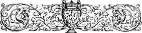
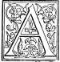
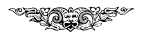
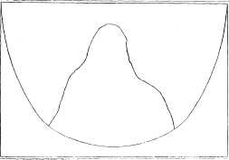

  
[Intangible Textual Heritage](../../index)  [Earth Mysteries](../index) 
[Index](index)  [Previous](ct09)  [Next](ct11) 

------------------------------------------------------------------------

**Cosmas Indicopleustes, Christian Topography (1897) pp. 304-320.  Book
8**

   

# BOOK VIII.

*On the Song of Hezekiah and the going back of the Sun.*\[300\]

 S I know well, my
dear Peter, how hard it is to please the race of man, I hesitated long
to comply with your request, for there be some men who cast reproach on
those who choose to commit their thoughts to writing, on the ground that
they immerse themselves in business, though it be in their option to
abstain from all exertion and to enjoy a life of leisure and repose.
Others again, since they set no value on writing, put out of sight what
is laborious, and seek quiet in seclusion. Some too there be who begin
to read books with unbounded eagerness, but afterwards, consigning them
to utter neglect, play the part of the poor brutes that walk on all
fours; while others, who are conversant with literature, do what is
still worse, for in the case of new writers, aware though they be that
these have reached the very pinnacle of fame, they will not condescend
to peruse their works, even when they are compositions of most sterling
merit. Persons again of the common sort, led by their ignorance,
disparage even what is said to the purpose,[1](#1)
and, to speak plainly, calumny is ever inventive, and has \|305  no lack of material for sneering and indulging
in censorious remarks, the grounds for which envy supplies without
stint. When I turned over all this in my mind, I put off,
notwithstanding you besought me with great importunity, to give a
written interpretation of the Song of the blessed Hezekiah. But you have
now, my admirable friend, I know not how, prevailed over me and done
away with my reluctance, representing to me that there is no lack in
this world of those who are willing to labour hard from their eagerness
to read the works of all, and to approve those that are
excellent,[2](#2) according to the injunction of the divine
Apostle (Rom. ii, 18), and among such thou thyself rankest as one. For
this is a worthy subject on which to bestow your pains, anxious as thou
art to ascertain whether anything tending to profit is to be gained from
the Song; for it would be quite in keeping with your good sense in such
matters, were you to be convinced that what appears of least importance
in divine scripture is capable of affording no little help; and
certainly an eager desire to learn the use of everything is a point in
your character, which stands not far remote from your devotion to work.
So then, as I had with God's help all but completed my exposition of the
Song of Songs, which our common and admirable friend, Theophilus, had
invited me to take in hand, as you are yourself aware, I put off the
matter until now; but as I have just quite completed that work, I shall
at once proceed to fulfil your request,[3](#3) if the Holy
Spirit will, without whom there can be \|306 no
good thing in us. I shall state first with what purpose in view he
uttered the Song, and shall then proceed to its \[301\] detailed
exposition, and shall at the same time point out what is useful in each
passage, for in this way the point of what is said will become clearer.

The blessed Hezekiah then, who was King of the Jews, and a very pious
and virtuous man and an object of God's especial care, entertained the
idea that the blessed David had spoken of him prophetically in many of
the Psalms, such as the nineteenth, the twentieth,[4](#4) and
many others besides, and having moreover applied to himself the prophecy
which had once been made in his father's time by Isaiah: *Behold a
virgin shall conceive and bear a son*,[5](#5) he was uplifted
in mind by the workings of human passion, and imagined himself to be the
Christ who had been predicted. He was in consequence at first unwilling
to take a part in the common offices of life, through the existence of
another opinion among the Jews, that Christ when He comes, never dies,
but abides for ever, as they also said in the Gospel: *We have heard ont
of the Law that Christ abideth for ever.*[6](#6) So Hezekiah
being of this opinion abstained from taking a wife and providing for the
succession of his line by having children, being under the belief that
he would live always. But when it came to pass that Senachêreim
(Sennacherib) [7](#7) the King of the Assyrians
warred against Judaea and went up to Jerusalem to plunder it, Hezekiah
on hearing what had been said by the impious Rapsacus (the Rab-shakeh)
[8](#8) as well \|307 as what had been
written by Senachêreim himself, rent his royal robes, and went into the
temple clad in sackcloth, and besprinkled with ashes, and there
supplicated God to deliver him from the Assyrians. But when his prayer
was heard, and 185,000 men of the Assyrian army had been destroyed in
one night by the angel, and when a victory so great and so marvellous
had been wrought for him by God, he held more firmly than ever the
estimate of himself which he had formerly entertained, claiming that he
was beyond all doubt the Christ who had been predicted. Wherefore, as he
was again uplifted in mind by this conception of himself, he did not go
after his victory into the temple, as was his duty, to render thanks and
give glory to God, but he was uplifted with pride, as it is recorded in
the second Book of Chronicles (xxxii, 26): *That he humbled himself for
the pride of his heart,* and, *God left him, to try him, that he might
know all that was in his heart* (*ibid.,* 31).

But God who, in mercy to man, always works for his salvation, desiring
to dispossess Hezekiah of that notion which his erring human judgment
had suggested to him, and remembering also his virtues, did not permit
him to be deluded to the end, but sent him such a sickness as led him to
despair of his life. Then Isaiah the prophet going in unto him said:
*Set thy house in order, for thou shalt die and not
live*;[9](#9) and thus at once took away the two
opinions he had entertained. For some of the Jews said that the Christ
never dies, while others held that he does really die, \[302\] but rises
again from the dead. So by saying *thou shalt die* the prophet took away
from him one opinion----that according to which he thought he would
never die, but when he added thereto and said: *thou shalt not live,* he
took away the other opinion, according to which others asserted that he
rises from the dead. For, being under the \|308
test of sickness, he was taught by both expressions that he was not
Christ. But the Prophet with great wisdom suggested to him by the power
of the Holy Spirit, that he was not the Christ, when he said to him:
*Set thy house in order, for thou shalt die and not live;* as if he
said, arrange thine affairs, setthng to whom thou wilt transmit thy
kingdom, in order that the promise of God may be guarded against the
possibility of failure, for thou art not the Christ proclaimed by the
Prophets, who has a kingdom without successor, but thou shalt
undoubtedly have a successor, and thou hast not done well in neglecting
to beget children to succeed thee in thy kingdom. It must therefore be
thy concern now to arrange thine affairs, and to declare whom thou wilt
have to be thy successor in the kingdom. As he had fancied that he would
have but himself for his successor, Hezekiah on coming to know otherwise
wept bitterly, and having repented and turned himself on his bed to the
wall----the quarter in which the Temple lay, in accordance with the
practice obtaining among the Jews----he made his supplication with his
thoughts, you may be sure, directed to the
Temple.[10](#10)

But when he had changed his estimate of himself, and corrected his false
notion, inasmuch as his prayer had been heard and he had recovered from
his sickness, and been deemed worthy of an addition to his life, of
fifteen years, and had been assured of this by another very wonderful
sign, namely, by the retrogression of the sun, of which I shall state
the cause a little farther on, then he sang the song to the Lord,
wherein he set forth each of the circumstances already mentioned, for he
speaks thus \[see Isaiah xxxviii, 10-20.\] *I* *said in the noontide of
my* \|309 *days I shall go,*[11](#11)
as if he said, I always cherished this thought in my heart, saying to
myself, that I shall live always and never die. For by his saying: *In
the noontide of my days I shall go,* he indicated that his days would
never be shortened; and as if some one, while he was silent, had asked:
while you were absorbed in these meditations what happened to you? he
continues and says: *At the gates of the grave I shall leave the residue
of my years;*[11](#11) meaning, while I was thus meditating,
I was all at once seized with a dreadful sickness, and could no longer
cling to my former notion, but thought 1 should spend the rest of my
years in the grave. Then: *I* *shall no longer behold the salvation of
God upon the earth.*[12](#12) The salvation of God here
signifies Christ; for thus also Symeon, when he took up Christ in his
arms, prayed God to be allowed to depart from this life, since his eyes
had seen the salvation of God, namely Christ himself for it had been
revealed to him by the Spirit that *he should* \[303\] *not see death,
until he had seen the Lord
Christ.*[13](#13) What Hezekiah then meant
to show was this: I not only abandoned that idea and ceased to entertain
those lofty imaginations concerning myself, but I do not even think I
shall be privileged to see the Christ upon the earth, as I have only
other fifteen years to live. *I* *shall no longer see a man of my own
kindred* [14](#14)----this means, after the
fifteen years which God has granted to me as an addition to my years, I
shall, when dying, not only not be counted worthy to see Him, but not
even to see any man, nay, not so much as one of my kindred. *I am
deprived of the residue of my
life;*[[15](#15)](#14) this means,
having thrown away therefore my former estimate of myself, and
considering what was my duty for the future, I recognised that my life
would come to an end. \|310 

After this he says: *It has gone out and gone away from me, as one takes
down the tent which he had pitched;*[16](#16)
meaning: And so completely has my former overweening arrogance departed
from me, that I am like one, who, after having pitched a tent, forthwith
takes it down again. *The breath within me is as when a weaver is
preparing to cut away the web from the
loom;*[17](#17) meaning: My very soul had all but
left me, just as when the web of a woman who is weaving is ready to be
cut. *In that day I was delivered till morning as to a lion, he did so
break all my bones----from day even to night was I delivered
over;*[18](#18) meaning: In the time then of my
sickness, I was delivered over to the fever as to a terrible lion that
was crushing all my bones, so that, as it raged, I was tortured
incessantly from morning till evening and from evening till day-dawn.
*As a swallow so shall I chatter, and as a dove so shall I
mourn;*[19](#19) that is, In the time of my
sickness I would utter cries like the sharp and quivering notes of the
swallow, and in my pangs I would wail after the wont of doves. The
words, *I* *shall chatter,* and *I shall mourn* are used instead of *I*
*chattered* and *I* *mourned,* one tense being put for another----this
being an idiom of frequent occurrence in divine scripture; as when
Isaiah says: *He was led as a lamb to the
slaughter,*[20](#20) instead of he will be led.
*Mine eyes failed me in looking at the height of heaven towards the
Lord, who rescued me, and took away the anguish of my soul, O Lord;
concerning it, it was told unto thee*;[20](#20)
meaning: And so much did I strain the eyes of my mind in looking up to
the height of heaven, laying upon Thee, even upon God the Preserver of
all, the anguish of my soul, which Thou didst remove from me, having
changed my arrogance into humility and obedience to religion, on account
of which, O Lord, I shall for \|311 ever give
thanks unto Thee. *And thon hast resuscitated my breath, and having been
comforted by thee I lived. For thou didst rescue my soul that it might
not perish, and thou hast cast behind me all my
sins;*[21](#21) meaning: For by comforting me Thou didst
resuscitate my breath and I lived; having \[304\] rallied my soul that
was perishing, Thou hast cast my sins behind, and not suffered them to
be spread out before me. *For they that are in the grave cannot praise
thee, nor can the dead celebrate thee; nor can they that are in the
grave hope for thy mercy. The living shall praise thee, even as I also
do;*[22](#22) meaning: For if Thou hadst not
granted me still to live, how could I have been converted, or have
repented and been saved, or have hope of Thy mercy, since the dead who
are in the grave can do nothing of this kind, but in Thy compassion Them
hast graciously granted me this.

*It* *is a light thing for the shadow to decline ten
steps;*[23](#23) *nay, but let the shadow return
backward ten steps.*[24](#24) Accordingly after
the shadow of the sun, as he proceeded \[from mid-heaven\] had declined
the ten steps, then by the divine power, through the prayer of the
Prophet, the sun returned backward till he was again in mid-heaven, and
the shadow was found to have gone back the ten steps, according to
sacred scripture. For if, on the contrary, it had been the \|312 third hour of the day, the shadow having by this
time gone forward, could neither have gone back, nor could the sun have
moved backward, if even it had so happened that the door and the steps
of the house of Hezekiah looked to the west. And so much with regard to
the position of the house. But the reason for such a sign being accorded
was this----that most of the nations and perhaps all of them, serving
especially the host of heaven, honour the sun as a greater god than all
the others, and, as the father of lights. God therefore by ordering him
to go backward, showed to all the nations that He himself was Lord of
all, and that the sun was His servant, and was not God. For if He
ordered so great a luminary to go back contrary to his use and wont,
much more can He order those that are smaller, and treat them as His
servants. But with God's help I shall now declare what advantage thence
accrued. When the sun then went backward, the circumstance became known
to all the nations, even to the ends of the earth, so that even the King
of Babylon, Merodach,[25](#25) the son of Baladon, who lived
far off and yet beheld the sign, was struck with consternation, and a
desire of searching into the nature of this dread and strange miracle.
For amazement and terror overcame the king himself and his courtiers,
who eagerly sought to learn from all that were conversant with astronomy
the cause of this dread and mighty sign. And after much inquiry had been
made, he learned that Hezekiah the King of Judaea having fallen into a
sickness, and been brought to despair of his life, made prayer unto God,
and God restored him to health and gave him an extension of his life of
fifteen years, and with a view to give him a sure belief in the promise,
He wrought for him this dread and mighty sign because He is the God of
gods, \|313 who made heaven and earth and all
things that therein \[305\] are.

The Babylonian having learned this, and having been taught by the
occurrence that He by whom it was wrought was the God of the universe,
lost no time in sending many gifts and an embassy to Hezekiah, as being
a true and beloved servant of the God of all. On this occasion he was
likewise taught that heaven is not a revolving sphere, according to the
opinion of the Babylonians, who at first suspected it to be such, when
they were engaged in building the Tower to a lofty height, but that it
was stationary and fastened to the earth as a vault. For if it were a
sphere, then while the universe was wheeling in a forward direction, the
sun, since he could not but be carried along with it, could not be
advancing in the opposite direction so as to move backwards for the
space of three hours, that is, the fourth part of a day, and again
another fourth part, until he came back to the place from which he had
retrograded. But about all these figures we wrote in the *Christian
Topography,* as you yourself, admirable Sir, know, at the exhortation of
the God-beloved Parnphilus of Jerusalem. For the very Prophet through
whom the retrogression of the sun was effected, when, by means of the
dread sign, he had in reality confuted the theory of the Babylonians, by
showing that the heaven is not a revolving sphere, and that they held an
opinion that is erroneous, this very Prophet not long afterwards speaks
thus of the figure of the heaven: *He that established the heaven as a
vaulted chamber;*[26](#26) and again: *The Lord
God who made the heaven and fixed it,*[27](#27)
thus declaring at once that it is a vault, and that it is established
and fixed and not in revolution. But by committing such things to
writing it is manifest that he did a good service to the Babylonians.
For whoso \|314 wishes can learn this from what
took place in the time of Cyrus the King of the Persians. For taking
into his hands the book of Isaiah he found as he read the section which
contained the prophecy concerning himself; since Isaiah says in that
section: *Thus saith the Lord to his Anointed, to Cyrus, whose right
hand I have holden to subdue nations before him, and I will loose the
loins of kings. I will open the doors before him, and the gates shall
not be shut. I will go before thee and will level mountains. I will
break in pieces the doors of brass, and cut in sunder the bars of iron;
and I will give thee the treasures of darkness, and hidden riches of
secret places will I present to thee, that thou mayest know I am the
Lord, which call thee by thy name, even the God of Israel. For Jacob my
servant's sake and Israel my chosen, I have called thee by thy name and
I will accept thee;*[28](#28) and shortly
afterwards: *I have raised him up a king in righteousness, and I will
make straight all his ways. He shall build my city, and lead back the
captivity of unpeople, not for price nor reward, saith the Lord of
hosts.*[29](#29) Cyrus, struck with wonder at the
foreknowledge and the \[306\] prediction, and finding his own name
expressly announced by the Prophet
beforehand,[30](#30) ordered the people to go up
to Jerusalem, after having released them from captivity, and given them
funds wherewith to build their city and their temple. And not only did
he do this, but those also who came after him did trie same until the
City and the Temple were finished.

The decree of Cyrus, which is committed to writing and \|315 recorded in Chronicles and in Esdras (Ezra), and
which enjoined all the people to go up, runs thus: *In the first year of
Cyrus King of Persia, that the word of the Lord by the mouth of Jeremiah
might be accomplished, the Lord stirred up the spirit of Cyrus King of
the Persians that he made a proclamation throughout all his kingdom and
put it also in writing, saying: Thus saith Cyrus King of the Persians,
all the kingdoms of the earth hath the Lord, the God of heaven, given
me, and he hath charged me to build him an house in Jerusalem which is
in Judaea. Whosoever there is among you of all his people, be God with
him and let him go up!*[31](#31) See, my admirable
friend, how he acknowledges that he had read the book of Isaiah, and
believed in what was written, and fulfilled what was written in
scripture with all diligence and without sparing the expense. How then
is it not manifest that much benefit to religion accrued to all nations
from all these circumstances? And how could those who had such faith in
the scripture of Isaiah disbelieve what he said concerning the figure of
heaven in his book. *He that hath established the heaven as a
vault?*[32](#32) especially when in that age the
miracles of the overthrow of Senachereim and of the retrogression of the
sun were still recent events; whence also all the men of rank among them
being convinced as to the truth of these world-renowned miracles, and
convinced also by the prophesying of Isaiah, agreed to the opinion of
the king, and released the people with honour. Since then the
Babylonians were the first who conjectured and suspected that the heaven
was a sphere, they again were the first to be taught, through Isaiah the
Prophet, that it is not a sphere but a vault. From these sources having
derived all the figures we have also depicted them in the *Christian
Topography,* in the preface thereto, giving the name of the master who
taught \|316 us, namely, the great
Patricius,[33](#33) who came here among us from
the country of the Chaldaeans----and so much again on these matters.

When the ambassadors of the Babylonian king came to Hezekiah, his heart
in a fresh access of human weakness was lifted up with pride, and he
received them with all gladness, for his own glory; and contrary to the
will of God, he led them into the palace, displaying to them his
treasures and all his riches. Then again Isaiah was sent to him to
correct his frame of mind, and said to him ironically: *What do these
men say, and whence came they unto* \[307\] *thee?* And Hezekiah said:
*From a far country have they come unto me*----*even from Babylon.* Then
said Isaiah again: *What have they seen in thine
house?*[34](#34) But the King, seeing that the
Prophet put the question knowing how matters stood, told the truth and
said to him: *All that is in my house have they seen, and there is
nothing in the house which they have not seen*----*yea they have even
seen all my treasures:*[35](#35) Then he told him,
by way of a threat to chastise the pride which uplifted his heart, what
would come to pass after him and says: *Hear the word of the Lord of
Hosts. Behold the days come, that all that is in thine house, and that
which thy fathers have laid up in store until this day, shall be carried
to Babylon: nothing shall be left, saith the Lord. And of thy sons that
shall issue from thee, which thou shalt beget, shall they take away, and
they shall be eunuchs in the palace of the King of
Babylon;*[36](#36) as if He said, For you ought to
have been instructed by your former experiences that, not so much for
your glory as for Mine, were the mighty signs wrought, in order that the
nations also may be made acquainted with My greatness, which them again
didst think lightly of, and wert uplifted with pride, not giving \|317 Me thanks. But since without My sanction thou
didst receive the ambassadors, aud didst show them the wealth which thou
hast obtained from Me, be therefore henceforth taught that hereafter, in
the time of thy successors, I will deliver over to the Babylonians all
thy wealth to be plundered and captured, because thou hadst again no
regard for My glory, but didst honour thyself in preference to Me. But
inasmuch as thou hast ever been virtuous and pious, none of these things
shall happen in thy times. Hezekiah, on hearing and understanding this,
humbled himself, as he was a righteous man and obedient to God, and
giving thanks said to Isaiah: *Good is the word of the Lord which he
hath spoken. Let there be peace in my days.*1  But that all
things happened according to the word of the Prophet is a clear matter
of fact, for Nabouchodonosor (Nebuchadnezzar) the King of Babylon having
plundered Jerusalem took all the spoils to Babylon, and having selected
young men of the royal line, Daniel, Ananias, Azarias, Misael and their
companions, he made them eunuchs and appointed them to his own service;
for it was a custom for the King to be served by eunuchs, as they were
his personal attendants. In divine scripture certainly there is no
record of the marriage of any one of them, or of child born to them, nor
was any thing of this nature heard regarding them. But tradition and
custom alike, according to the prophecy, represent them, as shown in
their pictures, to be beardless snd smooth-skinned. But that, in their
time, there were many miracles and prodigies and revelations and
predictions which proved of great benefit to the Babylonians, Medes and
Persians, thou art not unaware, O admirable Peter, and that in
consequence the Kings greatly honoured them, and among their own
subjects published decrees touching religion, which \[308\] \|318 proclaimed, with reference to the God of all,
that He is the God of gods and the Lord of lords; and they moreover
ordained that such as uttered blasphemy against Him should be punished.
Thus God who continually directs all things, by means of His own people,
teaches all the nations by raising to honour those who do righteously,
while He punishes those who sin, and sends them into captivity----thus
teaching the nations by each of these dispensations to recognize His
beneficence and His majesty; in order that they also may take their
share in the duties of religion, being trained beforehand for the faith
to be afterwards revealed through our Lord Jesus Christ. For not one jot
or one tittle of scripture has been written needlessly, but all that is
therein has been recorded for some useful end and for the common and
manifold advantage of men. Wherefore, my Christ-loving friend, I
beseech, through you, those who fall in with this composition of mine to
read constantly divine scripture, and to reap therefrom all the gain
wherewith it can help every man in affairs human and divine. God grant
that we may obtain the divine blessing and promises through the prayers
of our teachers and of thy brotherhood, O thou who lovest Christ with
thine whole heart.[37](#37)

Just as the twelve loaves of shew-bread which lay on the table are a
type of the annual cycle and of the fruits of the earth, as was said
when we treated of the Tabernacle, and as is described in the ninth
book, so also now we have delineated the cycle of the twelve months of
the year, and the fruits produced in each month, giving thanks to God
\[309\] the giver of all, as also David moved by the Holy Spirit thus in
a psalm addresses *God: Bless thou the crown of* \|319 *the year of thy
goodness;*[38](#38) thus in a remarkable way
styling the cycle of the twelve months of the year a crown of goodness,
as crowning the surface of the earth with beauty, and fostering the
growth and maturity of its monthly fruits through the tempering of the
elements which the invisible powers accomplish. Wherefore he further
adds: *And the plains shall be filled with thy
fatness;*[38](#38) and again: *Thou hast prepared
their food, for thou hast so prepared it.*[39](#39) And
elsewhere again he speaks thus: *They all look to thee to give them
their food in due season;*[40](#40) as if he said,
Thou nourishest us, preparing our food from the products of each season.
And elsewhere he thus speaks concerning our most necessary food, which
the summer tropic perfects, and continues to give us for three months
successively: *They have been increased with their corn and wine and
oil* [41](#41)----here again in a remarkable way,
in the giving of thanks, observing the order in nature and mentioning
first corn, then \|320 wine, and thirdly oil, in
accordance with the order, in which by the blessing of God, they are
produced during the three summer months, by the agency of the rational
orders, namely, angels and men. It is therefore the duty of every
Christian to read divine scripture neither in a cursory nor perfunctory
way, but with studious care and in a suitable order, as in the outset we
advised, in order that the divine grace, accepting our resolution, may
cooperate in enabling us to know the mighty works of God. To Him be
glory for ever, Amen! Be strong, ye Christians, in the Lord.

 

\[Footnotes moved to the end and renumbered\]

1. 1 Gr. τὰ καλω̃ς λεγόμενα may perhaps
mean *what is finely said or expressed.*

2. 1 Gr. δοκιμάζειν τὰ διαφέροντα,
translated in the Revised Version "to approve the things that are
excellent", but in the margin thereof "to prove the things that differ."
Cosmas seems to have understood the words in the former sense. The
expression has occasioned much controversy.

3. 2 Gr. ἄρξομοι καὶ τὴν σὴν αἴτησιν.
Βουλήσει . . . . πληρου̃ν*.* As αἴτησιν is governed by πληρου̃ν, the
reading should be αἴτησιν βουλήσει, &c.

4. 1 The Psalms here meant are the
twentieth and the twenty-first of our Bible. In the Septuagint the ninth
and tenth psalms appear as but one, and hence the difference in the
numeration.

5. 2 Isai. vii, 14.

6. 3 John xii, 34.

7. 4 Sennacherib the son of Sargon was
the King, according to *Herodotus* (ii, 141), of the Assyrians and
Arabians. He invaded Judaea in the fourteenth year of the reign of
Hezekiah, who ascended the throne in 726 B.C. and died in 697.
Sennacherib died in 681.

8. 5 Rab-shakeh is a title, meaning
*Commander-in-Chief.*

9. 1 Isai. xxxiii, 1.

10. 1 Thus Daniel prayed at three
distinct times of the day with his face turned towards Jerusalem. The
Ebionites maintained this Jewish custom of turning in prayer towards the
sacred city.

11. 1 Isai. xxxviii, 10.

12. 2 *Ibid.* 11.

13. 3 Luke ii, 26.

14. 4 Isai. xxxviii, 11.

15. 5 *Ibid*. 12.

16. 1 Isai. xxxviii, 12.

17. 2 *Ibid.,*

18. 3 *Ibid.,* 13.

19. 4 *Ibid.,* 14.

20. 5 Isai. liii, 7.

21. 1 Isai. xxxviii, 17.

22. 2 *Ibid.,* 18, 19.

23. 3 Gr. ἀναβαθμούς*.* "Cyril of
Alexandria and Jerome thought that the *steps* were really stairs, and
that the shadow (perhaps of some column or obelisk on the top) fell on a
greater or smaller number of them according as the sun was low or high.
The terrace of a palace might thus easily be ornamented." Smith's
*Dictionary of the Bible.* Josephus quotes a passage from Apion to the
effect that in Egypt "Moses set up pillars instead of gnomons, under
which was represented a cavity like that of a boat, and the shadow that
fell from their tops fell down upon that cavity, that it might go round
about the like course as the sun itself goes round in the other." See
Whiston's *Josephus --contra Apion. Book II*, near the beginning.

24. 4 II Kings xx, 10.

25. 1 According to Bêrôsus, this king,
whom he calls Mardocampados was himself, like Hezekiah, tributary to the
Assyrians.

26. 1 Isai. xl, 22.

27. 2 Isai. xlv, 18.

28. 1 Isai. xlv, 1-4.

29. 2 *Ibid.* 13.

30. 3 The foregoing quotations are
taken from the forty-fifth chapter of Isaiah. Some biblical critics
contend that the latter chapters of this Prophet (40 to 66) were written
by a deutero-Isaiah who was about a century later than the first. One of
their arguments in support of this view is, that Cyrus is mentioned by
name, and that an intimate knowledge is exhibited of his career.

31. 1 Ezra i, 1-3.

32. 2 Isai. xl, 22.

33. 1 See note 2, p. 24.

34. 2 Isai. xxxix, 3.

35. 3 *Ibid.,* 4.

36. 4 *Ibid.,* 5-7.

37. 1 Montfaucon has here this note:
Cosmas here again delineates the figure of the conical mountain which
causes nights and eclipses, as he thought it would contribute much to
the understanding of the things said before, and of the ninth book,
regarding the course of the stars. For the cycle of the twelve months,
see Pl. 23 in the Appendix.  

 

38. 1 Psalm lxv, 12.

39. 2 *Ibid*., 10.

40. 3 Psalm civ, 27.

41. 4 Gen. iv, 7.

------------------------------------------------------------------------

[Next: Book 9](ct11)
