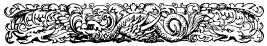
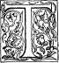
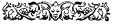

  
[Intangible Textual Heritage](../../index)  [Earth Mysteries](../index) 
[Index](index)  [Previous](ct12)  [Next](ct14) 

------------------------------------------------------------------------

**Cosmas Indicopleustes, Christian Topography (1897) pp. 358-373.  Book
11**

 

# BOOK XI.

*A description of Indian Animals, and of the Island of Taprobane.*

 HIS
animal[1](#1) is called the rhinoceros from having horns upon
his snout. When he is walking his horns are mobile, but when he sees
anything to move his rage, he erects them and they become so rigid that
they are strong enough to tear up even trees by the root, those
especially which come right before him. His eyes are placed low down
near his jaws. He is altogether a fearful animal, and he is somehow
hostile to the elephant. His feet and his skin, however, closely
resemble those of the elephant. His skin, when dried, is four fingers
thick, and this some people put, instead of iron, in the plough, and
with it plough the land. The Ethiopians in their own dialect call the
rhinoceros *Arou,* or *Harisi,* aspirating the *alpha* of the latter
word, and adding *risi.* By the *arou* they designate the beast as such,
and by *arisi,* ploughing, giving him this name from his shape about the
nostrils, and also from the use to which his hide is
turned.[2](#2) In Ethiopia I once saw a live \|359 rhinoceros while I was standing at a far
distance, and I saw also the skin of a dead one stuffed with chaff,
standing in the royal palace, and so I have been able to draw him
accurately.[3](#3)

*The Taurelaphus, the Bull-stag or Ox-deer.*

The taurelaphus is an animal found in India and in Ethiopia. Those in
India are tame, and are used for the transport of pepper and other
stuffs packed in saddle-bags. They are milked, and from the milk butter
is made. We also eat their flesh, the Christians killing them by cutting
their throats and the Pagans by felling them. The Ethiopian kind, unlike
the Indian, are wild and have not been domesticated.

*The Camelopardalis*----*the Giraffe.* \[335\]

Cameleopards are found only in Ethiopia. They also are wild creatures
and undomesticated. In the palace [4](#4) one or two that, by
command of the King, have been caught when young, are tamed to make a
show for the King's amusement. When milk or water to drink is set before
these creatures in a pan, as is done in the King's presence, they
cannot, by reason of the great length of their legs and the height of
their breast and neck, stoop down to the earth and drink, unless by
straddling with their forelegs. They must therefore, it is plain, in
order to drink, stand with their forelegs wide apart. This animal also I
have delineated from my personal knowledge of it. \|360 

*The Agriobous or Wild Ox.*

This wild ox is a large Indian animal,[5](#5) and from it is
got what is called the *toupha,*[6](#6) with which
commanders of armies decorate their horses and banners when taking the
field. If his tail, it is said, catches in a tree, he does not seek to
move off but stands stock-still, having a strong aversion to lose even a
single hair of his tail. So the people of the place come and cut off his
tail, and then the beast, having lost it all, makes his escape. Such is
the nature of this animal.

*The Moschus or Musk-deer.*

The small animal,[7](#7) again, is the Moschus,
called in the native tongue *Kastouri.* Those who hunt it pierce it with
arrows, and having tied up the blood collected at the
navel[8](#8) they cut it away. For this is the part which has
the pleasant fragrance known to us by the name of musk. The men then
cast away the rest of the carcase.

*The Monoceros or Unicorn.*

This animal is called the unicorn,[9](#9) but I cannot say
that I have seen him. But I have seen four brazen figures of \|361 him set up in the four-towered palace of the King
of Ethiopia. From these figures I have been able to draw him as you
see.[10](#10) They speak of him as a terrible beast and quite
invincible, and say that all his strength lies in his horn. When he
finds himself pursued by many hunters and on the point of being caught,
he springs up to the top of some precipice whence he throws himself
down[11](#11) and in the descent turns a somersault so that
the horn sustains all the shock of the fall,[12](#12) and he
escapes unhurt. And scripture in like manner speaks concerning him,
saying, *Save me from the mouth of lions, and my humility from the horns
of unicorns.*[13](#13) And again: *And he that is beloved as
the son of unicorns;*[14](#14) and again in the blessings of
Balaam wherewith he blessed Israel, he says for the second time: *God so
led him out of Egypt even as the glory of the
unicorn;*[15](#15) thus bearing complete testimony to the
strength, audacity, and glory of the animal.

*The Chaerelaphus or Hog-deer and Hippopotamus.* \[336\]

The hog-deer I have both seen and eaten. The hippopotamus, however, I
have not seen, but I had teeth of it so \|362
large as to weigh thirteen pounds,[16](#16) and these I sold
here.[17](#17) And I saw many such teeth both in
Ethiopia and in Egypt.

*Piperi*----*pepper.*

This is a picture of the tree which produces pepper. Each separate stem
being very weak and limp twines itself, like the slender tendrils of the
vine, around some lofty tree which bears no fruit. And every cluster of
the fruit is protected by a double leaf. It is of a deep green colour
like that of rue.

*Argellia*----*The Narikela of Sanskrit*----*Cocoa-nuts.*

The other tree \[represented\] bears what are called argellia, that is,
the large Indian nuts. It differs nothing from the date-palm, except
that it is of greater height and thickness and has larger fronds. It
bears not more than two or three flower-spathes, each bearing three
nuts. Their taste is sweet and very pleasant, like that of green nuts.
The nut is at first full of a very sweet water which the Indians drink,
using it instead of wine.[18](#18) This delicious drink is
called *rhongcosura.* If the fruit is gathered ripe and kept, then the
water gradually turns solid on the shell, while the water left in the
middle remains fluid, until of it also there is nothing left over. If
however it be kept too long the concretion on the shell becomes rancid
and unfit to be eaten. \|363 

*The Phoca or Seal, the Dolphin and the Turtle.*

The seal, the dolphin, and the turtle we eat at sea [19](#19)
if we chance to catch them. When we want to eat the dolphin and turtle
we cut their throat. But we do not kill the seal that way, but strike it
over the head as is done with the large kinds of fish. The flesh of the
turtle, like mutton, is dark-coloured; that of the dolphin is like pork,
but dark-coloured and rank;[20](#20) and that of the seal is,
like pork, white and free from smell.

*Concerning the Island of Taprobanê.* [21](#21) 

This is a large oceanic island lying in the Indian sea. By, the Indians
it is called Sielediba, but by the Greeks \|364
Taprobanê, and therein is found the hyacinth stone.[22](#22)
It lies on the other side of the pepper country. Around it are numerous
small islands [23](#23) all having fresh water and
cocoa-\[337\] nut trees. They nearly all have deep water close up to
their shores.[24](#24) The great island, as the natives
report, has a length of three hundred *gaudia,* that is,of nine hundred
miles,[25](#25) and it is of the like extent in
breadth. There are two kings in the island, and they are at feud the one
with the other.[26](#26) The one has the hyacinth
country, and the other the rest of the country where the harbour is. and
the centre of trade.[27](#27) \|365 It
is a great mart for the people in those parts. The island has also a
church of Persian Christians who have settled there, and a Presbyter who
is appointed from Persia, and a Deacon and a complete ecclesiastical
ritual.[28](#28) But the natives and their kings are
heathens.[29](#29) In this island they have many temples, and
on one, which stands on an eminence, there is a hyacinth as large as a
great pine-cone, fiery red, and when seen flashing from a distance,
especially if the sun's rays are playing round it, a matchless
sight.[30](#30) The island being, as it is, in a central
position, is much frequented by ships from all parts of India and from
Persia and Ethiopia, and it likewise sends out many of its own. And from
the \|366 remotest countries,[31](#31)
I mean Tzinista and other trading places, it receives
silk,[32](#32) aloes, cloves, sandalwood[33](#33)
and other products, and these again are passed on to marts on this side,
such as Male,[34](#34) where pepper grows, and to
Calliana[35](#35) which exports copper and sesame-logs, and
cloth for making dresses, for it also is a great place of business. And
to Sindu[36](#36) also where musk and castor is procured and
androstachys,[37](#37) and to Persia and the Homerite
country, and to Adulé. And the island receives imports from all these
marts which we have mentioned and passes them on to the remoter ports,
while, at the same time, exporting its own produce in both directions.
Sindu is on the frontier of India, for the river Indus, that is, the
Phison, which discharges into the Persian Gulf, forms the boundary
between Persia and India.[38](#38) The most notable places of
trade in India are these: Sindu, \|367
Orrhotha,[39](#39) Calliana, Sibor,[40](#40) and
then the five marts of Male which export pepper: Parti,
Mangarouth,[41](#41) Salopatana, Nalopatana,
Poudopatana.[42](#42) Then out in the ocean, at the distance
of about five days and nights from the continent, lies Sielediba, that
is Taprobanê. And then again on the continent is Marallo, a mart
exporting chank shells,[43](#43) then
Caber[44](#44) which exports alabandenum, and then farther
away is the clove country, then Tzinista which produces the
silk.[45](#45) Beyond this there is no other country, for the
ocean surrounds it on the east. This same Sielediba then, placed as one
may say, in the centre of the Indies and possessing the \|368 hyacinth receives imports from all the seats of
commerce and in turn exports to them, and is thus itself a great seat of
commerce.

\[338\] Now I must here relate what happened to one of our countrymen, a
merchant called Sopatrus, who used to go thither on business, but who to
our knowledge has now been dead these five and thirty years past. Once
on a time he came to this island of Taprobane on business, and as it
chanced a vessel from Persia put into port at the same time with
himself. So the men from Adulé with whom Sopatrus was, went ashore, as
did likewise the people of Persia, with whom came a person of venerable
age and appearance.[46](#46) Then, as the way there was, the
chief men of the place and the custom-house officers received them and
brought them to the king. The king having admitted them to an audience
and received their salutations, requested them to be seated. Then he
asked them: In what state are your countries, and how go things with
them? To this they replied, they go well. Afterwards, as the
conversation proceeded, the king inquired Which of your kings is the
greater and the more powerful? The elderly Persian snatching the word
answered: Our king is both the more powerful and the greater and richer,
and indeed is King of Kings, and whatsoever he \|369 desires, that he is able to do. Sopatrus on the
other hand sat mute. So the king asked: Have you,
Roman,[47](#47) nothing to say? What have I to say, he
rejoined, when he there has said such things? but if you wish to learn
the truth you have the two kings here present. Examine each and you will
see which of them is the grander and the more powerful. The king on
hearing this was amazed at his words and asked, How say you that I have
both the kings here? You have, replied Sopatrus, the money
[48](#48) of both ---- the *nomisma* [49](#49) of
the one, and the drachma, that is, the miliarision [50](#50)
of the other. Examine the image of each, and you will see the truth. The
king thought well of the suggestion, and, nodding his consent, ordered
both the coins to be produced. Now the Roman coin had a right good ring,
was of bright metal and finely shaped, for pieces of this kind are
picked for export to the island. But the miliarision, to say it in one
word, was of silver, and not to be compared with the gold coin. So the
king after he had turned them this way and that, and had attentively
examined both, highly commended the *nomisma,* saying that the Romans
were certainly a splendid, powerful, and \|370
sagacious people.[51](#51) So he ordered great honour to be
paid to Sopatrus, causing him to be mounted on an elephant, and
conducted round the city with drums beating and high state. These
circumstances were told us by Sopatrus himself and his companions, who
had accompanied him to that island from Adule; and as they told the
story, the Persian was deeply chagrined at what had occurred.

But, in the direction of the notable seats of commerce already
mentioned, there are numerous others \[of less importance\] both on the
coast and inland, and a country of great extent. Higher up in India,
that is, farther to the north, are the White Huns.[52](#52)
The one called Gollas when going to war takes with him, it is said, no
fewer than two \|371 thousand elephants, and a
great force of cavalry. He is the lord of India, and oppressing the
people forces them to pay tribute. A story goes that this king once upon
a time would lay siege to an inland city of the Indians which was on
every side protected by water. A long while he sat down before it, until
what with his elephants, \[339\] his horses and his soldiers all the
water had been drunk up.[53](#53) He then crossed over to the
city dryshod, and took it. These people set great store by the emerald
stone and wear it set in a crown. The Ethiopians who procure this stone
from the Blemmyes [54](#54) in Ethiopia take it into India
and, with the price it fetches, they invest in wares of great value. All
these matters I have described and explained partly from personal
observation, and partly from accurate inquiries which I made when in the
neighbourhood of the different places.

The kings of various places in India keep elephants,[55](#55)
such as the King of Orrhotha, and the King of Calliana, and the Kings of
Sindu, Sibor and Male. They may have each six hundred, or five hundred,
some more, some fewer. Now the King of Sielediba gives a good price both
for the elephants and for the horses that he has. The elephants he pays
for by cubit measurement. For the height is \|372
measured from the ground, and the price is reckoned at so many
*nomismata* for each cubit, fifty it may be, or a hundred, or even more.
Horses they bring to him from Persia, and he buys them, exempting the
importers of them from paying custom. The kings of the continent tame
their elephants, which are caught wild, and employ them in war. They
often set elephants to fight with each other for a spectacle to the
king.[56](#56) They keep the two combatants apart by means of
a great cross beam of wood fastened to two upright beams and reaching up
to their chests. A number of men are stationed on this and that side to
prevent the animals meeting at close quarters, but at the same time to
instigate them to fight one another. Then the beasts thrash each other
with their trunks till one of them gives in. The Indian elephants are
not provided with large tusks, but should they have such, the Indians
saw them off, that their weight may not encumber them in action. The
Ethiopians do not understand the art of taming elephants; but should the
king wish to have one or two for show, they capture them when young and
subject them to training. Now the country abounds with them, and they
have large tusks which arc exported by sea from Ethiopia even into India
and Persia and the Homerite country and the Roman dominion. These
particulars I have derived from what I have heard.

The river Phison separates all the countries of India \[lying along its
course\] from the country of the Huns. In scripture the Indian region is
called Euilat (Havilah). For it is thus written in Genesis: *Now the
river goeth out from Eden to water Paradise. And from there it was
parted and became four heads. The name of the first is Phison (Pishon);
that is it which compasseth the whole land of Euilat, where there is
gold*; *and the gold of that land is good; there is the* \|373 *carbuncle and the jasper
stone*;[57](#57) where the writer clearly calls
the country Euilat. This Euilat, moreover, is of the race of \[340\]
Ham. For thus again it is written: *The sons of Ham, Cush and Misraim,
Phut and Caraan the sons of Cush, Sabâ and Euilat;* that is the
Homerites and Indians, for Sabâ is situated in the Homerite country, and
Euilat is in India. For the Persian Gulf divides those two countries.
And that country has gold according to sacred scripture. It has also the
pezerôs[58](#58) which Scripture calls *anthrax*
(carbuncle) and the jasper stone, by which it designates the leek-green
stone.[59](#59) Clearly therefore does divine scripture, as
being really divine, relate these things, even as the whole of our
treatise goes to show.

 

\[Footnotes renumbered and placed at the end\]

1. 1 In the Codex the pictures of the
animals and plants precede the description of them. See the Plates in
the Appendix.

2. 2 Salt states that the name, by which
the rhinoceros (two-horned) is designated to this day all over
Abyssinia, is absolutely the same as that given by Cosmas. Hence he was
convinced that the language spoken at the Court of Axum was Gheez.

3. 1 The animal, however, as depicted by
Cosmas is more like a horse than a rhinoceros. A description of the
rhinoceros and its mode of fighting with the elephant is given by
Agatharchides in his work on the Erythraean.

4. 2 Cosmas here uses the Latin word:
παλατίω.

5. 1 This is evidently the *yak,* the
*Bos grunniens* of naturalists.

6. 2 The *Chowries* or fly-flappers used
in India, particularly on occasions of state and parade. Tupha is the
Turkish name of the horsetail standard.

7. 3 It is little more than three feet
in length.

8. 4 The cyst of the male, which is
about the size of a hen's egg, contains a clotted, oily, friable matter,
dark-brown in colour, and this is the true musk.

9. 5 The first author who has given a
description of the unicorn is Ctesias of Cnidos, a physician who spent
seventeen years at the Court of Artaxerxes Mnêmôn, where he heard all
manner of marvellous stories about India. The one-horned animal which he
describes under the name of *the wild ass of India,* and which Aristotle
speaks of as the *Indian ass,* is best identified with the rhinoceros,
notwithstanding all the errors of the description.

10. 1 Lobo, in his history of
Abyssinia, describes the unicorn as resembling a beautiful horse, and in
the picture of it by Cosmas its body is not unlike that of a horse. For
a remark on this picture, see Yule's *Marco Polo,* vol. ii, 273.

11. 2 Gr. εἰς κρημνὸν ἐφάλλεται, καὶ
ῥίπτει ἑαυτὸν ἐκ του̃ ὕψους. Montfaucon's rendering of these words:
"deorsum in praecipitia sese conjicit," does not give their full import.

12. 3 This is said to hold true of the
oryx.

13. 4 Psalm xxii, 21. The Revised
Version has here: *from the horns of the wild ox.* To the influence of
the Septuagint Version, which rendered the Hebrew word for the *wild ox*
(reem) *by unicorn,* may be traced most of the fables about the unicorn.

14. 5 Psalm xxix, 6.

15. 6 Numb. xxiii, 22.

16. 1 Gr. λιτρω̃ν. This word is the
Sicelo-Greek form of the Latin *libra.* The coinage system of the
Dorians of Sicily was borrowed from Italy.

17. 2 In Alexandria----and probably in
his earlier years, when he was a merchant.

18. 3 "Possibly," says Yule, "Cosmas
has confounded the cocoa-nut milk with the coco-palm toddy. For *sura*
is the name applied on the Malabar coast to the latter. *Roncho* may
represent *lanha,* the name applied there to the nut when ripe, but
still soft."

19. 1 Gr. κατὰ θάλατταν*.* Montfaucon
renders *ad oram maris* "on the sea shore."

20. 2 Gr. ὡς χοίρου, μελαμψόυ δὲ καὶ
βρομω̃δες. Montfaucon in his rendering overlooks the δὲ, and thus makes
Cosmas say that pork is black and foul-smelling. βρομω̃δες is an
incorrect form of βρωμω̃δες, an epithet applied by Strabo to the district
of Puteoli, which was noted for its foul smells.

21. 3 Ceylon has been known by many
names. In Sanskrit works it is called Lanka, an appellation unknown to
the Greeks. Megasthenes, who wrote his work on India about 300 B.C.,
calls it Taprobanê, a compound which is generally regarded as a
transliteration of Tâmraparnî, *copper-coloured leaf,* a name given to
the island by its Indian conqueror, Vijaya. This name is found in its
Pâli form, Tambaparni, in Asôka's inscription on the Girnâr rock. Some
are, however, of opinion that Taprobanê is a slightly-altered form of
*Dwîpa-Râvana* (Island of Râvana), as the country was called by
Brahmanical writers. From the *Periplûs* and Ptolemy we learn that
Taprobanê was anciently called *Simoundou,* but in his own time,
*Salike, i.e.,* the country of the *Salai.* Here we have in a
slightly-altered form the *Siele-diva* of Cosmas, for *diva* is but a
form of *Dwipa,* the Sanskrit for *island.* Both *salai* and *siele*
have their common source in *sihalam* (pronounced as *Silam),* the Pâli
form of the Sanskrit *sinhala*, a lion. To the same source may be traced
all its other names, such as Serendivus, Sirlediba, Serendib, Zeilan,
Sailan, and Ceylon. As there are no lions in Ceylon, *sinhala* must be
taken to mean a lion-like man----a hero----the hero Vijaya.

22. 1 Some think this is not our
jacinth, but rather the sapphire; others take it to be the amethyst.

23. 2 The Laccadives. The name means,
*islands by the hundred thousand.*

24. 3 Gr. ̕Ασσοβαθαὶ δὲ ὡς ἐπὶ τὸ
πλει̃στον πα̃σαί εἰσιν*.* Montfaucon renders *alia aliam proxime sitae,*
thus taking no account of βαθαὶ, the predominant partner in the
compound. ̕Ασσοβαθὸς is a barbarous form of ἀγχιβαθής*.*

25. 4 "The Hindus" says Tennent in his
*Ceylon,* Chap. I., "propounded the most extravagant ideas, both as to
the position and extent of the island; expanding it to the proportions
of a continent, and, at the same time, placing it a considerable
distance south-east of India." The Classical and Arab writers were no
less extravagant in their estimates than the Hindus. Even Ptolemy, who
determined correctly the general form and outline of the island, as well
as its actual position with reference to the adjoining continent,
represented it as some fourteen times larger than it is. Its extreme
length from north and south is 271 1/2 miles, its greatest width 137 1/2
miles, its circuit somewhat under 700 miles, and its area one-sixth
smaller than that of Ireland. With regard to the word *gaudia,* Tennent
says (*Ceylon,* vol. ii., p. 543, *note*): "It is very remarkable that
this singular word, *gaon,* in which Cosmas gives the dimensions of the
island, is in use to the present day in Ceylon, and means the distance
which a man can walk in an hour.....A *gaon* in Ceylon expresses a
somewhat indeterminate length, according to the nature of the ground to
be traversed."

26. 5 Gr. ἐναντίοι ἀλλήλων. Tennent
(*ibid*.) prefers to render this expression by "ruling at opposite ends
of the island."

27. 6 Tennent (*ibid.*) rejects
Thevenot's notion that by *hyacinth* Cosmas meant here "the part of the
island where jacinths are found;" on the ground that the region which
produces gems, namely, the south part of the island, is that which also
has the port and the emporium. The King who possessed the wonderful gem
(called by Gibbon *the luminous carbuncle*) ruled the northern part of
the island. The emporium, according to Gibbon, was *Trinquemale,* but
Tennent takes it to be *Point de Galle.*

28. 1 Gr. καὶ πα̃σαν τὴν ἐκκλησιαστικὴν
λειτουργίαν*.*

29. 2 Gr. ἀλλόφυλοι*.* Tennent renders
the sentence thus: "The natives and their kings are of different races."
Cosmas, however, here uses the term in the sense in which the kindred
compounds ἀλλοφυλέω and ἀλλοφυλισμός are used in the Septuagint. The
latter word in II Maccab. iv, 13, means *the adoption of gentle manners
and customs.* Montfaucon rightly renders: *alieni cultus.*

30. 3 The Chinese pilgrim Hiouen
Thsiang, who was a century later than Cosmas, relates that at
Anarajapura, on a spire surmounting one of its temples, a ruby was
elevated which with its transcendent lustre illuminated the whole
heaven. Marco Polo again relates that the King of Ceylon was reputed to
have the grandest ruby that ever was seen----one that was flawless and
brilliant beyond description. "It is most probable" says Tennent
(quoting the authority of Dana's *Mineralogy,* vol. ii, p. 196), "that
the stone described by Marco Polo was not a ruby but an amethyst, which
is found in large crystals in Ceylon, and which modern mineralogists
believe to be the 'hyacinth' of the ancients." There is no authentic
record of the ultimate history of this renowned jewel, unless it be the
"carbuncle" of unusual lustre which was purchased early in the 14th
century for the Emperor of China. See Tennent's *Ceylon,* vol. i, pp.
543-4, note.

31. 1 Gr. τω̃ν ἐνδοτέρων*.* The
countries inside of Cape Comorin, that is, to the east of it.

32. 2 Gr. μέταξιν-μέταξα and not
μέταξις is the usual form of this word. Metaxa is a Latin as well as a
Greek word, and means properly "yarn." It was used, however, by the
mediaeval Greeks to signify silk in general. Procopius, who was
contemporary with Cosmas, says that clothing was made from it, and that
of old Greeks called this clothing *mêdikê,* but in his time, *sêrikê.*
See *Note* 2, p. 47.

33. 3 Gr. τζανδάναν*.*

34. 4 The Malabar littoral.

35. 5 Calliana, now Kalyâna, near
Bombay, is named in the Kanhêri Bauddha Cave inscription. Mention is
also made of it in the *Periplûs of the Erythraean Sea,* which states
that it was raised to the rank of a regular mart in the times of the
elder Saragones, who was probably one of the great Sâtakarni or
Andrabhritya dynasty.

36. 6 Probably Diul-Sind at the mouth
of the Indus. See Yule's *Hobson-Jobson,* p. 247.

37. 7 Gr. ἀνδροστάχην*.* This word, so
far as I know, is not met with elsewhere. I take it to be an error in
transcription for na&rdou sta&xun or nardo&staxun, Latin *spica nardi,*
whence our *spikenard.*

38. 8 The Persian empire when
overthrown by Alexander the Great extended to the Indus, and even
embraced some territory in Sindh lying along the eastern bank of that
river.

39. 1 Pliny, in his list of the Indian
races, mentions a people called the *Horatae,* whose country adjoined
the Gulf of Khambay. Their name is an incorrect transcription of
*Sorath,* the popular form of *Saurâsh-tra* ----or, as it is called by
the author of the *Periplûs* and by Ptolemy, *Surastrênê, i.e.,*
Gujarat. Some have therefore identified *Orrhotha* with *Surat,* but as
*Surat* was not a place of any importance till the arrival of the
Portuguese in India, this view cannot be accepted. Yule took it to be
some place on the western coast of the peninsula of Gujarat.

40. 2 Yule identifies Sibor with Chaul
or Chênwal, a seaport situated 23 miles to the south of Bombay. It is
the Simylla of Ptolemy, and the Saimûr or Jaimûr of the Arabian
geographers.

41. 3 Mangarouth is now Mangalôr.

42. 4 These three ports appear to have
been situated on the coast of *Cottonarikê,* the pepper country,
somewhere between Mangalôr and Calicut. The termination *patana* means "
town". *Poudopatana* means "New town", and the place so called may be
identified with Ptolemy's *Podoperoura.*

43. 5 Gr. κοχλίους*.*

44. 6 *Caber* is the emporium called by
Ptolemy Chavêris, which Dr. Burnell identified with Kâvêrîpattam----a
place situated a little to the north of Tranquebar, at the mouth of the
Podu-Kâvêrî (New Kâverî). Kâvera is the Sanskrit word for *saffron.*
What its export, *alabandenum* was, is unknown.

45. 7 Gr. ἡ τζινίστα τὴν μέταξιν
βάλλουσα. Anciently *Seres* was the name of the Chinese nation as known
by land, and *Sinae* as known by sea. In the *Periplûs* the country is
called Thîna. Cosmas was the first who laid down its correct boundary on
the east by the Ocean.

46. 1 "Cosmas", says Tennent in his
*Ceylon* (vol. i, p. 542, note 2), "wrote between A.D. 545 and A.D. 550;
and the voyage of Sopatrus to Ceylon had been made thirty years before.
Kumaara Daas reigned from A.D. 515 to A.D. 524." He further states
(*ibid.,* p. 393) that of the eight kings who reigned between A.D. 515
and A.D. 586, two died by suicide, three by murder, and one from grief
occasioned by the treason of his son. The Malabars, taking advantage of
the anarchy prevailing, made frequent descents on the island then and
afterwards. This author, following the French version of Thevenot, has
been misled into saying that *Sopatrus sailed from Adulé in the same
ship with the Persian bound for Ceylon.* Cosmas describes the Persian as
a πρεσβύτης*, i.e., an old man,* and not an *orator* (*i.e.,* an
ambassador), as Montfaucon renders the Greek word.

47. 1 "Vincent has noted the fact that
in his interview with the Greek, he (the King) addressed him by the
epithet of Roomi, "σὺ ̔Ρωμευ̃", the term which has been applied from time
immemorial in India to the powers who have been successively in
possession of Constantinople, whether Roman, Christian, or Mahommedan"
(Tennent's *Ceylon,* vol. i, p. 542, note 2).

48. 2 Gr. τας μονίτας*.* This is a
Latin word, and should be μονήτας*.* Monêta was a name of Juno, in whose
temple money was coined. *Proprie, nota numinis impressi moneta est.*

49. 3 Gr. νόμισμα*.* This would be an
*aureus.* Constantine the Great coined *aurei* of seventy-two to the
pound of gold, and at this standard the coin remained to the end of the
empire.

50. 4 This word is generally written
miliarh&sion, a silver drachma of which twenty made a *daric,* which was
equivalent to an Attic *stater.* Among the imports of Barygaza (Bharoch)
enumerated in the *Periplus* we find *gold and silver
denarii*----δηνάριον χρυσου̃ν καὶ ἀργυρου̃ν*.*

51. 1 "This story," says Tennent
*(Ceylon,* vol. i, p. 542), "would, however, appear to be traditional,
as Pliny relates a somewhat similar anecdote of the ambassadors from
Ceylon in the reign of Claudius, and of the profound respect excited in
their minds by the sight of the Roman denarii."

52. 2 Gr. λευκοὶ Οὺ̓̃ννοι*.* The absence
of the rough breathing from the name is notable, since another form of
it is Χου̃νοι. About the year 100 of our aera the most warlike tribes of
the Huns, impatient of bearing longer the Chinese yoke, turned their
faces westward, and having left behind them the mountains of Imaus,
directed their march, some to the Oxus, and others to the Volga. "The
first of these colonies", says Gibbon in his 26th Chapter, "established
their dominion in the fruitful and extensive plains of Sogdiana, on the
eastern side of the Caspian, where they preserved the name of Huns, with
the epithet of Euthalites or Nephthalites. Their manners were softened,
and even their features were insensibly improved by the mildness of the
climate, and their long residence in a flourishing province which might
still retain a faint impression of the arts of Greece. The *white* Huns,
a name which they derived from the change of their complexions, soon
abandoned the pastoral life of Scythia." Sir William Hunter, at p. 170
of his work on *The Indian Empire,* says: "The latest writer on the
subject (the fortunes of the Scythian or Tartar races in Northern India)
believes that it was the White Huns who overthrew the Guptas between 465
and 470 A.D. He (Dr. J. Ferguson) places the great battles of Korur and
Maushari, which 'freed India from the Sâkas and Hunas', between 524 and
544 A.D. Cosmas Indicopleustes, who traded in the Red Sea about 535
A.D., speaks of the Huns as a powerful nation in Northern India in his
days."

53. 1 Even as the army of Xerxes and
his beasts of burden drank up the Scamander.----See *Herodot.* vii, 43.

54. 2 The Blemmyes were fierce
predatory nomads of the Nubian wilds and the regions adjacent. Emeralds
were found in the mines of Upper Egypt, and were no doubt shipped from
Adule for the Indian markets by the Ethiopian traders who bought them
from the Blemmyes. If taken to Barygaza (Bharoch), they could be
transported thence by a frequented trade-route to Ujjain, thence to
Kabul, and thence over the Hindu Kush to the regions of the Oxus.

55. 3 Pliny has preserved from
Megasthenes a section of his *Indika,* in which he states the number of
elephants kept by each of the Indian kings in his time.

56. 1 A custom still in vogue.

57. 1 Gen. ii, 10-12.

58. 2 This is an incorrect form of
παιδέρως, a kind of opal. 

59. 3 Gr. λίθον πράσινον*.*

------------------------------------------------------------------------

[Next: Book 12](ct14)
