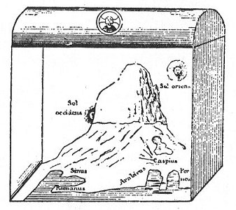

  
[Intangible Textual Heritage](../../index)  [Earth Mysteries](../index) 

------------------------------------------------------------------------

<table width="75%">
<colgroup>
<col style="width: 50%" />
<col style="width: 50%" />
</colgroup>
<tbody>
<tr class="odd">
<td width="50%" data-valign="CENTER"> 
</td>
<td width="50%" data-valign="CENTER"><h1 id="christian-topography" data-align="CENTER">Christian Topography</h1>
<h2 id="by-cosmas-indiopleustes" data-align="CENTER">by Cosmas Indiopleustes</h2>
<h5 id="translated-by-j.-w.-mccrindle" data-align="CENTER">translated by J. W. McCrindle</h5>
<h4 id="section" data-align="CENTER">[1897]</h4></td>
</tr>
</tbody>
</table>

------------------------------------------------------------------------

Christian Topography, written in the 6th century C.E., is a classic flat
earth text. Cosmas believed that the Earth was rectangular and that the
sky was shaped like a horizontal half-cylinder resting on a box. It
looks a bit like an old pirate chest. Cosmas believed that it the
Tabernacle constructed by Moses was based on the form of the universe.
There is a huge mountain that the sun goes behind when it is night.
Cosmas uses scriptural arguments to justify his flat-earth cosmology.
The text also contains geographical information that Cosmas collected
during his far-ranging travels, which took him all the way to India.

This etext is derived from the version at the [Additional Early Church
Fathers at the Tertullian Project
website](https://www.tertullian.org/fathers/index), which I highly
recommend. I have converted all of the Greek text (which was encoded in
a special Greek font) to Unicode. (For information on viewing Unicode in
your browser, see [The Unicode File](../../unicode).

------------------------------------------------------------------------

[Preface to the online edition](ct00)  
[Title page, contents, editor's preface](ct01)  
[Introduction](ct02)  
[Prologues, Book 1](ct03)  
[Book 2](ct04)  
[Book 3](ct05)  
[Book 4](ct06)  
[Book 5](ct07)  
[Book 6](ct08)  
[Book 7](ct09)  
[Book 8](ct10)  
[Book 9](ct11)  
[Book 10](ct12)  
[Book 11](ct13)  
[Book 12](ct14)  
[Plates](ct15)  
[Explanation of the plates](ct16)  
[Index](ct17)  
[Appendix Plates](ct18)  
