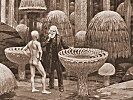

  
[Intangible Textual Heritage](../../index)  [Earth Mysteries](../index) 
[Index](index)  [Previous](eti06)  [Next](eti08) 

------------------------------------------------------------------------

[Buy this Book at
Amazon.com](https://www.amazon.com/exec/obidos/ASIN/1892062186/internetsacredte)

------------------------------------------------------------------------

  
*Etidorhpa*, by John Uri Lloyd, \[1897\], at Intangible Textual Heritage

------------------------------------------------------------------------

p. 1

### PROLOGUE.

My name was Johannes Llewellyn Llongollyn Drury. I was named Llewellyn
at my mother's desire, out of respect to her father, Dr. Evan Llewellyn,
the scientist and speculative philosopher, well known to curious
students as the author of various rare works on occult subjects. The
other given names were ancestral also, but when I reached the age of
appreciation, they naturally became distasteful; so it is that in early
youth I dropped the first and third of these cumbersome words, and
retained only the second Christian name. While perhaps the reader of
these lines may regard this cognomen with less favor than either of the,
others, still I liked it, as it was the favorite of my mother, who
always used the name in full; the world, however, contracted Llewellyn
to Lew, much to the distress of my dear mother, who felt aggrieved at
the liberty. After her death I decided to move to a western city, and
also determined, out of respect to her memory, to select from and
rearrange the letters of my several names, and construct therefrom three
short, terse words, which would convey to myself only, the resemblance
of my former name. Hence it is that the Cincinnati Directory does not
record my self-selected name, which I have no reason to bring before the
public. To the reader my name is Llewellyn Drury. I might add that my
ancestors were among the early settlers of what is now New York City,
and were direct descendants of the early Welsh kings but these matters
do not concern the reader, and it is not of them that I now choose to
write. My object in putting down these preliminary paragraphs is simply
to assure the reader of such facts, and such only, as may give him
confidence in my personal sincerity and responsibility, in order that he
may with a right understanding read the remarkable statements that occur
in the succeeding chapters.

The story I am about to relate is very direct, and some parts of it are
very strange, not to say marvelous; but not on account

p. 2

of its strangeness alone do I ask for the narrative a reading;—that were
mere trifling. What is here set down happened as recorded, but I shall
not attempt to explain things which even to myself are enigmatical. Let
the candid reader read the story as I have told it, and make out of it
what he can, or let him pass the page by unread—I shall not insist on
claiming his further attention. Only, if he does read, I beg him to read
with an open mind, without prejudice and without predilection.

Who or what I am as a participant in this work is of small importance. I
mention my history only for the sake of frankness and fairness. I have
nothing to gain by issuing the volume. Neither do I court praise nor
shun censure. My purpose is to tell the truth.

Early in the fifties I took up my residence in the Queen City, and
though a very young man, found the employment ready that a friend had
obtained for me with a manufacturing firm engaged in a large and
complicated business. My duties were varied and peculiar, of such a
nature as to tax body and mind to the utmost, and for several years I
served in the most exacting of business details. Besides the labor which
my vocation entailed, with its manifold and multiform perplexities, I
voluntarily imposed upon myself other tasks, which I pursued in the
privacy of my own bachelor apartments. An inherited love for books on
abstruse and occult subjects, probably in part the result of my blood
connection with Dr. Evan Llewellyn, caused me to collect a unique
library, largely on mystical subjects, in which I took the keenest
delight. My business and my professional duties by day, and my studies
at night, made my life a busy one.

In the midst of my work and reading I encountered the character whose
strange story forms the essential part of the following narrative. I may
anticipate by saying that the manuscript to follow only incidentally
concerns myself, and that if possible I would relinquish all connection
therewith. It recites the physical, mental, and moral adventures of one
whose life history was abruptly thrust upon my attention, and as
abruptly interrupted. The vicissitudes of his body and soul,
circumstances seemed to compel me to learn and to make public.

------------------------------------------------------------------------

[Next: Chapter I. “Never Less Alone Than When Alone.”](eti08)
