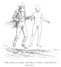

  
[Intangible Textual Heritage](../../index)  [Earth Mysteries](../index) 
[Index](index)  [Previous](eti40)  [Next](eti42) 

------------------------------------------------------------------------

[Buy this Book at
Amazon.com](https://www.amazon.com/exec/obidos/ASIN/1892062186/internetsacredte)

------------------------------------------------------------------------

  
*Etidorhpa*, by John Uri Lloyd, \[1897\], at Intangible Textual Heritage

------------------------------------------------------------------------

p. 226

### CHAPTER XXXIV.

#### I CEASE TO BREATHE, AND YET LIVE.

During this conversation we had been rapidly walking, or I should better
say advancing, for we no longer walked as men do, but skipped down into
the earth, down, ever downward. There were long periods of silence, in
which I was engaged in meditating over the problems that successively
demanded solution, and even had I desired to do so I could have kept no
record of time; days, or even weeks, may have been consumed in this
journey. Neither have I any method of judging of the rapidity of our
motion. I was sensible of a marked decrease in the amount of muscular
energy required to carry us onward, and I realized that my body was
quite exempt from weariness. Motion became restful instead of
exhausting, and it seemed to me that the ratio of the loss of weight, as
shown by our free movements, in proportion to the distance we traversed,
was greater than formerly. The slightest exhibition of propelling force
cast us rapidly forward. Instead of the laborious, short step of upper
earth, a single leap would carry us many yards. A slight spring, and
with our bodies in space, we would skip several rods, alighting gently,
to move again as easily. I marveled, for, although I had been led to
anticipate something unusual, the practical evidence was wonderfully
impressive, and I again questioned my guide.

"We are now nearing what physicists would call the center of gravity,"
he replied, "and our weight is rapidly diminishing. This is in exact
accordance with the laws that govern the force called gravitation,
which, at the earth's surface, is apparently uniform, though no
instrument known to man can demonstrate its exact variation within the
field man occupies. Men have not, as yet, been in a position to estimate
this change, although it is known that mountains attract objects, and
that a change in weight as we descend into the earth is perceptible; but
to evolve

p. 227

the true law, observation, at a distance of at least ten miles beneath
the surface of the ocean is necessary, and man, being a creature whose
motions are

<table data-align="RIGHT">
<colgroup>
<col style="width: 100%" />
</colgroup>
<tbody>
<tr class="odd">
<td data-valign="CENTER"><a href="img/22700.jpg"> 
Click to enlarge</a> 
“WE WOULD SKIP SEVERAL RODS, 
ALIGHTING GENTLY.” 
</td>
</tr>
</tbody>
</table>

confined to a thin, horizontal skin of earth, has never been one mile
beneath its surface, and in consequence his opportunities for comparison
are extremely limited."

"I have been taught," I replied, "that the force of gravitation
decreases until the center of the earth is reached, at which point a
body is without weight; and I can scarcely understand how such positive
statements from scientific men can be far from the truth."

"It is supposed by your surface men that the maximum of weight is to be
found at one-sixth the distance beneath the surface of the earth, and
therefrom decreases until at the center it is nothing at all," he
replied. "This hypothesis, though, a stagger toward the right, is far
from the truth, but as near as could be expected, when we consider the
data upon which men base their calculations. Were it not for the purpose
of controverting erroneous views, men would have little incentive to
continue their investigations, and as has been the rule in science
heretofore, the truth will, in time, appear in this case. One generation
of students disproves the accepted theories of that which precedes, all
working to eliminate error, all adding factors of error, and all
together moving toward a common goal, a grand generalization, that as
yet can not be perceived. And still each series of workers is
overlooking phenomena that, though obvious, are yet unperceived, but
which will make evident to future

p. 228

scientists the mistakes of the present. As an example of the manner in
which facts are thus overlooked, in your journey you have been impressed
with certain surprising external conditions, or surroundings, and yet
are oblivious to conditions more remarkable in your own body. So it is
with scientists. They overlook prominent facts that stare them boldly in
the face, facts that are so conspicuous as to be invisible by reason of
their very nearness."

"This statement I can not disprove, and therefore must admit under
protest. Where there is so much that appears mysterious I may have
overlooked some things, but I can scarcely accept that, in ignorance, I
have passed conditions in my own organization so marked as this decrease
in gravity which has so strikingly been called to my attention."

"You have, and to convince you I need only say that you have nearly
ceased to breathe, and are unconscious of the fact."

I stopped short, in momentary alarm, and now that my mind was directed
to the fact, I became aware that I did not desire to breathe, and that
my chest had ceased to heave with the alternate inhalation and
exhalation of former times. I closed my lips firmly, and for a long
period there was no desire for breath, then a slight involuntary
inhalation followed, and an exhalation, scarcely noticeable, succeeded
by a great interval of inaction. I impulsively turned my face toward the
passage we had trod; a feeling of alarm possessed me, an uncontrollable,
inexpressible desire to flee from the mysterious earth-being beside me,
to return to men, and be an earth-surface man again, and I started
backward through the chamber we had passed.

The guide seized me by the hand, "Hold, hold," he cried; "where would
you go, fickle mortal?"

"To the surface," I shouted; "to daylight again. Unhand me, unearthly
creature, abnormal being, man or devil; have you not inveigled me far
enough into occult realms that should be forever sealed from mankind?
Have you not taken from me all that men love or cherish, and undone
every tie of kith or kin? Have you not led me into paths that the
imagination of the novelist dare not conjure, and into experiences that
pen in human hand would not venture to describe as possible, until I now
stand with my feet on the boundary line that borders

p. 229

vacancy, and utter loss of weight; with a body nearly lost as a material
substance, verging into nothing, and lastly with breath practically
extinguished, I say, and repeat, is it not time that I should hesitate
and pause in my reckless career?"

"It is not time," he answered.

"When will that hour come?" I asked in desperation, and I trembled as he
replied:

"When the three Great Lights are closed."

  [  
Click to enlarge](img/22900.jpg)  
“AN UNCONTROLLABLE, INEXPRESSIBLE DESIRE TO FLEE.”  

------------------------------------------------------------------------

[Next: Chapter XXXV. “A Certain Point Within A Sphere.”—Men Are As
Parasites On the Roof of Earth.](eti42)
