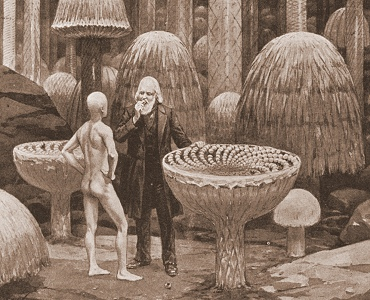

  
[Intangible Textual Heritage](../../index)  [Earth Mysteries](../index) 

------------------------------------------------------------------------

[Buy this Book at
Amazon.com](https://www.amazon.com/exec/obidos/ASIN/1892062186/internetsacredte)

------------------------------------------------------------------------

<table width="75%">
<colgroup>
<col style="width: 50%" />
<col style="width: 50%" />
</colgroup>
<tbody>
<tr class="odd">
<td width="50%" data-valign="TOP"></td>
<td width="50%" data-valign="CENTER"><h1 id="etidorhpa" data-align="CENTER">ETIDORHPA</h1>
<h2 id="by-john-uri-lloyd" data-align="CENTER">by John Uri Lloyd</h2>
<h4 id="section" data-align="CENTER">[1897]</h4></td>
</tr>
</tbody>
</table>

------------------------------------------------------------------------

[Contents](#contents)    [Start Reading](eti00)    [Page
Index](pageidx)    [Text (Zipped)](etitxt.zip)

------------------------------------------------------------------------

|                                                                                                                           |
|---------------------------------------------------------------------------------------------------------------------------|
|  |

Take a Victorian scifi premise, say, a trip to the center of the earth,
and by the way, it's hollow. Add a tale of a soul condemned by the
Illuminati to a perilous underground quest to find the Goddess of Love
(spoiler alert: spell Aphrodite backwards). Top it off with a wild magic
mushroom trip. That's Etidorhpa!

This may be the very source of the 'adepts living in hollow earth who
abduct humans' meme, later developed by [Ray
Palmer](../../ufo/irl/index), and many others. The book is larded with
long passages of speculative science. The structure of the hollow earth
and the effects of gravitation at various places is much better worked
out than some of the 'nonfiction' hollow earth books (e.g.
[Reed](../potp/index) or [Gardner](../jei/index)).

The journey of 'I-am-the-man' is a not-so-subtle allegory of spiritual
progression to being a disembodied adept. Along the way he loses his
youth, loses sunlight, becomes weightless, stops breathing, can hear
without ears, then his heart stops, ... and still he lives. Each of this
steps is symbolic of a progression to a more ethereal plane of
existence.

At times, the narrative recursion is three levels deep. This is an
acquired taste. L. Sprague de Camp called Etidorpha 'unreadable.' Modern
readers accustomed to consuming multiple narrative streams at the same
time (i.e. channel hopping), with long recursive breaks (i.e.
commercials) might do better.

Except for the titular Etidorhpa, there are no female characters. And
she only appears briefly in a hallucination. Why such a small part in
the book? Other genre novels, such as [Atlantida](../../atl/ant/index)
and [The Lost Continent](../../atl/tlc/index), are driven by strong
female characters. And once the main character is inside the hollow
earth, it just halts. He doesn't even get to meet Etidorhpa again.
Whether the author ran out of steam, or the ending was only supposed to
be implied, is unknown.

--J.B. Hare, Dec. 2, 2007.

------------------------------------------------------------------------

 [Title Page](eti00)  
[Ascription](eti01)  
[Preface](eti02)  
[Preface to This Edition](eti03)  
[A Valuable and Unique Library](eti04)  
[Contents](eti05)  
[Illustrations](eti06)  
[Prologue](eti07)  
[Chapter I. “Never Less Alone Than When Alone.”](eti08)  
[Chapter II. A Friendly Conference](eti09)  
[Chapter III. A Second Interview With the Mysterious Visitor](eti10)  
[Chapter IV. A Search For Knowledge.—The Alchemistic Letter](eti11)  
[Chapter V. The Writing of My Confession](eti12)  
[Chapter VI. Kidnapped](eti13)  
[Chapter VIII. A Wild Night.—I Am Prematurely Aged](eti14)  
[Chapter VIII. A Lesson In Mind Study](eti15)  
[Chapter IX. I Can Not Establish My Identity](eti16)  
[Chapter X. My Journey Towards the End of Earth Begins.—The Adepts’
Brotherhood](eti17)  
[Chapter XI. My Journey Continues.—Instinct](eti18)  
[Chapter XII. A Cavern Discovered.—Biswell's Hill](eti19)  
[Chapter XIII. The Punch-Bowls and Caverns of Kentucky.—“Into the
Unknown Country.”](eti20)  
[Chapter XIV. Farewell To God's Sunshine.—The Echo of the Cry](eti21)  
[Chapter XV. A Zone of Light Deep Within the Earth](eti22)  
[Chapter XVI. Vitalized Darkness.—The Narrows In Science](eti23)  
[Chapter XVII. The Fungus Forest.—Enchantment](eti24)  
[Chapter XVIII. The Food of Man](eti25)  
[Chapter XIX. The Cry From a Distance.—I Rebel Against Continuing the
Journey](eti26)  
[Chapter XX. My Unbidden Guest Proves His Statement and Refutes My
Philosophy](eti27)  
[Chapter XXI. My Weight Disappearing](eti28)  
[Chapter XXII. My Unbidden Guest Departs](eti29)  
[Chapter XXIII. I Question Scientific Men.—Aristotle's Ether](eti30)  
[Chapter XXIV. The Soliloquy of Prof. Daniel Vaughn on
Gravitation](eti31)  
[Chapter XXV. The Mother of a Volcano.—“You Can Not Disprove, and You
Dare Not Admit.”](eti32)  
[Chapter XXVI. Motion From Inherent Energy.—“Lead Me Deeper Into This
Expanding Study.”](eti33)  
[Chapter XXVII. Sleep, Dreams, Nightmare.—“Strangle the Life From My
Body.”](eti34)  
[Chapter XXVIII. A Challenge.—My Unbidden Guest Accepts It](eti35)  
[Chapter XXIX. Beware of Biology, the Science of the Life of
Man](eti36)  
[Chapter XXX. Looking Backward.—The Living Brain](eti37)  
[Chapter XXXI. A Lesson On Volcanoes.—Primary Colors Are Capable of
Farther Subdivision](eti38)  
[Chapter XXXII. Matter Is Retarded Motion](eti39)  
[Chapter XXXIII. “A Study of Science Is a Study of God.”—Communing With
Angels](eti40)  
[Chapter XXXIV. I Cease to Breathe, and Yet Live](eti41)  
[Chapter XXXV. “A Certain Point Within A Sphere.”—Men Are As Parasites
On the Roof of Earth.](eti42)  
[Chapter XXXVI. Drunkenness.—The Drinks of Man](eti43)  
[Chapter XXXVII. The Drunkard's Voice](eti44)  
[Chapter XXXVIII. The Drunkards’ Den](eti45)  
[Chapter XXXIX. Among the Drunkards](eti46)  
[Chapter XL. Further Temptation.—Etidorhpa](eti47)  
[Chapter XLI. Misery](eti48)  
[Chapter XLII. Eternity Without Time](eti49)  
[Chapter XLIII. The Last Contest](eti50)  
[Chapter XLIV. The Fathomless Abyss.—The Edge of the Earth
Shell](eti51)  
[Chapter XLV. My Heart Throb Is Stilled, and Yet I Live](eti52)  
[Chapter XLVI. The Inner Circle, or the End of Gravitation.—In the
Bottomless Gulf](eti53)  
[Chapter XLVII. Hearing Without Ears.—“What Will Be The End?”](eti54)  
[Chapter XLVIII. Why and How.—“The Struggling Ray of Light From Those
Farthermost Outreaches.”](eti55)  
[Chapter XLIX. Oscillating Through Space.—Earth's Shell Above
Me](eti56)  
[Chapter L. My Weight Annihilated.—“Tell Me,” I Cried In Alarm, “Is This
To Be a Living Tomb?”](eti57)  
[Chapter LI. Is That a Mortal?—“The End of Earth.”](eti58)  
[Chapter LII. The Last Farewell](eti59)  
[Epilogue. Letter Accompanying the Mysterious Manuscript](eti60)  
[The Life of Prof. Daniel Vaughn](eti61)  
[To the Recipients of the Author's Edition of Etidorhpa](eti62)  
[Reviews of Etidorhpa](eti63)  
