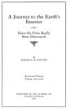
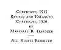

  
[Intangible Textual Heritage](../../index)  [Earth Mysteries](../index) 
[Index](index)  [Next](jei01) 

------------------------------------------------------------------------

p. 1

# A Journey to the Earth's Interior

###### --OR--

### Have the Poles Really Been Discovered

 

###### *By*

##### MARSHALL B. GARDNER

*Revised and Enlarged*  
*Profusely Illustrated*

#### PUBLISHED BY THE AUTHOR AT AURORA, ILLINOIS 1920

Scanned at Intangible Textual Heritage, June 2005. Proofed and formatted
by John Bruno Hare. This text is in the public domain in the United
States because it was published prior to 1923. These files may be used
for any non-commercial purpose provided this notice of attribution is
left intact in all copies.

[  
Click to enlarge](img/title.jpg)  
Title Page  

p. 2

COPYRIGHT, 1913

REVISED AND ENLARGED  
COPYRIGHT, 1920

BY

MARSHALL B. GARDNER

\_\_\_\_\_\_\_\_\_\_\_\_

ALL RIGHTS RESERVED

[  
Click to enlarge](img/verso.jpg)  
Verso  

p. 3

|                                                                                               |
|-----------------------------------------------------------------------------------------------|
| DEDICATED TO THE CONTINUED PROGRESS OF SCIENCE AND THE SERVICE THAT IT CAN RENDER TO HUMANITY |

 

p. 4

p. 5

p. 6

[  
Click to enlarge](img/00600.jpg)  
AUTHOR OF THE THEORY OF A CENTRAL SUN WITHIN  
THE EARTH'S INTERIOR  

 

------------------------------------------------------------------------

[Next: Contents](jei01)
