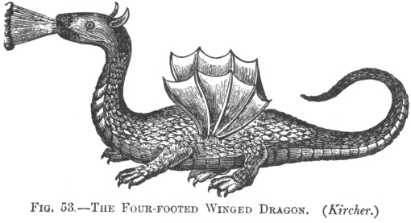

  
[Intangible Textual Heritage](../../index)  [Earth Mysteries](../index) 
[Legendary Creatures](../../lcr/index) 

------------------------------------------------------------------------

[Buy this Book at
Amazon.com](https://www.amazon.com/exec/obidos/ASIN/1851709444/internetsacredte)

------------------------------------------------------------------------

<table width="75%">
<colgroup>
<col style="width: 50%" />
<col style="width: 50%" />
</colgroup>
<tbody>
<tr class="odd">
<td width="50%" data-valign="TOP"> 
Public Domain Image</td>
<td width="50%" data-valign="CENTER"><h1 id="mythical-monsters" data-align="CENTER">Mythical Monsters</h1>
<h2 id="by-charles-gould" data-align="CENTER">by Charles Gould</h2>
<h4 id="section" data-align="CENTER">[1886]</h4></td>
</tr>
</tbody>
</table>

------------------------------------------------------------------------

[Contents](#contents)    [Start Reading](mm00)    [Page
Index](pageidx)    [Text \[Zipped\]](mmtxt.zip)

------------------------------------------------------------------------

|                                                                                                                           |
|---------------------------------------------------------------------------------------------------------------------------|
|  |

Charles Gould, the son of the ornithologist John Gould, wrote this book
in the 19th century on the subject now called 'cryptozoology,' the study
of (possibly imaginary) animals only known through anecdotal or folklore
evidence.

The core of the book is about dragons: Western, Chinese, and Japanese,
although it also covers the Sea-serpent, the Unicorn, and the Chinese
Phoenix. Gould hypothesized that the dragon was based on an unknown,
very rare animal, a huge reptile with wings, which became extinct in
historical times. He also concluded that persistent sea-serpent
sightings were also due to an undiscovered surviving prehistoric marine
animal. He drew on the then-emerging body of fossil evidence for
prehistoric megafauna, from flying lizards to whale-sized aquatic
dinosaurs.

In context the proposal was not all that outrageous.
[Darwin](../../aor/darwin/index) had 25 years earlier proposed that
humans are part of a huge web of biological relationships over vast
realms of time and space. So what other paradigms were about to be
shattered?

Gould leads off with a discussion of some other 'earth mysteries:' the
world-wide flood myth, cultural diffusion, and Atlantis; readers looking
for the cryptozoology will want to skip forward to [Chapter VI](mm09).
Extensive illustrations, translations from rare documents, and
historical accounts from newspaper articles, make this a must-have book
for anyone interested in this subject.

------------------------------------------------------------------------

 [Title Page](mm00)  
[Preface](mm01)  
[Contents](mm02)  
[Introduction](mm03)  
[Chapter I. On Some Remarkable Animal Forms](mm04)  
[Chapter II. Extinction of Species](mm05)  
[Chapter III. Antiquity of Man](mm06)  
[Chapter IV. The Deluge Not A Myth](mm07)  
[Chapter V. On the Translation of Myths Between the Old and the New
World](mm08)  
[Chapter VI. The Dragon](mm09)  
[Chapter VII. The Chinese Dragon](mm10)  
[Chapter VIII. The Japanese Dragon](mm11)  
[Chapter IX. The Sea-Serpent](mm12)  
[Chapter X. The Unicorn](mm13)  
[Chapter XI. The Chinese Phœnix](mm14)  

### Appendices

[Appendix I. The Deluge Tradition According To Berosus](mm15)  
[Appendix II. The Dragon](mm16)  
[Appendix III. Original Preface To “Wonders by Land and Sea”](mm17)  
[Appendix IV. A Memorial Presented by Liu Hsiu, by Order of His Imperial
Majesty The Emperor, on the “Book of Wonders by Land and Sea.”](mm18)  
[Appendix V. After Preface to the “Book of Wonders by Land and
Sea.”](mm19)  
[Appendix VI. Extracts From “Social Life of the Chinese”](mm20)  
[Appendix VII. Extracts From the “Pan Tsaou Kang Mu.”](mm21)  
[Appendix VIII. Extract From the “Yuen Keen Lei Han.”](mm22)  
[Appendix IX. Appendix to the Chapter on the Sea-Serpent](mm23)  
