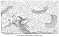
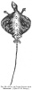
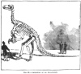
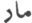

  
[Intangible Textual Heritage](../../index)  [Earth Mysteries](../index) 
[Index](index)  [Previous](mm08)  [Next](mm10) 

------------------------------------------------------------------------

[Buy this Book at
Amazon.com](https://www.amazon.com/exec/obidos/ASIN/1851709444/internetsacredte)

------------------------------------------------------------------------

*Mythical Monsters*, by Charles Gould, \[1886\], at Intangible Textual
Heritage

------------------------------------------------------------------------

p. 158

[  
Click to enlarge](img/fig32.jpg)  
FIG. 32.—MURAL TABLET, TEMPLE OF LONGEVITY, CANTON.  

p. 159

 

### CHAPTER VI.

#### THE DRAGON.

<table data-align="LEFT">
<colgroup>
<col style="width: 100%" />
</colgroup>
<tbody>
<tr class="odd">
<td data-valign="CENTER"><a href="img/fig33.jpg"> 
Click to enlarge</a> 
FIG. 33.—<em>Draco</em>, 
OR FLYING LIZARD FROM SINGAPORE. 
(<em>After N. B. Dennys</em>.) 
</td>
</tr>
</tbody>
</table>

THE dragon is defined in the *Encyclopædia Britannica* for 1877 as "the
name given by the ancients to a huge winged lizard or serpent
(fabulous)."

The text also goes on to state that "they (the ancients) regarded it as
the enemy of mankind, and its overthrow is made to figure among the
greatest exploits of the gods and heroes of heathen mythology. A dragon
watched the gardens of the Hesperides, and its destruction formed one of
the seven labours of Hercules. Its existence does not seem to have been
called in question by the older naturalists; figures of the dragon
appearing in the works of Gesner and Aldrovandus, and even specimens of
the monster, evidently formed artificially of portions of different
animals,

p. 160

have been exhibited." A reference is also made to the genus Draco,
comprising eighteen specimens of winged lizards, all small, and peculiar
to India and the islands of the Malay archipelago.

Such is the meagre account of a creature which figures in the history
and mythology of all nations, which in its different forms has been
worshipped as a god, endowed with beneficent and malevolent attributes,
combatted as a monster, or supposed to have possessed supernatural
power, exercised alternately for the benefit or chastisement of mankind.

Its existence is inseparably wedded to the history, from the most remote
antiquity, of a nation which possesses connected and authentic memoirs
stretching uninterruptedly from the present day far into the remote
past; on which the belief in its existence has been so strongly
impressed, that it retains its emblem in its insignia of office, in its
ornamentation of furniture, utensils, and dwellings, and commemorates it
annually in the competition of dragon boats, and the processions of
dragon images; which believes, or affects to believe, in its continued
existence in the pools of the deep, and the clouds of the sky; which
propitiates it with sacrifices and ceremonies, builds temples in its
honour, and cultivates its worship; whose legends and traditions teem
with anecdotes of its interposition in the affairs of man, and whose
scientific works, of antiquity rivalling that of our oldest Western
Classics, treat of its existence as a sober and accepted fact, and
differentiate its species with some exactness. It is, moreover, though
not very frequently, occasionally referred to in the Biblical history of
that other ancient, and almost equally conservative branch of the human
race, the Jews, not as a myth, or doubtfully existent supernatural
monster, but as a tangible reality, an exact terrible creature.

Equally do we find it noticed in those other valuable records of the
past which throw cross lights upon the Bible narrative, and confirm by
collateral facts the value of its

p. 161

[  
Click to enlarge](img/fig34.jpg)  
FIG. 34.—BRONZE DRAGONS SUPPORTING THE ARMILLARY SPHERE, OBSERVATORY,
PEKIN.  

p. 162

historic truth; such as the fragments of Chaldæan history handed down by
the reverent care of later historians, the careful narrative of
Josephus, and the grand resurrection of Chaldæan and Assyrian lore
effected by the marvellously well directed and fortunate labour of G. H.
Smith and those who follow in his train.

Among the earliest classics of Europe, its existence is asserted as a
scientific fact, and accepted by poets as a sound basis for analogies,
comparisons, allegories, and fable; it appears in the mythology of the
Goth, and is continued through the tradition and fable of every country
of Europe; nor does it fail to appear even in the imperfect traditions
of the New World, [\*](#fn_138) where its
presence may be considered as comparatively indigenous, and Undetermined
by the communications dependent on the so-called discovery of later
days.

Turning to other popular accounts, we find equally limited and
incredible versions of it. All consider it sufficiently disposed of by
calling it fabulous, [†](#fn_139) and that a
sufficient explanation of any possible belief in it is afforded by a
reference [‡](#fn_140) to the harmless genus of
existing flying lizards referred to above.

p. 163

Some consider it an evolution of the fancy, typifying noxious
principles; thus, Chambers [\*](#fn_141) says,
"The dragon appears in the mythical history and legendary poetry of
almost every nation as the emblem of the destructive and anarchical
principle; . . . as misdirected physical force and untamable animal
passions. . . . The dragon proceeds openly to work, running on its feet
with expanded wings, and head and tail erect, violently and ruthlessly
outraging decency and propriety, spouting fire and fury both from mouth
and tail, and wasting and devastating the whole land."

The point which strikes me as most interesting in this passage is the
reference to the legendary theory of the mode of the dragon's progress,
which curiously calls to mind the semi-erect attitude of the existing
small Australian frilled lizard (*Chlamydosaurus*). This attitude is
also ascribed to some of the extinct American Dinosaurs, such as the
Stegosaurus.

No one, so far as I am aware, in late days has hitherto ventured to
uphold the claims of this terrible monster to be accepted as a real
contemporary of primitive man, [†](#fn_142)
which

p. 164

may even have been co-existent with him to a comparatively recent date,
and but lately passed away into the cohort of extinct species, leaving
behind it only the traditions of its ferocity and terrors, to stamp
their impression on the tongues of all countries.

No one has endeavoured to collate the vast bulk of materials shrouded in
the stories of all lands. If this were perfectly effected, a diagnosis
of the real nature of the dragon might perhaps be made, and the chapter
of its characteristics, alliances, and habits completed like that of any
other well-established species.

The following sketch purposes only to initiate the task here propounded,
the author's access to materials being limited, and only sufficient to
enable him, as he thinks, to establish generally the proposition which
it involves, to grasp as it were some of the broader and salient
features of the investigation, while leaving a rich gleaning of
corroborative information for the hand of any other who may please to
continue and extend his observations.

At the outset it will be necessary to assign a much more extended
signification to the word dragon than that which is contained in the
definition at the head of this chapter. The popular mind of the present
day doubtless associates it always with the idea of a creature
possessing wings; but the *Lung* of the Chinese, the δράκων of the
Greeks, the

p. 165

\[paragraph continues\] *Draco* of the
Romans, the Egyptian dragon, and the *Nâga* of the Sanscrit have no such
limited signification, and appear to have been sometimes applied to any
serpent, lacertian, or saurian, of extraordinary dimensions, nor is it
always easy to determine from the passages in which these several terms
occur what kind of monster is specially indicated.

Thus the dragon referred to by Propertius in the quotation annexed may
have been a large python. "Lanuvium [\*](#fn_143) is, of old, protected by an aged
dragon; here, where the occasion of an amusement so seldom occurring is
not lost, where is the abrupt descent into a dark and hollowed cave;
where is let down—maiden, beware of every such journey—the honorary
tribute to the fasting snake, when he demands his yearly food, and
hisses and twists deep down in the earth. Maidens, let down for such a
rite, grow pale, when their hand is unprotectedly trusted in the snake's
mouth. He snatches at the delicacies if offered by a maid; the very
baskets tremble in the virgin's hands; if they are chaste, they return
and fall on the necks of their parents, and the farmers cry 'We shall
have a fruitful year.'" [†](#fn_144)

To the same class may probably be ascribed the dragon referred to by
Aristotle. [‡](#fn_145) "The eagle and the
dragon are enemies, for the eagle feeds on serpents"; and again, [§](#fn_146) "the Glanis in shallow water is often
destroyed by the dragon serpent." It might perhaps be supposed that the
crocodile is here referred to, but this is specially spoken of in
another passage, as follows [\*\*](#fn_147):
"But there are others which, though they live and feed in the water, do
not take in water but air, and produce their young out of the water;
many of these

p. 166

animals are furnished with feet, as the otter and crocodile, and others
are without feet, as the water-serpent."

A somewhat inexplicable habit is ascribed to the dragon in Book
ix. [\*](#fn_148): "When the draco has eaten
much fruit, it seeks the juice of the bitter lettuce; it has been seen
to do this."

Pliny, probably quoting Aristotle, [†](#fn_149)
also states that the dragon relieves the nausea which affects it in
spring with the juices of the lettuce; and Ælian [‡](#fn_150) repeats the story.

It is also probable that some large serpent is intended by Pliny in the
story which he relates, [§](#fn_151) after
Democritus, that a man called Thoas was preserved in Arcadia by a
dragon. When a boy, he had become attached to it and had reared it very
tenderly; but his father, being alarmed at the nature and monstrous size
of the reptile, had taken and left it in the desert. Thoas being here
attacked by robbers who lay in ambush, he was delivered from them by the
dragon, which recognized his voice and came to his assistance. It may be
noted in regard to this that there are many authenticated instances of
snakes evidencing considerable affection for those who have treated them
with kindness. [\*\*](#fn_152)

The impression that Pliny's dragon was intended to represent

p. 167

some large boa or python is strengthened by his statement: [\*](#fn_153) "The dragon is a serpent destitute of
venom; its head placed beneath the threshold of a door, the gods being
duly propitiated by prayers, will ensure good fortune to the house, it
is said."

It is remarkable that he attributes to the dragon the same desire and
capacity to attack the elephant as is attributed to the Pa snake in
Western China, and by the old Arabian voyagers to serpents in Borneo.

The *Shan-hai-king*, a Chinese work of extreme antiquity, of which
special mention will be made hereafter, says: "The Pa snake swallows
elephants, after three years it ejects the bones; well-to-do people,
eating it, are cured of consumption."

Diodorus Siculus, in speaking of the region of the Nile in Libya, says
that, according to report, very large serpents are produced there and in
great numbers, and that these attack elephants when they gather around
the watering places, involve them in their folds till they fall
exhausted, and then devour them.

Diodorus, in another passage referring to the crocodiles and hippopotami
of Egypt, speaking of Ethiopia and Libya, mentions a variety of serpents
as well as of other wild beasts, including dragons of unusual size and
ferocity.

While El Edrisi says: "On peut encore citer le serpent de Zaledj dont
parlent Ben Khordadébe, l’auteur du Livre des Merveilles, et divers
autres écrivains qui s’accordent à dire qu’il existe dans les montagnes
de l’ile de Zaledj une espèce de serpent qui attaque l’elephant et le
buffle, et qui ne les abandonnent qu’après les avoir vaincu." [†](#fn_154)

p. 168

Artemidorus, also, according to Strabo, [\*](#fn_155) "mentions serpents of thirty cubits in
length, which can master elephants and bulls. In this he does not
exaggerate; but the Indian and African serpents are of a more fabulous
size, and are said to have grass growing on their backs."

Iphicrates, according to Bryant, "related that in Mauritania there were
dragons of such extent that grass grew upon their backs." [†](#fn_156)

It is doubtful whether large serpents, or real dragons, are referred to
by Pliny in the following interesting passages which I give at length:
the surprise which he expresses at Juba's believing that they had
crests, leads me to suspect that there was possibly some confusion of
species involved; that Juba might have been perfectly accurate so far as
the crests are concerned, and that the beasts in question, in place of
being pythons of magnitude, were rather some gigantic lizard-like
creature, of great length and little bulk, corresponding with the
Chinese idea of the dragon, and, therefore, naturally bearing horny
crests, similar to those with which the monster is usually represented
by the latter people.

It must be noticed here, that if we postulate the existence of the
dragon, we are not bound to limit ourselves to a single species, or even
two, as the same causes which effected the gradual destruction of one
would be exceedingly likely to effect that of another; we must not,
therefore, be too critical in comparing descriptions of different
authors in different

p. 169

countries and epochs, since they may refer only to allied, but not
identical, animals.

“Africa produces elephants, but it is India that produces the largest,
as well as the *dragon*, who is perpetually at war with the elephant,
and is itself of so enormous a size, as easily to envelop the elephants
with its folds, and encircle them in its coils. The contest is equally
fatal to both; the elephant, vanquished, falls to the earth, and by its
weight crushes the dragon which is entwined around it. [\*](#fn_157)

“The sagacity which every animal exhibits in its own behalf is
wonderful, but in these it is remarkably so. The dragon has much
difficulty in climbing up to so great a height, and therefore, watching
the road, which bears marks of their footsteps, when going to feed, it
darts down upon them from a lofty tree. The elephant knows that it is
quite unable to struggle against the folds of the serpent, and so seeks
for trees or rocks against which to rub itself.

“The dragon is on its guard against this, and tries to prevent it, by
first of all confining the legs of the elephant with the folds of its
tail; while the elephant, on the other hand, tries to disengage itself
with its trunk. The dragon, however, thrusts its head into its nostrils,
and thus, at the same moment, stops the breath, and wounds the most
tender parts. When it is met unexpectedly, the dragon raises itself up,
faces its opponent, and flies more especially at the eyes; this is the
reason why elephants are so often found blind, and worn to a skeleton
with hunger and misery.

“There is another story, too, told in relation to these combats. The
blood of the elephant, it is said, is remarkably cold; for which reason,
in the parching heats of summer, it is sought by the dragon with
remarkable avidity. It lies, therefore, coiled up and concealed in the
river, in wait for

p. 170

the elephants when they come to drink; upon which it darts out, fastens
itself around the trunk, and then fixes its teeth behind the ear, that
being the only place which the elephant cannot protect with the trunk.
The dragons, it is said, are of such vast size that they can swallow the
whole of the blood; consequently the elephant, being drained of its
blood, falls to the earth exhausted; while the dragon, intoxicated with
the draught, is crushed beneath it, and so shares its fate. [\*](#fn_158)

“Æthiopia produces dragons, not so large as those of India, but still
twenty cubits in length. The only thing that surprises me is, how Juba
came to believe that they have crests. The Æthiopians are known as the
Asachæi, among whom they most abound; and we are told that on those
coasts four or five of them are found twisted and interlaced together
like so many osiers in a hurdle, and thus setting sail, with their heads
erect, they are borne along upon the waves to find better sources of
nourishment in Arabia.” [†](#fn_159)

Pliny then goes on to describe, as *separate from dragons, large
serpents in India*, as follows.

“Megasthenes [‡](#fn_160) informs us that in
India serpents grow to such an immense size as to swallow stags and
bulls; while Metrodorus says that about the river Rhyndacus, in Pontus,
they seize and swallow the birds that are flying above them, however
high and however rapid their flight.

“It is a well-known fact that during the Punic war, at the river
Bagrada, a serpent one hundred and twenty feet in length was taken by
the Roman army under Regulus, being besieged, like a fortress, by means
of balistæ and other engines of war. *Its skin and jaws* were preserved
in a temple at Rome down to the time of the Numantine war.

“The serpents, which in Italy are known by the name of

p. 171

boa, render these accounts far from incredible, for they grow to such
vast size that a child was found entire in the stomach of one of them
which was killed on the Vaticanian Hill during the reign of Emperor
Claudius.” [\*](#fn_161)

Aristotle tells us that "in Libya, the serpents, as it has been already
remarked, are very large. For some persons say that as they sailed along
the coast, they saw the bones of many oxen, and that it was evident to
them that they had been devoured by serpents. And, as the ships passed
on, the serpents attacked the triremes, and some of them threw
themselves upon one of the triremes and overturned it." [†](#fn_162)

It is doubtful whether the dragons described by Benjamin of Tudela, who
travelled through Europe and the East and returned to Castille in
1173, [‡](#fn_163) as infesting the ruins of
the palace of Nebuchodonosor at Babylon, so as to render them
inaccessible, were creatures of the imagination such as the mediæval
mind seems to have loved to dress up, or venomous serpents. But there is
little doubt that the so-called dragons of later voyages were simply
boas, pythons, or other large serpents, such as those described by John
Leo, in his description

p. 172

of a voyage to Africa, as existing in the caverns of Atlas. He says,
"There are many monstrous dragons which are thick about the middle, but
have slender necks and tails, so that their motion is but slow. [\*](#fn_164) They are so venomous, that whatever
they bite or touch, certain death ensues." There is also the statement
of Job Ludolphus that (in Æthiopia) "the dragons are of the largest
size, very voracious, but not venomous." [†](#fn_165)

I fancy that at the present day the numbers, magnitude, and terrifying
nature of serpents but feebly represent the power which they asserted in
the early days of man's existence, or the terror which they then
inspired. This subject has been so ably dealt with by a writer of the
last century [‡](#fn_166) that I feel no
hesitation in transcribing his remarks at length.

“It is probable, in early times, when the arts were little known and
mankind were but thinly scattered over the earth, that serpents,
continuing undisturbed possessors of the forest, grew to an amazing
magnitude, and every other tribe of animals fell before them. It then
might have happened that the serpents reigned tyrants of the district
for centuries together. To animals of this kind, grown by time and
rapacity to one hundred or one hundred and fifty feet long, the lion,
the tiger, and even the elephant itself were but feeble opponents. That
horrible fetor, which even the commonest and the most harmless snakes
are still found to diffuse, might in these larger ones become too
powerful for any living being to withstand, and while they preyed
without distinction, they might also have poisoned the atmosphere round
them. In this manner, having for ages lived in the hidden and un-peopled
forest, and finding, as their appetites were more powerful, the quantity
of their prey decreasing, it is possible

p. 173

they might venture boldly from their retreats into the more cultivated
parts of the country, and carry consternation among mankind, as they had
before desolation among the lower ranks of nature.

“We have many histories of antiquity presenting us such a picture, and
exhibiting a whole nation sinking under the ravages of a single serpent.
At that time man had not learned the art of uniting the efforts of many
to effect one great purpose. Opposing multitudes only added new victims
to the general calamity, and increased mutual embarrassment and terror.
The animal, therefore, was to be singly opposed by him who had the
greatest strength, the best armour, and the most undaunted courage. In
such an encounter hundreds must have fallen, till one more lucky than
the rest, by a fortunate blow, or by taking the monster in its torpid
interval and surcharged with spoil, might kill and thus rid his country
of the destroyer. Such was the original occupation of heroes.

“But as we descend into more enlightened antiquity we find these animals
less formidable, as being attacked in a more successful manner.

“We are told that while Regulus led his army along the banks of the
river Bagrada in Africa, an enormous serpent disputed his passage over.
We are assured by Pliny that it was one hundred and twenty feet long,
and that it had destroyed many of the army. At last, however, the
battering engines were brought out against it, and then, assailing it at
a distance, it was destroyed. Its spoils were carried to Rome, and the
general was decreed an ovation for his success.

“There are, perhaps, few facts better ascertained in history than this:
an ovation was a remarkable honour, and was only given for some signal
exploit that did not deserve a triumph. No historian would offer to
invent that part of the story, at least, without being subject to the
most shameful detection.

p. 174

“The skin was kept for several years after, in the Capitol, and Pliny
says he saw it there.

“This tribe of animals, like that of fishes, seem to have no bounds put
to their growth; their bones are in a great measure cartilaginous, and
they are consequently capable of great extension.

“The older, therefore, a serpent becomes, the larger it grows, and, as
they live to a great age, they arrive at an enormous size. Leguat
assures us that he saw one in Java that was fifty feet long. [\*](#fn_167) Carli mentions their growing to above
forty feet, and there is now in the British Museum one that measures
thirty-two feet.

“Mr. Wentworth, who had large concerns in the Berbice in America,
assures us that in that country they grow to an enormous length. He
describes an Indian mistaking one for a log, and proceeding to sit down
on it, when it began to move. A soldier with him shot the snake, but the
Indian died of fright. It measured thirty-six feet. It was sent to the
Hague.

“A life of savage hostility in the forest offers the imagination one of
the most tremendous pictures in nature. In those burning countries where
the sun dries up every brook for hundreds of miles round: where what had
the appearance of a great river in the rainy season becomes in summer
one dreary bed of sand; in those countries a lake that is never dry, or
a brook that is perennial, is considered by every animal as the greatest
convenience of nature. When they have discovered this, no dangers can
deter them from attempting to slake their thirst. Thus the neighbourhood
of a rivulet, in the heart of the tropical continents, is generally

p. 175

the place where all the hostile tribes of nature draw up for the
engagement.

“On the banks of this little envied spot, thousands of animals of
various kinds are seen venturing to quench their thirst, or preparing to
seize their prey. The elephants are perceived in a long line, marching
from the darker parts of the forest. The buffaloes are there, depending
upon numbers for security; the gazelles relying solely upon their
swiftness; the lion and tiger waiting a proper opportunity to seize.

“But chiefly the larger serpents are upon guard there, and defend the
accesses of the lake. Not an hour passes without some dreadful combat,
but the serpent, defended by its scales, and naturally capable of
sustaining a multitude of wounds, is of all others the most formidable.
It is the most wakeful also, for the whole tribe sleep with their eyes
open, and are consequently for ever upon the watch; so that, till their
rapacity is satisfied, few other animals will venture to approach their
station.”

We read of a serpent exhibited in the time of Augustus at Rome, which,
Suetonius tells us, "was fifty cubits in length." [\*](#fn_168) But at the present day there are few
authentic accounts of snakes exceeding thirty feet in length; and there
are some people who discredit any which profess to speak of snakes of
greater dimensions than this. There are some, however, among the annexed
stories, which I think demand belief, and apparently we may conclude
that the python and boa exceptionally attain as much as forty feet in
length, or even more.

Wallace [†](#fn_169) merely reports by hearsay
that the pythons in the Phillipines, which destroy young cattle, are
said to reach more than forty feet.

Captain Sherard Osborn, [‡](#fn_170) in his
description of Quedah in

p. 176

the Malay peninsula, says, also, as a matter of popular belief: “The
natives of Tamelan declared most of them to be of the boa-constrictor
\[species, but spoke of monsters in the deep forests, which might, if
they came out, clear off the whole village. A pleasant feat, for which
Jadie, with a wag of his sagacious head, assured me that an 'oular
Bessar' or big snake was quite competent.

“It was strange but interesting to find amongst all Malays a strong
belief in the extraordinary size to which the boa-constrictors or
pythons would grow; they all maintained that in the secluded forests of
Sumatra or Borneo, as well as on some of the smaller islands which were
not inhabited, these snakes were occasionally found of forty or fifty
feet in length.”

Major McNair says [\*](#fn_171): "One of the
keenest sportsmen in Singapore gives an account of a monster that he
encountered. He had wounded a boar in the jungle, and was following its
tracks with his dogs, when, in penetrating further into the forest, he
found the dogs at bay, and, advancing cautiously, prepared for another
shot at the boar; to his surprise, however, he found that the dogs were
baying a huge python, which had seized the boar, thrown its coils round
the unfortunate beast, and was crushing it to death. A well-directed
shot laid the reptile writhing on the ground, and it proved to be about
thirty feet long. But such instances of extreme length are rare."

Unfortunately the exciting story of a serpent, between forty and fifty
feet in length, which I extract from the North China Daily News of
November 10th, 1880, the scene of which is also laid in the Malay
peninsula, lacks the authenticity of the narrator's name. It is as
follows:—

"The Straits Times tells the following exciting python story: ‘A
sportsman, who a few days ago penetrated into the

p. 177

jungle lying between Buddoh and Sirangoon, came upon a lone hut in a
district called Campong Batta, upon the roof of which the skin of an
enormous boa or python (whichever may be the correct name) was spread
out. The hut was occupied by a Malay and his wife, from whom our
informant gathered the following extraordinary account. One night, about
a week previously, the Malay was awakened by the cries of his wife for
assistance. Being in perfect darkness, and supposing the alarm to be on
account of thieves, he seized his sharp parang, and groped his way to
her sleeping place, where his hand fell upon a slimy reptile. It was
fully a minute before he could comprehend the entire situation, and when
he did, he discovered that the whole of his wife's arm had been drawn
down the monster's throat, whither the upper part of her body was slowly
but surely following. Not daring to attack the monster at once for fear
of causing his wife's death, the husband, with great presence of mind,
seized two bags within reach, and commenced stuffing them into the
corner of the snake's jaws, by means of which he succeeded in forcing
them wider open and releasing his wife's arm. No sooner had the boa lost
his prey than he attacked the husband, whom he began encircling in his
fatal coils; but holding out both arms, and watching his opportunity, he
attacked the monster so vigorously with his parang that it suddenly
unwound itself and vanished through an opening beneath the attap sides
of the hut. His clothes were covered with blood, as was also the floor
of the hut, and his wife's arm was blue with the squeezing it received
between the boa's jaws. At daylight the husband discovered his patch of
plaintain trees nearly ruined, where the boa, writhing in agony, had
broken off the trees at the roots, and in the midst of the debris lay
the monster itself, dead. The Malay assured our informant that he had
received no less than sixty dollars from Chinese, who came from long
distances to purchase pieces of the flesh on account of its supposed
medical

p. 178

properties, and that he had refused six dollars for the skin, which he
preferred to retain as a trophy. It was greatly decomposed, having been
some days exposed in the open air, and useless for curing. There is no
telling what may have been the measurement of this large reptile, but
the skin, probably greatly stretched by unskilful removal, measured
between seven and eight fathoms."

Bontius speaks of serpents in the Asiatic Isles. "The great ones," he
says, "sometimes exceed thirty-six feet; and have such capacity of
throat and stomach that they swallow whole boars."

Mr. McLeod, in the *Voyage of the Alceste*, states that during a
captivity of some months at Whidah, on the coast of Africa, he had
opportunities of observing serpents double this length. [\*](#fn_172)

Broderip, in his *Leaves from the Note-book of a Naturalist* (Parker,
1852), speaks of a serpent thirty feet in length, which attacked the
crew of a Malay proa anchored for the night close to the island of
Celebes.

Mr. C. Collingwood in Rambles of a Naturalist, states that "Mr. Low
assured me that he had seen one \[python\] killed measuring twenty-six
feet, and I heard on good authority of one of twenty-nine feet having
been killed there. In Borneo they were said to attain forty feet, but
for this I cannot vouch."

That large pythons still exist in South and Western China, although of
very reduced dimensions as compared with those described in ancient
works, is affirmed by many writers, from whom I think it is sufficient
to extract a notice by one of the early missionaries who explored that
country.

"Pour ce qui est des serpens qu’on trouve dans Chine l’Atlas raconte que
la Province de Quansi, en produit de si grands et d’une longueur si
extrême, qu’il est presque incroyable; et il nous assure, qu’il s’en est
trouvé, qui étaient plus

p. 179

longs que ne seraient pas dix perches attachées les unes avec les
autres, c’est-à-dire, qu’ils avaient plus de trente pieds géométriques.
Flore Sienois dit, 'Gento est le plus grand de tous ceux qui sont dans
les provinces de Quansi, de Haynan, et de Quantun . . . il dévore les
cerfs. . . . Il s’élève droit sur sa queue, et combat vigoureusement, en
cette posture, contre les hommes et les bêtes farouches.'" [\*](#fn_173)

We have unfortunately no clue to the actual length of the serpent Bomma,
described by J. M. da Sorrento in *A Voyage to Congo* in 1682, contained
in Churchill's collection of voyages published in 1732. [†](#fn_174) "The flesh they eat is generally that of
wild creatures, and especially of a sort of serpent called Bomma. At a
certain feast in Baia, I observed the windows, instead of tapestry and
arras, adorned with the skin of these serpents as wide as that of a
large ox, and long in proportion."

That harmless snakes of from twelve to fourteen feet in length occur
abundantly in Northern Australia is generally known; but it is only of
late years that I have been made acquainted with a firm belief,
entertained by the natives in the interior, of the existence near the
junction of the Darling and Murray, south of the centre of the
continent, of a serpent of great magnitude.

I learn from Mr. G. R. Moffat that on the Lower Murray, between Swan
Hill and the Darling junction—at the time of his acquaintance with the
district (about 1857 to 1867)—the black fellows had numerous stories of
the existence of a large serpent in the Mallee scrub. It was conspicuous
for its size, thirty to forty feet in length, and especially for its
great girth, swiftness, and intensely disgusting odour; this latter, in
fact, constituted the great protection from it, insomuch

p. 180

as it would be impossible to approach without recognising its presence.

Mr. Moffatt learnt personally from a Mr. Beveridge, son of Mr. Peter
Beveridge, of Swan Hill station, that he had actually seen one, and that
his account quite tallied with those of the blacks. In answer to an
inquiry which I addressed to Australia, I received the note attached
below. [\*](#fn_175)

Mr. Henry Liddell, who was resident on the Darling River in 1871-72,
informs me that he has heard from stock-riders and ration-carriers
similar accounts to that of Mr. Moffatt, with reference to the existence
of large serpents of the boa species in an adjacent locality, viz. the
tract of country lying to the east of Darling and Murray junction, in
the back country belonging to Pooncaira station.

They described them as being numerous, in barren and rocky places, among
big boulders; fully forty feet long; as thick as a man's thigh; and as
having the same remarkable odour described by Mr. Moffatt. They spoke of
them as quite common, and not at all phenomenal, between Wentworth and
Pooncaira.

The Anaconda, in regard to which so much myth and superstition prevails
among the Indians of Brazil, is thus spoken of by Condamine, in his
*Travels in South America*. "The most rare and singular of all is a
large amphibious serpent from twenty-five to thirty feet long and more
than a foot thick, according to report. It is called Jacumama, or 'the
mother of the waters,' by the Americans of Maynas,

p. 181

and commonly inhabits the large lakes formed by the river-water after
flood." [\*](#fn_176)

Ulloa, also, in his *Voyage to South America*, [†](#fn_177) says: In the countries watered by that
vast river (the Maranon) is bred a serpent of a frightful magnitude, and
of a most deleterious nature. Some, in order to give an idea of its
largeness, affirm that it will swallow any beast whole, and that this
has been the miserable end of many a man. But what seems still a greater
wonder is the attractive quality attributed to its breath, [‡](#fn_178) which irresistibly draws any creature to
it which happens to be within the sphere of its attraction. The Indians
call it Jacumama, *i.e.* 'mother of water'; for, as it delights in lakes
and marshy places, it may in some sense be considered as amphibious. I
have taken a great deal of pains to inquire into this particular, and
all I can say is that the reptile's magnitude is really surprising."

John Nieuhoff, in his *Voyages to Brazil*, [§](#fn_179) speaking of the serpent Guaku or Liboya,
says: "It is questionless the biggest of all serpents, some being
eighteen, twenty-four, nay thirty feet long, and of the thickness of a
man in his middle. The Portuguese call it Kobra Detrado, or the roebuck
serpent, because it will swallow a whole roebuck, or any other deer it
meets with; after they have swallowed such a deer, they fall asleep, and
so are catched. Such a one I saw at Paraiba, which was thirty feet long,
and as big as a barrel. This serpent, being a very devouring creature,
greedy of prey, leaps from amongst the hedges and woods, and standing
upright upon its tail, wrestles both with men and wild

p. 182

beasts; sometimes it leaps from the trees upon the traveller, whom it
fastens upon, and beats the breath out of his body with its tail."

The largest (water boa) ever met with by a European appears to be that
described by a botanist, Dr. Gardiner, in his *Travels in Brazil*. It
had devoured a horse, and was found dead, entangled in the branches of a
tree overhanging a river, into which it had been carried by a flood; it
was nearly forty feet long.

[  
Click to enlarge](img/fig35.jpg)  
FIG. 35.—EGYPTIAN FOUR-WINGED SERPENT, CHANUPHIS, OR BAIT. (*From*
“*Serpent Myths of Ancient Egypt*,” *by W. R. Cooper*.)  

#### *Winged Serpents*.

The next section relates to winged serpents, a belief in which was
prevalent in early ages, and is strongly supported by several
independent works.

To my mind, Herodotus speaks without the slightest doubt upon the
subject in the following passages. "Arabia [\*](#fn_180) is the last of inhabited lands towards
the south, and it is the only country which produces frankincense,
myrrh, cassia, cinnamon, and ledanum." "The frankincense they procure by
means of the gum styrax, which the Greeks get from the Phœnicians. This
they burn, and thereby obtain the spice; for the trees which bear the
frankincense are guarded by

p. 183

winged serpents, small in size, and of various colours, whereof vast
numbers hang about every tree. They are of the same kind as the serpents
that invade Egypt, and there is nothing but the smoke of the styrax
which will drive them from the trees."

[  
Click to enlarge](img/fig36.jpg)  
FIG. 36.—THE SYMBOLIC WINGED SERPENT OF THE GODDESS MERSOKAR OR
MELSOKAR. (*After W. R. Cooper*.)  

Again, [\*](#fn_181) "the Arabians say that the
whole world would swarm with these serpents, if they were not kept in
check, in the way in which I know that vipers are." "Now, with respect
to the vipers and the winged snakes of Arabia, if they increased as fast
as their nature would allow, impossible were it for man to maintain
himself upon the earth. Accordingly, it is found that when the male and
female come together, at the very moment of impregnation, the female
seizes the male by the neck, and having once fastened cannot be brought
to leave go till she has bit the neck entirely through, and so the male
perishes; but after a while he is avenged upon the female by means of
the young, which, while still unborn, gnaw a passage through the womb
and then through the belly of their mother. Contrariwise, other snakes,
which are harmless, lay eggs and hatch a vast number of young. Vipers
are found in all parts of the world, but the winged serpents are nowhere
seen except in Arabia, where they are all congregated together; this
makes them appear so numerous."

p. 184

Herodotus had so far interested himself in ascertaining the probability
of their existence as to visit Arabia for the purpose of inquiry; he
says, [\*](#fn_182) "I went once to a certain
place in Arabia, almost exactly opposite the city of Buto, to make
inquiries concerning the winged serpents. On my arrival I saw the
back-bones and ribs of serpents in such numbers as it is impossible to
describe; of the ribs there were a multitude of heaps, some great, some
small, some middle-sized. The place where the bones lie is at the
entrance of a narrow gorge between steep mountains, which there open
upon a spacious plain communicating with the great plains of Egypt. The
story goes, that with the spring the snakes come flying from Arabia
towards Egypt, but are met in this gorge by the birds called ibises, who
forbid their entrance and destroy them all. The Arabians assert, and the
Egyptians also admit, that it is on account of the service thus rendered
that the Egyptians hold the ibis in so much reverence." He further [†](#fn_183) describes the winged serpent as being
shaped like the water-snake, and states that its wings are not
feathered, but resemble very closely those of the bat.

[  
Click to enlarge](img/fig37.jpg)  
FIG. 37.—THE SYMBOLIC WINGED SERPENT OF THE GODDESS EILEITHYA. (After W.
R. Cooper.)  

Aristotle briefly states, as a matter of common report, that there were
in his time winged serpents in Ethiopia. [‡](#fn_184) Both two and four winged snakes are
depicted among the Egyptian

p. 185

sculptures, considered by Mr. Cooper to be emblematic of deities, and to
signify that the four corners of the earth are embraced and sheltered by
the supreme Providence.

Josephus [\*](#fn_185) unmistakably affirms his
belief in the existence of flying serpents, in his account of the
stratagem which Moses adopted in attacking the Ethiopians, who had
invaded Egypt and penetrated as far as Memphis. From this we may infer
that in his time flying serpents were by no means peculiar to Arabia,
but, as might have been expected, equally infested the desert lands
bordering the fertile strip of the Nile.

In Whiston's translation we read that "Moses prevented the enemies, and
took and led his army before those enemies were apprised of his
attacking them; for he did not march by the river, but by land, where he
gave a wonderful demonstration of his sagacity; for when the ground was
difficult to be passed over, because of the multitude of serpents (which
it produces in vast numbers, and indeed is singular in some of those
productions, which other countries do not breed, and yet such as are
worse than others in power and mischief, and an unusual fierceness of
sight, some of which ascend out of the ground unseen, and also fly in
the air, and so come upon men at unawares, and do them a mischief),
Moses invented a wonderful stratagem to preserve the army safe and
without hurt; for he made baskets, like unto arks, of sedge, and filled
them with ibes, and carried them along with them; which animal is the
greatest enemy to serpents imaginable, for they fly from them when they
come near them; and as they fly they are caught and devoured by them, as
if it were done by the harts; but the ibes are tame creatures, and only
enemies to the serpentine kind; but about these ibes I say no more at
present, since the Greeks themselves are not unacquainted with this sort
of bird. As soon, therefore, as Moses was come to the land,

p. 186

which was the breeder of these serpents, he let loose the ibes, and by
their means repelled the serpentine kind, and used them for his
assistants before the army came upon that ground."

These statements of Herodotus and Josephus are both too precise to be
explicable on the theory that they refer to the darting or jumping
serpents which Nieuhoff describes, in his day, as infesting the palm
trees of Arabia and springing from tree to tree; or to the jaculus of
Pliny, [\*](#fn_186) which darts from the
branches of trees, and flies through the air as though it were hurled by
an engine, and which is described by Ælian and graphically figured by
Lucan [†](#fn_187) in the passage—"Behold!
afar, around the trunk of a barren tree, a fierce serpent—Africa calls
it the jaculus—wreathes itself, and then darts forth, and through the
head and pierced temples of Paulus it takes its flight: nothing does
venom there effect, death seizes him through the wound. It was then
understood how slowly fly the stones which the sling hurls, how
sluggishly whizzes the flight of the Scythian arrow."

Solinus, whose work, *Polyhistor*, is mainly a compilation from Pliny's
Natural History, gives a similar account of the swarms of winged
serpents about the Arabian marshes, and states that their bite was so
deadly that death followed the bite before pain could be felt; he also
refers to their destruction by the ibises, and is probably only quoting
other authors rather than speaking of his own knowledge.

Cicero, again, speaks of the ibis as being a very large bird, with
strong legs, and a horny long beak, which destroys a great number of
serpents, and keeps Egypt free from pestilential diseases, by killing
and devouring the flying serpents, brought from the deserts of Lybia by
the southwest wind, and so preventing the mischief which might

p. 187

attend their biting while alive, or from any infection when dead.

There are not unfrequent allusions in ancient history to serpents having
become so numerous as to constitute a perfect plague; the dreadful
mortality caused among the Israelites by the fiery serpents spoken of in
Numbers is a case in point, and another [\*](#fn_188) is the migration of the Neuri from
their own country into that of the Budini, one generation before the
attack of Darius, in consequence of the incursion of a huge multitude of
serpents. It is stated that some of these were produced in their own
country, but for the most part they came in from the deserts of the
north. The home of the Neuri appears to have been to the northwest of
the Pontus Euxinus, pretty much in the position of Poland, and I believe
that at the present day the only harmful reptile occurring in it is the
viper common to the rest of Europe. Diodorus Siculus [†](#fn_189) mentions a tradition that the Cerastes
had once made an irruption into Egypt in such numbers as to have
depopulated a great portion of the inhabited districts.

These stories are interesting as showing a migratory instinct occurring
in certain serpents, either periodically or occasionally, and are thus
to some extent corroborative of the account of the annual invasion of
Egypt by serpents, referred to in a previous page. They also, I think,
confirm the impression that serpents were more numerous in the days of
early history, and had a larger area of distribution than they have now,
and that possibly some species, such as the Arabian and flying serpents,
which have since become extinct, then existed. Thus the boa is spoken of
by Pliny as occurring commonly in Italy, and growing to such a vast size
that a child was found entire in one of them, which was killed on the
Vatican Hill during the reign of the

p. 188

\[paragraph continues\] Emperor Claudius.
Yet at the present day there are no snakes existing there at all
corresponding to this description.

Parallel instances of invasions of animals materially affecting the
prosperity of man are doubtless familiar to my readers, such as the
occasional migration of lemmings, passage of rats, flights of locusts,
or the ravages caused by the Colorado beetle; but many are perhaps quite
unaware what a terrible plague can be established, in the course of a
very few years, by the prolific unchecked multiplication of even so
harmless, innocent, and useful an animal as the common rabbit. The
descendants of a few imported pairs have laid waste extensive districts
of Australia and New Zealand, necessitated an enormous expenditure for
their extirpation, and have at the present day [\*](#fn_190) caused such a widespread destruction

p. 189

of property in the latter country, that large areas of ground have
actually had to be abandoned and entirely surrendered to them.

It is interesting to find in the work of the Arabic geographer El Edrisi
a tradition of an island in the Atlantic, called Laca, off the
north-west coast of Africa, having been formerly inhabited, but
abandoned on account of the excessive multiplication of serpents on it.
According to Scaligerus, the mountains dividing the kingdom of Narsinga
from Malabar produce many wild beasts, among which may be enumerated
winged dragons, who are able to destroy any one approaching their
breath.

Megasthenes (*tradente Æliano*) relates that winged serpents are found
in India; where it is stated that they are noxious, fly only by night,
and that contact with their urine destroys portions of animals.

p. 190

Ammianus Marcellinus (who wrote about the fourth century A.D.) states
that the ibis is one among the countless varieties of the birds of
Egypt, sacred, amiable, and valuable as storing up the eggs of serpents
in his nest for food and so diminishing their number. He also refers to
their encountering flocks of winged snakes, coming laden with poison
from the marshes of Arabia, and overcoming them in the air, and
devouring them before they quit their own region. And Strabo, [\*](#fn_191) in his geographical description of
India, speaks of serpents of two cubits in length, with membraneous
wings like bats: "They fly at night, and let fall drops of urine or
sweat, which occasions the skins of persons who are not on their guard
to putrefy." Isaiah speaks of fiery flying serpents, the term "fiery"
being otherwise rendered in the Alexandrine edition of the Septuagint by
θανατοῦντες "deadly," while the term "fiery" is explained by other
authorities as referring to the burning sensation produced by the bite,
and to the bright colour of the serpents. [†](#fn_192) Collateral evidence of the belief in
winged serpents is afforded by incidental allusions to them in the
classics. Thus Virgil alludes to snakes with strident wings in the line

Illa autem attolit stridentis anguibus alis. [‡](#fn_193)

Lucan [§](#fn_194) refers to the winged
serpents of Arabia as forming one of the ingredients of an incantation
broth brewed by a Thessalian witch, Erictho, with the object of
resuscitating a corpse, and procuring replies to the queries of Sextus,
son of Pompey. There are other passages in Ovid and other poets, in
which the words "winged serpents" are made use of, but

p. 191

which I omit to render here, since from the context it seems doubtful
whether they were not intended as poetic appellations of the monster to
which, by popular consent, the term dragon has been generally
restricted.

I feel bound to refer, although of course without attaching any very
great weight of evidence to them, to the numerous stories popular in the
East, in which flying serpents play a conspicuous part, the serpents
always having something magical or supernatural in their nature. Such
tales are found in the entrancing pages of the *Arabian Nights*, or in
the very entertaining folk-lore of China, as given to us by Dr. N. P.
Dennys of Singapore. [\*](#fn_195)

The latest notice of the flying serpent that we find is in a work by P.
Belon du Mans, published in 1557, entitled, *Portraits de quelques
animaux, poissons, serpents, herbes et arbres, hommes et femmes
d’Arabie, Egypte, et Asie, observés par P. Belon du Mans*. It contains a
drawing of a biped winged dragon, with the notice "Portrait du serpent
ailé" and the quatrain—

Dangereuse est du serpent la nature  
Qu’on voit voler près le mont Sinai  
Qui ne serait, de la voir, esbahy,  
Si on a peur, voyant sa pourtraiture?

\[paragraph continues\] This is copied by
Gesner, who repeats the story of its flying out of Arabia into
Egypt. [†](#fn_196) I attach considerable
importance to the short extract which I shall give in a future page from
the celebrated Chinese work on geography and natural history, the *Shan
Hai King*, or Mountain and Sea Classic. The *Shan Kai King* claims to be
of great antiquity, and, as Mr. Wylie remarks, though long looked on
with distrust, has been investigated recently by scholars of great

p. 192

ability, who have come to the conclusion that it is at least as old as
the Chow dynasty, and probably older. Now, as the Chow dynasty commenced
in 1122 B.C., it is, if this latter supposition be correct, of a prior
age to the works of Aristotle, Herodotus, and all the other authors we
have been quoting, and therefore is the earliest work on natural history
extant, and the description of the flying serpent of the Sien mountains
(*vide infrà*) the earliest record of the existence of such creatures.

#### *Classical Dragon and Mediæval Dragon*.

While the flying serpents of which we have just treated, will, if we
assent to the reality of their former existence, assist greatly in the
explanation of the belief in a winged dragon so far as Egypt, Arabia,
and adjacent countries are concerned, it seems hardly probable that they
are sufficient to account for the wide-spread belief in it. This we have
already glanced at; but we now propose to examine it in greater detail,
with reference to countries so distant from their habitat as to render
it unlikely that their description had penetrated there.

The poets of Greece and Rome introduce the dragon into their fables, as
an illustration, when the type of power and ferocity is sought for.
Homer, in his description of the shield of Hercules, speaks of "The
scaly horror of a dragon coiled full in the central field, unspeakable,
with eyes oblique, retorted, that askant shot gleaming fire." So
Hesiod [\*](#fn_197) (750 to 700 B.C., Grote),
describing the same object, says: "On its centre was the unspeakable
terror of a dragon glancing backward with eyes gleaming with fire. His
mouth, too, was filled with teeth running in a white line, dread and
unapproachable; and above his terrible forehead, dread strife

p. 193

was hovering, as he raises the battle rout. On it likewise were heads of
terrible serpents, unspeakable, twelve in number, who were wont to scare
the race of men on earth, whosoever chanced to wage war against the son
of Jove."

Here it is noteworthy that Hesiod distinguishes between the dragon and
serpents.

Ovid [\*](#fn_198) locates the dragon slain by
Cadmus in Bœotia, near the river Cephisus. He speaks of it as being hid
in a cavern, adorned with crests, and of a golden colour. He, like the
other poets, makes special reference to the eyes sparkling with fire,
and it may be noted that a similar brilliancy is mentioned by those who
have observed pythons in their native condition. He speaks of the dragon
as *blue*, [†](#fn_199) and terribly
destructive owing to the possession of a sting, long constricting folds,
and venomous breath.

The story of Ceres flying to heaven in a chariot drawn by two dragons,
and of her subsequently lending it to Triptolemus, to enable him to
travel all over the earth and distribute corn to its inhabitants, is
detailed or alluded to by numerous poets, as well as the tale of Medea
flying from Jason in a chariot drawn by winged dragons. Ceres [‡](#fn_200) is

p. 194

further made to skim the waves of the ocean, much after the fashion of
mythical personages depicted in the wood-cuts illustrating passages in
the *Shan Hai King*. [\*](#fn_201) Ammianus
Marcellinus, whose history ends with the death of Valerius in A.D. 378,
refers, as a remarkable instance of credulity, to a vulgar rumour that
the chariot of Triptolemus was still extant, and had enabled Julian, who
had rendered himself formidable both by sea and land, to pass over the
walls of, and enter into the city of Heraclea. Though rational
explanations are afforded by the theory of Bochart and Le Clerc, that
the story is based upon the equivocal meaning of a Phœnician word,
signifying either a winged dragon or a ship fastened with iron nails or
bolts; or by that of Philodorus, as cited by Eusebius, who says that his
ship was called a flying dragon, from its carrying the figure of a
dragon on its prow; yet either simply transposes into another phase the
current belief in a dragon, without prejudicing it.

Diodorus Siculus disposes of the Colchian dragon and the golden-fleeced
ram in a very summary manner, as follows:—

“It is said that Phryxus, the son of Athamas and Nephele, in order to
escape the snares of his stepmother, fled from Greece with his
half-sister Hellen, and that whilst they were being carried, under the
advice of the gods, by the ram with a golden fleece out of Europe into
Asia, the girl accidentally fell off into the sea, which on that account
has been called Hellespont. Phryxus, however, being carried safely into
Colchis, sacrificed the ram by the order of an oracle, and hung up its
skin in a shrine dedicated to Mars.

“After this the king learnt from an oracle that he would meet his death
when strangers, arriving there by ship, should have carried off the
golden fleece. On this account,

p. 195

as well as from innate cruelty, the man was induced to offer sacrifice
with the slaughter of his guests; in order that, the report of such an
atrocity being spread everywhere, no one might dare to set foot within
his dominions. He also surrounded the temple with a wall, and placed
there a strong guard of Taurian soldiery; which gave rise to a
prodigious fiction among the Greeks, for it was reported by them that
bulls, breathing fire from their nostrils, kept watch over the shrine,
and that a dragon guarded the skin, for by ambiguity the name of the
Taurians was twisted into that of bulls, and the slaughter of guests
furnished the fiction of the expiation of fire. In like manner they
translated the name of the prefect Draco, to whom the custody of the
temple had been assigned, into that of the monstrous and horrible
creature of the poets.”

Nor do others fail to give a similar explanation of the fable of
Phryxus, for they say that Phryxus was conveyed in a ship which bore on
its prow the image of a ram, and that Hellen, who was leaning over the
side under the misery of sea-sickness, tumbled into the water.

Among other subjects of poetry are the dragon which guarded the golden
apples of the Hesperides, and the two which licked the eyes of Plutus at
the temple of Æsculapius with such happy effect that he began to see.

Philostratus [\*](#fn_202) separates dragons
into Mountain dragons and Marsh dragons. The former had a moderate
crest, which increased as they grew older, when a beard of saffron
colour was appended to their chins; the marsh dragons had no crests. He
speaks of their attaining a size so enormous that they easily killed
elephants. Ælian describes their length as being from thirty or forty to
a hundred cubits; and Posidonius mentions one, a hundred and forty feet
long, that haunted the neighbourhood of Damascus; and another, whose

p. 196

lair was at Macra, near Jordan, was an acre in length, and of such bulk
that two men on horseback, with the monster between them, could not see
each other.

Ignatius states that there was in the library of Constantinople the
intestine of a dragon one hundred and twenty feet long, on which were
written the *Iliad* and *Odyssey* in letters of gold. There is no
ambiguity in Lucan's [\*](#fn_203) description
of the Æthiopian dragon: "You also, the dragon, shining with golden
brightness, who crawl in all (other) lands as innoxious divinities,
scorching Africa render deadly with wings; you move the air on high, and
following whole herds, you burst asunder vast bulls, embracing them with
your folds. Nor is the elephant safe through his size; everything you
devote to death, and no need have you of venom for a deadly fate."
Whereas the dragon referred to by Pliny (*vide ante*, [p.
169](#page_169)), as also combating the elephant, is evidently without
wings, and may either have been a very gigantic serpent, or a lacertian
corresponding to the Chinese idea of the dragon.

Descending to later periods, we learn from Marcellinus [†](#fn_204) that in his day dragon standards were
among the chief insignia of the Roman army; for, speaking of the
triumphal entry of Constantine into Rome after his triumph over
Magnentius, he mentions that numbers of the chief officers who preceded
him were surrounded by dragons embroidered on various points of tissue,
fastened to the golden or jewelled points of spears; the mouths of the
dragons being open so as to catch the wind, which made them hiss as
though they were inflamed with anger, while the coils of their tails
were also contrived to be agitated by the breeze. And again he speaks of
Silvanus [‡](#fn_205) tearing the purple silk
from the insignia

p. 197

of the dragons and standards, and so assuming the title of Emperor.

Several nations, as the Persians, Parthians, Scythians, &c., bore
dragons on their standards: whence the standards themselves were called
dracones or dragons.

It is probable that the Romans borrowed this custom from the Parthians,
or, as Casaubon has it, from the Dacae, or Codin, from the Assyrians;
but while the Roman dracones were, as we learn from Ammianus
Marcellinus, figures of dragons painted in red on their flags, among the
Persians and Parthians they were, like the Roman eagles, figures in
relievo, so that the Romans were frequently deceived and took them for
real dragons.

The dragon plays an important part in Celtic mythology. Among the Celts,
as with the Romans, it was the national standard.

While Cymri's dragon, from the Roman's hold  
Spread with calm wing o’er Carduel's domes of gold. [\*](#fn_206)

The fables of Merllin, Nennius, and Geoffry describe it as red in
colour, and so differing from the Saxon dragon which was white. The hero
Arthur carried a dragon on his helm, and the tradition of it is moulded
into imperishable form in the *Faerie Queen*. A dragon infested Lludd's
dominion, and made every heath in England resound with shrieks on each
May-day eve. A dragon of vast size and pestiferous breath lay hidden in
a cavern in Wales, and destroyed two districts with its venom, before
the holy St. Samson seized and threw it into the sea.

In Celtic chivalry, the word dragon came to be used for chief, a
Pendragon being a sort of dictator created in times of danger; and as
the knights who slew a chief in battle were said to slay a dragon, this
doubtless helped to keep alive the popular tradition regarding the
monster which had

p. 198

been carried with them westward in their migration from the common Aryan
centre.

The Teutonic tribes who invaded and settled in England bore the effigies
of dragons on their shields and banners, and these were also depicted on
the ensigns of various German tribes. [\*](#fn_207) We also find that Thor himself was a
slayer of dragons, [†](#fn_208) and both
Siegfried and Beowulf were similarly engaged in the Niebelungen-lied and
the epic bearing the name of the latter. [‡](#fn_209) The Berserkers not only named their
boats after the dragon, but also had the prow ornamented with a dragon
figure-head; a fashion which obtains to the present day among the
Chinese, who have an annual dragon-boat festival, in which long snaky
boats with a ferocious dragon prow run races for prizes, and paddle in
processions.

So deeply associated was the dragon with the popular legends, that we
find stories of encounters with it passing down into the literature of
the Middle Ages; and, like the heroes of old, the Christian saints won
their principal renown by dragon achievements. Thus among the
dragon-slayers [§](#fn_210) we find that—

1\. St. Phillip the Apostle destroyed a huge dragon at Hierapolis in
Phrygia.

2\. St. Martha killed the terrible dragon called Tarasque at Aix (la
Chapelle).

3\. St. Florent killed a similar dragon which haunted the Loire.

4\. St. Cado, St. Maudet, and St. Paul did similar feats in Brittany.

p. 199

5\. St. Keyne of Cornwall slew a dragon.

6\. St. Michael, St. George, St. Margaret, Pope Sylvester, St. Samson,
Archbishop of Dol, Donatus (fourth century), St. Clement of Metz, killed
dragons.

7\. St. Romain of Rouen destroyed the huge dragon called La Gargouille,
which ravaged the Seine.

Moreover, the fossil remains of animals discovered from time to time,
and now relegated to their true position in the zoological series, were
supposed to be the genuine remains of either dragons or giants,
according to the bent of the mind of the individual who stumbled on
them: much as in the present day large fossil bones of extinct animals
of all kinds are in China ascribed to dragons, and form an important
item in the Chinese pharmacopoeia. (*Vide* extract on

[  
Click to enlarge](img/fig38.jpg)  
FIG. 38.—SKELETON OF AN IGUANODON.  

p. 200

\[paragraph continues\] Dragon bones from
the *Pen-tsaou-kang-mu*, given on pp.
[244](mm10.htm#page_244)-[246](mm10.htm#page_246).)

The annexed wood-cut of the skeleton of an Iguanodon, found in a
coal-mine at Bernissant, exactly illustrates the semi-erect position
which the dragon of fable is reported to have assumed.

Among the latest surviving beliefs of this nature may be cited the
dragon of Wantley (Wharncliffe, Yorkshire), who was slain by More of
More Hall. He procured a suit of armour studded with spikes, and,
proceeding to the well where the dragon had his lair, kicked him in the
mouth, where alone he was vulnerable. The Lambton worm is another
instance.

The explanations of these legends attempted by mythologists, based on
the supposition that the dragons which are their subjects are simply
symbolic of natural phenomena, are ingenious, and perhaps in many
instances sufficient, but do not affect, as I have before remarked, the
primitive and conserved belief in their previous existence as a reality.

Thus, the author of *British Goblins* suggests that for the prototype of
the red dragon, which haunted caverns and guarded treasures in Wales, we
must look in the lightning caverns of old Aryan fable, and deduces the
fire-darting dragons of modern lore from the shining hammer of Thor, and
the lightning spear of Odin.

The stories of ladies guarded by dragons are explained on the
supposition [\*](#fn_211) that the ladies were
kept in the secured part of the feudal castles, round which the walls
wound, and that an adventurer had to scale the walls to gain access to
the ladies; when there were two walls, the authors of romance said that
the assaulter overcame two dragons, and so on. St. Romain, when he
delivered the city of Rouen from a dragon which lived in the river
Seine, simply protected

p. 201

the city from an overflow, just as Apollo (the sun) is symbolically said
to have destroyed the serpent Python, or, in other words, dried up an
overflow. And the dragon of Wantley is supposed by Dr. Percy to have
been an overgrown rascally attorney, who cheated some children of their
estates, but was compelled to disgorge by a gentleman named More, who
went against him armed with the "spikes of the law," whereupon the
attorney died of vexation.

Furthermore, our dragoons were so denominated because they were armed
with dragons, that is, with short muskets, which spouted fire like
dragons, and had the head of a dragon wrought upon their muzzle.

This fanciful device occurs also among the Chinese, for a Jesuit, who
accompanied the Emperor of China on a journey into Western Tartary in
1683, says, This was the reason of his coming into their country with so
great an army, and such vast military preparations; he having commanded
several pieces of cannon to be brought, in order for them to be
discharged from time to time in the valleys; purposely that the noise
and fire, issuing from the mouths of the dragons, with which they were
adorned, might spread terror around."

Though dragons have completely dropped out of all modern works on
natural history, they were still retained and regarded as quite orthodox
until a little before the time of Cuvier; specimens, doubtless
fabricated like the ingeniously constructed mermaid of Mr. Barnum, were
exhibited in the museums; and voyagers occasionally brought back, as
authentic stories of their existence, fables which had percolated
through time and nations until they had found a home in people so remote
from their starting point as to cause a complete obliteration of their
passage and origin.

For instance, Pigafetta, in a report of the kingdom of Congo, [\*](#fn_212) "gathered out of the discourses of Mr.
E. Lopes, a

p. 202

\[paragraph continues\] Portuguese,"
speaking of the province of Bemba, which he defines as "on the sea coast
from the river Ambrize, until the river Coanza towards the south," says
of serpents, "There are also certain other creatures which, being as big
as rams, have wings like dragons, with long tails, and long chaps, and
divers rows of teeth, and feed upon raw flesh. Their colour is blue and
green, their skin painted like scales, and they have *two feet but no
more*. [\*](#fn_213) The Pagan negroes used to
worship them as gods, and at this day you may see divers of them that
are kept for a marvel. And because they are very rare, the chief lords
there curiously preserve them, and suffer the people to worship them,
which tendeth greatly to their profits by reason of the gifts and
oblations which the people offer unto them."

And John Barbot, Agent-General of the Royal Company of Africa, in his
description of the coasts of South Guinea, [†](#fn_214) says: "Some blacks assuring me that they
(*i.e.* snakes) were thirty feet long. They also told me there are
winged serpents or dragons having a forked tail and a prodigious wide
mouth, full of sharp teeth, extremely mischievous to mankind, and more
particularly to small children. If we may credit this account of the
blacks, they are of the same sort of winged serpents which some authors
tell us are to be found in Abyssinia, being very great enemies to the
elephants. Some such serpents have been seen about the river Senegal,
and they are adorned and worshipped as snakes are at Wida or Fida, that
is, in a most religious manner."

Ulysses Aldrovaudus [‡](#fn_215) who published
a large folio volume on serpents and dragons, entirely believed in the
existence of the latter, and gives two wood engravings of a specimen

p. 203

which he professes to have received in the year 1551, of a true dried
Æthiopian dragon.

He describes it as having two feet armed with claws, and two ears, with
five prominent and conspicuous tubercles on the back. The whole was
ornamented with green and dusky scales. Above, it bore wings fit for
flight, and had a long and flexible tail, coloured with yellowish
scales, such as shone on the belly and throat. The mouth was provided
with sharp teeth, the inferior part of the head, towards the ears, was
even, the pupil of the eye black, with a tawny surrounding, and the
nostrils were two in number, and open.

He criticises Ammianus Marcellinus for his disbelief in winged dragons,
and states in further justification of his censure that he had heard,
from men worthy of confidence, that in that portion of Pistorian
territory called Cotone, a great dragon was seen whose wings were
interwoven with sinews a cubit in length, and were of considerable
width; this beast also possessed two short feet provided with claws like
those of an eagle. The whole animal was covered with scales. The gaping
mouth was furnished with big teeth, it had ears, and was as big as a
hairy bear. Aldrovandus sustains his argument by quotations from the
classics and reference to more recent authors. He quotes Isidorus as
stating that the winged Arabian serpents were called Sirens, while their
venom was so effective that their bite was attended by death rather than
pain; this confirms the account of Solinus.

He instances Gesner as saying that, in 1543, he understood that a kind
of dragon appeared near Styria, within the confines of Germany, which
had feet like lizards, and wings after the fashion of a bat, with an
incurable bite, and says these statements are confirmed by Froschonerus
in his work on Styria (*idque Froschonerus ex Bibliophila Stirio
narrabat*). He classes dragons (which he considers as essentially winged
animals) either as footless or possessing two or four feet.

p. 204

He refers to a description by Scaliger [\*](#fn_216) of a species of serpent four feet long,
and as thick as a man's arm, with cartilaginous wings pendent from the
sides. He also mentions an account by Brodeus, of a winged dragon which
was brought to Francis, the invincible King of the Gauls, by a
countryman who had killed it with a mattock near Sanctones, and which
was stated to have been seen by many men of approved reputation, who
thought it had migrated from transmarine regions by the assistance of
the wind.

Cardan [†](#fn_217) states that whilst he
resided in Paris he saw five winged dragons in the William Museum; these
were biped, and possessed of wings so slender that it was hardly
possible that they could fly with them. Cardan doubted their having been
fabricated, since they had been sent in vessels at different times, and
yet all presented the same remarkable form. Bellonius states that he had
seen whole carcases of winged dragons, carefully prepared, which he
considered to be of the same kind as those which fly out of Arabia into
Egypt; they were thick about the belly, had two feet, and two wings,
whole like those of a bat, and a snake's tail.

It would be useless to multiply examples of the stories, no doubt
fables, current in mediæval times, and I shall therefore only add here
two of those which, though little known, are probably fair samples of
the whole. It is amusing to find the story of Sindbad's escape from the
Valley of Diamonds reappearing in Europe during the Middle Ages, with a
substitution of the dragon for the roc. Athanasius Kircher, in the
*Mundus Subterraneus*, gives the story of a Lucerne man who, in
wandering over Mount Pilate, tumbled into a cavern from which there was
no exit, and, in searching round, discovered the lair of two dragons,
who proved

p. 205

[  
Click to enlarge](img/fig39.jpg)  
FIG. 39. THE DRAGONS OF MOUNT PILATE. (*From the* “*Mundus
Subterraneus*” *of Athanasius Kircher*.)  

p. 206

more tender than their reputation. Unharmed by them he remained for the
six winter months, without any other sustenance than that which he
derived from licking the moisture off the rock, in which he followed
their example. Noticing the dragons preparing for flying out on the
approach of spring, by stretching and unfolding their wings, he attached
himself by his girdle to the tail of one of them, and so was restored to
the upper world, where, unfortunately, the return to the diet to which
he had been so long unaccustomed killed him. In memory, however, of the
event, he left his goods to the Church, and a monument illustrative of
his escape was erected in the Ecclesiastical College of St. Leodegaris
at Lucerne. Kircher had himself seen this, and it was accepted as an
irrefragable proof of the story.

Another story is an account also given by A. Kircher, [\*](#fn_218) of the fight between a dragon and a
knight named Gozione, in the island of Rhodes, in the year 1349 A.D.
This monster is described as of the bulk of a horse or ox, with a long
neck and serpent's head—tipped with mule's ears—the mouth widely gaping
and furnished with sharp teeth, eyes sparkling as though they flashed
fire, four feet provided with claws like a bear, and a tail like a
crocodile, the whole body being coated with hard scales. It had two
wings, blue above, but blood-coloured and yellow underneath; it was
swifter than a horse, progressing partly by flight and partly by
running. The knight, being solicited by the chief magistrate, retired
into the country, when he constructed an imitation dragon of paper and
tow, and purchased a charger and two courageous English dogs; he ordered
slaves to snap the jaws and twist the tail about by means of cords,
while he urged his horse and dogs on to the attack. After practising for
two months, these latter could scarcely retain their frenzy at the mere
sight of the image. He then proceeded to

p. 207

\[paragraph continues\] Rhodes, and after
offering his vows in the Church of St. Stephen, repaired to the fatal
cave, instructing his slaves to witness the combat from a lofty rock,
and hasten to him with remedies, if after slaying the dragon he should
be overcome by the poisonous exhalations, or to save themselves, in the
event of his being slain. Entering the lair he excited the beast with
shouts and cries, and then awaited it outside. The dragon appearing,
allured by the expectation of an easy prey, rushed on him, both running
and flying; the knight shattered his spear at the first onset on the
scaly carcase, and leaping from his horse continued the contest with
sword and shield. The dragon, raising itself on its hind legs,
endeavoured to grasp the knight with his fore ones, giving the

[  
Click to enlarge](img/fig40.jpg)  
FIG. 40.—THE DRAGON Of THE DRACHENFELDT. (*Athanasius Kircher*.)  

latter an opportunity of striking him in the softer parts of the neck.
At last both fell together, the knight being exhausted by the fatigue of
the conflict, or by mephitic exhalations. The slaves, according to
instruction, rushed forward, dragged off the monster from their master,
and fetched water in their caps to restore him; after which he mounted
his horse and returned in triumph to the city, where he was at first
ungratefully received, but afterwards rewarded with

p. 208

the highest ranks of the order, and created magistrate of the
province. [\*](#fn_219)

Kircher had a very pious belief in dragons. He says: "Since monstrous
animals of this kind for the most part select their lairs and
breeding-places in subterraneous caverns, I have considered it proper to
include them under the head of subterraneous beasts. I am aware that two
kinds of this animal have been distinguished by authors, the one with,
the other without, wings. No one either can or ought to doubt concerning
the latter kind of creature, unless perchance he dares to contradict the
Holy Scripture, for it would be an impious thing to say it when Daniel
makes mention of the divine worship accorded to the dragon Bel by the
Babylonians, and after the mention of the dragon made in other parts of
the sacred writings."

Harris, in his *Collection of Voyages*, [†](#fn_220) gives a singular resume. He says:—“We
have, in an ancient author, a very large and circumstantial account of
the taking of a dragon on the frontiers of Ethiopia, which was one and
twenty feet in length, and was carried to Ptolemy Philadelphus, who very
bountifully rewarded such as ran the hazard of procuring him this
beast.—Diodorus Siculus, lib. iii. . . . Yet terrible as these were they
fall abundantly short of monsters of the same species in India, with
respect to which St. Ambrose [‡](#fn_221) tells
us that there were dragons seen in the neighbourhood of the Ganges
nearly seventy cubits in length. It was one of this size that Alexander
and his army saw in a cave, where it was fed, either out of reverence or
from curiosity, by the inhabitants; and the first lightning of its

p. 209

eyes, together with its terrible hissing, made a strong impression on
the Macedonians, who, with all their courage, could not help being
frighted at so horrid a spectacle. [\*](#fn_222) The dragon is nothing more than a
serpent of enormous size; and they formerly distinguished three sorts of
them in the Indies, viz. such as were found in the mountains, such as
were bred in caves or in the flat country, and such as were found in
fens and marshes.

“The first is the largest of all, and are covered with scales as
resplendent as polished gold. [†](#fn_223)These
have a kind of beard hanging from their lower jaw, their eyebrows large,
and very exactly arched; their aspect the most frightful that can be
imagined, and their cry loud and shrill; [‡](#fn_224) their crests of a bright yellow, and a
protuberance on their heads of the colour of a burning coal.

“Those of the flat country differ from the former in nothing but in
having their scales of a silver colour, [§](#fn_225) and in their frequenting rivers, to
which the former never come.

“Those that live in marshes and fens are of a dark colour, approaching
to a black, move slowly, have no crest, or any rising upon their
heads. [\*\*](#fn_226) Strabo says that the
painting them with wings is the effect of fancy, and directly contrary
to truth, but other naturalists and travellers both ancient and modern
affirm that there are some of these species winged. [¶](#fn_227)

p. 210

\[paragraph continues\] Pliny says their
bite is not venomous, other authors deny this. Pliny gives a long
catalogue of medical and magical properties, which he ascribes to the
skin, flesh, bones, eyes, and teeth of the dragon, also a valuable stone
in its head. ‘They hung before the mouth of the dragon den a piece of
stuff flowered with gold, which attracted the eyes of the beast, till by
the sound of soft music they lulled him to sleep, and then cut off his
head.’”

I do not find Harris's statement in Diodorus Siculus, the author quoted,
but there is the very circumstantial description of a serpent thirty
cubits (say forty-five feet) in length, which was captured alive by
stratagem, the first attempt by force having resulted in the death of
several of the party. This was conveyed to Ptolemy II. at Alexandria,
where it was placed in a den or chamber suitable for exhibition, and
became an object of general admiration. Diodorus says: "When, therefore,
so enormous a serpent was open for all to see, credence could no longer
be refused the Ethiopians, or their statements be received as fables;
for they say that they have seen in their country serpents so vast that
they can not only swallow cattle and other beasts of the same size, but
that they also fight with the elephant, embracing his limbs so tightly
in the fold of their coils that he is unable to move, and, raising their
neck up underneath his trunk, direct their head against the elephant's
eyes; having destroyed his sight by fiery rays like lightning, they dash
him to the ground, and, having done so, tear him to pieces."

In an account of the castle of Fahender, formerly one of the most
considerable castles of *Fars*, it is stated—"Such is the historical
foundation of an opinion generally prevalent, that the subterranean
recesses of this deserted edifice are still replete with riches. The
talisman has not been forgotten; and tradition adds another guardian to
the previous deposit, a dragon or winged serpent; this sits for ever
brooding over the treasure which it cannot enjoy."

p. 211

I shall examine, on a future occasion, how far those figures correspond
to the Persian ideas of dragons and serpents, the *azhdaha* (  = dragon) and *már* (  = snake), which, as various
poets relate, are constant guardians of every subterraneous *ganj*
(  = treasure).

The *már* at least may be supposed the same as that serpent which guards
the golden fruit in the garden of the Hesperides.

------------------------------------------------------------------------

### Footnotes

[162:\*](mm09.htm#fr_138) "In turning to the
consideration of the primitive works of art of the American continent .
. . when in the bronze work of the later iron period, imitative forms at
length appear, they are chiefly the snake and dragon shapes and
patterns, borrowed seemingly by Celtic and Teutonic wanderers, with the
wild fancies of their mythology, from the far eastern land of their
birth."—D. Wilson, *Prehistoric Man*, 1862.

"He had remarked that the Indians of the north-west coast frequently
repeat in their well-known blackstone carvings the dragon, the lotus
flower, and the alligator."—O. G. Leland, *Fusang*, London, 1875.

[162:†](mm09.htm#fr_139) "Dragon, an imaginary
animal something like a crocodile."—Rev. Dr. Brewer, *Dictionary of
Phrase and Fable*, p. 243.

[162:‡](mm09.htm#fr_140) "In the woods of Java
are certain flying snakes, or rather drakes; they have four legs, a long
tail, and their skin speckled with many spots, their wings are not
unlike those of a bat, which they move in flying, but otherwise keep
them almost unperceived close to the body. They fly nimbly, but cannot
hold it long, so that they fly from tree to p.
163 tree at about twenty or thirty paces' distance. On the
outside of the throat are two bladders, which, being extended when they
fly, serve them instead of a sail. They feed upon flies and other
insects."—Mr. John Nieuhoff's Voyage and Travels to the East Indies,
contained in a collection of *Voyages and Travels*, in 6 vols., vol. ii.
p. 317; Churchill, London, 1732.

[163:\*](mm09.htm#fr_141) *Chambers’
Encyclopædia*, vol. iii. p. 635.

[163:†](mm09.htm#fr_142) The following is the
nearest approach to such an assertion I have met with, but appears from
the context to apply to geologic time prior to the advent of man. "When
all those large and monstrous amphibia since regarded as fabulous still
in reality existed, when the confines of the water and the land teemed
with gigantic saurians, with lizards of dimensions much exceeding those
of the largest crocodiles of the present day: who to the scaly bodies of
fish, added the claws of beasts, and the neck and wings of birds: who to
the faculty of swimming in water, added not only that of moving on the
earth but that of sailing in air: p. 164 and
who had all the characteristics of what we now call chimeras and
dragons, and perhaps of such monsters the remains, found among the bones
and skeletons of other animals more resembling those that still exist
and propagate, in the grottos and caverns in which they sought shelter
during the deluges that affected the infancy of the globe, gave first
rise to the idea that these dens and caves were once retreats whence
such monsters watched and in which they devoured other animals." Thomas
Hope, *On the Origin and Prospects of Man*, vol. ii. p. 346; London,
1831.

Southey, in his Commonplace Book, pityingly alludes to this passage,
saying, "He believes in dragons and griffins as having heretofore
existed."

[165:\*](mm09.htm#fr_143) From the context,
Lanuvium appears to have been on the Appian Road, in Latium, about
twenty-fives miles from Rome.

[165:†](mm09.htm#fr_144) Propertius, *Elegy
VIII*.; Bohn, 1854.

[165:‡](mm09.htm#fr_145) *History of Animals*,
Book ix., chap. ii. § 3; Bohn.

[165:§](mm09.htm#fr_146) *Ibid*., Book vi.,
chap. xx. § 12.

[165:\*\*](mm09.htm#fr_147) *Ibid*., Book i., §
6.

[166:\*](mm09.htm#fr_148) *History of Animals*,
Book ix., chap. vii. § 4.

[166:†](mm09.htm#fr_149) *Natural History of
Pliny*, Book viii., chap. xli., translated by J. Bostock and H. T.
Riley; Loudon, 1855.

[166:‡](mm09.htm#fr_150) *Anim. Nat.*, Book
vi., chap. iv.

[166:§](mm09.htm#fr_151) *Natural History*,
Book viii., chap. xxii.

[166:\*\*](mm09.htm#fr_152) "On the contrary,
towards ourselves they were disappointingly undemonstrative, and only
evinced their consciousness of the presence of strangers by entwining
themselves about the members of the family as if soliciting their
protection. . . . They were very jealous of each other, Mr. Mann said;
jealous also of other company, as if unwilling to lose their share of
attention. . . . Two sweet little children were equally familiar with
the other boas, that seemed quite to know who were their friends and
playfellows, for the children handled them and petted them and talked to
them as we talk to pet birds and cats."—Account of Snakes kept by Mr.
and Mrs. Mann, of Cheyne Walk, Chelsea, in *Snakes*, by C. C. Hopley;
London, 1882.

[167:\*](mm09.htm#fr_153) *Natural History*,
Book xxix., chap. xx.

[167:†](mm09.htm#fr_154) "It is probable that
the island of Zanig described by Qazvinius, in his geographical work
(for extracts from which vide *Scriptorum Arabum de Rebus Indicis loci
et opuscula inedita*, by L Gildemeister, Bonnæ, p.
168 1838), as the seat of the empire of the Mahraj, is identical
with Zaledj. He says that it is a large island on the confines of China
towards India, and that among other remarkable features is a mountain
called Nacan (Kini Balu?), on which are serpents of such magnitude as to
be able to swallow oxen, buffaloes, and even elephants. Masudi includes
Zanig, Kalah, and Taprobana among the islands constituting the territory
of the Mahraj."—P. Amédée Jaubert, *Géographie d’Edrisi*, vol. i. p.
104; Paris, 1836.

[168:\*](mm09.htm#fr_155) Book vi., chap. iv. §
16.

[168:†](mm09.htm#fr_156) *Serpent Worship*, p.
35; Welder, New York, 1877.

[169:\*](mm09.htm#fr_157) *Pliny's Natural
History*, Book viii., chap. xi., translated by J, Bostock and H. T.
Riley; Bohn, London, 1855.

[170:\*](mm09.htm#fr_158) *Pliny's Natural
History*, Book viii., chap. xii.

[170:†](mm09.htm#fr_159) *Ibid*., Book viii.,
chap. xiii.

[170:‡](mm09.htm#fr_160) *Ibid*., Book viii.,
chap. xiv.

[171:\*](mm09.htm#fr_161) "At the present day
the longest Italian serpents are the Æsculapian serpent (a harmless
animal) and the *Colubes quadrilineatus*, neither of which exceeds ten
feet in length."—*Nat. Hist.*, Book viii., chap. xiv.

[171:†](mm09.htm#fr_162) *Aristotle's History
of Animals*, Book viii., chap. xxvii. § 6, by R. Cresswell, Bohn's
Series; Bell, London, 1878.

[171:‡](mm09.htm#fr_163) An abridgment of these
travels is contained in *Voyages par Pierre Bergeron*, à la Haye, 1735.
They were originally written in Hebrew, translated into Latin by Benoit
Arian Montare, and subsequently into French. \[The introduction refers
to his return to Castille in 1173, presumably after the termination of
his voyages; but in the opening paragraph there is a marginal note
giving the same date to his setting out from Sarragossa.\] Sir John
Mandeville gives a similar account in speaking of the tower of Babylon;
he says, "but it is full long sithe that any man durste neyhe to the
Tour: for it is all deserte and fulle of Dragouns and grete serpents,
and fulle of dyverse venemous Bestes alle about he."—*The Voyages of Sir
John Mandeville, Kt.*, p. 40; J. O. Halliwell, London, 1839.

[172:\*](mm09.htm#fr_164) *Harris's Voyages*,
vol. i. p. 360.

[172:†](mm09.htm#fr_165) *Ibid*., vol. i. p.
392.

[172:‡](mm09.htm#fr_166) *Encyclopædia of Arts
and Sciences*, first American edition, Philadelphia, 1798.

[174:\*](mm09.htm#fr_167) See *Voyage to the
East Indies*, by Francis Leguat; London, 1708. Leguat hardly makes the
positive affirmation stated in the text. In describing Batavia he says
there is another sort of serpents which are at least fifty feet long.

[175:\*](mm09.htm#fr_168) Broderip, *Leaves
from the Note Book of a Naturalist*, p. 357.

[175:†](mm09.htm#fr_169) *Australasia*, p. 273.

[175:‡](mm09.htm#fr_170) *Quedah*; London,
1857.

[176:\*](mm09.htm#fr_171) *Perak and the
Malays*, p. 77.

[178:\*](mm09.htm#fr_172) Figuier, *Reptiles
and Birds*, p. 51.

[179:\*](mm09.htm#fr_173) *La Chine Illustreé*,
d’Athase Keichere, chap, x. p. 272. Amsterdam,  .

[179:†](mm09.htm#fr_174) Vol. i. p. 601.

[180:\*](mm09.htm#fr_175) See *Proceedings* of
Royal Society of Tasmania, September 13, 1880. Mr. C. M. Officer
states—"With reference to the Mindi or Mallee snake, it has often been
described to me as a formidable creature of at least thirty feet in
length, which confined itself to the Mallee scrub. No one, however, has
ever seen one, for the simple reason that to see it is to die, so fierce
it is, and so great its power of destruction. Like the Bunyip, I believe
the Mindi to be a myth, a mere tradition."

[181:\*](mm09.htm#fr_176) Pinkerton's
*Voyages*, vol. xiv. p. 247.

[181:†](mm09.htm#fr_177) *Ibid*., vol. xiv. p.
514.

[181:‡](mm09.htm#fr_178) It is interesting to
compare this belief with stories given elsewhere, by Pliny, Book viii.
chap. xiv., and Ælian, Book ii. chap. xxi., of the power of the serpents
or dragons of the river Rhyndacus to attract birds by inhalation.

[181:§](mm09.htm#fr_179) Pinkerton's *Voyages*,
vol. xiv. p. 713.

[182:\*](mm09.htm#fr_180) Herodotus, Book iii.
chap. cvii., cviii.

[183:\*](mm09.htm#fr_181) Herodotus, Book iii.
chap. cviii.

[184:\*](mm09.htm#fr_182) Herodotus, Book ii.,
chap. lxxv.

[184:†](mm09.htm#fr_183) *Ibid*., Book ii.,
chap. lxxvi.

[184:‡](mm09.htm#fr_184) *Ibid*., Book i.,
chap. v.

[185:\*](mm09.htm#fr_185) *Antiquities of the
Jews*, Book ii., chap. x.

[186:\*](mm09.htm#fr_186) Book viii. chap.
xxxv.

[186:†](mm09.htm#fr_187) *Pharsalia*, Book ix.

[187:\*](mm09.htm#fr_188) Herodotus, Book iv.
chap. cv.

[187:†](mm09.htm#fr_189) Book iii. chap. xx.

[188:\*](mm09.htm#fr_190) "It may be some
comfort to graziers and selectors who are struggling, under many
discouragements, to suppress the rabbit plague in Victoria, to learn
that our condition, bad as it is, is certainly less serious than that of
New Zealand. There, not only is an immense area of good country being
abandoned in consequence of the inability of lessees to bear the great
expense of clearing the land of rabbits, but, owing to the increase of
the pest, the number of sheep depastured is decreasing at a serious
rate. Three years ago the number exceeded thirteen millions; but it is
estimated that they have since been diminished by two millions, while
the exports of the colony have, in consequence, fallen off to the extent
of £500,000 per annum. A Rabbit Nuisance Act has been in existence for
some time, but it is obviously inefficient, and it is now proposed to
make its provisions more stringent, and applicable alike to the
Government as well as to private landowners. A select committee of both
Houses of the Legislature, which has recently taken a large amount of
evidence upon this subject, reports in the most emphatic terms its
conviction that unless immediate and energetic action is taken to arrest
the further extension of, and to suppress the plague, the result will be
ruinous to the colony. A perusal of the evidence adduced decidedly
supports this opinion. Many of the squatters cannot be accused of
apathy. Some of them have employed scores of men, and spent thousands of
pounds a year in ineffectual efforts to eradicate the rabbits from their
runs. One firm last year is believed to have killed no less than
500,000; but the following spring their run was in as bad a state as if
they had never put any poison down, p.
189Similar instances of failure could be easily multiplied. It is
found, as with us, that one of the chief causes of non-success is the
fact that the Government do not take sufficient steps to destroy the
rabbits on unoccupied Crown lands. This foolish policy, of course, at
once diminishes the letting value of the adjacent pastoral country—to
such an extent, indeed, that instances have occurred in which 34,000
acres have been leased for £10 a year. Poison is regarded as the most
destructive agent that can be employed, and it is especially effective
when mixed with oats and wheat, a striking testimony to the value of
Captain Raymond's discovery. Most of the witnesses examined were
strongly of opinion that the Administration of the Rabbit Suppression
Act should not be left to private and, perhaps, interested persons, as
at present, but should be conducted by officers of the Government,
probably the sheep inspectors, on a principle similar to that by which
the scab was eradicated from the flocks of the colony. The joint
committee adopted this view, and also recommended the Legislature to
enact that all unoccupied Crown land, as well as all native, reserved,
or private land, should bear a proportionate share of the cost of
destroying the rabbits, and of administering the act. It is to be hoped
that, in the midst of the party conflicts which have so impeded
practical legislation this session, the Parliament will yet find time to
give effect to the useful recommendations of the Rabbit Nuisance
Committee."—*Australasian*, 10th September 1881.

[190:\*](mm09.htm#fr_191) Book xv. chap. i. §
37.

[190:†](mm09.htm#fr_192) See Smith's
*Dictionary of the Bible*, p. 145-47. Murray, 1863.

[190:‡](mm09.htm#fr_193) *Æneid*, Book vii.
561.

[190:§](mm09.htm#fr_194)

Non Arabum volucer serpens, innataque rubris  
Æquoribus custos pretiosæ vipera conchæ  
Aut viventis adhuc Lybici membrana cerastæ.—  
                                     Pharsalia, Book vi. 677.

[191:\*](mm09.htm#fr_195) The popular
illustrations of the Story of the Black and White Snakes given by him, a
favourite story among the Chinese, always represent them as winged.
*Folk Lore of China*, N. P. Dennys, Ph.D.

[191:†](mm09.htm#fr_196) Broderip, *Zoological
Recreations*, p. 333.

[192:\*](mm09.htm#fr_197) Compare Shakspeare,
"Peace, Kent. Come not between the Dragon and his wrath."

[193:\*](mm09.htm#fr_198) *Metamorphoses*, Book
iii. 35, translated by H. J. Riley; London, 1872.

[193:†](mm09.htm#fr_199) In reference to
colours so bright as to be inconsistent with our knowledge of the
ordinary colours of reptiles, it may he of interest to compare the
description by D’Argensola—who wrote the history of the successive
conquests of the Moluccas, by the Spaniards, Portuguese and Dutch—of a
blue and golden saurian existing upon a volcanic mountain in Tarnate.
"Il y a aussi sur cette montagne un grand lac d’eau douce, entouré
d’arbres, dans lequel on voit de crocodiles azurés et dorés qui ont plus
d’un brasse de longueur, et qui se plongent dans l’eau lors qu’ils
entendent des hommes."—D’Argensola, vol. iii. p. 4, translated from the
Spanish, 3 vols.; J. Desbordes, Amsterdam, 1706. And Pliny, *Nat.
Hist.*, Book viii. chap. xxviii., speaks of lizards upon Nysa, a
mountain of India, twenty-four feet long, their colour being either
yellow, purple, or azure blue.

[193:‡](mm09.htm#fr_200) Ovid, *Fasti*, Book
iv. 501.

[194:\*](mm09.htm#fr_201) These wood-cuts occur
on pp. 239, 240.

[195:\*](mm09.htm#fr_202) Broderip, *Zoological
Recreations*, p. 332.

[196:\*](mm09.htm#fr_203) Lucan, *Pharsalia*,
Book ix. 726-32.

[196:†](mm09.htm#fr_204) Book xvi. chap. x.

[196:‡](mm09.htm#fr_205) Book xv. chap. v.;
A.D. 355.

[197:\*](mm09.htm#fr_206) Lord Lytton, *King
Arthur*, Book i. Stanza 4.

[198:\*](mm09.htm#fr_207) *Chamber's
Cyclopædia*, 1881.

[198:†](mm09.htm#fr_208) J. Grimm, *Deutsche
Mythologie*, vol. ii. p. 653.

[198:‡](mm09.htm#fr_209) A dragon without wings
is called a lintworm or lindworm, which Grimm explains to mean a
beautiful or shining worm (here again we have a corroboration of the
idea of the gold and silver dragon given *ante*.)

[198:§](mm09.htm#fr_210) Brewer's *Dictionary
of Phrase and Fable*.

[200:\*](mm09.htm#fr_211) Rev. Dr. Brewer,
*Dictionary of Phrase and Fable*, London.

[201:\*](mm09.htm#fr_212) *The Harleian
Collection of Travels*, vol. ii. p. 457. 1745.

[202:\*](mm09.htm#fr_213) The italics are mine.

[202:†](mm09.htm#fr_214) Churchill, *Collection
of Voyages*, vol. v. p. 213; London, 1746.

[202:‡](mm09.htm#fr_215) Ulyssis Aldrovandi
*Serpentum et Draconum Historiæ*; Bononiæ, 1640.

[204:\*](mm09.htm#fr_216) Scaliger, lib. iii.
Miscell. cap. i. See *ante*, [p. 182](#page_182), "Winged Serpents."

[204:†](mm09.htm#fr_217) *De Naturâ Rerum*,
lib. vii., cap. 29.

[206:\*](mm09.htm#fr_218) Athanasii Kircheri
*Mundus Subterraneus*, Book viii. 27.

[208:\*](mm09.htm#fr_219) Probably many of my
readers are acquainted with Schiller's poem based on this story, and
with the beautiful designs by Retsch illustrating it.

[208:†](mm09.htm#fr_220) Harris, *Collection of
Voyages*, vol. i. p. 474; London, 1764.

[208:‡](mm09.htm#fr_221) *De Moribus
Brachmanorum*, p. 63. Strabo, lib. 16, p. 75. Bochart Hieroz, p. 11,
lib. 3, cap. 13.

[209:\*](mm09.htm#fr_222) Ælian, *De Animal*.,
lib. xv. cap. 21.

[209:†](mm09.htm#fr_223) Strabo, lib. xvi.

[209:‡](mm09.htm#fr_224) Gosse tells us that it
is still a common belief in Jamaica that crested snakes exist there
which crow like a cock.

[209:§](mm09.htm#fr_225) Strabo, lib. xvi.

[209:\*\*](mm09.htm#fr_226) Jonston, *Theatr.
Animal.*, tome ii. p. 34, "De Serpentibus." Note.—It is interesting to
record that in China, to the present day, the tradition of the gold and
silver scaled species of dragons remains alive. Two magnificent dragons,
200 feet and 150 feet long, representing respectively the gold and
silver dragon, formed part of the processions in Hongkong in December
1881, in honour of the young princes.

[209:¶](mm09.htm#fr_227) Strabo, lib. xvi.

------------------------------------------------------------------------

[Next: Chapter VII. The Chinese Dragon](mm10)
