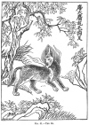
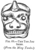

  
[Intangible Textual Heritage](../../index)  [Earth Mysteries](../index) 
[Index](index)  [Previous](mm12)  [Next](mm14) 

------------------------------------------------------------------------

[Buy this Book at
Amazon.com](https://www.amazon.com/exec/obidos/ASIN/1851709444/internetsacredte)

------------------------------------------------------------------------

*Mythical Monsters*, by Charles Gould, \[1886\], at Intangible Textual
Heritage

------------------------------------------------------------------------

p. 338

### CHAPTER X.

#### THE UNICORN.

A BELIEF in the unicorn, like that in the dragon, appears to have
obtained among both Eastern and Western authors, at a very early period.
In this case, however, it has survived the revulsion from a fatuous
confidence in the fables and concocted specimens of the Middle Ages, and
even now the existence or non-existence of this remarkable animal
remains a debateable question.

Until within a late period occasional correspondents of the South
African journals continued to assert its existence, basing their
communications on the reports of hunters from the interior, while but a
few hundred years since travellers spoke of actually seeing it or of
passing through countries in which its existence was absolutely affirmed
to them. Horns, generally those of the narwhal, but occasionally of one
species of rhinoceros, were brought home and deposited in museums as
those of the veritable unicorn, or sold, under the same pretext, for
large sums, on account of their reputed valuable medicinal
properties. [\*](#fn_281) The animal is
variously described as resembling a horse or some kind of deer; this
description

p. 339

may possibly refer to some animal of a type intermediate to them, now
almost, if not quite, extinct. In some instances it is supposed that a
species of rhinoceros is indicated.

There has been much discussion as to the identity of the animal referred
to in many passages of the Bible, the Hebrew name of which, *Reem*, has
been translated "unicorn." Mr. W. Smith considers that a species of
rhinoceros could not have been indicated, as it is spoken of in one
passage as a sacrificial animal, whereas the ceremonial ritual of the
Jews forbade the use of any animal not possessing the double
qualifications of chewing the cud and being cloven-footed. The qualities
attributed to it are great strength, an indomitable disposition, fierce
nature, and an active and playful disposition when young. He considers
that the passage, Deut. xxxiii. 17, should be rendered "his horns are
like the horns of a unicorn," and not, as it is given, "horns of
unicorns"; and is of opinion that some species of wild ox is intended.

Among profane Western authors we first find the unicorn referred to by
Ctesias, who describes it as having one horn, a cubit long. Herodotus
also mentions it in the passage, [\*](#fn_282)
"For the eastern side of Libya, where the wanderers dwell, is low and
sandy, as far as the river Triton; but westward of that, the land of the
husbandmen is very hilly and abounds with forests and wild beasts, for
this is the tract in which the huge serpents are found, and the lions,
the elephants, the bears, the aspicks, and the horned asses"; and again,
"Among the wanderers are none of these, but quite other animals, as
antelopes, &c. &c., and asses, not of the horned sort, but of a kind
which does not need to drink."

Aristotle [†](#fn_283) mentions two unicorn
animals. "There are only a few \[animals\] that have a solid hoof and
one horn, as the Indian ass and the oryx."

p. 340

Pliny [\*](#fn_284) tells us that the Orsæan
Indians hunt down a very fierce animal called the monoceros, which has
the head of the stag, the feet of the elephant, and the tail of the
boar, while the rest of the body is like that of the horse. It makes a
deep lowing noise, and has a single black horn, projecting from the
middle of its forehead, and two cubits in length. This animal, it is
said, cannot be taken alive. In speaking of the Indian ass, he
says, [†](#fn_285) "the Indian ass is only a
one-horned animal"; and of the oryx of Africa, [‡](#fn_286) "the oryx is both one-horned and
cloven-footed."

Ælian [§](#fn_287) transfers the locality back
again from Africa to Asia, and it may be presumed, in the following
quotation, that he indicates the country north of the Himalaya, Thibet,
and Tartary, which still has the reputation of being one of the homes of
the unicorn.

“They say that there are mountains in the innermost regions of India
inaccessible to men, and full of wild beasts; where those creatures
which with us are domesticated, such as sheep, dogs, goats, and cattle,
range about at their own free will, free from any charge by a shepherd
or herdsman.

“Both historians, and the more learned of the Indians, among whom the
Brahmins may be specified, declare that there is a countless number of
these beasts. Among them they enumerate the unicorn, which they call
cartazonon, and say that it reaches the size of a horse of mature age,
possesses a mane and reddish yellow hair, and that it excels in
swiftness through the excellence of its feet and of its whole body. Like
the elephant, it has inarticulate feet, and it has a boar's tail; one
black horn projects between the eyebrows,

p. 341

not awkwardly, but with a certain natural twist, and terminating in a
sharp point.

“It has, of all animals, the harshest and most contentious voice. It is
said to be gentle to other beasts approaching it, but to fight with its
fellows. Not only are the males at variance in natural contention
amongst themselves, but they also fight with the females, and carry
their combats to the length of killing the conquered; for not only are
their bodies generally indued with great strength, but also they are
armed with an invincible horn. It frequents desert regions and wanders
alone and solitary. In the breeding season it is of gentle demeanour
towards the female, and they feed together; when this has passed and the
female has become gravid, it again becomes fierce and wanders alone.

“They say that the young, while still of tender age, are carried to the
King of the Prasians for exhibition of their strength, and exposed in
combats on festivals; for no one remembers them to have been captured of
mature age.”

Cæsar [\*](#fn_288) records the reputed
existence in his day, within the bounds of the great Hercynian Forest,
of a bull, shaped like a stag, with one horn projecting from the middle
of its forehead and between the ears.

Cosmas, [†](#fn_289) surnamed Indicopleustes, a
merchant of Alexandria, who lived in the sixth century, and made a
voyage to India, and subsequently wrote works on cosmography, gives a
figure of the unicorn, not, as he says, from actual sight of it, but
reproduced from four figures of it in brass contained in the palace of
the King of Ethiopia. He states, from report, that "it is impossible to
take this ferocious beast alive; and that all its strength lies in its
horn. When it finds itself pursued and in danger of capture, it throws

p. 342

itself from a precipice, and turns so aptly in falling, that it receives
all the shock upon the horn, and so escapes safe and sound." It is
noteworthy that this mode of escape is attributed, at the present day,
to both the musk ox and the Ovis Ammon.

Marco Polo may or may not indicate a rhinoceros in the passage, "Après
avoir descendu ces deux journées et demie, on trouve une province au
midi qui est sur les confins de l’Inde, on l’appelle Amien—on marche
quinze journées par des lieux desertes et par de grands bois où il y a
beaucoup d’éléphants et de licornes et d’autres bêtes sauvages. Il n’y a
ni hommes ni habitations aussi, nous laisserons ce lieu."

But no such inference can be attached to the descriptions of the
Ethiopian unicorn by Leo and Ludolphus.

The first says: [\*](#fn_290)

“The unicorn is found in the mountains of high Ethiopia. It is of an ash
colour and resembles a colt of two years old, excepting that it has the
head of a goat, and in the middle of its Morehead a horn three feet
long, which is smooth and white like ivory, and has yellow streaks
running along from top to bottom.

“This horn is an antidote against poison, and it is reported that other
animals delay drinking till it has soaked its horn in the water to
purify it. This animal is so nimble that it can neither be killed nor
taken. But it casts its horn like a stag, and the hunters find it in the
deserts. But the truth of this is called in question by some authors.”

Ludolphus [†](#fn_291) says:

"Here is also another beast, called arucharis, with one horn, fierce and
strong, of which unicorn several have been seen feeding in the woods."

p. 343

Coming down to later days we find the unicorn described by Lewes
Vertomannus [\*](#fn_292)—he who, having
visited, among other places, the site of the legend of St. George and
the Dragon, [†](#fn_293) and undergone a
variety of adventures, visits, in the course of them, the temple of
Mecca, and, as follows, gives a description "of the unicorns of the
Temple of Mecha, which are not seen in any other place."

“On the other part of the temple are parks or places enclosed, where are
seen two unicorns, named of the Greeks monocerotæ, and are there showed
to the people for a miracle, and not without good reason, for the
seldomness and strange nature. The one of them, which is much higher
than the other, yet not much unlike to a colt of thirty months of age;
in the forehead groweth only one horn, in manner right foorth, of the
length of three cubits. The other is much younger, of the age of one
year, and like a young colt; the horn of this is of the length of four
handfulls.

“This beast is of the colour of a horse of weesell colour, and hath the
head like a hart, but no long neck, a thynne mane hanging only on the
one side. Their leggs are thin and slender like a fawn or hind. The
hoofs of the fore-feet are divided in two, much like the feet of a goat.
The outer part of the hinder feet is very full of hair.

“This beast doubtless seemeth wild and fierce, yet tempereth that
fierceness with a certain comeliness.

“These unicorns one gave to the Sultan of Mecha as a most precious and
rare gift. They were sent him out of Ethiope by a king of that country
who desired by that present to gratify the Sultan of Mecha.”

Visiting the interior of Arabia from Aden, and afterwards

p. 344

starting for Persia, Vertomannus was driven back by a contrary wind to
Zeila (in Africa), which he describes as being an important city with
much merchandise—when again he says, "I saw there also certain kyne,
having only one horn in the middle of the forehead, as hath the unicorn,
and about a span in length, but the horn bendeth backwards. They are of
bright shining red colour."

In an account of the travels of Johann Grueber, Jesuit (about 1661),
contained in Astley's collection of voyages, we find:—

“Sining [\*](#fn_294) is a great and populous
city, built at the vast wall of China, through the gate of which the
merchants from India enter Katay or China. There are stairs to go a-top
of the wall, and many travel on it from the gate at Sining to the next
at Soochew, which is eighteen days’ journey, having a delightful
prospect all the way, from the wall, of the innumerable habitations on
one side, and the various wild beasts which range the desert on the
other side.

“Besides wild bulls, here are tigers, lions, elephants, rhinoceroses,
and monoceroses, which are a kind of horned asses.

“Thus the merchants view the beasts free from danger, especially from
that part of the wall which, running southward, approaches Quang-si,
Yunnan, and Tibet; for at certain times of the year they betake
themselves to the Yellow River, and parts near the wall which abound
with thickets, in order to get pasture and seek their prey.”

Father Jerome Lobo, a Portuguese Jesuit, who embarked for Abyssinia in
the year 1622, [†](#fn_295) states that—

"In the province of Agaus has been seen the unicorn; that beast so much
talked of and so little known. The prodigious swiftness with which the
creature runs from one

p. 345

wood into another has given me no opportunity of examining it
particularly; yet I have had so near a sight of it as to be able to give
some description of it.

“The shape is the same with that of a beautiful horse, exact and nicely
proportioned, of a bay colour, with a black tail, which in some
provinces is long, in others very short; some have long manes hanging to
the ground. They are so timorous that they never feed but surrounded
with other beasts that defend them.

“Deer and other defenceless animals often herd about the elephant,
which, contenting himself with roots and leaves, preserves the beasts
that place themselves, as it were, under his protection, from the others
that would devour them.”

There is a somewhat doubtful story contained in the *Narrative of a
Journey from St. Petersburg, in Russia, to Peking, in China, in*
1719, [\*](#fn_296) to the effect that between
Tobolsky and Tomski—

“Our baggage having waited at Tara till our arrival, we left that place
on the 18th, and next came to a large Russian village sixty versts from
Tara, and the last inhabited by Russians till you pass the Baraba and
come to the river Oby. . . . . One of these hunters told me the
following story, which was confirmed by several of his neighbours, that
in the year 1713, in the month of March, being out a-hunting, he
discovered the track of a stag, which he pursued. At overtaking the
animal he was somewhat startled on observing it had only one horn, stuck
in the middle of its forehead. Being near this village, he drove it
home, and showed it, to the great admiration of the spectators. He
afterwards killed it, and ate the flesh, and sold the horn to a
comb-maker in the town of Tara, for ten alteens, about fifteen pence
sterling.

“I inquired carefully about the shape and size of this

p. 346

unicorn, as I shall call it, and was told that it exactly resembled a
stag.

“The horn was of a brownish colour, about one archæon or twenty-eight
inches long, and twisted from the root till within a finger's length of
the tip, where it was divided, like a fork, into two points, very
sharp.”

One of the most trustworthy of observers, the Abbé Huc, speaks very
positively on the subject of the unicorn. [\*](#fn_297) He says: "The unicorn really exists in
Thibet. . . . We had for a long time a small Mongol Treatise on Natural
History, for the use of children, in which a unicorn formed one of the.
pictorial illustrations. . . . The Chinese Itinerary says, on the
subject of the lake you see before your arrival at Atzder (going from
east to west), 'The unicorn, a very curious animal, is found in the
vicinity of this lake, which is forty *li* long.'"

The unicorn is known in Thibet by the name of *serou*; in Mongolia, by
that of *kere*; while in a Thibetan manuscript examined by the late
Major Lattre, it is called the one-horned *tsopo*.

Mr. Hazlitt, in his notes appended to the statement by Huc as to the
unicorn, states that Mr. Hodgson, of Nepaul, sent to Calcutta the skin
and horn of a unicorn that died in the menagerie of the Rajah of Nepaul.

It was described as being very fierce, and abundant in the plains of
Tingri, in the southern part of the Thibetan province of Tsang, watered
by the Arroun; it assembled round salt beds. The form is graceful,
colour reddish, two tufts of hair project from the exterior of each
nostril, and there is much down round the hair and mouth. The hair is
rough and seems hollow. Doctor Able designated it *Antelope Hodgsonii*.

Baron von Müller described, [†](#fn_298)
through the medium of M.

p. 347

\[paragraph continues\] Antoine d’Abbadie,
a unicorn animal which he had received when at Melpes in Kordofan:—

“I met, on the 17th of April 1848, a man who was in the habit of selling
to me specimens of animals. One day he asked me if I wished also for an
*a’nasa*, which he described thus: 'It is the size of a small donkey,
has a thick body and thin bones, coarse hair, and tail like a boar. It
has a long horn on its forehead, and lets it hang when alone, but erects
it immediately on seeing an enemy. It is a formidable weapon, but I do
not know its exact length. The *a’nasa* is found not far from here
(Melpes), towards the south-southwest. I have seen it often in the wild
grounds, where the negroes kill it, and carry it home to make shields
from its skin.' N.B.—This man was well acquainted with the rhinoceros,
which he distinguished, under the name of *fetit*, from the *a’nasa*.

“On June the 14th I was at Kursi, also in Kordofan, and met there a
slave merchant who was not acquainted with my first informer, and gave
me spontaneously the same description of the *a’nasa*, adding that he
had killed and eaten one long ago, and that its flesh was well
flavoured.”

This creature is mentioned by Rupell, under the name of *Nillekma* or
*Arase*, as indigenous to Kordofan, and, by Cavassi, as known in Congo
under that of *Abada*.

Mr. Freeman, in the *South African Christian Recorder* (vol. i.), gives
the native account of an animal not uncommon in Makooa, and called the
*Ndzoodzoo*, described as being about the size of a horse, extremely
fleet and strong, with a single horn from two feet to two and a half
feet in length, projecting from its forehead, which is said to be
flexible when the animal is asleep, and capable of being curled up at
pleasure, but becoming stiff and hard under the excitement of rage. It
is extremely fierce, and invariably attacks a man when it discerns him.
The female is without a horn.

Our latest information as to this species comes from

p. 348

\[paragraph continues\] Prejevalski, [\*](#fn_299) who, speaking of it as the orongo, says
that it has elegant black horns standing vertically above the head; the
back is dun-coloured; the middle of the breast, stomach, and rump,
white; seen at a distance it appears white; it is very numerous in
Northern Thibet. He adds: "Another prevalent superstition is that the
orongo has only one horn growing vertically from the centre of the head.
In Kansu and Kokonor we were told that unicorns were rare, one or two in
a thousand. The Mongols in Tsaidan deny it, but say it may be so in
south-west Thibet."

Turning to the Chinese classics and books of antiquity, we find
references, sometimes vague and mythical, sometimes exact, to several
distinct unicorn animals. These may be enumerated as:—

 [†](#fn_300) 1. The Ki-Lin, represented in
Japan by the Kirin.

2\. The King.

3\. The Kioh Twan.

4\. The Poh.

5\. The Hiai Chai.

6\. The Too Jon Sheu.

Besides these there are clear descriptions of the rhinoceros, which
cannot in any way be confounded with the above. The only one of these
popularly familiar is the Ki-Lin, the history of which is interwoven
with that of remote ages. The first mention of it is made in the Bamboo
Books—only in that part, however, of them which is apparently a
commentary, note, or subsequent addition, though some authorities hold
it to be a portion of the actual text. The work states that, during the
reign of Hwang-Ti (B.C. 2697), Ki-Lins appeared in the parks.

Their appearance was generally supposed to signalise the reign of an
upright monarch, and Confucius considered that

p. 349

the appearance of one during his epoch was a bad omen, as it did not
harmonise with the troubled state of the times. The name Ki-Lin is a
generic or dual word, composed of those of the Ki and the Lin, the
respective male and female of the creature.

[  
Click to enlarge](img/fig79.jpg)  
FIG. 79.—THE KI-LIN. (*After a modern Chinese painting*.)  

This peculiar species of word formation is adopted in other instances in
reference to birds and animals; thus we have the male Fung and the
female Hwang united in the Fung Hwang, or so-called Chinese phœnix, and
the Yuen and Yang in the Yuen Yang, or mandarin duck.

Sometimes the word Lin alone is used with the same generic meaning.

The *’Rh Ya*, in the original text, defines the Lin as having a Kiun's
body (the Kiun is a kind of muntjack or deer), an ox's tail, and one
horn. The commentary states that the

p. 350

tip of the horn is fleshy, and that the King Yang chapter of the "Spring
and Autumn Annals" of Confucius defines it as a horned Kiun.

[  
Click to enlarge](img/fig80.jpg)  
FIG. 80.—THE KI-LIN (FEMALE OF THE CHINESE UNICORN). (*From the ’Rh
Ya*.)  

The preface to the *Shi Shu* quotes Li Sian to the effect that the Lin
is an auspicious and perfect beast.

Sun Yen says it is a spiritual beast. The *Shwoh Wan* says

p. 351

the Lin is the female of the K‘i and the K‘i is a beast endowed with
goodness, possessing a Kiun's body, an ox's tail, and one horn.
According to the *Shwoh Wan*, the Lin may be considered as a large
female deer. Now the *Shu King* considers that many of these beasts are
comprised under the Ki-Lin, only the characters, though retaining the
sound, have become altered in form.

Chen Nau calls it Lin-che-chi and Man Chw‘en says that the Lin is
truthful, and reducible to rule.

The *Li Yuen* says: "If the unicorn can once be tamed, then the other
beasts will not show terror."

Ta Tai, in the *Li Ki*, quoting the *Yih* \[*King*\], says there are 360
kinds of hairy creatures, and the Ki-Lin is the chief of them.

The *Li Ki*, commenting on the *King Fang I Chw‘en*, says: "The Lin has
a Kiun's body, an ox's tail, a horse's hoof, and is of five colours. It
is twelve feet high." [\*](#fn_301)

Again, in commenting on Fuh Kien's *Ho Chwen*, it says: “The Lin springs
from the earth's central regions. It is a beast of superior integrity,
is attached to its mother, and reducible to rule. The Shu King, quoting
Luh Li, says the Lin has a Kiun's body, an ox's tail, a horse's feet,
and a yellow colour, round hoofs, and one horn; the tip of the horn is
erect and fleshy.

“Its call in the middle part thereof is like a monastery bell. Its pace
is regular; it rambles only on selected grounds and after it has
examined the locality. It will not live in herds, or be accompanied in
its movements. It cannot be beguiled into pitfalls, or captured in
snares. When the monarch is virtuous, this beast appears.”

At present there are Lin existing on the frontiers of Ping

p. 352

\[paragraph continues\] Cheu. Even the
large or small Lin are always like deer, so that this species is not the
auspicious Ying Lin; although Tsz Ma Siang Su, [\*](#fn_302) in his odes on the shooting of the Mi
and trapping Lin, says that it is.

The top of the horn being fleshy is a characteristic of the Lin, and Mao
Chw‘en says that the Lin's horn is an emblem of goodness. Ching Tsien
says that the horn has a fleshy termination, indicating the peaceful
character of the beast, and that it has no use for it.

The "Book of Rites," quoting the *Kwang Ya*, says that on account of its
elegant style it takes place, *par excellence*, among the large-horned
beasts; the existing edition of the Kwang Ya omits this.

The *Kung Yang Chw‘en* says the Kiun also has horns.

Kung Ssun Tsz, in the annals of the fourteenth year of the Duke Ngai
(State of Lu), says that the Kiun has fleshy horns.

Kwoh, in his preface, proves the Lin to have a Kiun's body.

The *’Rh Ya* gives the drawing of a unicorn animal called the Ki; but no
reference to the horn is given in the text, which simply describes it as
a large Kiun with a yak's tail and dog's feet.

The Ki is not defined in the *’Rh Ya*, and the only information I have
as to it is derived from Williams’ dictionary, where it is stated to be
"a fabulous auspicious animal, which appears when sages are born; the
male of the Chinese unicorn. It is drawn like a piebald scaly horse,
with one horn and a cow's tail, and may have had a living original in
some extinct equine animal." But there is a very full account of an
animal called the King. It is not impossible that it is identical with
the King which, in the usual brief

p. 353

style of the original text of the *’Rh Ya*, is epitomised as a large
Biao (a kind of stag), with an ox's tail and one horn; and the several
commentaries on it are as follows:—

[  
Click to enlarge](img/fig81.jpg)  
FIG. 81.—THE KI.  

"In the time of the Emperor Wu, of the Han dynasty, during the worship
of heaven and earth at the solstices at Yung, there was captured a
unicorn beast like a Piao; it

p. 354

was at that time designated the Lin; it was, however, a Piao related to
the Chang (a kind of deer)."

The Shwoh Wan says: "The King is a large stag with an

[  
Click to enlarge](img/fig82.jpg)  
FIG. 82.—THE KING (*From the ’Rh Ya*.)  

ox's tail and one horn." It may be a large form of the Piao. The Wang
Hwu Analects say that the Piao is an object of the chase, and that it is
as swift as a stag.

p. 355

Kwan Tsz, in the *Ti Yuen* volume, says that as there are Mi and Piao
and many species of deer, so also the Piao is a species of deer.

The "Shi Ki," in the book *Fung Shen*, says that during the worship at
the solstices at Yung, there was captured a one-horned beast like a
Piao, and that the local authorities assert that as His Majesty was
making reverential invocations on the country altar to the Supreme
Being, he was recompensed for the sacrifice by a beast which was a
unicorn.

Wu Chao's preface to the *Loh Yiu* says: "The body is like that of a
muntjack, and it has one horn"; while the Spring and Autumn (Annals)
allude to this animal in speaking of the horned Kiun.

The inhabitants of Ch‘u say the Kiun is a Piao. Kwoh, in his preface,
says that the capture made in the time of Wu, of the Han dynasty, was
actually a Piao, as demonstrated by the Han books. The *Chung Kiun*
narrative states that in Shang Yung was captured a white Lin bearing one
horn, of which the tip was fleshy. At the present day nothing has been
heard of a Piao with a fleshy tip, therefore these must be different
beasts.

Kwoh also says that the Piao is identical with the Chang, and the Chang
with the Kiun. This corresponds with what Wei Chao So had already
stated, that the people of Ch'u assert that the Kiun is a Piao, and that
the Piao is certainly a kind of deer.

Its meat is eminently savoury.

Luh Ki says that of all four-footed creatures, the Piao is the most
excellent.

Yeu Shi states in the *Kiao Sz* annals ("Sacrifices to Heaven and
Earth"), that the Piao is a kind of deer. Its body exactly resembles
that of the Chang.

Finally, the explanatory prefaces of many classical works, when
commenting on the *'Rh Ya*, say that the Piao is

p. 356

[  
Click to enlarge](img/fig82.jpg)  
FIG. 83.—THE KI-RIN (*From a Japanese Drawing in a Temple in Kioto*.)  

p. 357

identical with the Chang and of a black colour; and they confirm Kwoh's
opinion, although the *’Rh Ya* forgets to allude to the three characters
denoting the black colour.

It was probably some unicorn animal which is referred to in the General
History of China, called the *Tong Kien Kang Mu* (*vide* Père de
Mailla's translation), as having been presented to the Emperor Yung Loh
of the Ming dynasty, in A.D. 1415, by envoys from Bengal. De Mailla says
it was called a Ki-Lin by the Chinese out of flattery.

Again, the same History says that in the succeeding year the kingdom of
Malin sent as tribute a Ki-Lin similar to that from Bengal.

The Ki-Rin, a Japanese version of the Ki-Lin, is simply borrowed from
Chinese sources. It is figured in the illustrated edition of the great
Japanese Encyclopedia *Kasira gaki zou vo Sin mou dzu wi tai sei*, [\*](#fn_303) and represented, as in the Chinese
drawings, as covered with scales; but it must be noted that nothing in
any of the texts of either country warrants this furniture of the
body. [†](#fn_304)

The same encyclopedia figures another unicorn beast under the name of
the Kai Tsi, and describes it as being an animal of foreign countries,
resembling a lion, and having a single horn. It is also called the Sin
You or divine sheep. It is able to distinguish between right and wrong.
When Kau You exercised criminal jurisdiction, he handed over those whose
crime was doubtful to the Kai Tsu, and it is said that this animal
destroyed the guilty and spared the innocent.

p. 358

This is described in the Chinese work *Yuen Kien Léi Han*, [\*](#fn_305) under the name of the Hiai Chai, and
similar powers of discrimination are there attributed to it.

[  
Click to enlarge](img/fig84.jpg)  
FIG. 84.—THE SZ, OR MALAYAN RHINOCEROS. (*From the ’Rh Ya*.)  

p. 359

A synonym for it was the Chiai Tung. It states that, according to the
*Si Yang Y Shu*, a one-horned spiritual lamb was born in the Ping Shen
district, and in the twenty-first year of Kai Yuen. The horn was fleshy,
and the top of the head covered with white hair. The second chapter on
the same subject says that, in ancient times, if parties were at law,
the judge brought this animal out, and it would gore at the guilty one.

The Kioh Twan is yet another unicorn animal described in the *Yuen Kien
Léi Han*, [\*](#fn_306) which is said to have
the appearance of a deer with the tail of a horse, but to be of a
greenish colour, with one horn above the nose, and to be capable of
traversing eighteen thousand li in one day.

The *Li Kau Sing Sha Shao* says that the Emperor Yuen Ti Su sent his
ambassadors to the western part of India, who procured animals several
tens of feet in height, [†](#fn_307) unicorn,
like the rhinoceros. The rumour went that these were inauspicious for
the Emperor, and they were immediately returned.

#### *The Poh*.

The *Shan Hai King* describes an animal as existing among the plains of
Mongolia, having the appearance of a horse, with a white body, black
tail, one horn, teeth and claws like a tiger, which howls like the roll
of a drum, devours tigers and leopards, and is capable of being used
instead of soldiers; it is called Poh.

The *’Rh Ya* describes the same animal as like a horse, with saw teeth,
existing on tigers and leopards.

The "History of the North" says that in the Kingdom of Peh Chi (?) a
magistrate named Chung Wa held office,

p. 360

who was very equitable in his rule. His district was invaded by some
ferocious animals. Suddenly six of the Poh came and killed and devoured
them as a reward for his good rule.

The Sung History says that a man named Leu Chang, an ambassador, arrived
at a district called Shen Su, where the mountains contained a strange
animal, in appearance like a horse, but capable of eating tigers and
leopards. The people were unacquainted with it, and asked Leu Chang what
it was, who said it was called the Poh, and referred them to the *Shan
Hai King* for a description of it.

[  
Click to enlarge](img/fig85.jpg)  
FIG. 85.—TARGET IN THE FORM OF A SPHYNX. (*From the San Li T’u*.).  
The arrows were discharged upwards and fell into the cylinder behind the
figure.  

Among other remarkable and interesting drawings which have come down
from antiquity in the *San Li T’u*, [\*](#fn_308) or illustrated edition of the three
(ceremonial) rituals, are some representing the various targets used by
officials of different

p. 361

ranks in the military examinations, in which the arrows had to be lodged
by shooting upwards from a distance. These are fashioned in the form of
animals, one realising the idea

[  
Click to enlarge](img/fig86.jpg)  
FIG. 86.—THE LU TARGET. (*From the San Li T’u*.)  

of the sphynx, and two representing unicorn animals, called respectively
the Lu—which, according to some, is like an ass with one horn, but,
according to others, differing from a donkey in having a cleft hoof—and
the Sz, which is said to be like an ox with one horn.

[  
Click to enlarge](img/fig87.jpg)  
FIG. 87.—THE SZ TARGET. (*From the San Li T’u*.)  

p. 362

[  
Click to enlarge](img/fig88.jpg)  
FIG. 88.—THE TOO JOU SHEN. (*From the Ming Tombs*.)  

The Too Jon Shen is the name of an animal with a lion-like body and
head, cloven hoofs, and a blunt short horn 

<table data-align="LEFT">
<colgroup>
<col style="width: 100%" />
</colgroup>
<tbody>
<tr class="odd">
<td data-valign="CENTER"><a href="img/fig89.jpg"> 
Click to enlarge</a> 
FIG. 89.—THE 
TOO JOU SHEN. 
</td>
</tr>
</tbody>
</table>

projecting from the centre of the forehead. Two pairs of these form a
portion of the avenue of stone figures of animals leading up to the Ming
tombs, about eighty miles north of Pekin. I have not found it described
in any book.

A writer in the *China Review* [\*](#fn_309)
endeavours to prove that the Ki-Lin is a (From the Ming Tombs.)
reminiscence of the giraffe, which he supposes may once have spread over
Asia, and, in addition to various passages included among those which I
have quoted above, adduces one from the *Wu Tsah Tsu*, which states
that, "In the period Yung Loh of the Ming dynasty (1403-1425) a Ki-Lin
was caught, and a painter was ordered to make a sketch and hand it up to
the high magistrates. According to the picture, the body was perfectly
shaped like that of a

p. 363

deer, *but the neck was very long, perhaps three or four feet*." I must
admit that I cannot agree with him in his conclusions. Harris [\*](#fn_310) has given much better arguments in
favour of the unicorn being merely a species of oryx. He appears to me,
however, to speak too absolutely, to make his facts too pliant, and to
base his main belief on the untenable theory that the myth, tradition,
or theory is based on the profile drawing of an oryx, exhibiting one
horn only. We might

p. 364

just as soon expect people to start stories of two-legged cows or
horses, or one-legged races of men, if so slender a basis for forging a
species were sufficient. What the zoological status of the unicorn may
be I am not prepared to show, but I find it impossible to believe that a
creature whose existence has been affirmed by so many authors, at so
many different dates, and from so many different countries, can be, as
mythologists demand, merely the symbol of a myth. There is a possible
solution, which does not appear to have struck previous writers on the
subject, viz., that the unicorn may be merely a hybrid produced
occasionally and at more or less rare intervals.

By accepting this view we could explain the extraordinary combinations
of character assigned to it, and the discrepancy which exists between
the qualities of courage and gentleness ascribed to it by Western and
Chinese authors. A valuable chapter remains to be written by naturalists
and progressionists on the limits within which hybridization exists in a
state of nature among the higher animals; its prevalence among the lower
and among plants is, of course, well known. A cross between some equine
and cervine species might readily result in a unicorn offspring, and
either the courageous qualities of the sire [\*](#fn_311) or the gentleness of the dam might
preponderate, according to the relations of the species in each of the
instances.

As an alternative, we may speculate on the unicorn being a generic name
for several distinct species of (probably) now extinct animals; missing
links between the three families, the Equidæ, Cervidæ, and Bovidæ;
creatures which were the contemporaries of prehistoric man, and which,
before they

p. 365

finally expired, attracted the attention of his descendants, during
early historic times, by the rare appearance of a few surviving
individuals.

The supernatural qualities ascribed to these by various nations must be
considered merely the embroidery of fancy, designed to enrich and adorn
an article esteemed rare and valuable.

------------------------------------------------------------------------

### Footnotes

[338:\*](mm13.htm#fr_283) "At length, in the
sixteenth and seventeenth centuries, they were thrown open for
examination by the desire which then existed in Germany to possess the
*ebur fossile*, or 'unicorn's horn,' a supposed infallible specific for
the cure of many diseases. The unicorn horn was to be found in the
caves, and the search for it revealed the remains of lions, hyænas,
elephants, and many other tropical and strange animals." *Pop. Sci.
Monthly*, No, 32,.

[339:\*](mm13.htm#fr_284) Book iv. ch. cxci,
and cxcii.

[339:†](mm13.htm#fr_285) Book ii. ch. ii. § 8.

[340:\*](mm13.htm#fr_286) Book viii. ch. xxxii.

[340:†](mm13.htm#fr_287) Book xi. ch. cvi.

[340:‡](mm13.htm#fr_288) *Ibid*.

[340:§](mm13.htm#fr_289) Ælian, *De Naturâ
Animalium*, Book xvi. ch. xx.

[341:\*](mm13.htm#fr_290) *De Bello Gallico*,
ch. ii. p. 26.

[341:†](mm13.htm#fr_291) *Vide* Chartou's
*Voyageurs du Moyen Ages*, vol. ii. p. 25.

[342:\*](mm13.htm#fr_292) Harris’ *Voyages*,
vol. i. p. 362; "Africa," by John Leo.

[342:†](mm13.htm#fr_293) Pinkerton's *Voyages*,
vol. i. p. 392; "Ethiopia," by Jobus Ludolphus.

[343:\*](mm13.htm#fr_294) *The Navigation and
Voyage of Lewes Vertomannus, of Rome, into Arabia, Egypt, &c., in* 1503,
contained in "*The History of Travayle in the East and West Indies*,"
done into English by Richard Eden. London, 1577.

[343:†](mm13.htm#fr_295) Berynto, a city on the
seacoast of Syria, Phœnicia.

[344:\*](mm13.htm#fr_296) Sining is on the
western frontier of Kansuh, towards Kokonor.

[344:†](mm13.htm#fr_297) Pinkerton's *Voyages*,
vol. xv. p. 23.

[345:\*](mm13.htm#fr_298) Pinkerton's
*Voyages*, vol. vii. p. 333.

[346:\*](mm13.htm#fr_299) *Travels in Tartary,
Thibet, and China*. Hue and Gabet. Translated by W. Hazlitt, vol. ii. p.
245.

[346:†](mm13.htm#fr_300) Gosse, *Romance of
Natural History*.

[348:\*](mm13.htm#fr_301) Prejevalski's
*Mongolia*, vol. ii. p. 207; London, 1876.

[348:†](mm13.htm#fr_302) See *’Rh Ya* and *Yuen
Keen Luy Han*, vol. ccccxxix. p. 1.

[351:\*](mm13.htm#fr_303) This height will have
to be reduced in accordance with the difference between the magnitude of
old and new standards of measurement.

[352:\*](mm13.htm#fr_304) A poet, native of
Hang Cheu.

[357:\*](mm13.htm#fr_305) Vide the translation
into French by L. Serrurier, Leyden, 1875.

[357:†](mm13.htm#fr_306) "The Chinese have a
tradition that this animal skips, and is so holy or harmless that it
won't even tread upon an insect, and that it is to come in the shape of
an incomparable man, a revealer of mysteries, supernatural and divine,
and a great lover of all mankind, who is expected to come, about the
time of a particular constellation in the heavens, on a special mission
for their benefit. The Japanese unicorn answers the description of the
animal bearing that name, and supposed to be still extant in Ethiopia,
and which is equal to the size of a small p.
358 horse, reddish in colour, and slender as a gazelle, the male
having one horn. The unicorn is the ancient crest of the kings of
Israel, and is still retained by the Mikado." *Epitome of the Ancient
History of Japan*, p. 116; N. McLeod, Nagasaki, 1875.

[358:\*](mm13.htm#fr_307) Vol. ccccxxx. p. 18.

[359:\*](mm13.htm#fr_308) Vol. ccccxxxii. p.
38.

[359:†](mm13.htm#fr_309) This will have to be
reduced by nearly one-half, to equate it with the present measures of
length.

[360:\*](mm13.htm#fr_310) *San Li T’u*, vol.
viii. p. 3. The *San Li T’u* is an illustrated, modern, edition by Nieh
Tsung I. of the old *San Li*; it was written during the reign of the
great patron of literature, Kang Hi (A.D. 1661 to 1723).

[362:\*](mm13.htm#fr_311) Vol. vii. No. 1, p.
72.

[363:\*](mm13.htm#fr_312) Harris, *Game and
Wild Animals of Southern Africa*. The Oryx Capensis—The Gemsbock.

“The figure of the renowned unicorn can be traced in all the ancient
ear-rings, coins, and Latin heraldic insignia, to some one of the
members of the oryxine family; of all the whimsies of antiquity, whether
emanating from the unbridled and fertile fancies of the people of Egypt
and Persia, or devised by the more chaste and classic taste which
distinguished Greece and Rome, the unicorn—unquestionably the most
celebrated—is the chimera which has in modern ages engrossed the largest
portion of attention from the curious.

“The rhinoceros is supposed to be the animal so often alluded to in
Scripture under the name of *reem* or unicorn, yet the combination
presented in the oryx of the antelopine and equine characters, the horns
and cloven hoof of the one, blended with the erect mane, general contour
and long switch tail of the other, corresponds in all essential
particulars with the extant delineations and descriptions of the
heraldic unicorn, which is universally represented to have been
possessed of a straight slender horn, ringed at the base, and to have
the hoof divided; to have worn a mane reversed, a black flowing tail,
and a turkey-like tuft on the larynx, whilst both the size and ground
colour were said to be those of the ass, with the addition of sundry
black markings, imparting to the face and forehead a piebald appearance.

“The alterations required to reduce the African oryx to the standard of
this model, are slight and simple, nor can it be doubted that they have
been gradually introduced by successive copyists; the idea of the single
horn having been derived in the first instance from profile
representations of that animal given in bas-relief on the sculptured
monuments of ancient Egypt and Nubia . . . . . . They have in their
aspect a certain bovine expression; and Arabs and other natives never
consider them as antelopes but as a species of buffalo . . . . . . The
oryx boldly defends itself when pressed by the hunters, is quarrelsome
during the rutting season, and it is said that even the lion dreads an
encounter with it.”

[364:\*](mm13.htm#fr_313) Even the patient ass,
in a state of nature, is endowed with great courage. Baharan, one of the
early Persian monarchs, received the surname Baharan Guz from his
transfixing, with one arrow, a wild ass and a lion engaged in active
combat.

------------------------------------------------------------------------

[Next: Chapter XI. The Chinese Phœnix](mm14)
