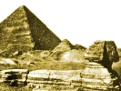

  
[Intangible Textual Heritage](../../index)  [Earth Mysteries](../index) 
[Index](index)  [Previous](osgp07)  [Next](osgp09) 

------------------------------------------------------------------------

[Buy this Book at
Amazon.com](https://www.amazon.com/exec/obidos/ASIN/B0029U2WGY/internetsacredte)

------------------------------------------------------------------------

  
*The Origin and Significance of the Great Pyramid*, by C. Staniland
Wake, \[1882\], at Intangible Textual Heritage

------------------------------------------------------------------------

p. 92

### NOTE

ONE of the most curious series of relations found by the Pyramidists is
connected with the Great Coffer, or sarcophagus, of the King's Chamber.
John Taylor and his followers assert that this coffer is the same in
capacity with the Ark and with the Laver of the Hebrew Tabernacle, and
that the Molten Sea of Solomon's Temple was just fifty times such
capacity, and exactly equal in interior cubic space with the contents of
the King's Chamber itself. There is nothing absurd or improbable in
there being some such relation between those vessels, if the Pyramid was
a temple dedicated to the god Seth. Judging, indeed, from the analogy
presented by Hindoo usage, the coffer was "a sacred trough, filled by
the Priests on certain festivals with sacramental water and
lotus-flowers." This explanation of its use was given to Mr, St. John by
some learned Brahmins, who said that the

p. 93

\[paragraph continues\] Great Pyramid was
a temple, and that if it had an underground communication with the Nile
it must have been intended for the worship of Pad Madévi. [\*](#fn_100) An early English writer, Mr. Shaw,
would seem to have been much of the same opinion, as he thought the
coffer was intended for the celebration of the mystical worship of
Osiris, and he supposed it to have contained images, sacred vestments
and utensils, or water for lustration. If for Osiris we substitute Seth
that opinion will be near the truth. The so-called King's Chamber, of
which an enthusiastic pyramidist says, "The polished walls, fine
materials, grand proportions, and exalted place eloquently tell of
glories yet to come," if not "the chamber of perfections" [†](#fn_101) of Cheops's tomb, was probably the place
to which the [initiate](errata.htm#7) was admitted after he had passed
through the narrow upward passage and the grand gallery, with its lowly
termination, which gradually prepared him for the final stage of the
sacred mysteries.

------------------------------------------------------------------------

### Footnotes

[93:\*](osgp08.htm#fr_100) Referred to by Col.
Vyse, "Operations," etc., Vol. ii. p. 313.

[93:†](osgp08.htm#fr_101) This was one of the
names of the principal chamber of a tomb. See "Records of the Past,"
Vol. xii. Egyptian Texts, p. 106.

------------------------------------------------------------------------

[Next: Appendix I](osgp09)
