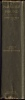
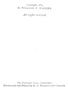

  
[Intangible Textual Heritage](../../index)  [Earth Mysteries](../index) 
[Index](index)  [Next](pf01) 

------------------------------------------------------------------------

[Buy this Book at
Amazon.com](https://www.amazon.com/exec/obidos/ASIN/1410100847/internetsacredte)

------------------------------------------------------------------------

  
*Paradise Found*, by William F. Warren, \[1885\], at Intangible Textual
Heritage

------------------------------------------------------------------------

p. i

 
[  
Click to enlarge](img/spine.jpg)  
Spine  

  [  
Click to enlarge](img/inscrip.jpg)  
Inscription on flyleaf  

##### PARADISE FOUND

###### THE CRADLE OF THE HUMAN RACE AT THE NORTH POLE

p. ii

  [  
Click to enlarge](img/front.jpg)  
Frontispiece: DIAGRAM ILLUSTRATING THE TRUE KEY TO ANCIENT COSMOLOGY AND
MYTHICAL GEOGRAPHY.  

<table data-border="0" width="50%">
<colgroup>
<col style="width: 100%" />
</colgroup>
<tbody>
<tr class="odd">
<td data-valign="top" width="655">
<em>Compare</em> <a href="pf42.htm#page_479">p. 479</a>.

A. The Northern celestial Pole in the zenith. 
A B. The axis of the heavens in perpendicular position. 
C D. The axis of the Earth in perpendicular position. 
I I I I. The abode of the supreme God, or gods. 
2, 3, 4. Europe, Asia, and the known portion of Africa. 
5 5 5. The Earth-surrounding equatorial Ocean-river. 
6 6 6. The abode of disembodied human souls. 
7 7 7 7. The abode of demons. 
C. Location of submerged Eden. 
C A. "The Strength of the Hill of Sion."
</td>
</tr>
</tbody>
</table>

 

p. iii

  [  
Click to enlarge](img/title.jpg)  
Title Page  

# PARADISE FOUND

## THE CRADLE OF THE HUMAN RACE AT THE NORTH POLE

### A Study of the Prehistoric World

###### BY

## WILLIAM F. WARREN, S. T. D., LL. D.

###### PRESIDENT OF BOSTON UNIVERSITY, CORPORATE MEMBER OF THE AMERICAN ORIENTAL SOCIETY, AUTHOR OF "ANFANGSGRÜNDE DER LOGIK," "EINLEITUNG IN DIE SYSTEMATISCHE THEOLOGIE," "THE TRUE KEY TO ANCIENT COSMOLOGY AND MYTHICAL GEOGRAPHY," ETC., ETC.

##### *WITH ORIGINAL ILLUSTRATIONS*

#### SIXTH EDITION

#### BOSTON

#### HOUGHTON, MIFFLIN AND COMPANY

##### New York: 11 East Seventeenth Street

##### The Riverside Press, Cambridge

#### \[1885\]

Scanned, proofed and formatted at Intangible Textual Heritage by John
Bruno Hare, March, 2008. This text is in the public domain in the US
because it was published prior to 1923.

p. iv

 
[  
Click to enlarge](img/verso.jpg)  
Verso  

The Riverside Press, Cambridge:

Electrotyped and Printed by H. O. Houghton and Company.

p. v

*RESPECTFULLY DEDICATED*,

WITH FRIENDLY PERMISSION,

TO

PROFESSOR F. MAX MÜLLER,

OF

THE UNIVERSITY OF OXFORD.

------------------------------------------------------------------------

[Next: Preface](pf01)
