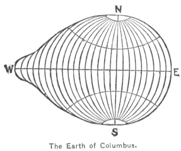
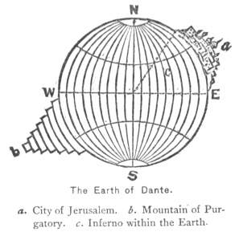

  
[Intangible Textual Heritage](../../index)  [Earth Mysteries](../index) 
[Index](index)  [Previous](pf31)  [Next](pf33) 

------------------------------------------------------------------------

[Buy this Book at
Amazon.com](https://www.amazon.com/exec/obidos/ASIN/1410100847/internetsacredte)

------------------------------------------------------------------------

  
*Paradise Found*, by William F. Warren, \[1885\], at Intangible Textual
Heritage

------------------------------------------------------------------------

p. 300

### CHAPTER VIII.

#### REVIEW OF THE ARGUMENT.

*Now if Water be the Best, and Gold be the most
Precious, so now to the farthest bound doth Theron by his fair deeds
attain, and from his own home touch the Pillars of Heracles*. [1](#fn_502) *Pathless the things beyond, pathless
alike to the unwise and the wise. Here will I search no more; the quest
were vain*.—Pindar (Myers).

In Part Second, at the very beginning of
our discussion, attention was called to the two classes of tests which
the hypothesis of an Arctic polar site for Eden must of necessity meet:
first, the tests which would apply alike to all the ordinarily proposed
sites in temperate and inter-tropical latitudes; and second, the tests
which would be inseparable from the aspects and adjustments of Nature at
the Pole. In the first class seven were enumerated, and at the close of
Part Fourth we saw how surprisingly and convincingly all of the seven
had been met. In the second class seven others were particularized as
"new features" introduced into the problem of the site of Eden by the
very nature of our hypothesis. They were all of so peculiar and
extraordinary a character, and they so modified the requirements to be
made of all corroborative human tradition, that nothing short of the
truth of the intrinsically improbable hypothesis could save it

p. 301

from obvious and ridiculous failure at each successive point. In the
present Part we have now brought together the facts, or at least a
portion of the facts, which go to demonstrate that the hypothesis of a
Polar Paradise, *and no other*, can meet and satisfy each one of these
new and more difficult requirements. Speaking after the manner of the
mathematicians, though of course with due remembrance of the nature of
the reasoning employed, it may be said that we have first solved our
problem, and then, by a new process and with changed elements, proved
and verified our answer. Whoever would see how strikingly complete and
cogent this verifying process is should turn back to the second chapter
of Part Second and carefully collate the seven "new features" there
enumerated with the facts of the first seven chapters of the present
Part. The result of such a collation upon any candid mind can hardly be
doubtful.

In the writer's firm-grounded conviction, then, Lost Eden is found. To no one of his readers
can its true site be more surprising than it was at first to him. Every
antecedent probability seemed in array against it. First of all, in such
problems *every* new hypothesis is inherently unlikely in direct
proportion to the number of hypotheses previously propounded and found
wanting. Where had more been advanced by the learned and ingenious than
here? Again, from its nature the hypothesis greatly aggravated the
conditions and requirements of the problem itself. And if, during
centuries of discussion, no sublunary site had been found which could
meet the simple conditions of Genesis, how unlikely that with new and
far more

p. 302

extraordinary conditions added a place could be found corresponding!
Again, in order to its verification, the hypothesis required that a
wholly new interpretation of mankind's oldest cosmological ideas and
traditions should be propounded and verified,—an interpretation
unanimously forbidden by the consensus of modern scholarship in almost
every department of historical and archæological research. How supremely
unlikely that any such undertaking could be crowned with success!

Happily, human events do not fall out according to our short-sighted
human likelihoods. Even the thoughtless man sees it, and exclaims, "It
is always the impossible that happens!" The more reverent soul, who
discerns in all history a higher than human agency, and in whose eyes
Nature itself is supernatural, must least of all be daunted by the
unpromising first appearances of any clue to truth. His conceptions of
the actual are larger than those of mere believers in nature, and
thereto are adjusted his conceptions of the probable. Identifying
himself with that personal Power which everywhere makes for truth no
less than for righteousness, he is ever expecting the otherwise
unexpectable, and for the same reason ever looking upon each new truth
attained, not as a personal achievement, but simply as one more proof
and precious pledge of pupilhood.

In the progress of the studies here summed up many curious things have
come to light, one of which may appropriately be mentioned in this
place. Archæologists are well aware that more than one hundred years
ago, in his "Lettres sur l’Atlantide de Platon," 1779, and "Lettres sur
l’Origine des Sciences," 1777, the learned and ingenious Jean

p. 303

\[paragraph continues\] Sylvain Bailly
advocated the view that the primitive cradle of civilization was in
Siberia, under the 49th or 50th degree of latitude. In the latter of the
works named there occurs a noteworthy passage in which the author,
rhetorically fixing the birthplace of mankind at the very Pole, remarks
upon the "singular conformity "of such a starting-point, both with all
the phenomena of civilization and with the indications of mythology. In
the same breath, however, as if startled by his own temerity, he
reassures his readers by announcing that his suggestion is "only a
philosophic fiction," and that it "lacks the support of history." [1](#fn_503) Is it too much to say that the support
of history has now been furnished? [2](#fn_504)

Though our hypothesis needs no further confirmation, it would be
perfectly easy to develop a new and striking line of evidence from the
light which it throws on the origin of the erroneous preconceptions
which in the past have either perpetually suggested false theories, or
else occasioned the conviction that the problem was insoluble. Thus,
after what we have learned as to the posture of worshipers in all
ancient nations, it is easy to understand

p. 304

that the primitive Garden "in the Front-country" must have been in the
North. But since in the Post-Glacial ages this Front-country was
naturally associated with the East, and all investigators, Jewish,
Christian, and Mohammedan, were trying to find some Oriental region of
Paradisaic climate, with a central Tree and a quadrifurcate River by
which the primitive Gan-Eden might be identified, we have in this
preliminary misconception reason enough for their failure age after age.

Again, in reviewing the results of the theologians, we saw that not a
few of the more modern had, like Luther, been repelled and disgusted by
the apparently senseless and contradictory representations of the
earlier fathers and church-teachers, in some of which Paradise was
placed in heaven, and yet apparently on earth, and anon perhaps midway
between heaven and earth; as high, in fact, as the moon. In view of such
representations we cannot be surprised that a keen-witted satirist like
Samuel Butler, in enumerating the rare accomplishments of Hudibras,
should have said,—

"He knew the seat of Paradise,  
 Could tell in what degree it lies;  
 And, as he was disposed, could prove it  
 Below the moon, or else above it."

Our study of the prehistoric Paradise-mountain, standing upon the earth
at the Arctic Pole and lifting its head "to the orbit of the moon,"
brings instant light into all this confusion. The mountain *is* at once
in heaven and on earth. And it is interesting to note that late mediæval
theologians, despite their meagre opportunities for historical research,
traced this conception to just that apostle who, according

p. 305

to ecclesiastical tradition, as special "Apostle of India," had best
opportunity to learn of the East-Aryan Meru, and to report this peculiar
and venerable tradition of Paradise. [1](#fn_505) Moreover, as we have seen, there were in
several Asiatic religions two Paradises, a celestial and a terrestrial,
connected by a pillar, or bridge, up and down which holy souls could
pass. When, therefore, an ancient writer is found alluding in one place
to Paradise as on earth and in another to Paradise as in heaven, the
confusion is not in his own mind, but merely in that of his reader.

Here, too, a good word can be put in for poor Cosmas Indicopleustes,—the
man who has had the honor of being more ignorantly and contemptuously
abused by modern scientists than any other cosmographer of early
Christian ages. Doubtless it is easy to ridicule his rude representation
of the universe, but who will assure us that, thirteen or fourteen
centuries hence, it may not be equally easy to ridicule the speculations
of Herschel as to the form of the Cosmic Whole? However this may be, the
foregoing chapters have given a new significance to the thought of the
monk "who sailed to India," showing us that his "Mountain" to the North
of the known countries of his day was none other than Mount Meru, the
legendary heaven-supporting culmination of the Northern hemisphere. His
location of Eden, so far as the verdict of science is yet rendered, is
at least as well supported as Hackers

p. 306

in lost "Lemuria," or Unger's in a mid-Atlantic "Atlantis." Most
remarkable of all, just North *of the
Arctic Ocean boundary of Europe*—not in the West, as sometimes falsely
represented [1](#fn_506)—he locates "*the land
where men dwelt before the Flood*." [2](#fn_507) If our conclusions are correct, Cosmas
was the earliest known geographer who gave to the Christian world a true
account of the original seat of the post-Edenic antediluvian world. Thus
those who have so long made him their pet illustration of the ignorance
and unscientific spirit of "Christian" teaching may yet see occasion to
revise their judgment, and to transform a portion of their ridicule into
praise.

The same principles which explain the strange world of Cosmas explain
also the strange conception of the Earth which we found in the letters
of Columbus. According to this latter, it will be remembered, the
historic hemisphere was true to the spherical figure, but the hemisphere
of his far West explorations rose to a lofty eminence at the equator, in
what he supposed to be Asia, but which afterwards proved to be the
northern part of South America. This gave to the Earth the figure shown
in the adjoining cut,—a figure which he compared to that of a nearly
round pear. [3](#fn_508) At first view this
conception

p. 307

seems altogether arbitrary, and even whimsical; but if we 

|                                         |
|-----------------------------------------|
|  |

go back a century or two to Dante's Earth, we find a globe still more
eccentric, one on which the Paradise-mount has slipped down full 30°
below the equator, as shown in the following figure. A fundamental datum
for its construction is found in the description of the Mountain of
Purgatory, respecting whose location it is said, "Zion stands with this
Mountain in such wise on the earth that both have a single horizon and
diverse hemispheres." [1](#fn_509) A 

|                                                                                                                    |
|--------------------------------------------------------------------------------------------------------------------|
|  |

commentator on this says, "When the Divina Commedia was written,
Jerusalem was believed to be the exact

p. 308

centre of the habitable hemisphere; the other was conceived to be
covered with water. Out of this ocean the mountain of the poet's
Purgatory rises up, like the Peak of Teneriffe, from the bosom of the
waves, and is exactly opposite to Mount Zion, so that the two become the
antipodes of each other. The mathematicians in their measurement of
Dante's Hell proceeded in this wise: An arc of thirty degrees was
measured from the meridian of Jerusalem westward as far as Cuma, near
Naples, and here, at the '*Fauces Averni*' of Vergil, it pleased them to
locate its dreary entrance. Another arc of thirty degrees was next
measured from the same meridian eastward, so that both together made up
a portion of the earth's circumference of about 4330 English miles, the
chord of which would be equal to its semi-diameter. This was made the
base of their operations, so that with the world's centre for its apex .
. . the Inferno became as broad as it was deep. At this centre of
gravity, firmly wedged in everlasting ice, the grim monarch of these
dolorous realms is placed." [1](#fn_510)

A more recent editor remarks, "Dante's Purgatory is figured as an island
mountain whose summit just reaches to the first of the celestial
spheres, that of the Moon. . . . It is exactly at the antipodes of
Jerusalem, and its bulk is precisely equal and opposite to the cavity of
Hell. . . . On the summit of the mountain is the Earthly Paradise,
formerly the Garden of Eden." [2](#fn_511)

p. 309

Upon the correctness of "the mathematicians" above mentioned, the
present writer is not prepared to pass judgment, [1](#fn_512) but no careful reader of the Divine
Comedy can fail to see that its "Mount Zion" and the Purgatorial
"*Montagna malagevole, altissima et cinta de mare*," are simply
unrecognized "survivals" of prehistoric thought,—antipodal
world-mountains once situate at the poles, but here relocated to suit
the demands of sacred mediæval cosmology. They are the Su-Meru and
Ku-Meru of India figuring in Christian poetry. In Lord Vernon's
illustration of this curious cosmos, a Hindu pundit would almost
certainly think he had a Puranic *mappe-monde*. [2](#fn_513) That after the Paradise-mount has thus
declined, first to the latitude of Central Asia, then to the equator,
and finally to the pendant position in which Lord Vernon places it,
directly under the City of God, with a hypogene central Inferno
between,—that after such translocations it should so long have eluded
the recognition of all Paradise-seekers is surely little wonder. [3](#fn_514)

p. 310

Our Arctic Eden, therefore, by explaining the origin of the cosmological
conceptions of ancient Chaldæa and Egypt and India, explains at the same
time the origin of the most eccentric and apparently senseless
conceptions of mediæval and modern cosmographers, and presents what may
properly enough be called the philosophy of the errors and
misconceptions and fancies of previous searchers after Paradise. It is
much that an hypothesis meets all the requirements of a given problem;
it is more that it does this better than any other hypothesis; it would
seem to be past all question when it so illuminates and enriches the
very data of the problem that every previous solution falls away of
itself, the philosophy of its origin and of its inadequacy being patent
and unquestionable.

------------------------------------------------------------------------

### Footnotes

[300:1](pf32.htm#fr_502) "Atlas gave to
Heracles the κόσμου κίονας which contained all the secrets of Nature."
Rawlinson's *Heradotus*, vol. i., p. 505 n. Compare below, Part VI., ch.
ii. Also Jonnès, *L’Océan*, pp. 121, 107, *et passim*.

[303:1](pf32.htm#fr_503) "Au reste, si j’ai
tracé la marche de l’homme né sous le pôle, s’avançant vers l’équateur,
inventant toutes les différentes mesures de l’année, par les
circonstances physiques des différentes latitudes, ce n’est qu’une
fiction philosophique, singulière par sa conformité avec les phénomènes,
remarquable par l’explication des fables; fiction qui surtout n’a rien
d’absurde en elle-même, et à laquelle il ne manque que d’être appuyée
par l’histoire: "pp. 255, 256.

[303:2](pf32.htm#fr_504) Since the announcement
of his results the writer has received letters from three plain,
unschooled Bible-students, who appear to have anticipated, each in his
own way, the conclusions of this book. One of them, Mr. Alexander
Skelton, a machinist and blacksmith, of Paterson, N. J., obtained a
hearing, it seems, in the *New York Tribune*, in 1878, and his argument,
though brief, is remarkably comprehensive and cogent.

[305:1](pf32.htm#fr_505) "I have found it in
some most ancient books that Thomas, the Apostle, was the author of the
opinion . . . that Paradise was so high as to reach to the lunar
circle."—Albertus Magnus, *Summa Theologiæ*, Pars II., Tract. xiii., qu.
79.

[306:1](pf32.htm#fr_506) E.g., by Donnelly,
*Atlantis*, p. 96.

[306:2](pf32.htm#fr_507) "Terra ultra Oceanum
ubi ante Diluvium habitabant homines." Cosmas Indicopleustes. *De
Mundo*, lib. iv. Montfaucon, *Collectio Nova*, tom ii., Tabula i., opp.
p. 188.

[306:3](pf32.htm#fr_508) "It is probable that
this idea really dates from the seventh century. We may read in several
cosmographical manuscripts of that epoch that the earth has the form of
a cone or a top, its surface rising from south to north. These ideas
were considerably spread by the compilations of John of Beauvais in
1479, from whom, probably, Columbus derived his notion." Flammarion,
*Astronomical Myths*, p. 307 p. 296. See also
G. Marinelli, *La Geografia e i Patri della Chiera*. Roma, 1882.

[307:1](pf32.htm#fr_509)

Come ciò sia, se il vuoi poter pensare,  
  Dentro raccolto immagina Siòn  
  Con questo monte in su la terra stare,  
Sì che ambo e due hanno un solo orizzon,  
  E diversi emìsperi.  
                  (*Purgatorio*, Canto iv., 67-70.)

[308:1](pf32.htm#fr_510) Henry Clark Barlow,
*Contributions to the Study of the Divina Commedia*. London, 1864: pp.
169, 170.

[308:2](pf32.htm#fr_511) A. J. Butler, *The
Purgatory of Dante*. London, 1880: Prefatory Note. Compare Witte's
genial lecture on "Dante's Weltgebäude," in his *Dante-Forschungen*, Bd.
i., pp. 161-182.

[309:1](pf32.htm#fr_512) Dante's instructor in
the natural sciences was Brunetto Latini, who was born A.D. 1230 and
died 1294. He is paid an affectionate tribute in the *Inferno*, xv. 85.
He wrote a work of which *Li Livres dou Tresor*, Paris, 1863, is an
Old-French edition. In it (lib. i., part iii., c. v.) the author ably
advocates the doctrine of the spherical figure of the earth. Dante's
references to the author and to his work have been carefully collected
and presented in a learned paper in the *Jahrbuch der Deutschen Dante-
Gesellschaft*, Bd. iv., pp. 1-23.

[309:2](pf32.htm#fr_513) See the "Figura
universale della Divina Commedia," p. xxx. of vol. i. of *L’Inferno di
Dante Alighieri da G. G. Warren Lord Vernon*. London, 1858.

[309:3](pf32.htm#fr_514) Flammarion's picture
(*Myths of Astronomy*, p. 3111 corresponds quite closely to Lord
Vernon's, only the exactly *south polar* position of the mountain is
made, if possible, more unequivocal by inserting the words "Southern
Hemisphere," and making the pendant mount p.
310 its precise culmination point beneath. See, further, S.
Günther on "Die Kosmologische Anschauungen des Mittelalters," in *Die
Rundschau für Geographie and Statistik*, Bd. iv.

------------------------------------------------------------------------

[Next: Chapter I. The Bearing of Our Results on the Study of Biology and
Terrestrial Physics](pf33)
