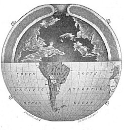

  
[Intangible Textual Heritage](../../index)  [Earth Mysteries](../index) 

------------------------------------------------------------------------

<table width="75%">
<colgroup>
<col style="width: 50%" />
<col style="width: 50%" />
</colgroup>
<tbody>
<tr class="odd">
<td width="50%" data-valign="CENTER"> 
</td>
<td width="50%" data-valign="CENTER"><h1 id="the-phantom-of-the-poles" data-align="CENTER">The Phantom of the Poles</h1>
<h2 id="by-william-reed" data-align="CENTER">by William Reed</h2>
<h4 id="section" data-align="CENTER">[1906]</h4></td>
</tr>
</tbody>
</table>

------------------------------------------------------------------------

[Contents](#contents)    [Start Reading](potp00)  

------------------------------------------------------------------------

The hollow earth has long been a popular alternative theory of the shape
of the earth. Typically this theory also posits large holes at the North
and South Poles which would allow entry into the interior.[\*](#note) In
his 1906 book, The Phantom of the Poles, William Reed presents a
collection of reports of polar explorers on strange and unexplained
phenomena, such as warm winds, deposits of dust, rocks embedded in
icebergs, large ice-free areas, fresh water areas in the open polar
ocean, and bizarre auroras, all in support of his belief that the polar
areas are the vestibule to the interior of the hollow earth. Reed
believed that the poles were unreachable because they simply didn't
exist.

However, three years later, on April 6th, 1909, Peary and Henson reached
the North Pole (more or less: it is now thought that they missed it by
about 20 nautical miles). And so Reed's primary assertion, that the
poles cannot be reached, was soon to be invalidated by facts. Today the
poles have been reached by land, air and in the case of the North Pole,
by submarine; there is a permanent base at the South Pole, [which you
can view on webcam](https://www.cmdl.noaa.gov/obop/spo/livecamera.html).
([You can also view the North Pole on
webcam](https://www.arctic.noaa.gov/gallery_np.html)). The poles are no
phantom.

In contrast to [Teed](../cc/index) and [Rowbotham](../za/index), Reed
doesn't claim to be the messiah or that his theory is based on
scriptural evidence. Nor does he attempt a far-reaching overhaul of
science to make his point. Although he is wrong about the nature of the
aurora (one word: magnetohydrodynamics), the origin of meteorites, and
some other points, his book makes interesting reading, and conveys a
sense of wonder about the cosmos.

*--John Bruno Hare, 6/18/2005*

\* So, this sort of hollow Earth would be
topologically equivalent to a donut. *Umm, donuts.*

------------------------------------------------------------------------

 [Title Page](potp00)  
[Contents](potp01)  
[Illustrations](potp02)  
[Introduction](potp03)  
[General Summary](potp04)  
[Chapter I. Flattening of the Earth at the Poles.](potp05)  
[Chapter II. Length of Polar Nights](potp06)  
[Chapter III. Working of the Compass](potp07)  
[Chapter IV. Around the Curve](potp08)  
[Chapter V. Mysteries of the Polar Regions](potp09)  
[Chapter IV. The Water-Sky: What It Is](potp10)  
[Chapter VII. The Aurora: Its Wonderful Variations](potp11)  
[Chapter VIII. Meteors or Volcanic Disturbances](potp12)  
[Chapter IX. Finding of Rock in and on Ice](potp13)  
[Chapter X. Dust in the Arctic](potp14)  
[Chapter XI. Open Water at Farthest Point North and South](potp15)  
[Chapter XII. Why it is Warmer Near the Poles](potp16)  
[Chapter XIII. Driftwood--Whence it Came](potp17)  
[Chapter XIV. Have Other Than the Eskimos Inhabited the Arctic
Regions?](potp18)  
[Chapter XV. What Produces Colored Snow in the Arctic?](potp19)  
[Chapter XVI. Where and how are Icebergs Formed?](potp20)  
[Chapter XVII. The Tidal Wave](potp21)  
[Chapter XVIII. Clouds, Fogs, and Vapors](potp22)  
[Chapter XIX. Arctic and Antarctic Winds](potp23)  
[Chapter XX. The Centre of Gravity](potp24)  
[Chapter XXI. Cannot Reach the Poles](potp25)  
[Chapter XXII. What is in the Interior of the Earth?](potp26)  
[In Conclusion](potp27)  
