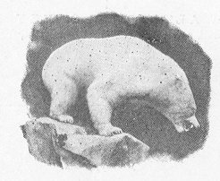
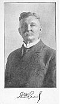
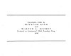

  
[Intangible Textual Heritage](../../index)  [Earth Mysteries](../index) 
[Index](index)  [Next](potp01) 

------------------------------------------------------------------------

p. 5

# THE PHANTOM OF THE POLES

## BY WILLIAM REED

 

#### WALTER S. ROCKEY COMPANY

#### NEW YORK

#### \[1906\]

NOTICE OF ATTRIBUTION  
Scanned at Intangible Textual Heritage, June 2005. Proofed and formatted
by John Bruno Hare. This book is in the public domain in the United
States because it was published prior to 1923. These files may be used
for any non-commercial purpose, provided this notice of attribution is
left intact in all copies.

[  
Click to enlarge](img/front.jpg)  
Frontispiece: Portrait of William Reed  

[  
Click to enlarge](img/cover.jpg)  
Cover and spine  

[  
Click to enlarge](img/title.jpg)  
Title Page  

[  
Click to enlarge](img/verso.jpg)  
Verso  

p. 6

Copyright, 1906, by  
WILLIAM REED  
and  
WALTER S. ROCKEY  
Entered at Stationers' Hall, London, Eng.  
1906

p. 7

This Volume is Dedicated to  
MY GRANDSON  
SYDNEY REED SMITH

 

------------------------------------------------------------------------

[Next: Contents](potp01)
