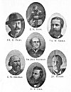

  
[Intangible Textual Heritage](../../index)  [Earth Mysteries](../index) 
[Index](index)  [Previous](potp02)  [Next](potp04) 

------------------------------------------------------------------------

p. 13

[  
Click to enlarge](img/01300.jpg)  
SOME FAMOUS POLAR EXPLORERS  

 [1](#fn_0) [2](#fn_1) [3](#fn_2)

p. 14 p. 15

# INTRODUCTION.

THIS volume is not written to entertain those who read for amusement,
but to establish and prove, so far as proof can he established and
proved, a half-score or more of mighty truths hitherto nit comprehended.
This may seem boastful; but, when understood, I hope it will not be so
considered; for one key will unlock them all. Throw away the key, or
refuse to use it, and the truths will remain securely locked in the
archives of the unknowable, as they have been since man inhabited the
earth. I fully realize that the task is herculean; but as Hercules
performed his tasks, I hope to do likewise. I am aware that I also have
one powerful giant to tackle; but the stone in my sling may land at the
place at which it is aimed, and the giant Prejudice be laid low and be
succeeded by that young stalwart, General Investigation.

p. 16

The problems to be solved are as follows:

1\. Why is the earth flattened at the poles?

2\. Why have the poles never been reached?

3\. Why is the sun invisible so long in winter near the farthest points
north or south?

4\. What is the Aurora Borealis?

5\. Where are icebergs formed, and how?

6\. What produces a tidal wave?

7\. Why do meteors fall more frequently near the poles, and whence do
they come?

S. What causes the great ice-pressure in the Arctic Ocean during still
tide and calm weather?

9\. Why is there colored snow in the Arctic region?

10\. Why is it warmer near the poles than six hundred to one thousand
miles away from them?

11\. Why is ice in the Arctic Ocean frequently filled with rock, gravel,
sand, etc.?

p. 17

12\. Does the compass refuse to work near the poles?

Should I be able to give reasonable answers to the above
questions--replies that will satisfy any intelligent person--the public
will admit, I believe, that I have fulfilled my task. Above all, I hope
to be exonerated from trying to make others believe things in which I
place no credence. So sure am I that my solutions of the problems given
above are correct, I am willing to stake my all on their correctness. To
me, the solutions given in this volume are perfectly clear. I have
thought over every possible objection, and all statements are presented
with certainty.

They will be taken up under separate heads, and, thus, furnish the
reader with what the lawyers would term a brief, giving authorities on
whose statements I base my opinion. The judges, in this case, will be
the public, whom I hope to have on my side.

Before I do this I wish to acknowledge my indebtedness to the brave men
who have spent their time, comfort, and, many,

p. 18

their lives, that all might know the truth and the geography of this
wonderful world. Through their reports I am able to prove my theory that
this earth is not only hollow, or double, but suitable in its interior
to sustain man with as little discomfort--after getting acclimated and
accustomed to the different conditions--as on its exterior, and can be
made accessible to mankind with one-fourth the outlay of treasure, time,
and life that it cost to build the subway in New York City. The number
of people that can find comfortable homes (if it be not already
occupied) will be billions.

Some have said: "Isn't it wonderful, if true?"

I am like the stranger that visited the Falls of Niagara with a friend.
As he stood gazing at the falling waters, the friend remarked: "Isn't it
wonderful?" "What's wonderful?" asked the stranger. "Why, the water
pitching over like that." "Why," said the stranger, "I don't see
anything to hinder it."

That expresses the whole situation. It

p. 19

may be surprising, and seem wonderful to many, or ridiculous to others,
but I see nothing to hinder it.

------------------------------------------------------------------------

### Footnotes

[13:1](potp03.htm#fr_0) Greeley From "Three Years
of Arctic Service," courtesy Charles Scribner's Sons.

[13:2](potp03.htm#fr_1) Peary From "Northward,"
F. A. Stokes Co. Copyright 1902 by Rockwood, N. Y.

[13:3](potp03.htm#fr_2) Nansen From "Farthest
North." Copyright 1897 by Harper & Brothers.

------------------------------------------------------------------------

[Next: General Summary](potp04)
