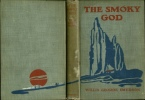

  
[Intangible Textual Heritage](../../index)  [Earth Mysteries](../index) 
[Index](index)  [Next](smog01) 

------------------------------------------------------------------------

[Buy this Book at
Amazon.com](https://www.amazon.com/exec/obidos/ASIN/B0026P3SA6/internetsacredte)

------------------------------------------------------------------------

  
*The Smoky God*, by Willis George Emerson, \[1908\], at Intangible
Textual Heritage

------------------------------------------------------------------------

p. 1

# THE SMOKY GOD

###### Or

### A Voyage to the Inner World

p. 2

<table data-border="1">
<colgroup>
<col style="width: 100%" />
</colgroup>
<tbody>
<tr class="odd">
<td data-valign="top">
OTHER BOOKS

BY

WILLIS GEORGE EMERSON

"BUELL HAMPTON." A Novel 
"THE BUILDERS." A Novel

_____

FORBES &amp; CO. CHICAGO
</td>
</tr>
</tbody>
</table>

p. 3 p. 4

  [  
Click to enlarge](img/front.jpg)  
“I was left alone with the dead.”  

p. 5

# THE SMOKY GOD

###### Or

## A Voyage to the Inner World

###### BY

### WILLIS GEORGE EMERSON

AUTHOR OF "BUELL HAMPTON," "THE BUILDERS,"
ETC.

##### With Illustrations by

### JOHN A. WILLIAMS

#### CHICAGO

#### FORBES & COMPANY

#### \[1908\]

Scanned, proofed and formatted at Intangible Textual Heritage December
2008, by John Bruno Hare. This text is in the public domain in the US
because it was published prior to 1923.

 
[  
Click to enlarge](img/cover.jpg)  
Cover  

  [  
Click to enlarge](img/title.jpg)  
Title Page  

p. 6 p. 7

Dedicated  
TO  
MY CHUM AND COMPANION  
BONNIE EMERSON  
MY WIFE

------------------------------------------------------------------------

[Next: Contents](smog01)
