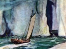

  
[Intangible Textual Heritage](../../index)  [Earth Mysteries](../index) 
[Index](index)  [Previous](smog02)  [Next](smog04) 

------------------------------------------------------------------------

[Buy this Book at
Amazon.com](https://www.amazon.com/exec/obidos/ASIN/B0026P3SA6/internetsacredte)

------------------------------------------------------------------------

  
*The Smoky God*, by Willis George Emerson, \[1908\], at Intangible
Textual Heritage

------------------------------------------------------------------------

p. 44 p. 45

### PART TWO

### OLAF JANSEN'S STORY

My name is Olaf Jansen. I am a Norwegian,
although I was born in the little seafaring Russian town of Uleaborg, on
the eastern coast of the Gulf of Bothnia, the northern arm of the Baltic
Sea.

My parents were on a fishing cruise in the Gulf of Bothnia, and put into
this Russian town of Uleaborg at the time of my birth, being the
twenty-seventh day of October, 1811.

My father, Jens Jansen, was born at Rodwig on the Scandinavian coast,

p. 46

near the Lofoden Islands, but after marrying made his home at Stockholm,
because my mother's people resided in that city. When seven years old, I
began going with my father on his fishing trips along the Scandinavian
coast.

Early in life I displayed an aptitude for books, and at the age of nine
years was placed in a private school in Stockholm, remaining there until
I was fourteen. After this I made regular trips with my father on all
his fishing voyages.

My father was a man fully six feet three in height, and weighed over
fifteen stone, a typical Norseman of the most rugged sort, and capable
of more endurance than any other man I have ever known. He possessed the

p. 47

gentleness of a woman in tender little ways, yet his determination and
will-power were beyond description. His will admitted of no defeat.

I was in my nineteenth year when we started on what proved to be our
last trip as fishermen, and which resulted in the strange story that
shall be given to the world,—but not until I have finished my earthly
pilgrimage.

I dare not allow the facts as I know them to be published while I am
living, for fear of further humiliation, confinement and suffering.
First of all, I was put in irons by the captain of the whaling vessel
that rescued me, for no other reason than that I told the truth about
the marvelous discoveries made by my father and myself.

p. 48

\[paragraph continues\] But this was far
from being the end of my tortures.

After four years and eight months’ absence I reached Stockholm, only to
find my mother had died the previous year, and the property left by my
parents in the possession of my mother's people, but it was at once made
over to me.

All might have been well, had I erased from my memory the story of our
adventure and of my father's terrible death.

Finally, one day I told the story in detail to my uncle, Gustaf
Osterlind, a man of considerable property, and urged him to fit out an
expedition for me to make another voyage to the strange land.

At first I thought he favored my

p. 49

  [  
Click to enlarge](img/04900.jpg)  
“Twenty-eight years—long, tedious, frightful years of suffering.”  

p. 50 p. 51

project. He seemed interested, and invited me to go before certain
officials and explain to them, as I had to him, the story of our travels
and discoveries. Imagine my disappointment and horror when, upon the
conclusion of my narrative, certain papers were signed by my uncle, and,
without warning, I found myself arrested and hurried away to dismal and
fearful confinement in a madhouse, where I remained for twenty-eight
years—long, tedious, frightful years of suffering!

I never ceased to assert my sanity, and to protest against the injustice
of my confinement. Finally, on the seventeenth of October, 1862, I was
released. My uncle was dead, and the friends of my youth were now

p. 52

strangers. Indeed, a man over fifty years old, whose only known record
is that of a madman, has no friends.

I was at a loss to know what to do for a living, but instinctively
turned toward the harbor where fishing boats in great numbers were
anchored, and within a week I had shipped with a fisherman by the name
of Yan Hansen, who was starting on a long fishing cruise to the Lofoden
Islands.

Here my earlier years of training proved of the very greatest advantage,
especially in enabling me to make myself useful. This was but the
beginning of other trips, and by frugal economy I was, in a few years,
able to own a fishing-brig of my own.

For twenty-seven years thereafter

p. 53

\[paragraph continues\] I followed the sea
as a fisherman, five years working for others, and the last twenty-two
for myself.

During all these years I was a most diligent student of books, as well
as a hard worker at my business, but I took great care not to mention to
anyone the story concerning the discoveries made by my father and
myself. Even at this late day I would be fearful of having any one see
or know the things I am writing, and the records and maps I have in my
keeping. When my days on earth are finished, I shall leave maps and
records that will enlighten and, I hope, benefit mankind.

The memory of my long confinement with maniacs, and all the horrible

p. 54

anguish and sufferings are too vivid to warrant my taking further
chances.

In 1889 I sold out my fishing boats, and found I had accumulated a
fortune quite sufficient to keep me the remainder of my life. I then
came to America.

For a dozen years my home was in Illinois, near Batavia, where I
gathered most of the books in my present library, though I brought many
choice volumes from Stockholm. Later, I came to Los Angeles, arriving
here March 4, 1901. The date I well remember, as it was President
McKinley's second inauguration day. I bought this humble home and
determined, here in the privacy of my Own abode, sheltered by my own
vine

p. 55

and fig-tree, and with my books about me, to make maps and drawings of
the new lands we had discovered, and also to write the story in detail
from the time my father and I left Stockholm until the tragic event that
parted us in the Antarctic Ocean.

I well remember that we left Stockholm in our fishing-sloop on the third
day of April, 1829, and sailed to the southward, leaving Gothland Island
to the left and Oeland Island to the right. A few days later we
succeeded in doubling Sandhommar Point, and made our way through the
sound which separates Denmark from the Scandinavian coast. In due time
we put in at the town of Christiansand, where we rested two days, and
then started around the

p. 56

\[paragraph continues\] Scandinavian coast
to the westward, bound for the Lofoden Islands.

My father was in high spirit, because of the excellent and gratifying
returns he had received from our last catch by marketing at Stockholm,
instead of selling at one of the seafaring towns along the Scandinavian
coast. He was especially pleased with the sale of some ivory tusks that
he had found on the west coast of Franz Joseph Land during one of his
northern cruises the previous year, and he expressed the hope that this
time we might again be fortunate enough to load our little fishing-sloop
with ivory, instead of cod, herring, mackerel and salmon.

We put in at Hammerfest, latitude

p. 57

  [  
Click to enlarge](img/05700.jpg)  
“A vessel larger than our little fishing sloop could not have threaded
its way among the icebergs.”  

p. 58 p. 59

seventy-one degrees and forty minutes, for a few days’ rest. Here we
remained one week, laying in an extra supply of provisions and several
casks of drinking-water, and then sailed toward Spitzbergen.

For the first few days we had an open sea and a favoring wind, and then
we encountered much ice and many icebergs. A vessel larger than our
little fishing-sloop could not possibly have threaded its way among the
labyrinth of icebergs or squeezed through the barely open channels.
These monster bergs presented an endless succession of crystal palaces,
of massive cathedrals and fantastic mountain ranges, grim and
sentinel-like, immovable as some towering cliff

p. 60

of solid rock, standing silent as a sphinx, resisting the restless waves
of a fretful sea.

After many narrow escapes, we arrived at Spitzbergen on the 23d of June,
and anchored at Wijade Bay for a short time, where we were quite
successful in our catches. We then lifted anchor and sailed through the
Hinlopen Strait, and coasted along the North-East-Land. [1](#fn_1)

A strong wind came up from the southwest, and my father said that we had
better take advantage of it and try to reach Franz Josef Land, where,

p. 61

the year before he had, by accident, found the ivory tusks that had
brought him such a good price at Stockholm.

Never, before or since, have I seen so many sea-fowl; they were so
numerous that they hid the rocks on the coast line and darkened the sky.

For several days we sailed along the rocky coast of Franz Josef Land.
Finally, a favoring wind came up that enabled us to make the West Coast,
and, after sailing twenty-four hours, we came to a beautiful inlet.

One could hardly believe it was the far Northland. The place was green
with growing vegetation, and while the area did not comprise more than
one or two acres, yet the air was

p. 62

warm and tranquil. It seemed to be at that point where the Gulf Stream's
influence is most keenly felt. [1](#fn_2)

On the east coast there were numerous icebergs, yet here we were in open
water. Far to the west of us,

p. 63

however, were icepacks, and still farther to the westward the ice
appeared like ranges of low hills. In front of us, and directly to the
north, lay an open sea. [1](#fn_3)

My father was an ardent believer in Odin and Thor, and had frequently
told me they were gods who came from far beyond the "North Wind."

There was a tradition, my father

p. 64

explained, that still farther northward was a land more beautiful than
any that mortal man had ever known, and that it was inhabited by the
"Chosen." [1](#fn_4)

My youthful imagination was fired by the ardor, zeal and religious
fervor

p. 65

of, my good father, and I exclaimed: "Why not sail to this goodly land?
The sky is fair, the wind favorable and the sea open."

Even now I can see the expression of pleasurable surprise on his
countenance as he turned toward me and asked: "My son, are you willing
to go with me and explore—to go far beyond where man has ever ventured?"
I answered affirmatively. "Very well," he replied. "May the god Odin
protect us!" and, quickly adjusting the sails, he glanced at our
compass, turned the prow in due northerly direction through an open
channel, and our voyage had begun. [1](#fn_5)

p. 66

The sun was low in the horizon, as it was still the early summer.
Indeed, we had almost four months of day ahead of us before the frozen
night could come on again.

Our little fishing-sloop sprang forward as if eager as ourselves for
adventure. Within thirty-six hours we were out of sight of the highest
point on the coast line of Franz Josef Land. We seemed to be in a strong
current running north by northeast. Far to the right and to the left of
us were icebergs, but our little sloop bore down on the narrows and
passed through channels and out into open seas—channels so narrow in
places

p. 67

that, had our craft been other than small, we never could have gotten
through.

On the third day we came to an island. Its shores were washed by an open
sea. My father determined to land and explore for a day. This new land
was destitute of timber, but we found a large accumulation of drift-wood
on the northern shore. Some of the trunks of the trees were forty feet
long and two feet in diameter. [1](#fn_6)

p. 68

After one day's exploration of the coast line of this island, we lifted
anchor and turned our prow to the north in an open sea. [1](#fn_7)

I remember that neither my father nor myself had tasted food for almost

p. 69

thirty hours. Perhaps this was because of the tension of excitement
about our strange voyage in waters farther north, my father said, than
anyone had ever before been. Active mentality had dulled the demands of
the physical needs.

Instead of the cold being intense as we had anticipated, it was really
warmer and more pleasant than it had been while in Hammerfest on the
north coast of Norway, some six weeks before. [1](#fn_8)

p. 70

We both frankly admitted that we were very hungry, and forthwith I
prepared a substantial meal from our well-stored larder. When we had
partaken heartily of the repast, I told my father I believed I would
sleep, as I was beginning to feel quite drowsy. "Very well," he replied,
"I will keep the watch."

I have no way to determine how

p. 71

long I slept; I only know that I was rudely awakened by a terrible
commotion of the sloop. To my surprise, I found my father sleeping
soundly. I cried out lustily to him, and starting up, he sprang quickly
to his feet. Indeed, had he not instantly clutched the rail, he would
certainly have been thrown into the seething waves.

A fierce snow-storm was raging. The wind was directly astern, driving
our sloop at a terrific speed, and was threatening every moment to
capsize us. There was no time to lose, the sails had to be lowered
immediately. Our boat was writhing in convulsions. A few icebergs we
knew were on either side of us, but fortunately the channel was open
directly to the north. But would it remain so? In

p. 72

front of us, girding the horizon from left to right, was a vaporish fog
or mist, black as Egyptian night at the water's edge, and white like a
steam-cloud toward the top, which was finally lost to view as it blended
with the great white flakes of falling snow. Whether it covered a
treacherous iceberg, or some other hidden obstacle against which our
little sloop would dash and send us to a watery grave, or was merely the
phenomenon of an Arctic fog, there was no way to determine. [1](#fn_9)

p. 73

  [  
Click to enlarge](img/07300.jpg)  
“By what miracle we escaped being dashed to destruction, I do not
know.”  

p. 74 p. 75

By what miracle we escaped being dashed to utter destruction, I do not
know. I remember our little craft creaked and groaned, as if its joints
were breaking. It rocked and staggered to and fro as if clutched by some
fierce undertow of whirlpool or maelstrom.

Fortunately our compass had been fastened with long screws to a
crossbeam. Most of our provisions, however, were tumbled out and swept
away from the deck of the cuddy, and

p. 76

had we not taken the precaution at the very beginning to tie ourselves
firmly to the masts of the sloop, we should have been swept into the
lashing sea.

Above the deafening tumult of the raging waves, I heard my father's
voice. "Be courageous, my son," he shouted, "Odin is the god of the
waters, the companion of the brave, and he is with us. Fear not."

To me it seemed there was no possibility of our escaping a horrible
death. The little sloop was shipping water, the snow was falling so fast
as to be blinding, and the waves were tumbling over our counters in
reckless white-sprayed fury. There was no telling what instant we should
be dashed against some drifting ice-pack.

p. 77

The tremendous swells would heave us up to the very peaks of mountainous
waves, then plunge us down into the depths of the sea's trough as if our
fishing-sloop were a fragile shell. Gigantic white-capped waves, like
veritable walls, fenced us in, fore and aft.

This terrible nerve-racking ordeal, with its nameless horrors of
suspense and agony of fear indescribable, continued for more than three
hours, and all the time we were being driven forward at fierce speed.
Then suddenly, as if growing weary of its frantic exertions, the wind
began to lessen its fury and by degrees to die down.

At last we were in a perfect calm. The fog mist had also disappeared,
and before us lay an iceless channel

p. 78

perhaps ten or fifteen miles wide, with a few icebergs far away to our
right, and an intermittent archipelago of smaller ones to the left.

I watched my father closely, determined to remain silent until he spoke.
Presently he untied the rope from his waist and, without saying a word,
began working the pumps, which fortunately were not damaged, relieving
the sloop of the water it had shipped in the madness of the storm.

He put up the sloop's sails as calmly as if casting a fishing-net, and
then remarked that we were ready for a favoring wind when it came. His
courage and persistence were truly remarkable.

On investigation we found less than one-third of our provisions
remaining,

p. 79

while to our utter dismay, we discovered that our water-casks had been
swept overboard during the violent plungings of our boat.

Two of our water-casks were in the main hold, but both were empty. We
had â fair supply of food, but no fresh water. I realized at once the
awfulness of our position. Presently I was seized with a consuming
thirst. "It is indeed bad," remarked my father. "However, let us dry our
bedraggled clothing, for we are soaked to the skin. Trust to the god
Odin, my son. Do not give up hope."

The sun was beating down slantingly, as if we were in a southern
latitude, instead of in the far Northland. It was swinging around, its
orbit ever visible and rising higher

p. 80

and higher each day, frequently mist-covered, yet always peering through
the lacework of clouds like some fretful eye of fate, guarding the
mysterious Northland and jealously watching the pranks of man. Far to
our right the rays decking the prisms of icebergs were gorgeous. Their
reflections emitted flashes of garnet, of diamond, of sapphire. A
pyrotechnic panorama of countless colors and shapes, while below could
be seen the green-tinted sea, and above, the purple sky.

------------------------------------------------------------------------

### Footnotes

[60:1](smog03.htm#fr_1) *It will be remembered
that Andree started on his fatal balloon voyage from the northwest coast
of Spitzbergen*.

[62:1](smog03.htm#fr_2) *Sir John Barrow, Bart.,
F.R.S., in his work entitled "Voyages of Discovery and Research Within
the Arctic Regions," says on page* 57: *"Mr. Beechey refers to what has
frequently been found and noticed—the mildness of the temperature on the
western coast of Spitzbergen, there being little or no sensation of
cold, though the thermometer might be only a few degrees above the
freezing-point. The brilliant and lively effect of a clear day, when the
sun shines forth with a pure sky, whose azure hue is so intense as to
find no parallel even in the boasted Italian sky."*

[63:1](smog03.htm#fr_3) *Captain Kane, on page*
299*, quoting from Morton's Journal on Monday, the* 26*th of December,
says: "As far as I could see, the open passages were fifteen miles or
more wide, with sometimes mashed ice separating them. But it is all
small ice, and I think it either drives out to the open space to the
north or rots and sinks, as I could see none ahead to the north."*

[64:1](smog03.htm#fr_4) *We find the following in
"Deutsche Mythologie," page* 778*, from the pen of Jakob Grimm; "Then
the sons of Bor built in the middle of the universe the city called
Asgard, where dwell the gods and their kindred, and from that abode work
out so many wondrous things both on the earth and in the heavens above
it. There is in that city a place called Hlidskjalf, and when Odin is
seated there upon his lofty throne he sees over the whole world and
discerns all the actions of men."*

[65:1](smog03.htm#fr_5) *Hall writes, on page*
288: *"On the* 23*rd of January the two Esquimaux, accompanied by two of
the sea men*, p. 66 *went to Cape Lupton. They
reported a sea of open water extending as far as the eye could reach."*

[67:1](smog03.htm#fr_6) *Greely tells us in vol.*
1*, page* 100*, that: "Privates Connell and Frederick found a large
coniferous tree on the beach, just above the extreme high-water mark. It
was nearly thirty inches in circumference, some thirty feet long, and
had apparently been carried to that point by a current* p. 68 *within a couple of years. A portion of it was
cut up for fire-wood, and for the first time in that valley, a bright,
cheery camp-fire gave comfort to man."*

[68:1](smog03.htm#fr_7) *Dr. Kane says, on page*
379 *of his works: "I cannot imagine what becomes of the ice. A strong
current sets in constantly to the north; but, from altitudes of more
than five hundred feet, I saw only narrow strips of ice, with great
spaces of open water, from ten to fifteen miles in breadth, between
them. It must, therefore, either go to an open space in the north, or
dissolve."*

[69:1](smog03.htm#fr_8) *Captain Peary's second
voyage relates another circumstance which may serve to confirm a
conjecture which has long keen maintained by some, that an open sea,
free of ice, exists at or near the Pole. "On the second of November,"
says Peary, "the wind freshened up to a gale from north by* p. 70 *west, lowered the thermometer before midnight
to* 5 *degrees, whereas, a rise of wind at Melville Island was generally
accompanied by a simultaneous rise in the thermometer at low
temperatures. May not this," he asks, "be occasioned by the wind blowing
over an open sea in the quarter from which the wind blows? And tend to
confirm the opinion that at or near the Pole an open sea exists?"*

[72:1](smog03.htm#fr_9) *On page* 284 *of his
works, Hall writes: "From the top of Providence Berg, a dark fog was
seen to the north, indicating water. At* 10 *a. m. three of the men
(Kruger, Nindemann and Hobby) went to Cape* p.
75 *Lupton to ascertain if possible the extent of the open water.
On their return they reported several open spaces and much young ice—not
more than a day old, so thin that it was easily broken by throwing
pieces of ice upon it."*

------------------------------------------------------------------------

[Next: Part Three: Beyond the North Wind](smog04)
