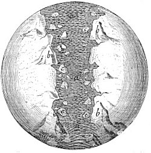

  
[Intangible Textual Heritage](../../index)  [Earth Mysteries](../index) 

------------------------------------------------------------------------

<table width="75%">
<colgroup>
<col style="width: 50%" />
<col style="width: 50%" />
</colgroup>
<tbody>
<tr class="odd">
<td width="50%" data-valign="CENTER"> 
</td>
<td width="50%" data-valign="CENTER"><h1 id="the-sacred-theory-of-the-earth" data-align="CENTER">The Sacred Theory of the Earth</h1>
<h2 id="by-thomas-burnet" data-align="CENTER">by Thomas Burnet</h2>
<h4 id="section" data-align="CENTER">[1691]</h4></td>
</tr>
</tbody>
</table>

------------------------------------------------------------------------

[Title Page](ste00)  
[Dedication: To the King's Most Excellent Majesty](ste01)  
[Preface to the Reader](ste02)  
[Contents of the Chapters](ste03)  

### Book I

[Chapter I. The Introduction](ste04)  
[Chapter II](ste05)  
[Chapter III](ste06)  
[Chapter IV](ste07)  
[Chapter V](ste08)  
[Chapter VI](ste09)  
[Chapter VII](ste10)  
[Chapter VIII.](ste11)  
[Chapter IX](ste12)  
[Chapter X](ste13)  
[Chapter XI](ste14)  
[Chapter XII](ste15)  

### Book II

[Title Page](ste16)  
[Chapter I](ste17)  
[Chapter II](ste18)  
[Chapter III](ste19)  
[Chapter IV](ste20)  
[Chapter V](ste21)  
[Chapter VI](ste22)  
[Chapter VII](ste23)  
[Chapter VIII](ste24)  
[Chapter IX](ste25)  
[Chapter X](ste26)  
[Chapter XI. Concerning NATURAL PROVIDENCE](ste27)  

### Book III

[Title Page (Book III and IV)](ste28)  
[Dedication (Books 3 and 4)](ste29)  
[Preface to the Reader](ste30)  
[Contents of the Chapters (Books 3 and 4)](ste31)  
[Chapter I. The Introduction](ste32)  
[Chapter II. The true state of the Question is propos’d](ste33)  
[Chapter III](ste34)  
[Chapter IV](ste35)  
[Chapter V](ste36)  
[Chapter VI. Concerning the Causes of the Conflagration](ste37)  
[Chapter VII](ste38)  
[Chapter VIII](ste39)  
[Chapter IX](ste40)  
[Chapter X](ste41)  
[Chapter XI](ste42)  
[Chapter XII](ste43)  
[The Conclusion](ste44)  

### Book IV

[Title Page](ste45)  
[Preface to the Reader](ste46)  
[Chapter I. The Introduction](ste47)  
[Chapter II](ste48)  
[Chapter III](ste49)  
[Chapter IV](ste50)  
[Chapter V](ste51)  
[Chapter VI](ste52)  
[Chapter VII](ste53)  
[Chapter VIII](ste54)  
[Chapter IX](ste55)  
[Chapter X](ste56)  

### A Review of the Theory of the Earth

[Title Page](ste57)  
[Chapter I](ste58)  
[Chapter II](ste59)  
[Chapter III](ste60)  
[Chapter IV](ste61)  
[Books printed for Walter Kettilby](ste62)  
