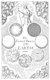
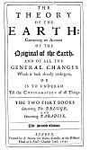

  
[Intangible Textual Heritage](../../index)  [Earth Mysteries](../index) 
[Index](index)  [Next](ste01) 

------------------------------------------------------------------------

# THE SACRED THEORY OF THE EARTH

###### Containing an Account

###### OF THE

##### Original of the Earth

###### AND OF ALL THE

#### GENERAL CHANGES

##### Which it hath already undergone

#### OR

#### IS TO UNDERGO

### Till the CONSUMMATION of all Things

#### THE TWO FIRST BOOKS

#### *Concerning* the DELUGE

###### AND

#### *Concerning* PARADISE

## by Thomas Burnet

#### The Second Edition,

#### *LONDON*

#### Printed by *R. Norton*, for *Walter Kettilby*, at the Biƒhops-Head in St. *Paul*'s Church-Yard

#### \[1691\]

Thomas Burnet, born 1635? deceased 1715

NOTICE OF ATTRIBUTION  
Scanned at Intangible Textual Heritage, July 2005. Proofed and formatted
by John Bruno Hare. This text is in the public domain worldwide. These
files may be used for any non-commercial purpose provided this notice of
attribution accompanies all copies.

[  
Click to enlarge](img/front12.jpg)  
Frontispiece  

[  
Click to enlarge](img/title12.jpg)  
Title Page  

------------------------------------------------------------------------

[Next: Dedication: To the King's Most Excellent Majesty](ste01)
