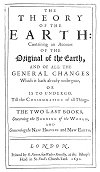

  
[Intangible Textual Heritage](../../index)  [Earth Mysteries](../index) 
[Index](index)  [Previous](ste27)  [Next](ste29) 

------------------------------------------------------------------------

##### THE

#### THEORY

###### OF THE

# EARTH:

##### Containing an Account

###### OF THE

### Original of the Earth

###### AND OF ALL THE

#### GENERAL CHANGES

##### Which it hath already undergone,

###### OR

###### IS TO UNDERGO

##### Till the CONSUMMATION of all Things.

## THE TWO LAST BOOKS,

#### *Concerning the* BURNING *of the* WORLD,

###### AND

#### *Concerning th*e NEW HEAVENS and NEW EARTH.

#### LONDON,

#### Printed by *R. Norton*, for *Walter Kettilby*, at the Biƒhops-Head in S. *Paul*'s Church-Yard, 1690.

 

[  
Click to enlarge](img/front34.jpg)  
Portrait of the Author: Frontispiece to Books 3 and 4  

[  
Click to enlarge](img/title34.jpg)  
Title Page of Books 3 and 4  

------------------------------------------------------------------------

[Next: Dedication (Books 3 and 4)](ste29)
