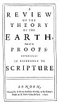

  
[Intangible Textual Heritage](../../index)  [Earth Mysteries](../index) 
[Index](index)  [Previous](ste56)  [Next](ste58) 

------------------------------------------------------------------------

p. 379

###### A

## REVIEW

###### OF THE

## THEORY

###### OF THE

# EARTH

###### And of its

### PROOFS:

###### ESPECIALLY

###### IN REFERENCE TO

## SCRIPTURE

#### *LONDON*,

#### Printed by R. Norton, for Walter Kettilby, at the Biƒhop's-Head in St. *Paul*'s Church-Yard.

#### \[1690\]

[  
Click to enlarge](img/title5.jpg)  
A Review of the Theory of the Earth: Title Page  

There are no chapters in this section of the book: the chapter breaks
(the titles in green type) were added by the transcriber.

------------------------------------------------------------------------

[Next: Chapter I](ste58)
