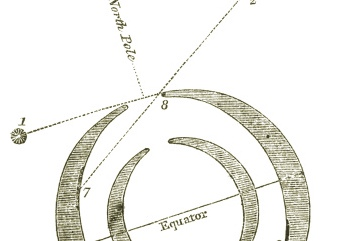

  
[Intangible Textual Heritage](../../index)  [Earth Mysteries](../index) 
[Utopia](../../utopia/index) 

------------------------------------------------------------------------

<table width="75%">
<colgroup>
<col style="width: 50%" />
<col style="width: 50%" />
</colgroup>
<tbody>
<tr class="odd">
<td width="50%" data-valign="TOP"></td>
<td width="50%" data-valign="CENTER"><h1 id="symzonia-voyage-of-discovery" data-align="CENTER">Symzonia; Voyage of Discovery</h1>
<h2 id="by-adam-seaborn" data-align="CENTER">by Adam Seaborn</h2>
<h5 id="pseud.-john-cleves-symmes" data-align="CENTER">(pseud. John Cleves Symmes?)</h5>
<h4 id="section" data-align="CENTER">[1820]</h4></td>
</tr>
</tbody>
</table>

------------------------------------------------------------------------

[Contents](#contents)    [Start Reading](sym00)    [Page
Index](pageidx)    [Text \[Zipped\]](sym.txt.gz)

------------------------------------------------------------------------

This is among the first and rarest of the Hollow Earth books. In the
early 19th century, John Cleves Symmes proposed that the earth was
actually a set of five nested spheres, each with polar openings. He
unsuccessfully lobbied congress to fund an expedition to the poles to
investigate this theory. This novel, based on Symmes' theories, was
published in 1820. Some believe that Symmes was the author, but this has
not been established beyond a shadow of doubt.

Probably the first US utopian science fiction novel, Symzonia is also a
classic sea yarn. The narrator, Mr. Seaborn, initiates just such an
expedition as Symmes dreamed of. With a special high-tech paddle boat,
built with no metal to avoid magnetic effects, Seaborn sets out on a
voyage into uncharted southern waters. Conflict is provided by a
mutinous Mr. Slim, who proves to be Seaborn's nemesis. Eventually the
ship penetrates into the Antarctic hole, and voyages deep into the inner
surface of the earth, which Seaborn claims for the US and calls
'Symzonia'. They encounter a utopian society, run by a benevolent
aristocracy, which has long since banished all of their misfits to a
distant colony, and possibly the outside Earth. The Symzonians have
advanced airships, boats with jet propulsion, flame-proof cloth woven
from spiderwebs, and a mysterious weapon of mass destruction.
Eventually, they expel Seaborn and his crew back to the exterior world.
Due to a series of accidents, all material evidence of Symzonia is lost
on the return voyage, and Seaborn is swindled out of his profits.

Edmond Halley, the famed astronomer, was the first to propose that the
Earth contained a set of nested hollow spheres. Symme's theory, and this
book in particular, was likely one of Poe's primary influences,
particularly seen in his Narrative of Arthur Gordon Pym. The rumor of a
hidden advanced civilization inside the earth has long been elaborated
in fictional and occult books from [Bulwer-Lytton](../../atl/vril/index)
to the [the Shaver Mystery](../../ufo/irl/index).

PRODUCTION NOTES: Published in 1820 and only reprinted once in 1965,
this book is almost impossible to obtain. I searched for years for a
copy of this in vain. I was finally able to obtain a copy of the 1965
facsimile for over $250, and used that as the basis of this
etext.--J.B. Hare, December 8, 2008.

------------------------------------------------------------------------

 [Title Page](sym00)  
[Sectional View of the Earth Showing the Openings at the Poles](sym01)  
[Advertisement](sym02)  
[Contents](sym03)  
[Chapter I](sym04)  
[Chapter II](sym05)  
[Chapter III](sym06)  
[Chapter IV](sym07)  
[Chapter V](sym08)  
[Chapter VI](sym09)  
[Chapter VII](sym10)  
[Chapter VIII](sym11)  
[Chapter IX](sym12)  
[Chapter X](sym13)  
[Chapter XI](sym14)  
[Chapter XII](sym15)  
[Chapter XIII](sym16)  
[Chapter XIV](sym17)  
[Chapter XV](sym18)  
[Chapter XVI](sym19)  
[Chapter XVII](sym20)  
[Chapter XVIII](sym21)  
[Chapter XIX](sym22)  
[Chapter XX](sym23)  
